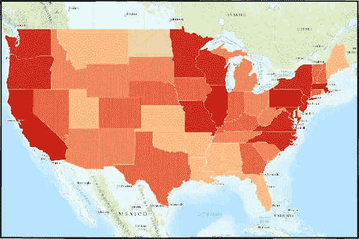
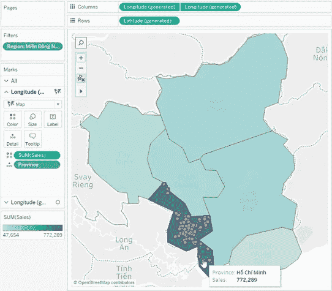
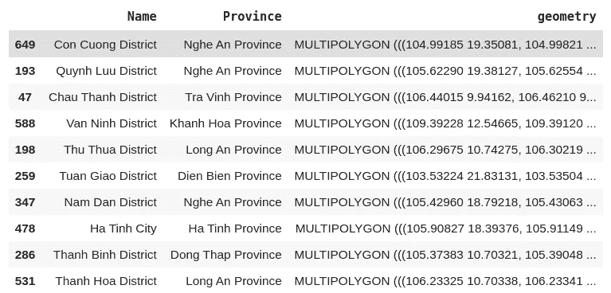
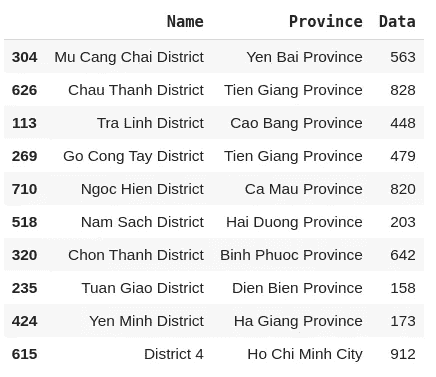
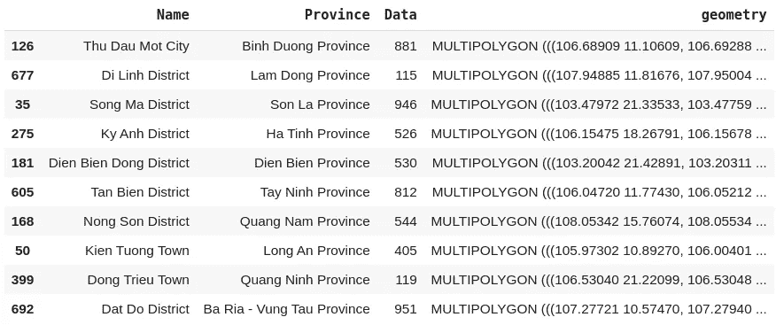
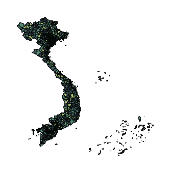
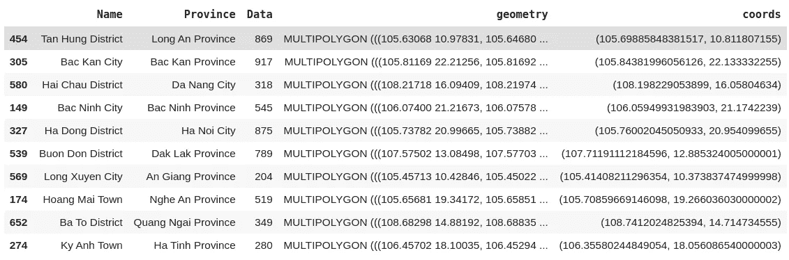
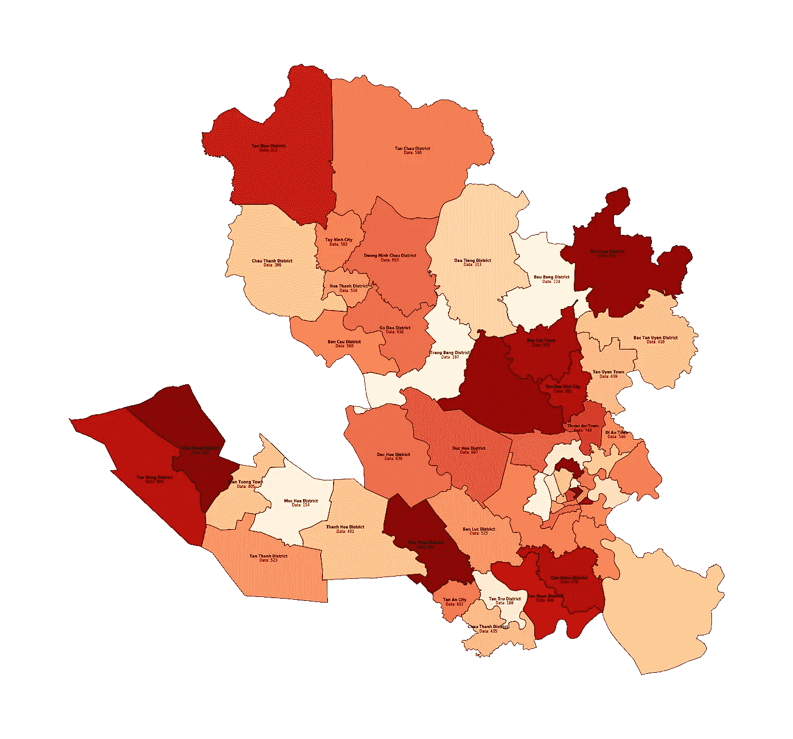
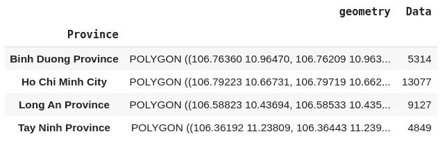
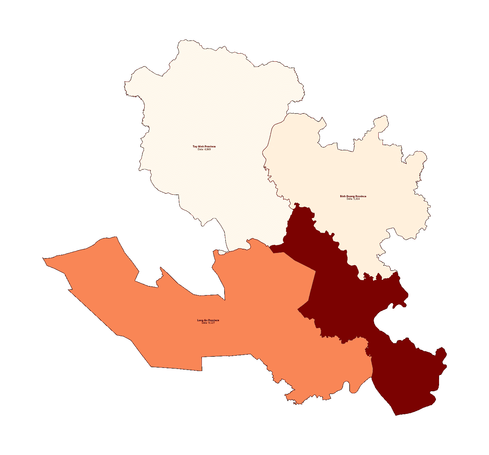

# 用 Geopandas & Geoplot 绘制地理数据

> 原文：<https://towardsdatascience.com/plotting-geographical-data-with-geopandas-338cc7e17e4e?source=collection_archive---------11----------------------->

## 用 Geopandas 和 Geoplot 制作美丽的地图

来源:[地图 UI 模式](https://www.mapuipatterns.com/choropleth-map/)

# 背景

回到 2019 年 2 月，我一直在一家媒体公司担任研究员。我的工作涉及大量的数据和电子表格来存储和分析。但是对于这样一个快速发展的行业，每天都有数百万行新数据流入，Microsoft Excel 很难完成这项工作。仅仅更新几个电子表格就很容易花费一整个上午的时间，因为在处理大量数据时，Excel 的性能会迅速下降。我想为我的作品学习一些新工具，我在[代码学校](https://www.coderschool.vn/en/)找到了一个关于 Python 的数据分析课程。对于像我这样有商业背景的人来说，编码就像火箭科学一样，我认为我不会感兴趣。然而，由于 Excel 经常崩溃，我感到沮丧，我还是试了一下，天哪，真是令人兴奋。从那时起我就开始写代码，现在我在我学习第一行代码的学校教书。

我在工作中经常遇到的一个话题就是处理地理数据。在我了解 Python 之前，在地图上绘制数据是一项非常具有挑战性的任务。我们的选择之一是 Tableau 和它的地图功能(来源: [Tableau](https://help.tableau.com/current/pro/desktop/en-us/maps_howto_simple.htm) )。然而，Tableau 的一个局限性是，它只能按越南各省绘制数据，而许多项目要求数据按地区显示。

填充多边形选项不适用于越南地区。来源: [Tableau 社区论坛](https://community.tableau.com/groups/vietnam/blog/2018/05/08/t%C3%ADnh-n%C4%83ng-m%E1%BB%9Bi-tr%C3%AAn-tableau-2018)

在这方面，Python 提供了更大的灵活性，在地图上绘图时也提供了更多的定制选项。

# **地质公园&地质公园**

[**Geopandas**](https://geopandas.org/) 和 [**Geoplot**](https://residentmario.github.io/geoplot/index.html) 是两个允许我们处理和可视化地理数据的 Python 库。 **Geopandas** 基于 **pandas** 并扩展其特性以允许操作几何数据类型。 **Geoplot** 同样建立在 **matplotlib** 之上，用于制图绘图。如果你对**熊猫**和 **matplotlib** 不熟悉，我建议你从这两篇文章开始:

 [## “熊猫”Python 库快速介绍

### 一些背景

towardsdatascience.com](/a-quick-introduction-to-the-pandas-python-library-f1b678f34673)  [## 使用 Matplotlib 实现数据可视化

### 数据可视化是商业活动的重要组成部分，因为现在的组织收集了大量的数据…

towardsdatascience.com](/data-visualization-using-matplotlib-16f1aae5ce70) 

在这个例子中，我将在 Colab 笔记本环境中运行代码。首先，我们需要安装 **Geopandas** 和 **Geoplot:**

安装 geopandas 和 geoplot

导入必要的库:

导入库

世界各国的几何数据在互联网上随处可见。它们有许多不同的格式，其中大部分都受 geopandas 的支持。越南各省的几何数据可在 [HCMGIS OpenData](http://opendata.hcmgis.vn/) 上获得。在这个例子中，我将使用 JSON 格式。 **Geopandas** 具有函数 *read_file* 从源中读取几何数据。这将返回一个包含许多列的 Geopandas 数据帧，但是我们只需要关心名称(地区)、省份和几何列。

越南几何数据

注意几何栏中的数据:它们是**多多边形**格式，代表世界地图上该地区的形状和位置。

我们还需要一些数据来绘制在地图上。我准备了一些. csv 文件形式的示例数据。它包含了越南一些地区的数字数据和他们所属的省份。我们可以用**熊猫读文件。**

阅读示例数据

这是我们要在地图上说明的数据。

为了在地图上展示我们的示例数据，我们需要将它与几何数据结合起来。这可以通过方法*合并来实现。*

将示例数据与其各自的几何数据相结合

我们现在可以用 **geoplot** 制作一张地图。在这个例子中，我制作了一个 Choropleth 地图，其中变量数据(色调)的值由多边形的颜色表示。**地质公园**有更多地图类型选项，查看他们的[文档](https://residentmario.github.io/geoplot/plot_references/plot_reference.html)。

绘制一张 choropleth 地图

这是我们的结果！

这张地图看起来不太好，但我们可以添加一些调整来使它变得更好！

# 改进情节

把越南的所有区都画在一起可能不是一个好主意，因为越南的区太多了。相反，我们可以按地区细分国家。例如，通过对数据框应用过滤器，我可以只选择四个省份进行绘图。

更改 *figsize* 参数来配置贴图的大小，更改 *cmap* 参数来配置用于多边形的调色板。

现在看起来好多了！

我们经常想要做的是给绘图添加一些标签(例如，地区的名称和变量的值)。由于 **geoplot** 构建在 **matplotlib** 之上，我们可以使用 *plt.text* 来完成此操作。但是，它需要标签在图上的位置。方法 *centroid* 返回多边形中心点的 x-y 坐标，这正是我们需要的！

生成每个多边形的中心点

现在我们可以用 **matplotlib** 给绘图添加一些标签。

将地区名称及其各自的数据值添加到地图中

注意到右下角那些杂乱的文本簇了吗？就是因为胡志明市的区太小，彼此标签太靠近。一个解决办法是从地图上去掉胡志明市的行政区划。

排除胡志明市的区域标签

我们的最终结果！

geopandas 的另一个非常有用的特性是将多个多边形组合成更大的块。例如，当您希望按省份而不是按地区显示数据时，这尤其有用。 **geopandas** 具有 dissolve()函数，可以将地区数据行聚合到相应的省份中。

使用 Sum 函数将地区聚合为省份

聚集数据框架

各省现在都在数据框的索引中，所以绘制标签的代码需要做一些小的修改。

我们需要再次生成 x-y 坐标

这些地区现在被分成几个省

# 结论

Geopandas 和 **Geoplot** 是两个非常有用的可视化地理数据的 Python 库。他们需要更多的努力，但也允许对情节有更多的控制。