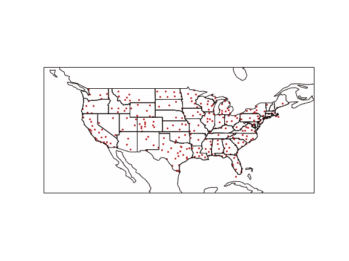

# 使用 Cartopy 打印地理空间数据

> 原文：<https://towardsdatascience.com/plotting-geospatial-data-with-cartopy-4b5ad0da0761?source=collection_archive---------16----------------------->

## 用于制作高质量静态地图的 Python 库


照片由[捕捉人心。](https://unsplash.com/@dead____artist?utm_source=medium&utm_medium=referral) on [Unsplash](https://unsplash.com?utm_source=medium&utm_medium=referral)

随着大数据时代的到来，也迎来了大地理空间数据时代。研究人员越来越多地获得地理信息，这些信息可以做任何事情，从跟踪濒危物种的迁移模式到绘制该国每一家甜甜圈店的地图。

为了帮助可视化这些信息，python 库 [Cartopy](https://pypi.org/project/Cartopy/) 只用几行代码就可以创建专业的可发布地图。构建时考虑了 Matplotlib，它的语法熟悉且易于理解。

# 简单地图

首先，我们将创建尽可能简单的世界地图。在编写任何繁重的代码之前，应该安装 python 中的 Cartopy 和 Matplotlib 库。

```
import cartopy.crs as crs
import cartopy.feature as cfeature
import matplotlib.pyplot as plt
```

以上，先决条件库被导入并准备好使用。

```
# Initialize the figure
figure = plt.figure(figsize=(8,6))# use the Mercator projection
ax = figure.add_subplot(1,1,1, projection=crs.Mercator(())# Add feature to the map
ax.stock_img()plt.show()
```


有纹理的世界地图。图由作者制作。

接下来的几行代码介绍了创建地图的基本过程:

1.  初始化地图，并使用 figsize 参数指定图形的大小
2.  添加指定所用投影的子图
3.  向支线剧情添加特征

只用几行代码，就创建了一个最小的地图。不幸的是，这张地图相当平淡，所以我们将添加一些额外的功能。

```
figure = plt.figure(figsize=(8,6))ax = figure.add_subplot(1,1,1, projection=crs.Mercator())# adds a stock image as a background
ax.stock_img()# adds national borders
ax.add_feature(cfeature.BORDERS)# add coastlines
ax.add_feature(cfeature.COASTLINE)plt.show()
```


有边界的世界地图。图由作者制作。

通过修改变量 ax，更多的信息被添加到地图中。在这种情况下，国界和海岸线被画出来。其他功能，如主要河流和湖泊地图也可以用同样的方法包括在内。完整的功能列表可以在[这里](https://scitools.org.uk/cartopy/docs/v0.15/matplotlib/feature_interface.html)找到。

# 不同的预测

上面的地图使用了著名的墨卡托投影。虽然在大多数情况下完全足够，但墨卡托地图扭曲了土地大小，因为它将一个球体拉伸到一个正方形上。幸运的是，Cartopy 支持其他投影。

```
figure = plt.figure(figsize=(8,6))# set the projection to Mollweide
ax = figure.add_subplot(1,1,1, projection=crs.Mollweide())
ax.stock_img()plt.show()
```


莫尔韦德投影。图由作者制作。

通过改变 crs 的投影参数。墨卡托()至 crs。Molleweide()，创建一个不同的、更椭圆(更精确)的投影。

```
figure = plt.figure(figsize=(8,6))# Set the projection to Interrupted Goode Homolosine
ax = figure.add_subplot(1,1,1, projection=crs.InterruptedGoodeHomolosine())
ax.stock_img()plt.show()
```


间断古德同亏线投影。图由作者制作。

通过在 projection 参数中使用 InterruptedGoodeHomolosine()，可以产生更精确的投影。

这些绝不是 Cartopy 可以绘制的唯一投影。完整列表可在[这里](https://scitools.org.uk/cartopy/docs/latest/crs/projections.html#cartopy-projections)找到。

# 放大和缩小片段

虽然世界地图在许多情况下都很有用，但通常数据需要在一个局部区域中表示，例如一个大陆或一个国家。

```
figure = plt.figure(figsize=(8,6))ax = figure.add_subplot(1,1,1, projection=crs.Mercator())
ax.add_feature(cfeature.COASTLINE)
ax.add_feature(cfeature.STATES)# Zoom in on the US by setting longitude/latitude parameters
ax.set_extent(
    [
        -135, # minimum latitude
        -60, # min longitude
        20, # max latitude
        55 # max longitude
    ],
    crs=crs.PlateCarree()
)plt.show()
```


一张简单的美国地图。图由作者制作。

在初始化地图并添加了常用的要素之后，还使用 set_extent()方法修改了 ax 变量，该方法指定了经度和纬度的范围，以便在地图上设置焦点。

请注意参数 crs，它指定了要使用的坐标系。一般惯例是使用板块 Carrée 投影的坐标，即使它与地图的投影不一致，因为它产生更可预测的结果。

# 散点图

到目前为止，我们只讨论了生成通用地图，但现在我们将讨论在这些地图上绘制数据。唯一的要求是每个观测值都有一个有效的纬度和经度。为了演示，从 [Kaggle](https://www.kaggle.com/aravindram11/list-of-us-airports) 中提取了美国 341 个机场的源文件，并将其绘制在散点图上。

```
import pandas as pd# Read the data
df = pd.read_csv("airports.csv")
```

在进行任何映射之前，Pandas 库被导入到结构化数据中，CSV 文件被读入到数据帧中。

```
figure = plt.figure(figsize=(8,6))ax = figure.add_subplot(1,1,1, projection=crs.PlateCarree())
ax.add_feature(cfeature.COASTLINE)
ax.add_feature(cfeature.STATES)ax.set_extent(
    [-135, -60, 20, 55],
    crs=crs.PlateCarree()
)# modify the plot by adding a scatterplot over the map
plt.scatter(
    x=df["LONGITUDE"],
    y=df["LATITUDE"],
    color="red",
    s=4,
    alpha=1,
    transform=crs.PlateCarree()
)plt.show()
```



美国大陆的机场。图由作者制作。

实际上，创建地图后，Matplotlib 会在图像上添加一个散点图。对于熟悉流行图形库的人来说，语法应该非常熟悉。对那些不是的人来说，争论的分类是:

*   x:x 轴上的数据。在这种情况下，经度
*   y:y 轴上的数据。在这种情况下，纬度
*   颜色:标记的颜色
*   学生:马克笔的大小
*   alpha:标记的透明度，从 0 到 1

可以在散点图上传递额外的参数来进一步定制它。完整的名单可以在[这里](https://matplotlib.org/3.1.0/api/_as_gen/matplotlib.pyplot.scatter.html)找到。

还要注意 transform 参数，按照惯例，它使用 Plate Carrée 投影的原因与 set_extent()类似。

# 结论

Cartopy 是一个多样化的地图库。考虑到各种投影和坐标系统，它支持从生态跟踪到商业智能的广泛的可能用例。

然而，它与 Matplotlib 的集成是一个令人难以置信的数据分析工具。虽然只演示了一个简单的散点图，但它对 Matplotlib 的广泛而灵活的使用意味着可以将不同数量的绘图和图形投影到一个地图上。