# 使用 Pandas & Matplotlib 绘制 Google 趋势数据

> 原文：<https://towardsdatascience.com/plotting-google-trends-data-using-pandas-matplotlib-ec33a2f77c8c?source=collection_archive---------52----------------------->

## 辅导的

## 分析谷歌趋势的前五名民主党总统候选人数据，找出辩论季最受欢迎的候选人。

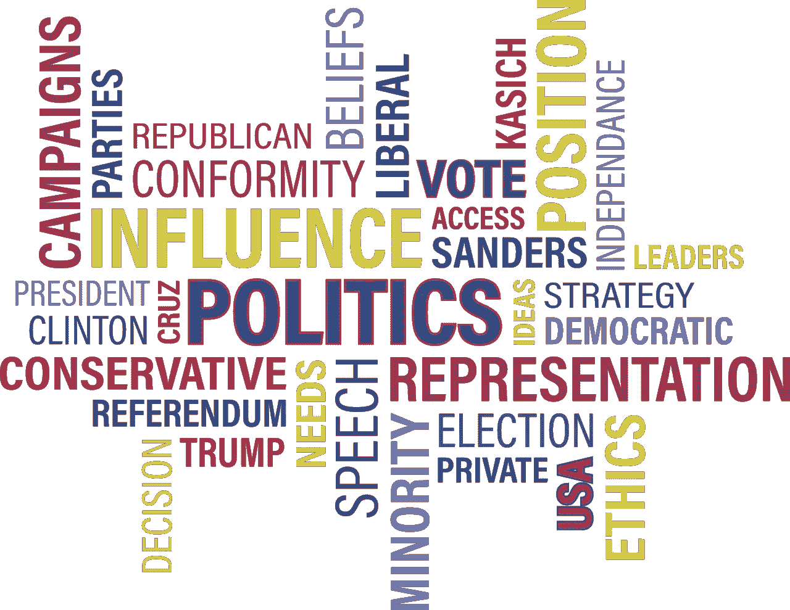

图片来自[皮克斯拜](https://pixabay.com/?utm_source=link-attribution&amp;utm_medium=referral&amp;utm_campaign=image&amp;utm_content=1327276)的[玛丽·帕尔克](https://pixabay.com/users/905513-905513/?utm_source=link-attribution&amp;utm_medium=referral&amp;utm_campaign=image&amp;utm_content=1327276)

如果你一直在观看过去一年的民主党总统候选人辩论，你可能会同意这有点像一场狂野之旅。从[咬手指](https://www.businessinsider.com/biden-bites-wifes-finger-in-bizarre-campaign-stop-moment-2019-11)到[紧张的辩论后对峙](https://www.cnn.com/2020/01/15/politics/bernie-sanders-elizabeth-warren-debate-audio/index.html)。我们知道乔·拜登是民主党的假定提名人。但是我想看看数据。我们将使用 pandas 和 matplotlib 库从 Google Trends 中以搜索兴趣数据的形式遍历和探索这些数据。我们将重新创建谷歌趋势图，以可视化它们随时间的流行程度。我们来看看——**谁是最受欢迎的候选人？**

# 谷歌趋势

> Google Trends 提供了一个在特定时间范围内对 Google 的搜索请求示例。谷歌将搜索数据标准化，使术语之间的比较更容易。根据某个主题在所有主题的所有搜索中所占的比例，这些数字的范围是 0 到 100。—trends.google.com

这意味着，当查看这些值时，值 100 表示在给定的时间范围内，这些术语(候选项)中的最高流行度。值为 50 意味着该术语的流行程度是一半。

*注:我知道谷歌搜索实际上并不是流行度的黄金标准。然而，它确实反映了人们每天在谷歌上进行的搜索。*

**数据** 本项目使用的候选人是那些参加了前 10 场辩论的候选人。乔·拜登，伯尼·桑德斯，伊丽莎白·沃伦，艾米·克洛布查尔，皮特·布蒂吉格。数据是从 2019 年 4 月到 2020 年 5 月的谷歌趋势中拉出来的。

## 1|导入必要的库，导入和检查数据

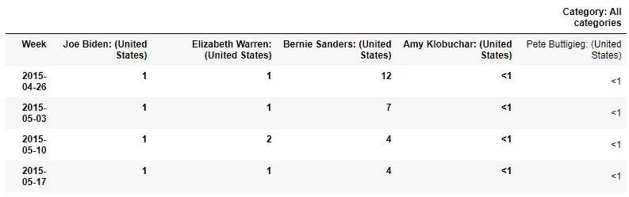

候选人. csv

数据作为一个大列读入，标签为“类别:所有类别”。我们可以通过传递行索引来指定哪一行应该是我们的标签，从而改变这一点。

## 2|使用正确的标签重新读入数据集

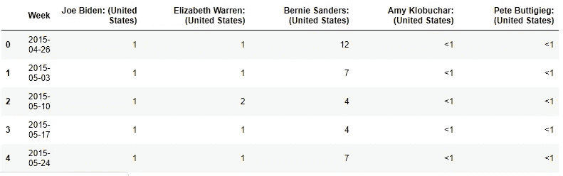

candidates.csv 读入正确的标签

很好——现在我们已经读入了带有正确标签的数据帧。现在，开始一些争论。首先——看看这些标签……当在 pandas 中操作数据时，易于使用的列标签可以使工作更快，更少令人沮丧。我们可以通过缩短它们，去掉空格，并使它们都变成小写来清理这些标签。

## 3|调整列标签

列表理解将用于调整标签。如果你需要的话，这是一个很好的教程来温习列表理解。

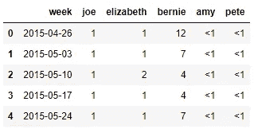

清洁的色谱柱标签

不错！使用列标签要容易得多。让我们再看看我们的数据。

## 4 |检查数据

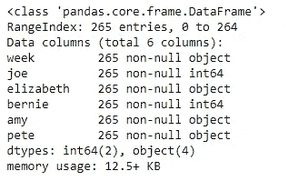

候选数据帧的数据类型

好的——我们看到“joe”和“bernie”列具有整数数据类型，但是其余的列是“object”类型。这是因为当谷歌趋势有一个非常低的数字，而不是“0”，他们把术语“<1’. The ‘

## 5| Replace the ‘<1’ string with an integer

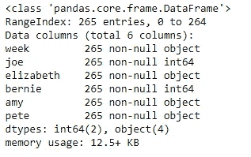

Great, the ‘

## **6 |调整列的类型&设置索引**

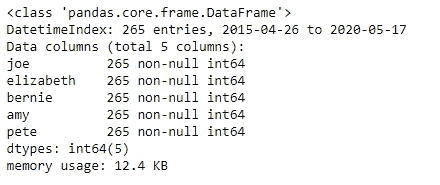

不错！现在，我们的 DatetimeIndex 显示了数据的日期范围，每一列都是数字类型。我们来看看数据！

## 7 |绘制数据

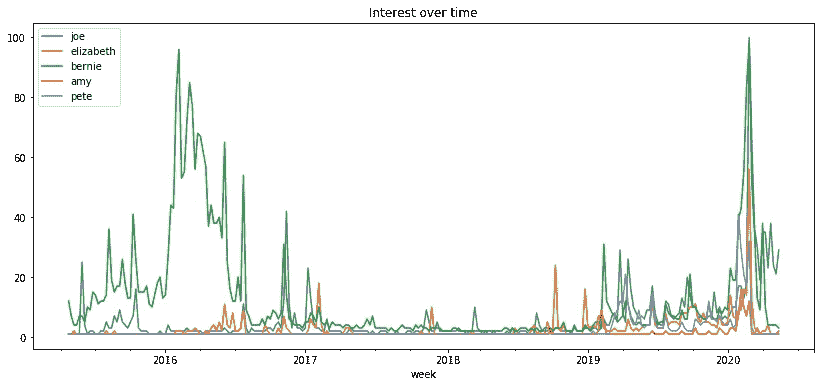

2015 年 4 月至 2020 年 5 月的谷歌搜索趋势

我们看到伯尼从 2016 年 2 月到大约 5 月底主导结果。这是在桑德斯 2016 年竞选总统期间。

让我们从民主党初选辩论之前的时间开始放大，覆盖民主党初选辩论的日期。民主辩论时间:*2019 年 6 月 26 日，2019 年 7 月 30 日，2019 年 9 月 12 日，2019 年 10 月 15 日，2019 年 11 月 20 日，2019 年 12 月 19 日，2020 年 1 月 14 日，2020 年 2 月 7 日，2020 年 2 月 19 日，2020 年 3 月 15 日*。然而，我们数据中的日期是每周的——在绘制数据之前，我们需要将日期调整为代表辩论发生的那一周的日期。

## 8|调整辩论日期然后绘图

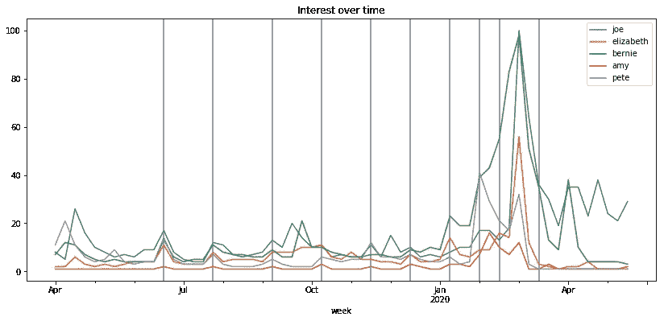

标有辩论日期的趋势数据

我们可以看到每个辩论日期前后都有峰值。在第一次辩论之前有几个峰值-我们看到皮特·布蒂吉格在 2019 年 4 月有一个小峰值。2019 年 4 月 15 日 Buttigieg 宣布竞选。伊丽莎白·沃伦在【22,2019 年 4 月 22 日有一个较小的峰值，对应于她的[取消学生债务](https://www.cnn.com/2019/04/22/politics/elizabeth-warren-student-debt-college-tuition-plan/index.html)和取消大学学费的计划的发布。乔·拜登于 2019 年 4 月 25 日**宣布竞选总统。**

有些峰值并不与辩论日期直接对应。例如，我们看到拜登和桑德斯在 9 月和 10 月的活动之间有一个高峰。2019 年 9 月 25 日**拜登在*吉米·基梅尔直播* 接受了[采访，他在采访中讨论了弹劾调查。2019 年**10 月 2 日**桑德斯因动脉阻塞](https://www.youtube.com/watch?v=LSWwhNvk1tc)[住院](https://abcnews.go.com/Politics/bernie-sanders-78-canceled-events-notice-hospitalized/story?id=66003850)。**

# 最热门人选？

那么，谁是最受欢迎的候选人？我们看到，在 2 月底/3 月初，拜登和桑德斯都大幅上升，他们看起来势均力敌。让我们通过在熊猫数据框架上使用 rolling() & mean()函数来消除由短期运动引起的噪声。

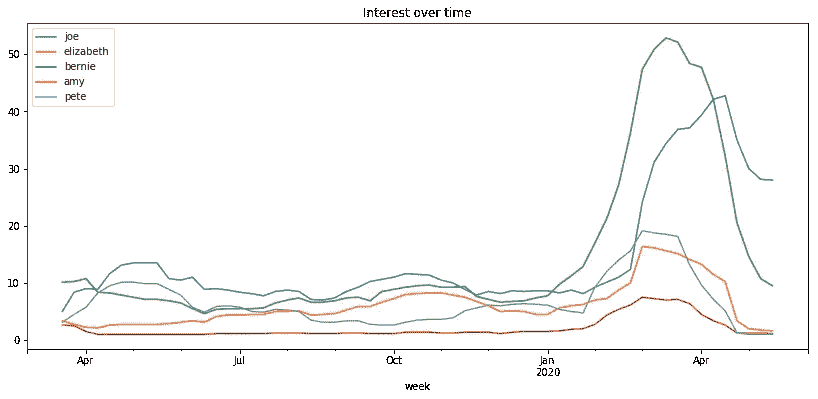

首先，我想指出一些有趣的事情——皮特的旅程。他在 2019 年 4 月/5 月有一个大的初始攀升(不久后超过桑德斯)，然后在年底(12 月/1 月)有一个较小的攀升，其他候选人开始下降或持平。

至于最热门的人选，会不会是拜登？看起来拜登在大多数辩论中都保持了一定的领先优势。还是桑德斯？到了新年，伯尼一直领先，直到他退出比赛。

你认为谁是更受欢迎的候选人？

你可以在 [Github repo](https://github.com/bryan-md/google-trend-analysis) 中找到完整的代码。另外——我花了一些时间使用这些数据通过 Tableau 构建了带有注释的相同情节。在这里看一下[互动 viz](https://public.tableau.com/profile/bryan.dickinson#!/vizhome/candidatetrendscomoparisons/CandidateComparisons)。

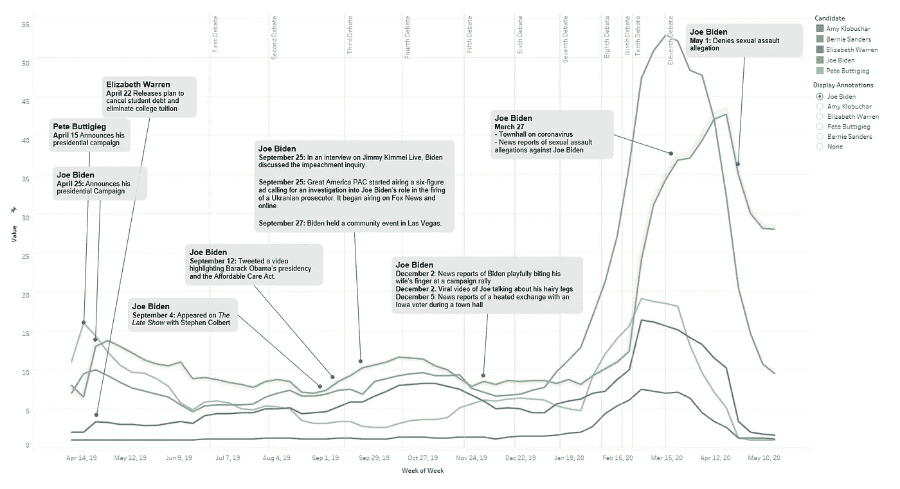

完成互动的静态照片，即[此处](https://public.tableau.com/profile/bryan.dickinson#!/vizhome/candidatetrendscomoparisons/CandidateComparisons)。