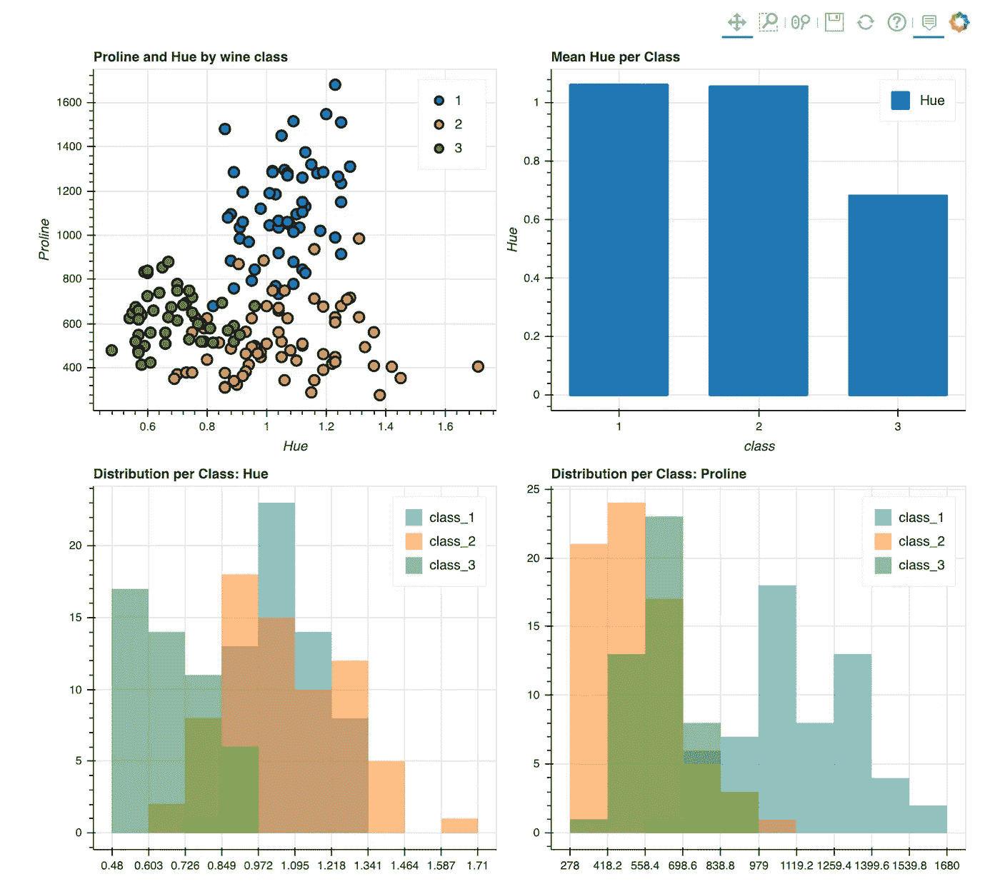
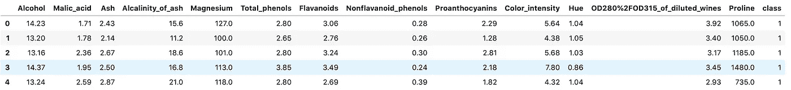
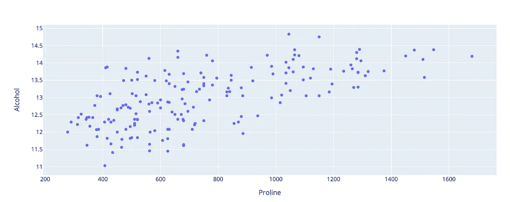
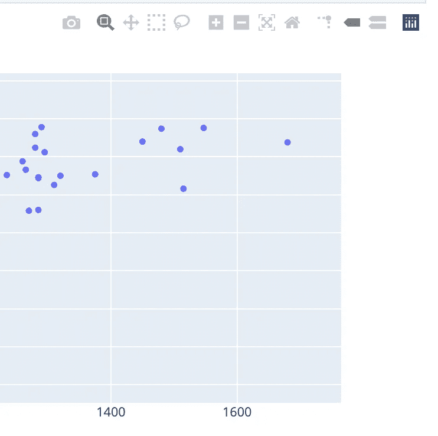
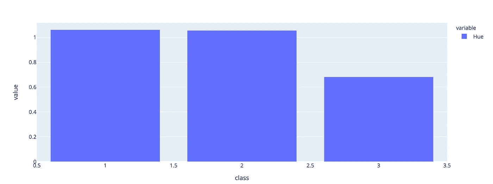
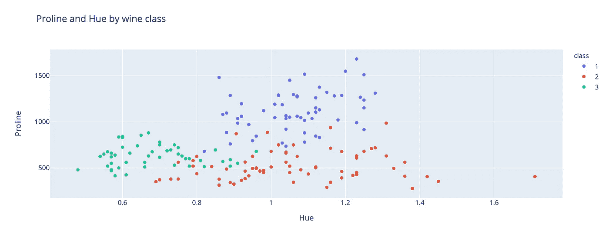
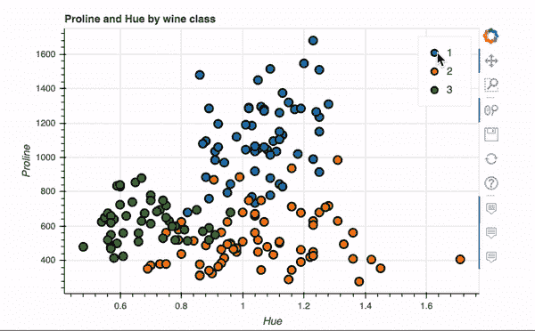

# 熊猫里的情节越来越漂亮了

> 原文：<https://towardsdatascience.com/plotting-in-pandas-just-got-prettier-289d0e0fe5c0?source=collection_archive---------8----------------------->

## 创建丰富的可视化和仪表板与熊猫绘图后端为 Plotly 和 Bokeh



流行的 Python 数据分析库[熊猫](https://pandas.pydata.org/)中的绘图功能一直是我获取超级快速图表的常用方法之一。然而，可用的观想总是相当基础的，并不特别漂亮。

我经常发现自己使用 Pandas 绘图功能快速执行一些可视化数据探索。但是，当涉及到向利益相关者展示见解时，可以使用 Plotly 或 Bokeh 等“更漂亮”的绘图库重新进行可视化。

自从最新的 Pandas 版本 0.25.3 以来，这不再是必要的，您现在可以使用第三方可视化库作为 Pandas 绘图功能的后端。流行的基于网络的交互式可视化 Python 库 Plotly 最近也发布了一个[熊猫绘图后台](https://medium.com/plotly/beyond-tidy-plotly-express-now-accepts-wide-form-and-mixed-form-data-bdc3e054f891)。

让我们来看看如何使用 Plotly 和 Bokeh 后端创建更丰富的可视化效果。

# 使用不同的后端

为了激活绘图功能的不同后端，在导入 pandas 之后，添加这行代码。

```
pd.options.plotting.backend = 'plotly'
```

当前可用的后端有:

*   Plotly
*   全息视图
*   Matplotlib
*   熊猫 _bokeh
*   Hyplot

# Plotly 后端

Plotly 是一个 Python 库，支持各种丰富的交互式可视化。Plotly 包的一个好处是它建立在 Javascript 版本的库之上，这意味着图表是基于 web 的，可以显示为 HTML 文件或嵌入到基于 Python 的 web 应用程序中。您还可以下载高质量图像文件的可视化效果，因此非常适合在文档或论文中使用。

让我们快速浏览一些熊猫绘图功能的后端使用示例。

如果你还没有安装它，你将需要安装 Plotly`pip intsall plotly`。如果你在 Jupyterlab 中使用 Plotly，你将需要执行几个额外的安装步骤[来显示可视化。首先，安装 IPywidgets。](https://plotly.com/python/getting-started/#jupyterlab-support-python-35)

```
pip install jupyterlab "ipywidgets>=7.5"
```

然后运行这个来安装 Plotly 扩展。

```
jupyter labextension install jupyterlab-plotly@4.8.1
```

为了说明绘图后端的用法，我将使用一个来自 openml.org 的数据集，名为“葡萄酒”数据集。可以在这里找到，但是也可以使用下面的代码直接导入到笔记本中(你需要先安装 Scikit-learn)。

葡萄酒数据集由葡萄酒类型的许多特征和相应的标签组成。数据集的前几行如下所示。



让我们使用 Plotly 后端来稍微探索一下数据集。

绘图功能的工作方式与标准的 Pandas 绘图功能非常相似，只是现在可视化以丰富的 Plotly 显示。以下代码绘制了数据集中两个要素之间的关系。



如果我们将鼠标悬停在图表上，可以看到我们可以选择将图表下载为高质量的图像文件。



我们可以将 Pandas groupby 函数结合起来，创建一个条形图来总结不同类别之间平均色调的差异。



让我们向之前创建的散点图中添加类。Plotly 允许您轻松地将不同的颜色应用到每个类，以便我们可以可视化的分离。



# 散景后端

Bokeh 是另一个 Python 绘图库，提供丰富的交互式可视化。可视化可以在网络浏览器中查看，嵌入到网络应用程序中，或者用于创建交互式仪表板。Bokeh 甚至有一个流式 API，因此可以为流式数据(如金融市场)创建实时可视化。

熊猫散景的完整文档可以在这里找到[。该库可以被 pip 安装`pip install pandas-bokeh`。](https://github.com/PatrikHlobil/Pandas-Bokeh)

为了在 Jupyterlab 中显示散景可视化，我们需要安装两个新的扩展。

```
jupyter labextension install @jupyter-widgets/jupyterlab-managerjupyter labextension install @bokeh/jupyter_bokeh
```

让我们使用散景后端重新创建之前创建的散点图。

可视化如下所示。散景图是自动交互的。



散景有一个 [**plot_grid**](https://docs.bokeh.org/en/latest/docs/user_guide/layout.html) 功能，可以为多个图表创建类似仪表板的布局。下面的代码以网格布局创建了四个图表—显示在代码下面。


内置的 Pandas 绘图功能增加了多个第三方后端，大大增强了这个库的数据可视化能力。本文只给出了 Plotly 和 Bokeh 后端的一些功能。如果您仔细阅读文档，您会发现使用这一新功能可以创建丰富的仪表板和 web 应用程序。

感谢阅读！

我每月都会发一份简讯，如果你想加入，请点击此链接注册。期待成为您学习旅程的一部分！