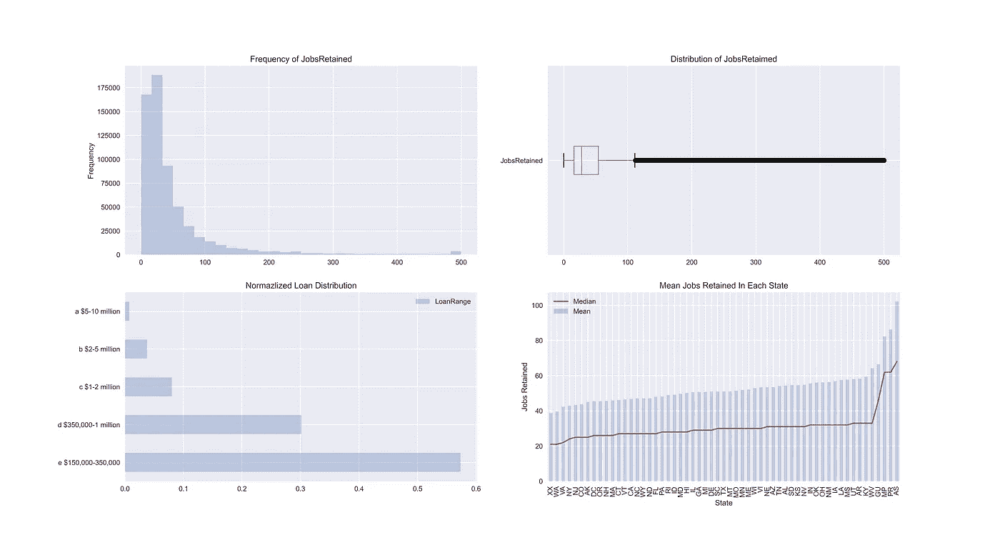
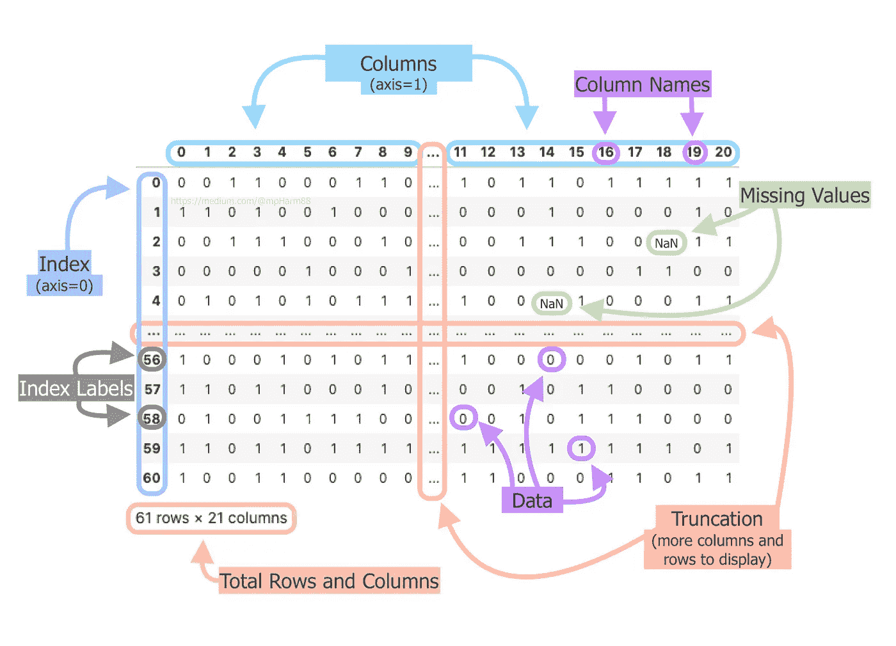
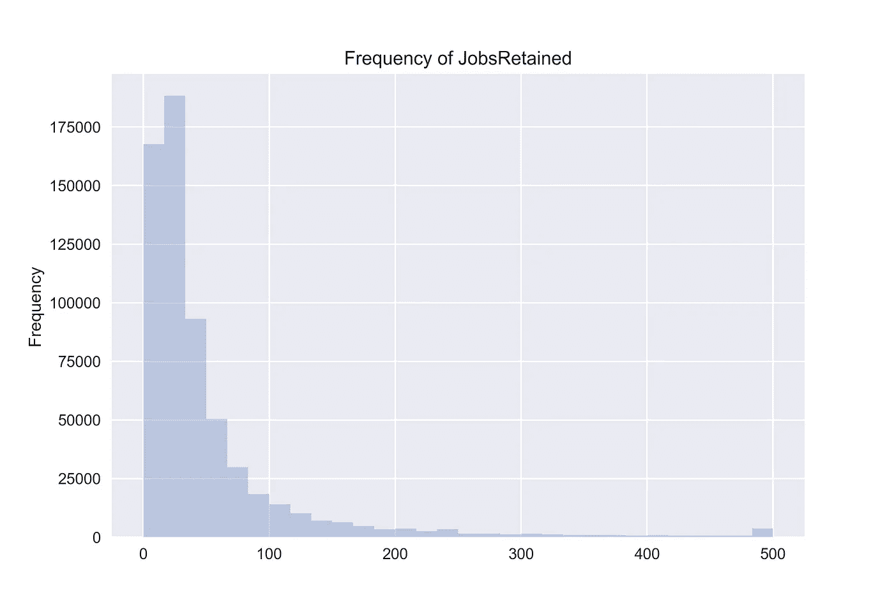
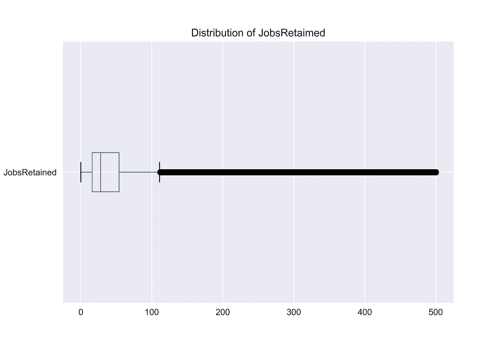
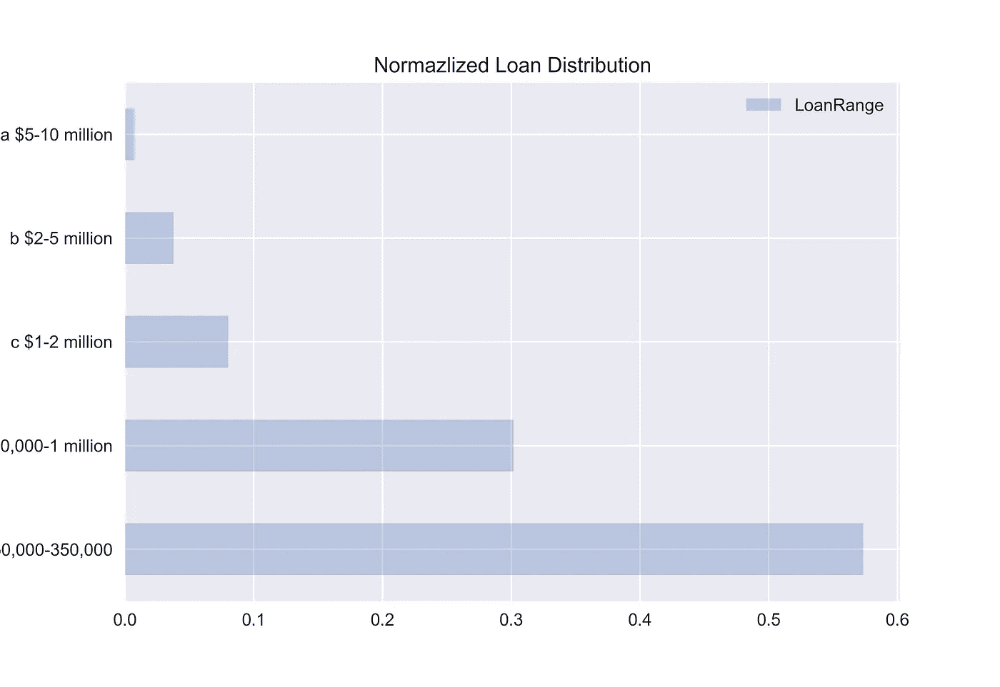
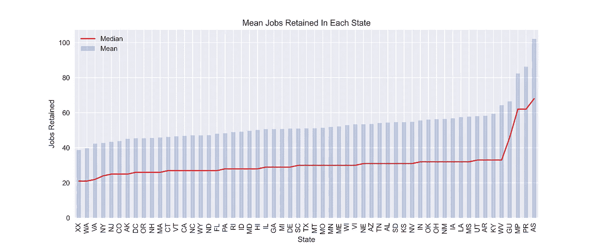

# 绘制熊猫和 PPP 贷款数据

> 原文：<https://towardsdatascience.com/plotting-w-pandas-and-ppp-loan-data-2d8d1995a626?source=collection_archive---------25----------------------->

## 查看我在 Python [字典](https://medium.com/swlh/how-to-use-python-dictionaries-19c003afa65f)、[列表](https://medium.com/swlh/how-to-use-python-lists-831f4369a0cb)和[字符串](https://medium.com/swlh/how-to-use-python-dictionaries-19c003afa65f)上的其他帖子

## 探索性数据分析初学者指南。



图片由 Mikio Harman 提供

# 数据帧

在深入研究数据之前，理解什么是数据帧及其用途是很重要的。了解这一点将有助于我们理解熊猫的数据是如何被操纵的。

熊猫数据框是表格，就像你在 Excel 中看到的一样。它们由列和行组成，并以表格格式排列我们的数据，以便更容易使用数据进行推断或预测。



[数据应整齐，即每个变量形成一列，每个观察值形成一行，每种类型的观察单位形成一个表格。](https://vita.had.co.nz/papers/tidy-data.pdf)图片由 Mikio Harman 拍摄

更具体地说，DataFrame 可以使用一个`[dictionary](https://docs.python.org/3/tutorial/datastructures.html#dictionaries)`、`[lists](https://docs.python.org/3/tutorial/datastructures.html#more-on-lists)`、`[pd.Series](https://pandas.pydata.org/pandas-docs/stable/reference/api/pandas.Series.html#pandas-series)`、`n[umpy.ndarrays](https://numpy.org/doc/stable/reference/generated/numpy.ndarray.html)`或另一个`DataFrame`来填充 DataFrame 对象。让我们使用前四种方法创建数据框架，并展示查看数据的四种不同方法。

如果你还没有，你需要下载 [Pandas](https://pandas.pydata.org/pandas-docs/stable/getting_started/install.html#installation) 和 [NumPy](https://numpy.org/install/) 最简单的方法就是使用`[pip](https://pypi.org/project/pip/)`。

```
pip install pandas numpy
```

用熊猫创建数据框很容易。根据您处理的数据和数据结构，能够以不同的方式创建它们给了您很大的灵活性。您还可以将一个列名列表传入到`columns`参数中，并使用`index`参数将哪个列用于索引。

查看数据也很简单，Pandas 提供了许多从数据中提取行的方法。笔记本中涵盖的五种方式是:

*   `[head()](https://pandas.pydata.org/pandas-docs/stable/reference/api/pandas.DataFrame.head.html#pandas-dataframe-head)`——看看前 5 行
*   `[tail()](https://pandas.pydata.org/pandas-docs/stable/reference/api/pandas.DataFrame.tail.html#pandas-dataframe-tail)` —查看最后 5 行
*   `[sample(x)](https://pandas.pydata.org/pandas-docs/stable/reference/api/pandas.DataFrame.sample.html#pandas-dataframe-sample)` —看 x 随机行
*   `[shape](https://pandas.pydata.org/pandas-docs/stable/reference/api/pandas.DataFrame.shape.html#pandas-dataframe-shape)`返回一个元组:(行，列)
*   `[df[start:stop:step]](https://pandas.pydata.org/pandas-docs/stable/reference/api/pandas.DataFrame.sample.html)` —数据帧切片

## 截断

您经常会遇到数据集太大而无法在屏幕上完整显示的情况。当有太多的数据以列或行的方式显示时，Pandas 会自动截断你的数据，这就是为什么你会看到一个交叉的`…`穿过你的数据，就像上面的例子中看到的那样。这可以通过使用以下方法访问`[pd.options](https://pandas.pydata.org/pandas-docs/stable/user_guide/options.html#options-and-settings)`方法来解决:

```
**# Changing these settings as seen in the notebook above will let you view your desired amount of rows and columns.**
pd.options.display.max_rows
pd.options.display.max_columns**# View up to 100 rows and columns**
pd.options.display.max_rows = 100
pd.options.display.max_columns = 100
```

警告显示比需要更多的行和列将会增加查看代码输出的时间。

现在我们已经了解了什么是数据帧以及与数据帧相关的一些基本功能，让我们加载一些数据并进行一些初步的 EDA。

## EDA 是什么？

> "探索性数据分析(EDA)是一种利用各种技术(主要是图形技术)进行数据分析的方法/理念. "
> 
> [- NIST/SEMATECH 统计方法电子手册](https://www.itl.nist.gov/div898/handbook/eda/section1/eda11.htm)

对于什么样的技术可以用于 EDA 没有硬性规定，但是通常使用可视化和简单的统计来帮助探索数据。这可以包括使用:

1.  散点图
2.  箱线图
3.  直方图
4.  线形图
5.  条形图

**工资保障计划贷款数据集**

将鼠标悬停在某个状态上可查看更多详细信息。

对于这个例子，我们将使用[小企业管理局工资保障计划贷款水平数据](https://home.treasury.gov/policy-issues/cares-act/assistance-for-small-businesses/sba-paycheck-protection-program-loan-level-data)。2020 年 3 月，美国立法者同意了一项价值 2 万亿美元的刺激法案。该套餐包括

*   成人 1，200 加元，家庭收入不超过 75，000 加元的每个儿童 500 加元
*   为美国企业提供 5000 亿美元的基金贷款，每笔贷款都要公开
*   失业救济金连续四个月增加了 600 美元
*   航空公司 250 亿美元
*   航空货运公司 40 亿美元
*   30 亿美元用于航空承包商
*   3670 亿美元的小型企业贷款和补助计划
*   州政府和地方政府 1500 亿美元
*   1300 亿美元用于医院、医疗保健系统和供应商

我们将使用分配给小企业的 3670 亿美元的数据，看看 EDA 是否能帮助我们得出任何假设。

> “工资保护计划是一项贷款，旨在为小企业提供直接激励，以保持他们的工人在工资单上。”
> 
> -[sba.gov](https://www.sba.gov/funding-programs/loans/coronavirus-relief-options/paycheck-protection-program)

## 汇总统计数据

Pandas 有许多用于返回汇总统计数据的内置方法。我最喜欢的一些包括`[describe()](https://pandas.pydata.org/pandas-docs/stable/reference/api/pandas.DataFrame.describe.html#pandas-dataframe-describe)`和`[info()](https://pandas.pydata.org/pandas-docs/stable/reference/api/pandas.DataFrame.info.html#pandas-dataframe-info)`。

`describe()`将返回两组不同的描述性统计数据，具体取决于是对分类列还是数字列执行该操作。

**分类列(离散值):**

*   `**count**` —列中非缺失值的数量
*   `**unique**` —列中有多少个唯一值
*   `**top**` —列中最常见的值
*   `**freq**` —最大`**top**`值在列中出现多少次

**数字列(连续值):**

*   `**count**` —列中非缺失值的数量
*   `**mean**` —列中找到的平均值
*   `**std**` —列的标准偏差
*   `**min**` —列中的最小值
*   `**25%**` —列的第 25 个百分点值
*   `**50%**` —列的第 50 个百分位(中值)的值
*   `**75%**` —列的第 75 百分位的值
*   `**max**` —列中的最大值

`info()`告诉我们关于索引数据类型、列数据类型、存在多少非空值以及数据帧使用的内存量的信息。

让我们来看看一些运行中的代码。

## 加载数据

Pandas 可以加载多种文件类型，这取决于你使用哪种文件类型。我使用的数据是一个 CSV 文件，Pandas 方便地提供了一个`[read_csv()](https://pandas.pydata.org/pandas-docs/stable/reference/api/pandas.DataFrame.info.html#pandas-dataframe-info)`方法，当给定正确的文件路径时，该方法会自动将数据读入 DataFrame。Pandas 还提供了许多参数，在加载数据时可以包含这些参数，这可以减少数据清理过程中的大量繁重工作。

想学习加载不同的文件类型吗？检查这里的[和](https://pandas.pydata.org/pandas-docs/stable/reference/io.html#input-output)。

## **楠策**

缺失值在数据中普遍存在，处理它们将是一项常见的任务。Pandas 以`NaN`的形式表示缺失值，意思是“不是一个数字”。这些不是表示缺失值的唯一方式，您的工作是确定在生成数据时如何处理缺失值。当您使用 Pandas 读入数据时，您可以指定哪些值代表缺失值。

默认情况下，Pandas 在加载数据时会将以下值解释为缺失，并会自动将它们转换为一个`NaN`:' '、' #N/A '、' #N/A N/A '、' #NA '、'-1。#IND '，'-1。#QNAN '，'-nan '，'-NaN '，' 1。#IND '，' 1。' #QNAN '，'< NA >'，'不适用'，' NA '，' null '，' NAN '，'不适用'，' NaN '，' NULL '。

我通过将两个方法链接在一起来确定每一列中有多少缺失值。

```
df.isna().sum()
```

`[isna()](https://pandas.pydata.org/pandas-docs/stable/reference/api/pandas.DataFrame.isna.html#pandas-dataframe-isna)`为数据帧中的每个值返回一个布尔值，如果它丢失或不丢失，`[sum()](https://pandas.pydata.org/pandas-docs/stable/reference/api/pandas.DataFrame.sum.html#pandas-dataframe-sum)`对布尔值进行合计，以确定每列中有多少个丢失的值。这是一种简便的方法，可以知道哪些列可以立即删除，哪些列需要进一步分析，以了解应该如何处理缺失的值。

## 熊猫策划

对 Pandas 使用`[plot()](https://pandas.pydata.org/pandas-docs/stable/reference/api/pandas.DataFrame.plot.html#pandas-dataframe-plot)`方法可以很容易地快速可视化您的数据。让我们试着使用方法来理解一些可用的特性。在本例中，我们将使用熊猫创建以下地块。

1.  直方图—非常适合查看数据的频率
2.  箱线图—非常适合查看数据的分布
3.  水平条形图—非常适合检查离散类型
4.  堆积图——非常适合比较多个推论。

## 列选择和分组依据

Pandas 通过简单地在`[]`中传递列名和列名就可以很容易地选择一个列。如果您想选择多个列，只需传递一个名称列表即可。默认情况下，当您选择一个包含索引标签和值的列时，Pandas 将返回一个`pd.Series`对象，如果您想返回一个`DataFrame`对象，只需传递列表中的单个列名即可。点击了解更多信息。

```
**# Make the DataFrame**
data = {chr(65+x):[x+1] for x in range(3)}
df = pd.DataFrame(data)**# Getting a single column**
print(df["C"])
print(type(df["C"]))*# Output
0    3
<class 'pandas.core.series.Series'>***# Returning a DataFrame from a single column**
print(df[["C"]])
print(type(df[["C"]]))*# Output
0    3
1    4
Name: C, dtype: int64
<class 'pandas.core.frame.DataFrame'>***# Passing a list of column names**
print(df[["B", "A"]])*#Output
   B   A
0  2  1
1  3  2
<class 'pandas.core.frame.DataFrame'>*
```

有时，您会希望按某个变量对数据进行分组，并对其余数据执行聚合(平均值、总和、计数等)。).这可以通过使用`[groupby()](https://pandas.pydata.org/pandas-docs/stable/reference/api/pandas.DataFrame.groupby.html#pandas-dataframe-groupby)`方法来实现。`groupby()`的基本语法是这样的:

`df.groupby(<Column Name to group by>).<aggregation function>`

我强烈推荐阅读相关文档，`groupby()`是熊猫经常使用的方法，也是我最喜欢使用的方法之一。下面的代码示例更详细地说明了如何使用它。

## 柱状图

```
df["JobsRetained"].plot(
    kind="hist", 
    title="Frequency of JobsRetained",
    bins=30,
    alpha=0.3 **#adjusts the transperancy**
)
```



图片由 Mikio Harman 提供

直方图显示了装箱值的出现频率。

当查看“JobsRetained”列时，我们看到数据中可能存在异常值。我们希望看到正态分布，但显然，从 x 轴上看，单个企业可以保留的工作岗位数量在 0-500 之间。这个直方图告诉我们，我们的数据是右偏的，这意味着我们的大部分数据值出现在 0-100 个保留的工作之间。

## 箱线图

```
df["JobsRetained"].plot(
    kind="box",
    vert=False, **#makes the box plot horizontal**
    title="Distribution of JobsRetaimed"
);
```



图片由 Mikio Harman 提供

箱线图向我们更精确地展示了连续数据的分布。图表上的方框代表从第 25 个百分位数到第 75 个百分位数的四分位数范围，红线代表中位数。离开盒子的线被称为须，从一个须的末端到另一个须的末端的距离代表 99.3%的数据。另外 0.7%显示在胡须外。

在我们的例子中，异常值看起来就像是紧密排列在一起的数据点的黑色粗线。箱线图看起来与直方图相似，因为它也被推到了图表的左侧。我们希望看到这一点，因为我们的直方图已经显示，大多数值都在 0-100 个保留的工作岗位之间。

## 条形图

```
df["LoanRange"].value_counts(normalize=True).plot(
    kind="barh", 
    title="Normazlized Loan Distribution",
    legend=True,
    alpha=0.3
)
```



图片由 Mikio Harman 提供

条形图有助于可视化离散变量的分布。在我们的例子中，我们在“LoanRange”列中绘制了五个不同的值。这些值代表每个批准属于哪一类贷款。

x 轴是归一化的，这意味着它显示了每个离散值与整个数据集相比所占的比例。看起来最常批准的贷款在 0-350，000 美元之间，占总数据的 50-60%。数据需要在绘图前汇总，这就是为什么在代码中使用了`[value_counts()](https://pandas.pydata.org/pandas-docs/stable/reference/api/pandas.Series.value_counts.html#pandas-series-value-counts)`。

## 平均值和中位数

```
df.groupby("State")["JobsRetained"].mean().sort_values().plot(
    kind="bar",
    title = "Mean Jobs Retained In Each State",
    alpha = 0.3,
    legend=True,
)df.groupby("State")["JobsRetained"].median().sort_values().plot(
    kind="line",
    title = "Mean Jobs Retained In Each State",
    legend=True,
    color="red",
    rot=90,
    alpha=.8,
    figsize=(12,5) **#determines the size** 
)
plt.ylabel("Jobs Retained") 
plt.legend(["Median", "Mean"])
```



图片由 Mikio Harman 提供

只要具有相同的 x 轴，就可以在彼此的顶部绘制多个图。您还可以在代码之外使用一些 matplotlib 语法来微调图表的外观。

在这里，我们看到数据中每个州的“保留的工作”的中值和平均值相互叠加。由于数据的偏斜，预计会看到一个非常高的平均值。中位数只是整个数据集中的中间数字。由于保留了 0-100 个工作岗位之间的大量数据，以及保留了约 0-500 个工作岗位的数据范围，因此中值远低于平均值是有意义的。

## 熊猫简介


一个为 Pandas 中的任何数据集自动生成 EDA 的包。

没有提到[熊猫简介](https://pandas-profiling.github.io/pandas-profiling/docs/master/index.html)，关于熊猫的 EDA 讨论就不完整。Pandas Profiling 将自动执行各种 EDA 技术，并创建一个交互式报告。它非常容易上手，我已经包含了一个交互式报告，可以使用相同的数据来查看它的运行情况。**参见互动报道** [**此处**](https://nbviewer.jupyter.org/github/mpHarm88/projects/blob/master/pandas/dataframes4.ipynb) **。**

## **感谢阅读🎉**

我希望你现在能够自己完成一些简单的 EDA！

在这里找到这个博客的代码。