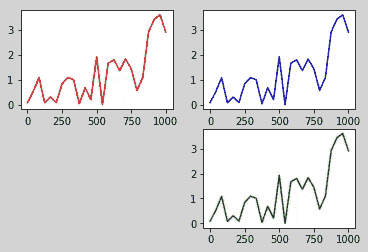
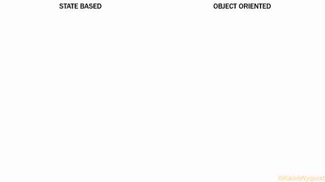
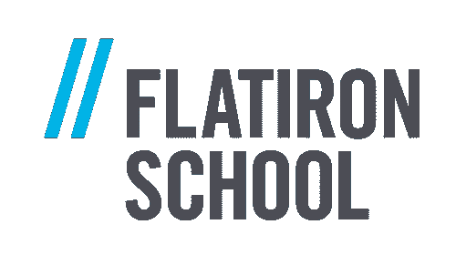

# plt.subplot()还是 PLT . subplot()？了解 Pyplot 中基于状态的编程与面向对象的编程

> 原文：<https://towardsdatascience.com/plt-subplot-or-plt-subplots-understanding-state-based-vs-object-oriented-programming-in-pyplot-4ba0c7283f5d?source=collection_archive---------6----------------------->

## 如何驯服 Matplotlib 的双头怪兽，达到你想要的数据可视化效果

当我学习如何使用 Python 编程语言编码时，Pyplot 模块(Matplotlib 库的一部分，在这里别名为`plt`)的介绍特别不直观…老实说，有点让人迷惑。例如，功能`plt.subplot()`和`plt.subplot**s**()`可能看起来被一个字母`**s**`关闭，但通常前者后面是一个形式为`**plt**.plot(data_x, data_y)`的绘图功能，而后者后面通常是`**ax[0,0]**.plot(data_x, data_y)`。更令人困惑的是，尽管“旅程”可能不同，但输出的“目的地”往往是相同的，这让任何人都想知道最终的实际差异是什么。


在 Matplotlib 的 Pyplot 模块中，双头龙 Uroboros 吃着自己的尾巴，试图模仿一个饼图，而不理解基于状态和面向对象编程之间的微妙区别。[来源:[维基共享资源](https://commons.wikimedia.org/wiki/File:Uroboros.png)

在对 Pyplot 文档进行了更深入的研究之后，在网络普通用户的帮助下，我了解到在这些产生错误的细微差异背后，有两种完全不同的编程方法，Pyplot 接口支持这两种方法:第一种是“基于状态的”，第二种是“面向对象的”。

虽然 Matplotlib 学习者从“面向对象”方法开始并坚持使用它被认为是[最佳实践](https://matplotlib.org/tutorials/introductory/lifecycle.html#a-note-on-the-object-oriented-api-vs-pyplot)，但是花点时间使用“基于状态”的方法对于更好地理解计算机科学中一个更大的概念争论来说是一个很好的迷你课程。像我这样没有花时间去理解这些细微差别的 Pyplot 用户可能会发现自己与一个模块的双头兽进行了无休止的斗争，永远无法驯服它以获得他们所设想的数据可视化。

对于学习 Pyplot 的 Matplotlib 新手来说，下面是一个简短的历史注释，说明为什么“基于状态”和“面向对象”编程哲学存在，以及它们如何试图在一个模块中同时存在。换句话说，当我第一次试图理解这个看似奇怪又矛盾的工具时，这就是我希望拥有的洞察力。

# 为什么有两种不同的方法？

更具 Pythonic 风格但也更复杂的方法“面向对象编程”在 20 世纪 60 年代的挪威计算中心有着历史渊源，在那里[克利斯登·奈加特和奥利·约翰·达尔创建了 Simula 编程语言](https://doi.org/10.1016/j.ic.2013.08.002)的第一个版本，该语言设计用于编程计算机模拟，其中不同的参与者和未知因素以复杂但可重复的方式相互作用(例如，如果核反应堆要在 10，000 个平行宇宙中建造，其中有多少个宇宙会发生严重事故？).几十年后，[互联网和其他计算机网络的兴起普及了“面向对象编程”](http://www.informit.com/articles/article.aspx?p=2036576)。Python 是采用这种常见方法的许多语言之一，其他主流语言如 Java、C++和 Ruby 也是如此。


达尔和尼加德在开发 Simula，un ivac[来源:[cs-exhibitions . uni-klu . AC . at](http://cs-exhibitions.uni-klu.ac.at/)]期间。

随着 Python 的普及，2003 年创建了 Matplotlib 库，以使 Python 成为 20 世纪 70 年代末首次开发的专有软件 [MATLAB](https://en.wikipedia.org/wiki/MATLAB) 的开源替代品。然而，MATLAB 的方法更接近于所谓的“基于状态的编程”，而不是“面向对象”。这种更简单的方法通过已建立的过程运行变量，产生一系列状态，最终以期望的结果结束。这与使用基本计算器时的情况没有什么不同。例如:

来源:[吉菲](https://giphy.com/gifs/calculator-calculate-add-up-ghTPBMNczu5BBGbyX5)

*   计算器从初始状态“0”开始
*   我们输入常量变量“1”。这用新状态“1”替换了初始状态。
*   我们现在添加加法过程“+”和一个新的常量变量，在这种情况下，它也恰好是“1”。
*   我们用等号“=”将状态、过程和变量结合起来。
*   这给了我们一个新的状态，“2”。我们可以使用更多的过程来修改这种状态(“+”、“-”、“×”、“”、“√”或“%”)。

（🤦🏼‍♂️我有时会不小心把基于状态的编程写成“基于阶段的”，因为在我的想象中，我把这个过程看作是一系列阶段，每个阶段都朝着最终目标前进。但是正确的术语是基于状态的。)

虽然 MATLAB 和其他基于状态的语言非常简单，但它们的缺点是不容易封装对象和抽象函数，导致更复杂程序的代码更长、更混乱。

Matplotlib 的本意是作为 MATLAB 用户进入 Python 的桥梁，因此它最初的设计是为了适应基于状态的编程和面向对象的编程。尽管一些基于状态的编程特性(尤其是 [Pylab](https://matplotlib.org/faq/usage_faq.html#matplotlib-pyplot-and-pylab-how-are-they-related) )现在已经被弃用，以缓解混乱，但基于状态的 MATLAB 遗产通过 Pyplot 模块继续存在。

# 并排看到基于状态和面向对象的编程

这些不同的编程理念汇聚在 Pyplot 模块中。做考古挖掘的数字版本，有可能对比两者，通过比较两组不同的代码，将这些历史带入生活，最终得到相同的结果。

在这个例子中，我们将尝试创建一个有三个支线剧情的人物，如下所示。



注意，下面的代码假设 Pyplot 已经导入，并且已经定义了`data_x`和`data_y`。你可以在 GitHub 上找到这个初步代码。

首先，我们使用基于状态的方法创建这个图。

```
plt.figure(facecolor='lightgrey')
plt.subplot(2,2,1)
plt.plot(data_x, data_y, 'r-')
plt.subplot(2,2,2)
plt.plot(data_x, data_y, 'b-')
plt.subplot(2,2,4)
plt.plot(data_x, data_y, 'g-')
```

我发现一个有助于理解这里发生的事情的窍门是 ***【支线剧情】是名词，“情节”是动词*** 。也就是说，`plt.subplot(2,2,1)`在一个 2×2 的网格中创建并聚焦于第一个子情节(从左到右，从上到下)。然后`plt.plot(data_x, data_Y, 'r-')`使用第一个子情节中提供的数据主动绘制红线。

(🕵🏽‍♀️细心的观察者可能还会注意到，第三个次要情节已经被上面代码中的*省略了*。)

第二，同样的图形可以通过面向对象的方法实现:

```
fig, ax = plt.subplots(2,2)
fig.set_facecolor('lightgrey')
ax[0,0].plot(data_x, data_y, 'r-')
ax[0,1].plot(data_x, data_y, 'b-')
fig.delaxes(ax[1,0])
ax[1,1].plot(data_x, data_y, 'g-')
```

这里，`plt.subplot**s**(2,2)`(注意附加的`**s**`)已经生成了一个可比较的人物对象(`fig`)，它包含一个 2×2 的子情节数组(或“轴”对象)。然而，现在，面向对象的方法首先从`ax`数组中检索“axes”对象，而不是将程序集中在一个子情节上，然后在该子情节中绘图。然后，axes 方法中的参数负责绘图。

(🕵🏽‍♀️注意到，在上面的代码中，第三个子情节(在这里以数组形式表示为`ax[1,0]`)是*创建的，然后又删除了*，而不是像基于状态的方法中那样简单地省略掉。)

除了在面向对象的方法中节省一行代码之外，这些细微的差别似乎无关紧要。但是，对于那些仍在学习 Pyplot 的人来说，应该警告他们，不知不觉地混合这些方法可能会导致看似无法解释的编码混乱。下面的动画逐行展示了基于状态的过程与面向对象的过程的根本区别。只需要一点点想象力，就可以看出试图混合搭配这些流程会造成多么令人头痛的问题！



自己的作品。在知识共享署名许可下可重复使用[ [CC BY 4.0](https://creativecommons.org/licenses/by/4.0/) ]。

# 轮到你了！

为了进一步实验这些方法如何彼此不同，但却达到相同(或至少相似)的结果，即插即用 Pyplot 代码的这些片段来添加轴标签和图形标题:

## 基于状态的方法

```
plt.suptitle("Your Title Here")
plt.xlabel("X Axis")
plt.ylabel("Y Axis")
```

## 面向对象的方法

```
fig.suptitle("Your Title Here")
ax[1,1].set_xlabel("X Axis")
ax[1,1].set_ylabel("Y Axis")
```

（💡提示:当试验上述方法时，请注意代码相对于`plt.subplot()`的位置如何在基于状态的方法中产生差异，以确定哪个轴被命名，而面向对象的方法由于 axes 对象的数组而与位置无关。)

为了方便起见，[GitHub](https://github.com/KalebNyquist/statebased_vs_oop_pyplot)上提供了一个 Jupyter 笔记本，其中包含用于生成上述图形的代码。

# 更深入

到目前为止，您应该对理解 Pyplot 接口的双重性有了一个坚实的基础，并且对编码语言的 DNA 有了一个小小的了解。

如果你想更多地了解 Pyplot 的双重性质，我发现有一些在线阅读资料特别有帮助，包括“[一个情节的生命周期](https://matplotlib.org/tutorials/introductory/lifecycle.html)”和“[有效地使用 Matplotlib](https://pbpython.com/effective-matplotlib.html) ”。关于面向对象编程的更多内容，“[如何向一个六岁的孩子解释面向对象编程”](https://www.freecodecamp.org/news/object-oriented-programming-concepts-21bb035f7260/)”尤其具有启发性。最后，Ankit Gupta 有[有用的资源，将 Matplotlib](/whats-new-in-matplotlib-3-1b3b03f18ddc) 的最新版本放在它们的历史开发环境中。

我撰写的内容广泛，可能会引起初露头角的数据科学家的兴趣。请务必查看我的 [Airtable API-Python 教程](https://medium.com/towards-data-science/downloading-airtable-data-into-python-89e5c7107a24)和我的列表[“非营利数据管理的 5 个最佳实践”](/nonprofit-data-management-cb1e4dd2cf0c)。如果你觉得这篇文章有帮助，如果你[给我买一杯咖啡](https://www.buymeacoffee.com/kalebnyq)或者[通过这个推荐链接](https://medium.com/@kalebnyquist/membership)成为一个媒体订阅者来帮助支持我更多的写作，我会非常感激。

恭喜你。你现在已经驯服了 Pyplot 的双头怪物，你可以开始狂欢了！[来源:[吉菲](https://giphy.com/gifs/disney-GmxVp1WocZbck/embed)

[](https://flatironschool.com/scholarships/2022q2ar/?utm_campaign=ec2a7f51-e911-403e-8e92-50950d9f7c32&utm_source=emailbatch&utm_medium=email&utm_term=txtlink)

*这篇文章的早期草稿是作为 2019 年* [*数据科学与熨斗学校华盛顿 DC 校区*](https://flatironschool.com/scholarships/2022q2ar/?utm_campaign=ec2a7f51-e911-403e-8e92-50950d9f7c32&utm_source=emailbatch&utm_medium=email&utm_term=txtlink) *奖学金的一部分完成的。特别感谢我的同事和导师提供的反馈。*

*如果您有兴趣了解更多关于熨斗学校数据科学项目的信息并欣赏这篇文章，* [*使用此推荐链接了解更多信息，并支持更多类似您在此处看到的内容*](https://flatironschool.com/scholarships/2022q2ar/?utm_campaign=ec2a7f51-e911-403e-8e92-50950d9f7c32&utm_source=emailbatch&utm_medium=email&utm_term=txtlink) *。*