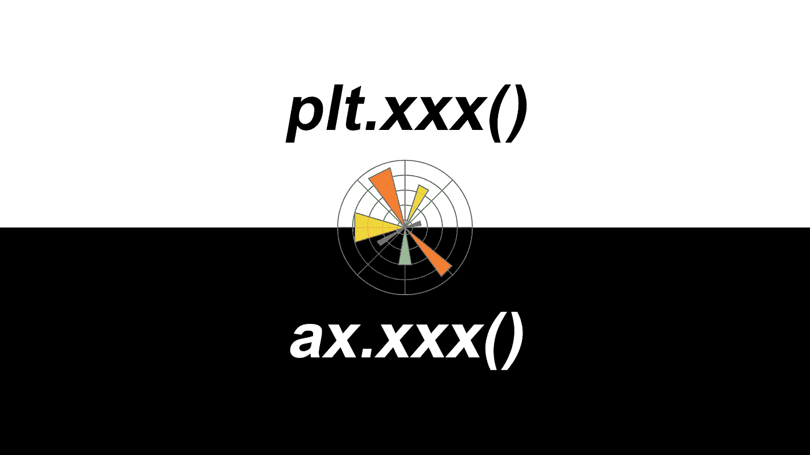
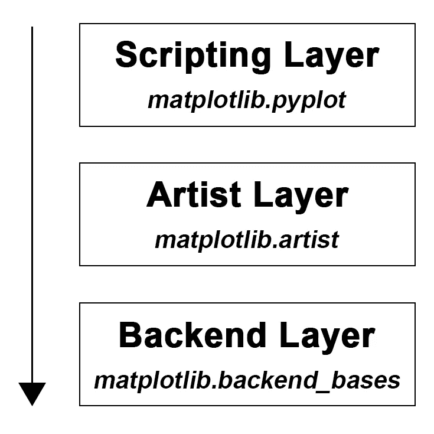
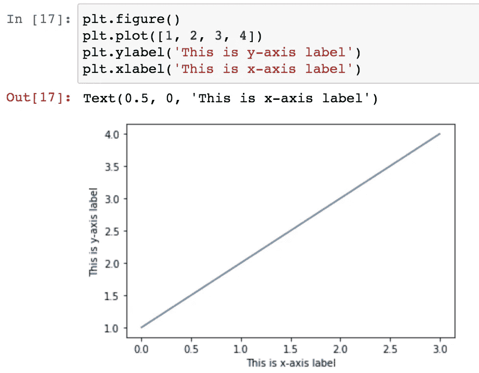
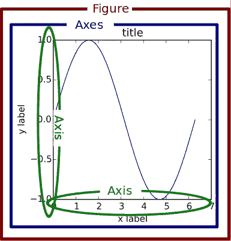
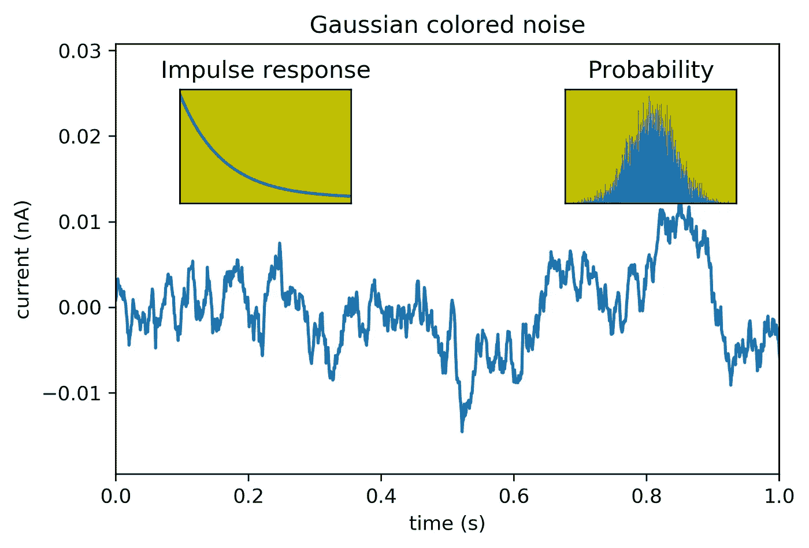

# plt.xxx()还是 ax.xxx()，那是 Matplotlib 里的问题

> 原文：<https://towardsdatascience.com/plt-xxx-or-ax-xxx-that-is-the-question-in-matplotlib-8580acf42f44?source=collection_archive---------5----------------------->

## 学习 matplotlib 的初学者建议

作为一个最近从使用 R 转换到 Python 的新手，通过标准 Python 可视化库`matplotlib`进行数据可视化是学习过程中不可避免的一部分。最开始的时候，在看了几个容易找到的`matplotlib`教程后，有一种“恩，没我想的那么难”的印象。在`import matplotlib.pyplot as plt`之后，我基本上可以通过调用`plt.xxx(…)`(如`plt.plot(…)`、`plt.scatter(…)`、`plt.bar(…)`、`plt.xlabel(…)`、`plt.ylabel(…)`、`plt.legend(…)`等)来剧情一切。).当涉及到一些具体的调整时，Stackoverflow 是可以找到答案的地方。很多时候，我只需要复制粘贴解决方案，甚至不需要阅读问题描述，人们称之为 **Stackoverflow 综合症**。然而，随着剧情变得复杂，我发现在`matplotlib`中总是有许多不同的方法来解决一个特定的问题。例如，您可能会发现，`plt.title(…)`、`ax.set_title(…)`和`ax.title.set_text(…)`这些功能都可以为一个情节设置一个标题。每次遇到这种情况，我都不知所措。`plt.xxx()`不是一刀切的方法吗？`ax.xxx()`从哪里来？

> plt.xxx()，还是 ax.xxx()，就是这个问题。

因此，我意识到复制粘贴的方法永远不会让我精通`matplotlib`。我需要知道`matplotlib`的架构和剧情。如果你是一个`matplotlib`的初学者，并且和我一样经历过类似的情况，这是给你的帖子。在这篇文章中，我将分享我的笔记:

1.  `matplotlib`中`plt.xxx()`与`ax.xxx()`的区别，
2.  在`matplotlib`中，`figure`不仅是一个图形，`axes`也不是轴的复数，
3.  分别用这两种方法画一个例图。

我希望这篇文章能解答你长期以来的困惑，并节省你学习的时间。

## `plt.xxx()` 和`ax.xxx()`的区别

如图 1 所示，`matplotlib`架构中有三个主要层。从上到下分别是**脚本层** ( `matplotlib.pyplot`模块)、**美工层** ( `matplotlib.artist`模块)、和**后端层** ( `matplotlib.backend_bases`模块)。

图 1，Matplotlib 架构

让我们从底层开始，**后端层**通过与你机器中的工具箱如 [wxPython](https://www.wxpython.org/) 或绘图语言如 PostScript 通信来处理所有繁重的工作。这是最复杂的一层。在这一层中，`FigureCanvas`是绘制图形的区域，`Renderer`是知道如何在`FigureCanvas`上绘制的对象。像你我这样的普通用户几乎不需要处理这一层。

然后是中间层，**艺术家层**，这里是`ax.xxx()`的来源。顾名思义，使用该层，您可以控制和微调尽可能多的元素(例如，脊线、刻度方向、刻度标签大小、刻度标签字体、刻度颜色等。)就像艺术家在画布上作画一样。与**脚本层**(见下文)相比，这一层允许你做更多的定制，对于高级剧情来说更方便。特别是当处理多个图形/轴时，你不会混淆哪个是当前活动的，因为每个子图都被分配给一个`ax`。这就是为什么`ax.xxx()`有时被称为**基于对象的绘图**。在编写 web 应用程序、UI 应用程序或者与其他开发人员共享的脚本时，我们肯定会更多地使用这一层。

顶层，**脚本层，**`plt.xxx()`驻留于此，旨在使`matplotlib`像 MATLAB 脚本一样工作。换句话说，这一层被认为是所有三层中最轻的脚本接口，它包括一组命令风格的函数，用于快速轻松地生成图形和绘图。这也是为什么很多`matplotlib`教程更喜欢从这一层介绍。这是最容易开始和使用的部分，你基本上是在`figure`的顶部添加对象(如线条、文本、矩形)。脚本层绘图有时也称为**程序绘图**。

图 2，脚本层绘制

## Matplotlib 中的“图形”和“轴”

在`matplotlib`中，`figure`和`axes`是一个图形的层(请注意，我并没有引用这个“图形”作为脚本)。这里让我们用 matplotlib 网站[的一张图来解释这些概念。](https://matplotlib.org/1.5.1/faq/usage_faq.html#parts-of-a-figure)

图 3，Matplotlib 中的部分图形

从图 3 中我们可以看到，整个`figure`(标记为外部红色方框)是一个图形的基础。其上一层是`axes`(标记为内部蓝色方框)。一个`figure`至少可以有一个`axes`。从这里我们知道，`axes`指的是图形的一部分，而不是一个以上轴的复数。例如，如果在`figure`上有一个图，那么这个图就是`axes`。如果你在一个`figure`上有多个支线剧情，那么每个支线剧情就是一个`axes`。为了能够制作一个情节，我们通常在开始时调用`fig = plt.figure()`。我们通过调用`ax1 = fig.add_subplot(2, 1, 1)`在`figure`中创建一个`axes`对象。这创建了 2 行 1 列的第一个支线剧情`figure`。因此，所有的`ax1.xxx(…)`都是专用于`ax1`的功能。例如，要访问子情节`ax1`中的 x 轴和 y 轴，我们调用`ax1.xaxis(…)`和`ax1.yaxis(…)`。同样，我们可以通过调用`ax2 = fig.add_subplot(2, 1, 2)`来添加另一个子情节，并通过调用`ax2.xxx(…)`来操纵它的元素。这样，在不弄乱代码的情况下，我们清楚地知道我们正在处理哪个子情节(当然，还有许多其他方法来调用两个`axes`，例如，`fig, ax = plt.subplots(2)`，那么每个轴都可以通过调用`ax[0]`和`ax[1]`来访问)。

## 使用两种方法的示例图

好了，在明确了`plt.xxx()`和`ax.xxx()`的概念后，让我们用一个改编自 [matplotlib 文档](https://matplotlib.org/examples/pylab_examples/axes_demo.html)的简单例子来演示它们在绘制带有支线剧情的人物时的区别。

脚本层绘图

艺术家图层绘图

如果一切顺利，你会得到如下图。

图 4，一个示例图

从这两个脚本中可以看出(**脚本层出图** *vs.* **美工层出图**)，虽然美工层出图的代码比脚本层出图的代码更冗长，但是更容易读懂。这是一个非常重要的实践，可以让您生成高质量的代码并增加代码的可读性。当情节变得复杂时，艺术家分层绘图的力量就会越来越明显。

综上所述，我们可以使用`plt.xxx()`来快速获得用于探索性数据分析的图表，然而，当您的代码是一个严肃项目的一部分并且需要与其他人共享时，`ax.xxx()`是一种常用的风格。另外，作为一名`matplotlib`的学习者，我强烈建议从**艺术家图层绘制**开始，从中你会对`matplotlib`绘制有一个更全面的了解，对你在数据可视化方面的长远发展肯定更有好处。

以下是我发现非常有用的材料(*持续更新列表*)

*   [Matplotlib 剖析——为 SciPy 会议开发的教程](https://github.com/matplotlib/AnatomyOfMatplotlib)
*   [用于数据可视化的 Python 工具](https://pyviz.org/index.html)
*   [如何浏览 PyViz 景观](https://know.anaconda.com/eBook-PyVizeBookLP_ReportRegistration.html?utm_source=pyviz.org&utm_campaign=pyviz&utm_content=ebook)
*   Matplotlib 画廊
*   [Matplotlib API 概述](https://matplotlib.org/api/api_overview.html)

和往常一样，我欢迎反馈、建设性的批评以及倾听您的数据科学项目。你可以在 Linkedin 上找到我，现在也可以在我的网站上找到我。