# 推荐系统的 PMF

> 原文：<https://towardsdatascience.com/pmf-for-recommender-systems-cbaf20f102f0?source=collection_archive---------15----------------------->

## 概率矩阵分解和协同过滤

自动推荐系统通常用于基于关于偏好的现有数据向用户提供他们感兴趣的产品建议。文献描述了不同类型的推荐系统。但是，我们将强调两个主要类别，然后进一步扩展第二个类别:

**基于内容的过滤:**这些利用用户偏好来进行新的预测。当用户提供关于他/她的偏好的明确信息时，这被系统记录并用于自动提出建议。我们日常常用的许多网站和社交媒体都属于这一类。

**协同过滤:**当用户提供的信息不足以进行商品推荐时会发生什么？在这种情况下，我们可以使用其他有类似偏好的用户提供的数据。这类方法利用一组用户过去选择的历史来引出推荐。

在第一种情况下，期望给定的用户建立一个明确陈述偏好的简档，而在第二种情况下，该信息可能不完全可用，但是我们期望我们的系统仍然能够基于相似用户提供的证据来做出推荐。一种被称为*概率矩阵分解*，或者简称为 *PMF* 的方法，通常用于协同过滤，并且将是我们在本文剩余部分讨论的主题。现在让我们深入研究这个算法的细节以及它的直觉。

## 概率矩阵分解解释

假设我们有一组用户 *u* 1， *u* 2， *u* 3 … *u* N，他们对一组项目 *v* 1， *v* 2， *v* 3 … *v* M 进行评级。然后我们可以将评级构造为矩阵 ***R***

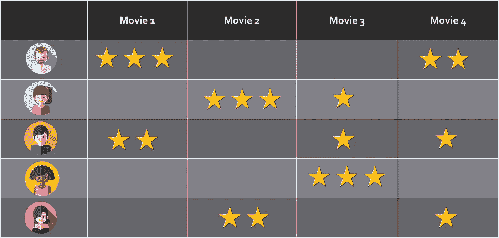

评级映射。它可以被认为是一个矩阵，其中每个用户(行)对许多项目(列)进行评级

***R*** 矩阵的一个重要特点是*稀疏*。也就是说，只有一些单元格具有非空的等级值，而其他单元格则没有。对于给定的用户 *A* ，系统应该能够根据他/她的偏好以及类似用户的选择提供商品推荐。然而，对于用户 *A* 来说，没有必要明确地对要推荐的特定项目进行评级。具有相似偏好的其他用户将弥补关于用户 *A* 的缺失数据。这就是为什么*概率矩阵分解*属于*协同过滤*推荐系统的范畴。

让我们考虑一下电影推荐系统。想象一下，如果我们被要求观看并评价在特定季节放映的每一部电影，情况会是怎样。那将是非常不切实际的，不是吗？我们只是缺少这样做的时间。

鉴于并非所有用户都能够对所有可用商品进行评级，我们必须找到一种方法来填补 ***R*** 矩阵中的信息空白，并且仍然能够提供相关的建议。PMF 通过利用类似用户提供的评级来解决这个问题。从技术上来说，它利用了贝叶斯学习的一些原则，这些原则也适用于我们拥有稀缺或不完整数据的其他场景。

可以使用两个低秩矩阵*和 ***V*** 来估计 ***R*** 矩阵，如下所示:*

*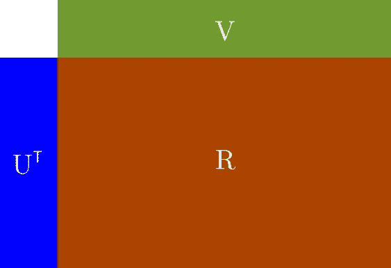*

*R 矩阵的分量*

*这里，**T33U**T 是一个 *N* x *D* 矩阵，其中 *N* 是注册用户数， *D* 是排名。 ***V*** 是一个 *D* x *M* 矩阵，其中 *M* 是要评定的项目数。因此， *N* x *M* 额定值矩阵 ***R*** 可通过以下方式近似计算:*

*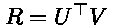*

*等式 1: R 表达式*

*我们从现在开始的工作是找到*T 和 ***V*** ，它们将依次成为我们模型的参数。因为 ***U*** 和 ***V*** 是低秩矩阵，所以 PMF 又称为*低秩矩阵因式分解问题*。此外，*和 ***V*** 矩阵的这一特殊特性使得 PMF 即使对于包含数百万条记录的数据集也是可伸缩的。***

**PMF 从贝叶斯学习中获得参数估计的直觉。一般来说，我们可以说，在贝叶斯推断中，我们的目标是通过诉诸贝叶斯规则来找到模型参数的后验分布:**

**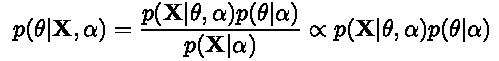**

**等式 2:参数推断的贝叶斯规则**

**这里， **X** 是我们的数据集，θ是分布的参数或参数集。α是分布的超参数。p(θ| **X** ，α)是*后验分布*，也称为*后验*。p( **X** |θ，α)为*似然*，p(θ|α)为*在先*。训练过程的整体思想是，随着我们获得更多关于数据分布的信息，我们将调整模型参数θ以适应数据。从技术上讲，后验分布的参数将被插入到先验分布中，用于训练过程的下一次迭代。也就是说，给定训练步骤的后验分布将最终成为下一步骤的先验。将重复该过程，直到各步之间的后验分布 p(θ| **X** ，α)变化很小。**

**现在让我们回到我们对 PMF 的直觉。如前所述，我们的模型参数将是*和 ***V*** *，*而 ***R*** 将是我们的数据集。一旦经过训练，我们将最终得到一个经过修改的 ***R**** 矩阵，该矩阵还将包含对最初在 ***R*** 中为空的用户项目单元格的评级。我们将使用修改后的评分矩阵进行预测。考虑到这些因素，我们将:***

**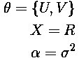**

**其中，σ是零均值球形高斯分布的标准偏差。然后，通过替换等式 2 中的这些表达式，我们将得到:**

**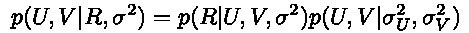**

**既然 ***U*** 和 ***V*** 矩阵是相互独立的(用户和项目独立发生)，那么这个表达式也可以这样写:**

**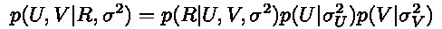**

**等式 3:PMF 的后验分布**

**现在是时候找出这个等式的每一个组成部分等同于什么了。首先，似然函数由下式给出:**

**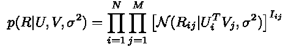**

**等式 4:观察评级的分布[1]**

**这里， *I* { *ij* }是一个指示器，当第 *i* 行和第 *j* 列的等级存在时，其值为 1，否则为零。正如我们所看到的，该分布是具有以下参数的球形高斯分布:**

**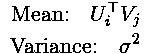**

**反过来，*和 ***V*** 的先验分布由下式给出:***

**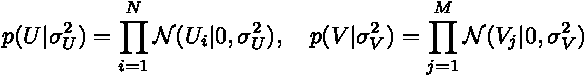**

**等式 5 和 6:U 和 v 的先验分布。**

**这是两个零均值球面高斯函数。然后，将 4、5 和 6 替换为 3，我们将得到:**

**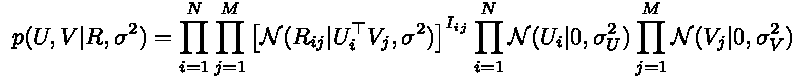**

**为了训练我们的模型，我们将通过使参数*和 ***V*** 的导数等于零来寻求最大化该函数。然而，这样做将非常困难，因为高斯函数中有 *exp* 函数。为了解决这个问题，我们应该将对数应用到前面等式的两边，然后应用所需的导数。因此，通过将对数应用于前面等式的两边，我们将得到:***

**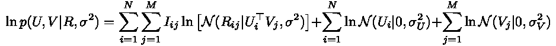**

**这是一个更容易区分的表达式。我们还知道，根据定义，高斯 PDF 由下式给出:**

**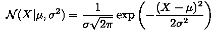**

**因此，对数后验概率的表达式如下所示(注意:为了简单起见，我们去掉了常数):**

**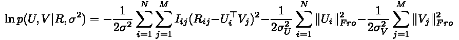**

**这里，后缀的*表示 Frobenius 范数，由下式给出:***

**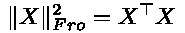**

**最后，通过引入一些附加符号来识别模型的超参数，我们将得到:**

**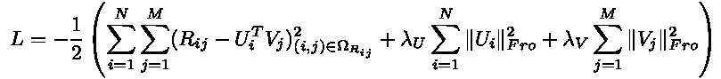**

**等式 7:PMF 的对数后验概率**

**其中:**

**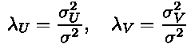**

**然后，通过对方程 7 的参数求导，并使导数等于零，我们将得到:**

**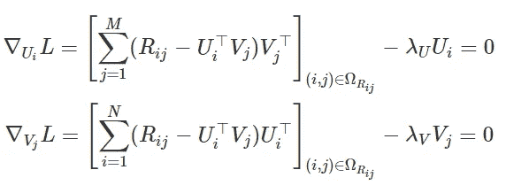**

**从这里我们可以推导出更新 ***U*** *i* 和 ***V*** *j* 的表达式:**

**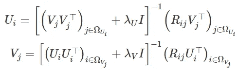**

**等式 8 和 9:更新 U 和 V 的表达式**

**假设 *λU* 和 *λV* 都不为零，则所涉及的逆矩阵保证存在。作为训练过程的一部分，我们将迭代更新**I*和 ***V*** *j* 。一旦我们找到这些的最佳值，我们将能够通过使用等式 7 获得 log-MAP(最大后验概率)的值。正如我们将在 Python 实现中看到的，我们可以使用这个值来监控训练收敛。***

## **用 Python 实现**

***注意:实现的完整源代码可在 https://bit.ly/35Cr5kl*获得**

**出于训练的目的，我们利用了 IMDB 电影数据库的子集，然后将它分成两部分，分别用于训练和验证。**

****初始化:**为了初始化 ***V*** ，我们从一个标准差为 1/ *λV 的零均值高斯中抽取随机数*此外，秩值 *D* 被设置为相对较小的值 10。**

**初始化代码**

****更新参数:**为了更新*和 ***V*** ，我们使用等式 8 和 9:***

****

**对应的 Python 代码如下:**

**更新参数**

****计算对数后验概率:**对数后验概率由等式 7 给出:**

****

**使用以下 Python 代码:**

**对数后验计算**

****训练循环:**为了训练模型，我们调用先前的函数，并监控在训练和测试集上评估的对数后验以及 RMSE(均方根误差):**

**训练循环**

**我们运行训练循环 150 次迭代，结果如下:**

**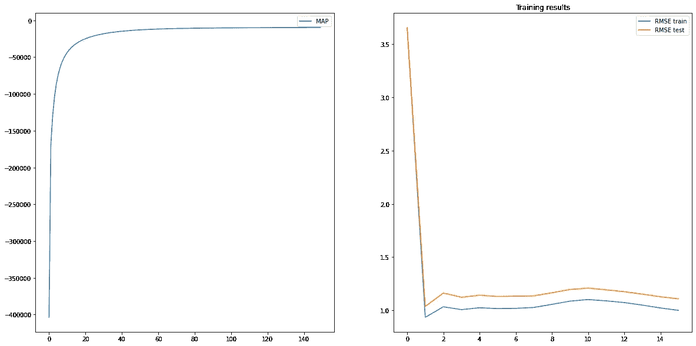**

**训练图**

**在左边，我们可以看到当我们训练模型时对数后验概率是如何演变的。在右侧，我们可以看到在训练集和测试集上评估的 RMSE 值。考虑到 ***R*** 预测值可能超出 0–5 的评级范围，我们使用线性插值来确保 ***R*** 值在此区间内。原始论文[1]提出了其他方法，如使用逻辑函数和线性插值。对于训练，还建议使用带动量的梯度下降来处理较大的数据集。**

**最后，以下是数据库中用户 id 为 45 的一些电影推荐:**

**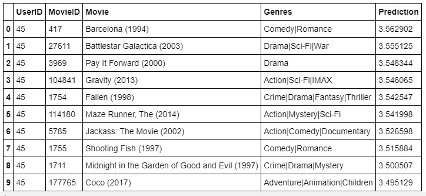**

## **结论**

**PMF 是一个强大的协同过滤算法。它利用具有相似偏好的用户提供的数据向特定用户提供推荐。它也称为低秩矩阵分解方法，因为它使用低秩矩阵来估计评级 ***R*** 矩阵，然后进行有用的预测。**

**我希望你喜欢这篇文章！如果你有任何问题，请随时来找我。我会继续写更多这样的材料。敬请关注。**

## **参考**

**[1]萨拉赫胡季诺夫、鲁斯兰&姆尼赫、安德烈。*概率矩阵分解*。NIPS’07:第 20 届神经信息处理系统国际会议论文集，第 1257-1264 页，2007。**

**[2]布鲁克斯-巴特利特·乔尼。*概率概念讲解:参数估计的贝叶斯推断*。地点:【https://bit.ly/3bajPNC **