# 肺炎检测:利用深度学习拓展人类能力的边界

> 原文：<https://towardsdatascience.com/pneumonia-detection-pushing-the-boundaries-of-human-ability-with-deep-learning-ce08dbd0dc20?source=collection_archive---------35----------------------->

## 看看我是如何构建一个卷积神经网络(CNN)来从胸部 x 光片中检测肺炎的


通过 Shutterstock.com 沉浸成像成像

在进入我们如何使用人工神经网络来检测肺炎之前，让我们了解一点关于肺炎的知识，因为这将为建立模型铺平道路。

## 首先，什么是肺炎？

> 肺炎是一种严重的肺部感染，它会导致肺部的**小气囊发炎，并充满液体或脓**。肺炎患者可能需要住院或入住重症监护室(ICU)。

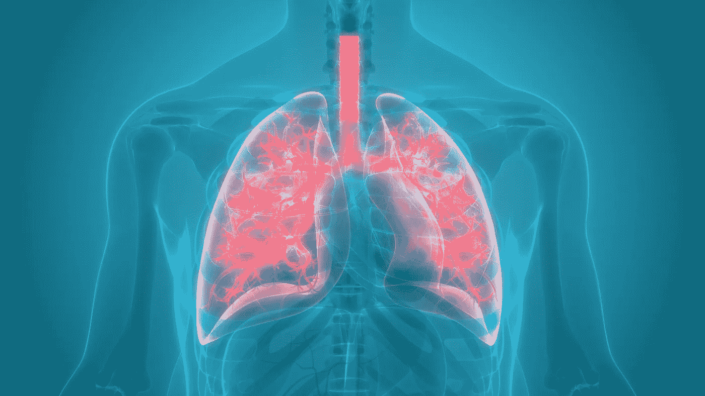

通过 Shutterstock.com 的魔法矿图片

## 关于肺炎的一些事实

*   肺炎是世界上 5 岁以下儿童死亡的主要原因。
*   肺炎是美国儿童住院的最常见原因。
*   对于我们成年人来说，肺炎是除女性分娩之外最常见的住院原因。

## **如何检测肺炎？**

现在我们知道肺炎是一种常见疾病，每年在美国和世界各地都会影响许多人。我们平时怎么检测这种病？

事实证明，胸部 x 光一直被认为是检测任何形式肺炎的最佳工具。然而，研究表明，即使是经验丰富的放射科医生也常常很难正确识别 X-Ray⁴.上的某种物质是否是渗透物(比空气密度大的物质，如脓或液体)这导致诊断延误，增加了疾病的严重性和相关的死亡率。


图片由 OneStockPhoto 通过 Shutterstock.com 提供

如果人类不能早期正确诊断疾病，也许…深度学习可以有所帮助！

# 目标

建立一个深度学习模型，可以从患者的胸部 x 光图像中检测出肺炎。

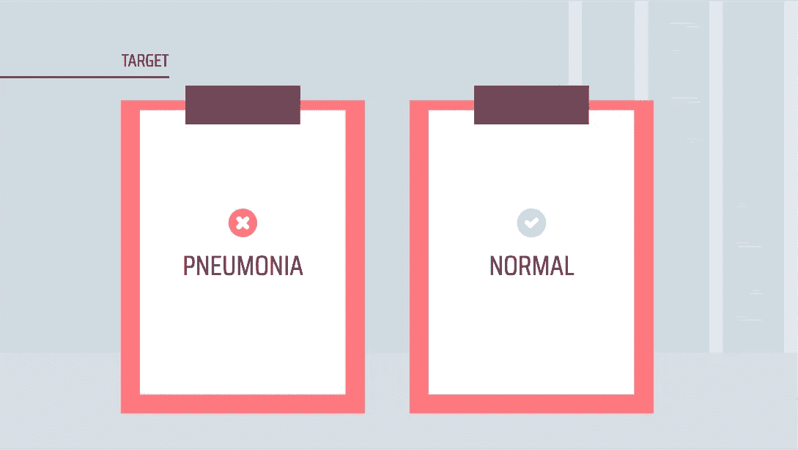

幻灯片演示模板 go

# 方法

下面是我如何创建深度学习模型的高级方法。我首先从 [Kaggle](https://www.kaggle.com/paultimothymooney/chest-xray-pneumonia) 收集数据，这些是来自中国的病人的胸部 x 光图像。在一些简单的探索性数据分析后，我通过重新调整像素和图像放大对图像进行预处理。然后，我开始创建卷积神经网络(CNN)模型的架构，这是一种深度学习模型。

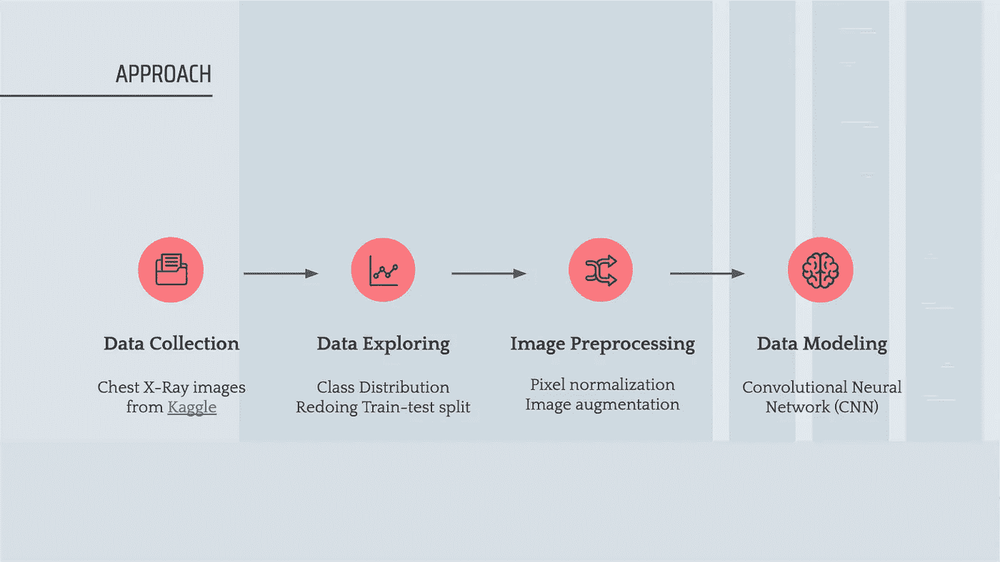

Slidesgo 的演示模板| Freepik 的信息图表

# **数据收集**

从 [Kaggle](https://www.kaggle.com/paultimothymooney/chest-xray-pneumonia) 获得的数据包含来自中国广州一家医疗中心的 5，856 名 5 岁以下儿童患者的胸部 x 光照片。

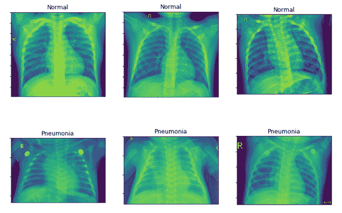

中国广州某医疗中心患者的胸部 x 光图像(数据集: [Kaggle](https://www.kaggle.com/paultimothymooney/chest-xray-pneumonia)

# **简单探索性数据分析(EDA)**

## **重做列车试运行**

当我开始训练我的神经网络时，我犯了一个大错误，它只有一个非常小的验证数据集。来自 Kaggle 的数据实际上已经被分成 3 个文件夹:训练、验证和测试。每个文件夹然后被分成两类:正常和肺炎。然而，验证集只包含 16 个图像，每个类有 8 个图像。虽然常用的分割比例是:70%训练，15%验证，15%测试，但我的验证集是整个数据的 0.27%。毫无疑问，无论我对我的模型应用什么样的正则化技术，我的模型表现仍然和我饥饿和睡眠不足时的情绪一样不稳定。

经验教训— **始终确保您的训练、验证和测试数据集处于适当的比率，并且包含足够的数据，使模型具有预测能力**。后来，我重新安排了我的数据集，得到了这个比例:70%训练，19%验证，11%测试。

## **阶级分布**

我们的训练数据集分布有 79%的肺炎患者图像和 21%的非肺炎患者图像。

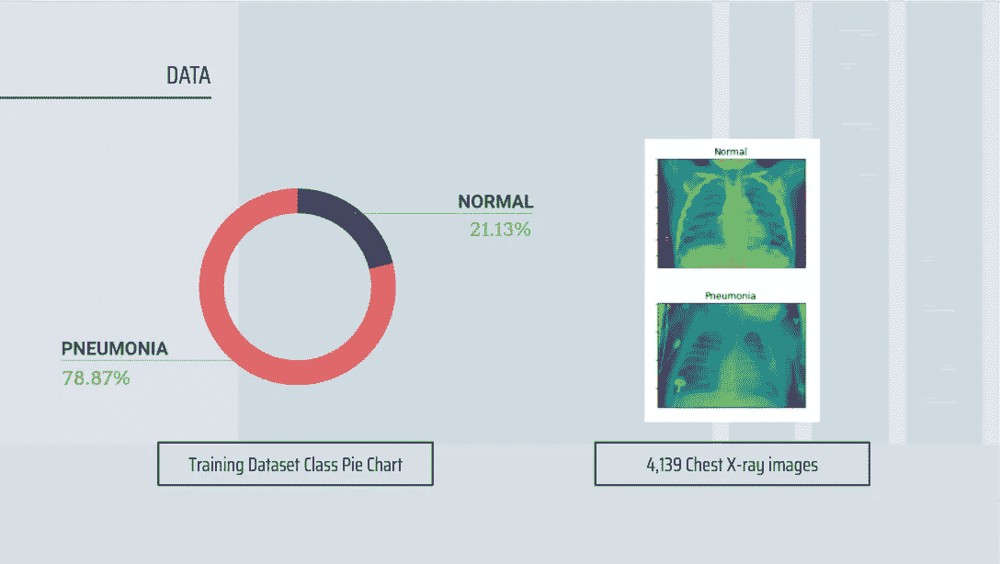

幻灯片演示模板 go

# **图像预处理**

接下来，通过像素归一化和数据扩充对这些图像进行预处理。

## **像素归一化**

对于大多数图像数据，像素值是 0 到 255 之间的整数。由于神经网络使用小的权重值处理输入，具有较大值的输入会减慢学习过程。归一化像素会将整数缩小到 0 到 1 之间的值，因此归一化像素是一个很好的做法，可以确保高效的计算。

## **数据扩充**

此外，我们还对图像进行了一些增强:水平翻转、放大和剪切。数据扩充是一种很好的做法，不仅可以向现有数据集添加更多数据，还可以添加微小的改变，也称为多样性，以避免模型过度适应训练数据。

# **建模**

深度学习真的是一门工艺艺术，你真的可以按照你喜欢的方式构建你的模型。虽然有一些通用的模型架构，但是您仍然可以尝试不同的配置来为您的模型获得最佳结果。

## **从 RGB 转换为灰度图像**

因为我们用于二元分类问题的图像是 X 射线，它通常显示从白色到各种灰度到黑色的密度范围。否则，它们会有不同的色调，但仍然侧重于颜色的密度。对我来说，这听起来就像灰度图像，只有灰色阴影，有或没有黑色或白色。

很自然地，我决定将我们的图像从 RGB(三维)转换成灰度(一维)。这可以降低模型的复杂性，因为模型需要学习图像的许多属性，例如边缘、形状、图案、纹理、阴影、亮度、对比度等。，同时还要考虑颜色。

## 模型架构

我已经训练了至少 30 个模型，这些模型具有不同的激活、特征图数量、退出和批量标准化的组合。这是我表现最好的模型的架构。

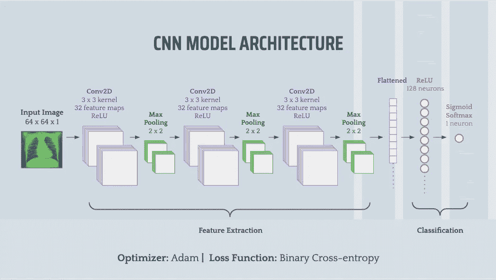

幻灯片演示模板 go

概括地说，我们有 3 个卷积 2D 层，每个层后面都有一个最大池层。展平后，它被馈入一个具有 ReLU 激活的完全连接的层。最后，由于这是一个二元分类，我们让输出图层使用 sigmoid softmax 激活来预测输出概率，该概率可以根据我们的阈值转换为类值。

我还尝试了添加和组合不同的技术，如批量标准化和退出，但是验证损失和验证 AUC 分数波动很大，它们几乎不收敛(如果根本不收敛的话)。因此，我决定带他们出去。

# 结果

我们将通过下面的图表来看看我们的深度学习模型在每个时期是如何被训练的。

对于左侧的图表，随着历元数的增加，验证损失和训练损失的线彼此接近，这意味着我们的模型似乎没有太多的过拟合或欠拟合。我们还可以在右侧的图表中看到，训练线和验证 AUC 分数最终收敛到几乎相等的点。

对于检测肺炎的情况，我们的目标是**高召回率**,因为任何延迟诊断都意味着某人可能会真的生病，并可能失去生命。我们首先让我们的模型**为 AUC 分数**优化，**专注于为我们的二元分类**提供良好的可分性度量。然后，如果企业对更高或更低的误报或漏报感到更舒服，我们可以调高或调低阈值(从 0.5 开始)。

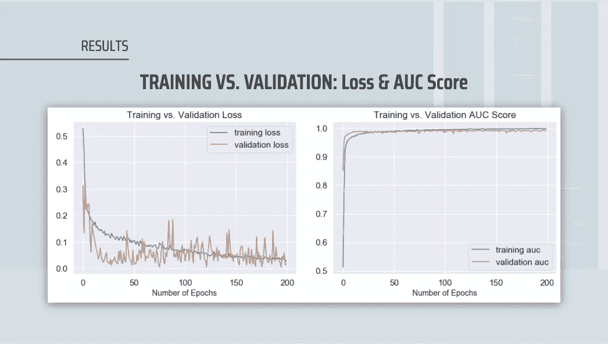

幻灯片演示模板 go

我们的测试集产生了 97.98%的 AUC 分数，表明我们的 CNN 模型在按测试集中的类别对数据进行排序方面做得很好。当我们有一个类不平衡时，优化 AUC 也是有帮助的，因为我们不想过度适应一个类。

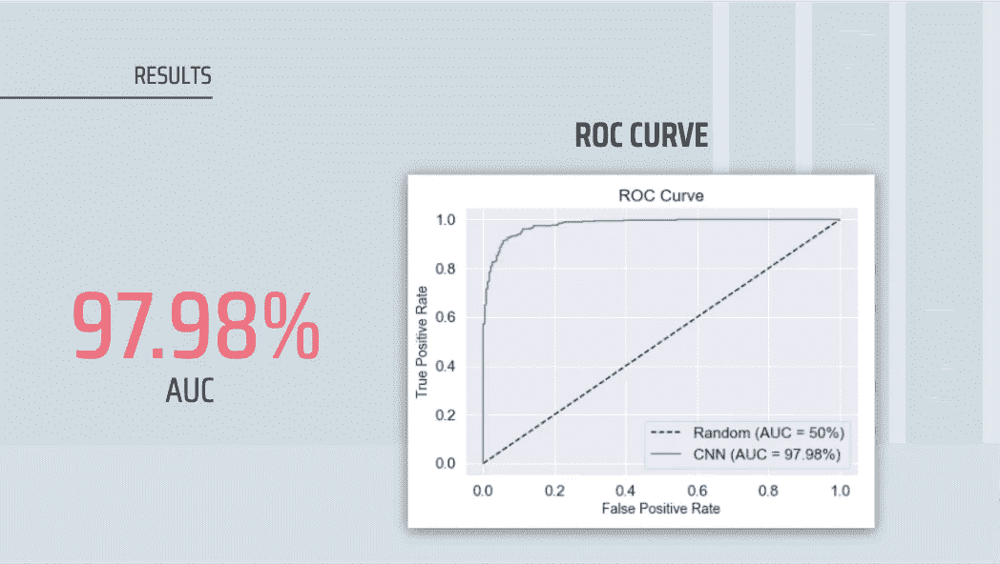

幻灯片演示模板 go

我们的模型达到了 98.72%的召回率。从混淆矩阵中，我们看到，在右上角，模型有 8.49%为假阳性，然后在左下角，模型有 0.80%为假阴性。

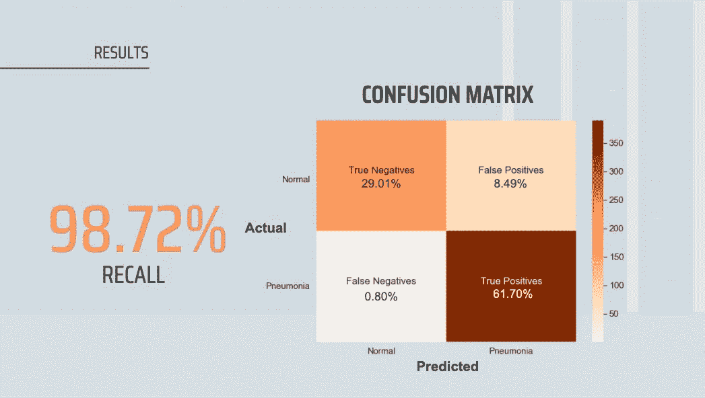

幻灯片演示模板 go

# 密码

既然我们已经解释了一切。让我们看看实际运行的代码。

## 导入必要的库

## 设置随机种子

## 通过数据扩充生成批量图像数据(训练、验证和测试)

## 训练模型

## 创建一个输出指标和图表的函数

*   **指标:**准确度、精确度、召回率、特异性和 F1 分数
*   **图表:** 1)训练与验证损失
    2)训练与验证 AUC
    3)混淆矩阵

## 通过指标和图表输出结果

```
[Summary Statistics]
Accuracy = 90.71% | Precision = 87.90% | Recall = 98.72% | Specificity = 77.35% | F1 Score = 93.00%
```

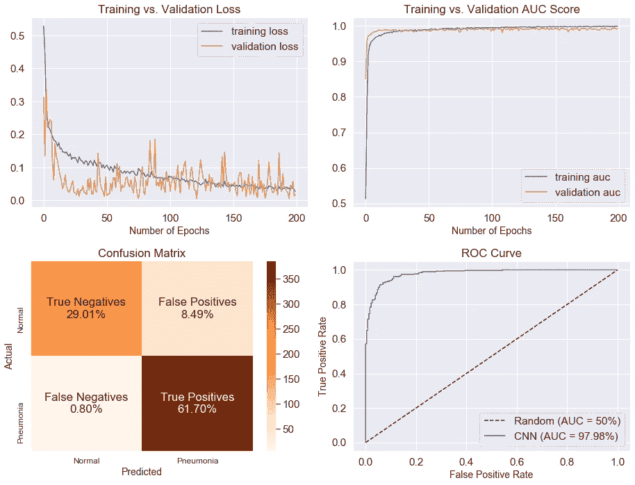

最终模型的指标和图表

# 未来的工作


幻灯片演示模板 go

我们的模型似乎具有较高的召回率和 AUC 值，但由于数据集的限制，仍然可能存在盲点。如果有更多的时间和资源，我愿意探索以下内容:

**1。根据患者居住地和年龄在数据集中包含更多多样性** 我们当前的模型是用仅包含居住在中国的 5 岁以下患者的 X 射线图像的数据集进行训练的。这就带来了一个问题，如果患者不在中国居住或处于不同的年龄组，我们的模型是否可以准确地检测到肺炎？为了使模型更加稳健，我希望在数据集中包括更多的多样性，即包括来自世界不同地区和不同年龄的患者的 x 射线图像，例如老年人，因为研究也表明老年人更容易感染 pneumonia⁶.

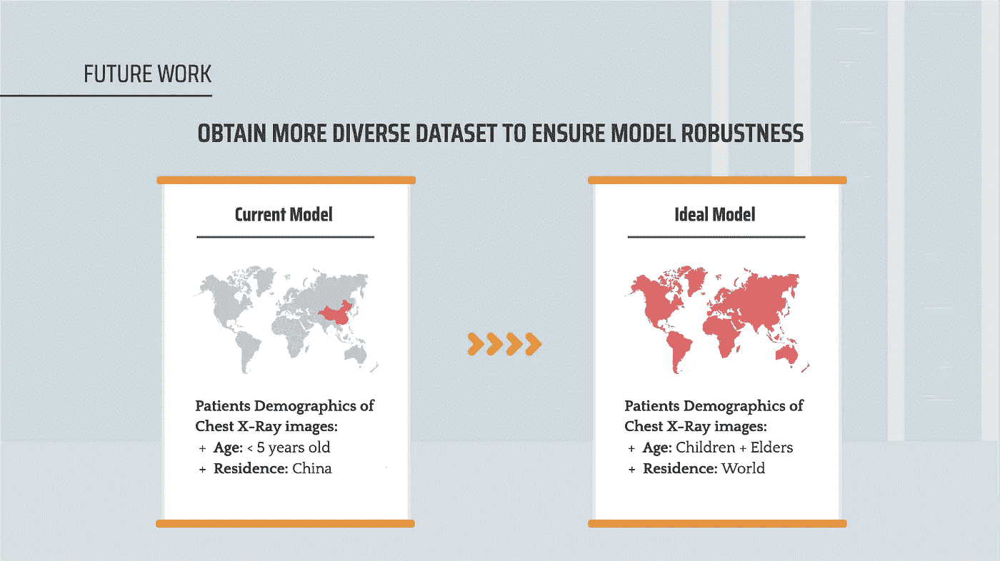

幻灯片演示模板 go

**2。使用在条件复杂性方面更能代表患者人群分布的数据集训练模型** 到目前为止，我们已经建立了一个二元分类模型，用于识别患者是否患有肺炎。在现实中，患者可能患有不同类型的肺部疾病(有时一次不止一种),他们仍然会在 X 射线上显示为浸润。我希望将我们当前的数据集与来自 NIH 临床中心的[数据集相结合，该数据集由超过 30，000 名患者的超过 110，000 张胸部 x 光图像组成，具有 14 种常见胸部疾病标签。NIH 团队认为，该数据集将“更能代表真实的患者群体分布和现实的临床诊断挑战”。⁵](https://www.nih.gov/news-events/news-releases/nih-clinical-center-provides-one-largest-publicly-available-chest-x-ray-datasets-scientific-community)

[1]:美国肺脏协会。(2020 年 5 月 27 日)。*了解肺炎*。[https://www . lung . org/lung-health-diseases/lung-disease-lookup/pneumonia/learn-about-pneumonia](https://www.lung.org/lung-health-diseases/lung-disease-lookup/pneumonia/learn-about-pneumonia)

[2]:美国胸科学会。*2019 年 20 大肺炎事实*。[https://www . thoracic . org/patients/patient-resources/resources/top-pneumonia-facts . pdf](https://www.thoracic.org/patients/patient-resources/resources/top-pneumonia-facts.pdf)

[3]: GE 医疗保健。(2019 年 2 月 25 日)。*人工智能可能掌握 X 线诊断肺炎的关键*。[https://www . gehealthcare . com/feature-article/ai-could-hold-the-key-to-identifying-pneumonia-via-x-ray #:~:text = Chest % 20X % 2 ray % 20 have % 20 long，via % 20X % 2Dray % 20a % 20challenge。](https://www.gehealthcare.com/feature-article/ai-could-hold-the-key-to-identifying-pneumonia-via-x-ray#:~:text=Chest%20X%2Drays%20have%20long,via%20X%2Dray%20a%20challenge.)

[4]:爱德华·道尔。(2006 年 2 月)。需要更多关于肺炎患者的信息吗？试试这些策略。[https://www . todays hospitalist . com/Need-more-information-about-the-pneumonia-patient-Try-these-strategies/](https://www.todayshospitalist.com/Need-more-information-about-that-pneumonia-patient-Try-these-strategies/)

[5]:美国国立卫生研究院。(2017 年 9 月 27 日)。 *NIH 临床中心向科学界提供最大的公开胸部 x 光数据集之一*。[https://www . NIH . gov/news-events/news-releases/NIH-clinical-center-provides-one-large-public-available-胸部 x-ray-datasets-scientific-community](https://www.nih.gov/news-events/news-releases/nih-clinical-center-provides-one-largest-publicly-available-chest-x-ray-datasets-scientific-community)

[6]:，，和尹。(2015 年 8 月 15 日)。*老年重症肺炎:危险因素的多变量分析*。[https://ncbi.nlm.nih.gov/pmc/articles/PMC4612842/](https://ncbi.nlm.nih.gov/pmc/articles/PMC4612842/)