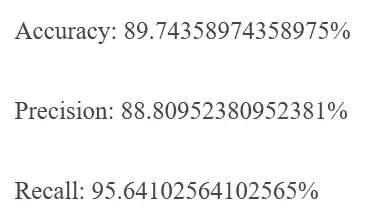

# 使用卷积神经网络的肺炎检测

> 原文：<https://towardsdatascience.com/pneumonia-detection-using-convolutional-neural-network-12b94aeb1206?source=collection_archive---------43----------------------->

# 介绍

随着 AIML 课程的完成，我想把我新学到的知识用于一些兼职项目，这些项目既可以帮助我在该领域获得一些实践经验，又可以解决一个有趣的现实生活问题，或者对它有一些实际用处。在寻找一个符合我需要的项目的过程中，我最终决定建立一个卷积神经网络，通过查看胸部 x 光图像来检测肺炎。

# 什么是肺炎？

肺炎是一种影响肺部的急性呼吸道感染。肺由称为肺泡的小囊组成，当健康人呼吸时，肺泡中充满空气。当一个人患肺炎时，肺泡中充满了脓和液体，这使得呼吸疼痛，并限制了氧气的摄入。

肺炎是全球儿童死亡的单一最大传染性原因。肺炎在 2017 年导致 808 694 名 5 岁以下儿童死亡，占所有 5 岁以下儿童死亡的 15%。肺炎影响世界各地的儿童和家庭，但在南亚和撒哈拉以南非洲最为普遍。

# 项目概述

有了这些事实作为灵感，我开始着手我的项目:

首先，我需要弄清楚我可以在哪里构建和运行代码，因为我的系统规格不足以处理构建模型所需的计算能力，所以我使用了谷歌的 Colab。Colab 允许您在浏览器中编写和执行 Python，使用

*   不需要配置
*   免费访问 GPU
*   轻松分享

无论你是一名**学生**、一名**数据科学家**还是一名**人工智能研究员**，Colab 都能让你的工作变得更简单。

注意:需要 API

在下面的代码中，我也提到了如何从 Kaggle 访问数据集，但需要注意的重要事项是:

1.  准备好您的 API 密钥文件，即' **kaggle.json'**
2.  使用这种方法，每次在 google collab 中重置运行时，您都将丢失所有文件和生成的模型，因此一旦完成，请始终下载您的模型文件，并在每次重置后记得重新导入数据集

# 我在努力实现什么？

当你提交一个 5 岁孩子胸部的 x 光图像时，算法应该能够以很高的准确度预测病人是否患有肺炎。

# 代码

*   首先，你必须把你的 API 密匙文件上传到你在 Colab 的 Jupyter 笔记本上:
*   接下来，从 Kaggle 导入数据集并解压缩:

```
**from** **google.colab** **import** files
files.upload()!pip install -q kaggle 
!mkdir -p ~/.kaggle 
!cp kaggle.json ~/.kaggle/ 
!kaggle datasets download -d paultimothymooney/chest-xray-pneumonia
!unzip /content/chest-xray-pneumonia.zip
```

*   我使用了 Paul Mooney 的胸部 X 射线图像(肺炎)数据集，因为数据已经方便地分为训练、测试和 val:
*   train-包含用于教授我们的模型的训练数据/图像。
*   Val —包含我们将用来验证模型的图像。这个数据集的目的是防止我们的模型过度拟合。当模型学习训练数据中的细节和噪声达到对新数据的模型性能产生负面影响的程度时，就会发生过度拟合。这意味着训练数据中的噪声或随机波动被模型拾取并学习为概念。问题是这些概念不适用于新数据，并对模型的概括能力产生负面影响。
*   测试—这包含我们在模型学习了图像与其标签(肺炎/非肺炎)之间的关系后用于测试模型的数据
*   现在，让我们从导入所有需要的库开始:

```
**from** **keras.models** **import** Sequential
**from** **keras.layers** **import** Conv2D
**from** **keras.layers** **import** MaxPooling2D
**from** **keras.layers** **import** Flatten
**from** **keras.layers** **import** Dense
**from** **keras.preprocessing.image** **import** ImageDataGenerator
**import** **numpy** **as** **np**
**from** **keras.preprocessing** **import** image
**import** **os**
**import** **matplotlib.pyplot** **as** **plt**
**import** **cv2**
```

1.  Keras Python 库使创建深度学习模型变得快速而简单。顺序 API 允许您为大多数问题逐层创建模型。它的局限性在于，它不允许您创建共享层或具有多个输入或输出的模型。
2.  Keras Conv2D 是一个 2D 卷积层，这一层创建一个卷积核，这是风与层输入，这有助于产生输出张量。(注意:-内核:在图像处理中，内核是卷积矩阵或遮罩，可以通过在内核和图像之间进行卷积来用于模糊、锐化、浮雕、边缘检测等。)
3.  keras.layers 中的 MaxPooling2D，用于池化操作。为了建立这个特殊的神经网络，我们使用最大池函数，存在不同类型的池操作，如最小池、平均池等。在 MaxPooling 中，我们需要各个感兴趣区域的最大值像素。
4.  从 keras.layers 展平，用于展平。展平是将所有生成的二维数组转换成一个长的连续线性向量的过程。
5.  来自 keras.layers 的 Dense，用于执行神经网络的完全连接
6.  ImageDataGenerator，它获取一批图像，并对批中的每个图像应用一系列随机变换(包括随机旋转、调整大小、剪切等。)然后用新的随机转换的批次替换原始批次来训练 CNN。

*   我首先定义了两个变量，它们包含我要使用的图像尺寸值和我要使用的批量大小:

```
img_dims = 64
batch_size = 32
```

*   然后，我创建了一个 sequential 类的对象，并开始对卷积步骤进行编码:

```
classifier = Sequential()
classifier.add(Conv2D(32, (3, 3), input_shape = (img_dims, img_dims, 3), activation = 'relu'))
classifier.add(MaxPooling2D(pool_size = (2, 2)))
classifier.add(Flatten())
classifier.add(Dense(units = 128, activation = 'relu'))
classifier.add(Dense(units = 1, activation = 'sigmoid'))
```

*   然后我使用“Conv2D”函数添加了一个卷积层。Conv2D 函数有 4 个参数:

1.  第一个是滤波器，这是一个强制性的 Conv2D 参数，定义卷积层将学习的滤波器数量，即 32 个。这里，滤波器用于对图像进行切片，并逐个映射，学习输入图像的不同部分。想象一下，一个小滤镜从左到右从上到下滑过图像，移动的滤镜正在寻找，比如说，一个黑色的边缘。每次找到一个匹配，它就被映射到输出图像上。
2.  第二个参数是每个滤波器的形状，这里是 3x3，
3.  第三个是每个图像的输入形状和图像类型(RGB 或黑白),即我们的 CNN 将要拍摄的输入图像的分辨率为 64x64”代表 RGB，这是一个彩色图像
4.  第四个参数是我们要使用的激活函数，这里“relu”代表一个校正的线性单位函数。激活函数是一个帮助决定神经元是否会触发的节点。Relu 将矩阵 x 中的所有负值设置为零，所有其他值保持不变。

*   现在，我对一幅图像进行卷积运算后得到的合成特征图进行合并运算。池操作的主要目的是尽可能减小图像的大小。
*   接下来，我通过展平将所有汇集的图像转换成一个连续的矢量。展平是理解的一个非常重要的步骤。我们在这里所做的基本上是采用二维数组，即汇集图像像素，并将其转换为一维单一向量。
*   现在，为了创建一个完全连接的层，我已经连接了展平步骤后得到的一组节点，这些节点将作为这些完全连接的层的输入层。“密集”是添加完全连接层的功能，“单位”是我们定义应该出现在此隐藏层中的节点数量的地方。
*   然后我初始化了输出层，它由一个节点组成，给我相应的输出
*   一旦 CNN 模型构建完成，就该编译它了:

```
classifier.compile(optimizer = 'adam', loss = 'binary_crossentropy', metrics = ['accuracy'])
```

*   这里我们使用了以下参数:

1.  Adam 是一种优化算法，可以用来代替经典的随机梯度下降过程，以基于训练数据迭代地更新网络权重。
2.  交叉熵损失或对数损失衡量分类模型的性能，其输出是 0 到 1 之间的概率值。交叉熵损失随着预测概率偏离实际标签而增加。
3.  最后，指标参数是选择性能指标。

*   在我们开始将 CNN 拟合到图像数据集之前，我们需要预处理图像以防止过度拟合:

```
input_path = '/content/chest_xray/'
train_datagen = ImageDataGenerator(rescale = 1./255,
shear_range = 0.2,
zoom_range = 0.2,
horizontal_flip = **True**)
test_datagen = ImageDataGenerator(rescale = 1./255)
training_set = train_datagen.flow_from_directory(directory=input_path+'train',
target_size = (img_dims, img_dims),
batch_size = batch_size,
class_mode = 'binary')
test_set = test_datagen.flow_from_directory(directory=input_path+'test',
target_size = (img_dims, img_dims),
batch_size = batch_size,
class_mode = 'binary')
```

1.  对于此任务，我们使用了 Keras 的 ImageDataGenerator，并传递了以下参数:
2.  **重新标度:**重新标度因子。默认为无。如果无或为 0，则不应用重缩放，否则我们将数据乘以所提供的值(在应用所有其他变换之后)。
3.  **剪切 _ 范围**:浮动。剪切强度(逆时针方向的剪切角度，单位为度)。用于变换图像方向的剪切。
4.  **zoom_range** :浮动或【下，上】。随机缩放的范围。
5.  **水平 _ 翻转**:布尔型。随机水平翻转输入。
6.  **flow_from_directory** :获取一个目录的路径，生成批量的扩充/规范化数据。

*   现在让数据符合 CNN 模型:

```
epochs = 10  
hist = classifier.fit_generator(            training_set, steps_per_epoch=training_set.samples // batch_size,             epochs=epochs, validation_data=test_set,             validation_steps= test_set.samples)
```

1.  在上面的代码中，“steps_per_epoch”保存训练图像的数量，即 training_set 文件夹包含的图像的数量。
2.  和“时期”，单个时期是训练神经网络的单个步骤；换句话说，当一个神经网络只在一遍中对每个训练样本进行训练时，我们说一个时期结束了。所以训练过程应该由多个时期组成。

*   一旦您最终建立并训练了您的模型，您就可以将图像传递给 classifier.predict()(即[modelname])。predict())函数并获得预测。
*   您还可以使用 classifier.save()(即[modelname])保存您的模型以供将来使用。save())

# 结果呢

如果你对代码感兴趣，可以去看看 [GitHub](https://github.com/nischalmadiraju/Pnuemonia_Detection_CNN)

我能够实现:



通过改变网络中使用的层数可以获得更高的精度。另一种提高精度的方法是相应地改变超参数。

# 结论

对于任何具有良好编程技能的开发人员来说，创建一个对数百万人有用的机器学习模型都是相当容易的。

专业人士已经取得了更好的结果。作为一个初学者，我能够达到 89%的准确率，这显然是不错的。但为了在现实世界中被数百万人使用，89%的准确率意味着它将误诊大约 100，000 例病例。

# 随着未来的发展，ML 技术的改进，但最重要的是——越来越多的人参与其中——我们将能够解决更多这样的问题。