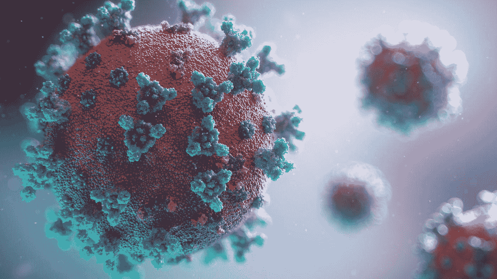

# 使用深度学习的肺炎检测

> 原文：<https://towardsdatascience.com/pneumonia-detection-using-deep-learning-5dc66468eb9?source=collection_archive---------27----------------------->

## 使用 PyTorch 的端到端深度学习项目

由 [Unsplash](https://unsplash.com?utm_source=medium&utm_medium=referral) 上的[融合医学动画](https://unsplash.com/@fusion_medical_animation?utm_source=medium&utm_medium=referral)拍摄的照片

# 现代的疫情

随着最近新冠肺炎病毒的爆发，历史似乎正在重演，我们将回到 20 世纪西班牙流感时期。冠状病毒是一种致命的病毒，已经在世界各国夺去了成千上万人的生命。老年人和患有严重基础疾病或先前患有肺炎的人似乎更有可能出现更严重的病毒并发症。随着死亡人数的上升和有限的医疗资源，世界各地的医生和医疗专业人员正在夜以继日地治疗患者和防止病毒传播。病毒的严重形式会导致肺炎，导致更大的死亡风险。快速准确地检测肺炎至关重要，以便患者能够及时接受治疗，尤其是在贫困地区。

随着我们在这个时代不断发展的技术进步，有可能使用基于深度学习框架的工具来根据胸部 x 光图像检测肺炎。这里的挑战将是帮助诊断过程，允许加快治疗和更好的临床结果。

# 数据

该项目将使用的数据集是来自 Kaggle 的[胸部 x 光图像(肺炎)](https://www.kaggle.com/paultimothymooney/chest-xray-pneumonia)。数据集由训练数据、验证数据和测试数据组成。训练数据包括 5，216 个胸部 x 射线图像，其中 3，875 个图像显示为患有肺炎，1，341 个图像显示为正常。验证数据相对较少，只有 16 幅图像，其中有 8 个肺炎病例和 8 个正常病例。测试数据包括在 390 个肺炎病例和 234 个正常病例之间分割的 624 个图像。

从训练数据可以看出，数据非常不平衡。肺炎病例似乎比正常病例多三倍，这是有道理的，因为这是医学数据。由于验证数据是一个小样本，所以我将在应用训练/验证拆分之前，将它与训练数据合并，并混洗新的数据集。

在研究了数据集中的一些图像后，我注意到一些图像是灰度 1 通道的，而另一些是 3 通道的。在进行任何转换和数据加载之前，数据需要保持一致，所以我决定将所有单通道图像转换为 3 通道图像。这可以简单地通过重复单通道值 3 次来完成，如下面我的代码中针对 PneumoniaDataset 类所示。

对于训练集和验证集，我决定进行 80/20 的划分。对于数据转换，我选择将图像大小调整为(256，256)大小，并使用 90 度仿射转换。数据转换或扩充是一种强大的技术，在几乎所有情况下都有助于提高模型的稳健性。当数据集不平衡时，这种技术甚至会更有帮助。您可以生成欠采样类的不同样本，以便尝试平衡总体分布。为了简单起见，我将只使用原始数据集。对于批量大小，我将使用 16 的大小，因为较低的批量大小将有助于防止我们的模型过度拟合。让我们快速浏览一下训练和验证集中的一些图片。

在仔细观察这些图像后，除了医疗专业人员，任何人都很难区分正常病例和肺炎病例。如果我们能够建立一个强大的模型，这肯定会对医疗专业人员的工作有很大帮助，最终有望帮助他们节省时间和金钱。

# 模型

我们的初始模型将是一个简单的 8 层卷积神经网络，具有最大池和 ReLU 激活功能。让我们看看模型在验证和测试集上表现如何。

我们可以看到，我们的模型在训练和验证数据集上做得很好，但未能正确分类测试集中的一半以上的图像。我们的模型肯定是过度拟合，所以我们需要引入一些正则化技术，可以帮助解决这个问题。让我们定义一个新的模型，它具有批处理规范化和丢弃，这两种常见的规范化技术在防止过度拟合方面非常有用。

随着批量标准化、丢弃和几个更多层的引入，这个模型被证明比以前的模型好得多。它现在能够正确分类测试数据集中超过一半的图像。然而，这仍然不足以在现实世界中舒适地使用。到目前为止，我们使用的模型还不够复杂，不足以捕捉错综复杂的图像。为了解决这个问题，我们使用迁移学习的优化技术，我们将为一个目的训练的复杂模型重新用于另一个目的。在这种情况下，我们将使用在 ImageNet 数据集上训练的预训练残差网络，并将该模型重新用于我们的胸部 x 射线数据集。我们将使用一个 34 层剩余网络，最后一层有漏失，看看它与以前的模型相比有多好。

测试精度约为 83%,这无疑是对前两种模型的改进。这显示了使用迁移学习来解决一般图像问题的能力和有效性。虽然测试的准确性已经显著提高，但这是否足以部署到现实世界中仍然是个问题。让我们在一些测试图像上尝试该模型。

这个模型显然不是很好，但它的功能仍然令人印象深刻。在分类上面两张图是有病还是正常方面肯定比我强。

# 最后的话

在这个项目中，我们发现了迁移学习的力量，以及它如何改善深度学习模型的性能。最终的模型当然可以通过进一步添加正则化和优化技术以及调整超参数得到更多的改进。此外，在不平衡的数据集上进行训练并不是最佳的，因此在这种情况下，生成新的图像来平衡分布也将被证明是有用的。

# 参考

*   [胸部 x 光数据集](https://www.kaggle.com/paultimothymooney/chest-xray-pneumonia)
*   [源代码](https://jovian.ml/allenkong221/pneumonia-detection-resnet)