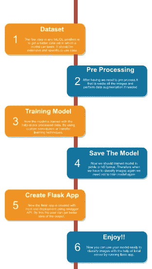
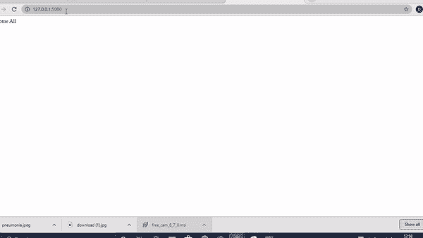

# 使用深度学习和 swagger 的肺炎检测。

> 原文：<https://towardsdatascience.com/pneumonia-detection-using-deep-learning-and-swagger-18aa5e8af576?source=collection_archive---------34----------------------->

## 深度学习| Swagger API

## 在这个故事中，我们将通过使用深度学习检测肺炎的步骤，并使用 swagger 部署模型。


来自[突发](https://burst.shopify.com/medical?utm_campaign=photo_credit&amp;utm_content=High+Res+Doctor%27s+Office+Flatlay+Picture+%E2%80%94+Free+Images&amp;utm_medium=referral&amp;utm_source=credit)的莎拉[普夫卢格](https://burst.shopify.com/@sarahpflugphoto?utm_campaign=photo_credit&amp;utm_content=High+Res+Doctor%27s+Office+Flatlay+Picture+%E2%80%94+Free+Images&amp;utm_medium=referral&amp;utm_source=credit)的照片

在本文中，我们将借助胸部 X 射线进行肺炎检测。此外，我们还将使用 swagger API 为它添加一个 GUI。这里需要注意的重要一点是，创建 GUI 所需的时间将会大大减少。由于本文有两个主要部分，我们将讨论深度学习在肺炎检测中的使用，然后使用 swagger 创建一个快速前端。

# **深度学习在肺炎检测中的应用:**

在任何深度学习用例中，可以开始的第一个术语是数据。在这次检测中，我们将使用正常和肺炎胸部 x 光片的数据集[这里](https://www.kaggle.com/paultimothymooney/chest-xray-pneumonia)。数据集包含训练、测试和验证三个目录。这三个子目录中的子目录是:normal 和 pneumonia，其中包含用于训练、测试和验证模型的图像。我们总共有 5856 张图片。理解了数据集之后，现在让我们进入训练部分。首先，我们将导入所有有用的库

```
**import os
import pandas as pd
import numpy as np****from** **keras.layers** **import** Input, Lambda, Dense, Flatten
**from** **keras.models** **import** Model
**from** **keras.applications.vgg16** **import** VGG16
**from** **keras.applications.vgg16** **import** preprocess_input
**from** **keras.preprocessing** **import** image
**from** **keras.preprocessing.image** **import** ImageDataGenerator
**from** **keras.models** **import** Sequential
**from** **glob** **import** glob
**import** **matplotlib.pyplot** **as** **plt**
```

在上面的代码片段中，我们导入了像 NumPy 这样的库，用于数组处理，pandas，用于数据帧创建和操作，OS，用于路径和目录相关的操作。当我们在代码中使用它时，其他目录将被讨论。

在这个问题中，我们将保持所有图像的大小相同。因此，调整所有图像的大小。

```
IMAGE_SIZE = [224, 224]
```

我们将在变量中声明训练和测试路径。之后，在我们的例子中，我们使用迁移学习技术，如 VGG16，以获得更好的准确性。为此，我们必须导入 VGG16 模型。

```
vgg = VGG16(input_shape=IMAGE_SIZE + [3], weights='imagenet', include_top=**False**)
```

由于有三个 RGB 通道，输入形状参数为正 3。权重取自 imagenet 竞赛。此外，include_top 保持为 False，因为我们只需要在两个类之间进行分类。
为了不重新训练预训练层，我们必须将所有可训练层设为假。

```
**for** layer **in** vgg.layers:
  layer.trainable = **False**
```

为了获得列表中 train 文件夹路径下的所有类别，我们使用了一个 glob 方法。

```
folders = glob('/chest-xray-pneumonia/chest_xray/chest_xray/train/*')
```

通过将 include_top 保持为 False，我们没有指定模型中的最后一层。在这里，我们将添加我们定制的最后一层。

```
 x = Flatten()(vgg.output)*#this removes the last layers*
prediction = Dense(len(folders), activation='softmax')(x)
```

在预测中，当添加一个密集层时，我们传递了参数 len(folders ),它表示正常和肺炎这两个类别。所以，len(文件夹)是两个。指定最后一层后，我们现在将创建一个对象模型。其具有标准的 VGG 输入(我们在上面已经定义)和作为输出的预测。

```
model = Model(inputs=vgg.input, outputs=prediction)
```

现在我们将编译已定义的模型对象。

```
model.compile(
  loss='categorical_crossentropy',
  optimizer='adam',
  metrics=['accuracy']
)
```

在编译之后，加载带有一些预处理和图像增强的数据集，以便我们的模型获得更多可以学习的图像。我们使用图像数据生成器。这有助于通过对给定图像执行水平翻转、剪切和缩放来重新缩放图像并生成更多图像。

```
**from** **keras.preprocessing.image** **import** ImageDataGenerator
#for test datatest_datagen = ImageDataGenerator(rescale = 1./255)#For train datatrain_datagen = ImageDataGenerator(rescale = 1./255,
                                   shear_range = 0.2,
                                   zoom_range = 0.2,
                                   horizontal_flip = **True**)
```

现在，我们将创建一个训练集，用于模型训练。这个目标是通过使用来自目录函数的流来实现的。

```
training_set = train_datagen.flow_from_directory('/chest-xray-pneumonia/chest_xray/chest_xray/train', 
target_size = (224, 224),
batch_size = 32, 
class_mode = 'categorical')# for test datatest_set = test_datagen.flow_from_directory('/chest-xray-pneumonia/chest_xray/chest_xray/test',                                             target_size = (224, 224),                                             batch_size = 32,                                             class_mode = 'categorical')
```

现在，我们将用 5 个历元训练模型，如果你愿意，你也可以增加历元。

```
r = model.fit_generator(
  training_set,
  validation_data=test_set,
  epochs=5,
  steps_per_epoch=len(training_set),
  validation_steps=len(test_set)
)
```

在成功训练了五个时期的模型后，它给出了大约 95%的验证准确度，这在任何情况下都足够好了。之后，我们将把模型保存在“h5”表单中。

# **通过 swagger 部署保存的模型**

这一部分展示了我们如何快速制作前端来演示我们的模型输出。这将需要不到 10 分钟的时间来执行。这将在另一个名为 app.py 的文件中完成

首先，导入所需的库，如 Flask、flassger 和 swagger

```
from flask import Flask
import flasgger
from flasgger import Swagger
```

之后，我们将加载保存的“h5 模型”。

```
 from keras.models import load_model
from keras.preprocessing import image
from keras.applications.vgg16 import preprocess_input
import numpy as np

MODEL_PATH="model_vgg19.h5"
model = load_model(MODEL_PATH)
model._make_predict_function()
```

在这之后，创建了一个简单的 flask 应用程序，其中 swagger API 用于创建一个易于使用的前端页面。flask 应用程序有两个函数 welcome，当我们点击本地主机链接时会被重定向到这两个函数。另一个功能是 predict_note_file，通过将“/predict_file”添加到本地主机链接来显示在浏览器中。
以下代码描述了 flassger 附带的 flask app 功能。

```
from flask import Flask, request
import flasgger
from flasgger import Swaggerapp=Flask(__name__)
Swagger(app)[@app](http://twitter.com/app).route('/')
def welcome():
    return "Welcome All"[@app](http://twitter.com/app).route('/predict_file',methods=["POST"])
def predict_note_file():
    """Let's Predict Pneumonia
    This is using docstrings for specifications.
    ---
    parameters:
      - name: file
        in: formData
        type: file
        required: true

    responses:
        200:
            description: The output values

    """
    img = image.load_img(request.files.get("file"),target_size=(224, 224))
    x = image.img_to_array(img)
    x = np.expand_dims(x, axis=0)
    img_data = preprocess_input(x)
    classes = model.predict(img_data)
    A = np.squeeze(np.asarray(classes))
    if(A[1]==1):
        return "PNEUMONIA"
    else:
        return "NORMAL"

if __name__=='__main__':
    app.run()
```

在函数 predict_note_file 中，图像数据以 post 方法的形式传输。docstring 包含属性、参数和响应。docstring 中描述的参数被合并到使用 swagger API 生成的页面中。此外，要激活 swagger API，我们必须将“/apidocs”添加到本地主机链接的末尾。当你观看下面的输出演示视频时，你会更加清楚。获得图像后，我们对其进行预处理，使其与我们的模型输入形式兼容，并相应地预测输出。
此图描述了在 swagger API 和其他相关分类器的帮助下进行肺炎检测的逐步过程。



整个系统流程图。

输出:



输出演示

# **结论**

在本文中，我们看到了如何用一个非常简单的前端 UI 实现肺炎检测，而不需要前端做太多工作。这个 flassger 代码可以被视为一个模板，您可以在这个前端的帮助下轻松部署任何机器学习模型。这对没有任何 web 开发知识的人很有帮助。此外，这也有助于他们轻松地在各种数据上测试他们的模型。因此，本文指出了肺炎检测背后的深度学习技术，并使用 swagger API 来可视化本地服务器上模型的工作。

如果你有任何疑问，那么你可以 ping 我这里的。

对于所有的源代码，你可以访问[这里](https://github.com/Devarsh23/Pneumonia-detection-Using-Chest-X-ray-End-to-End-deployment)。