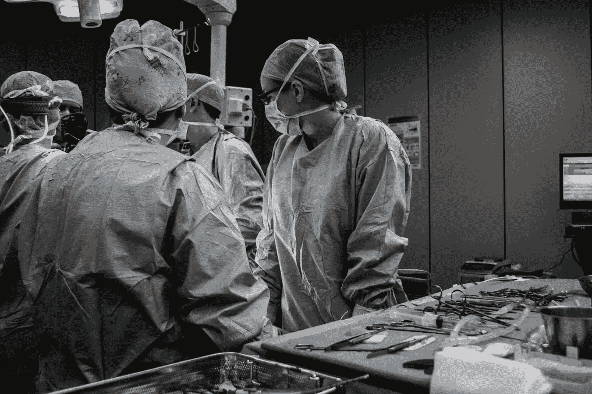
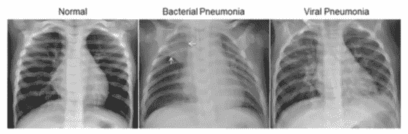
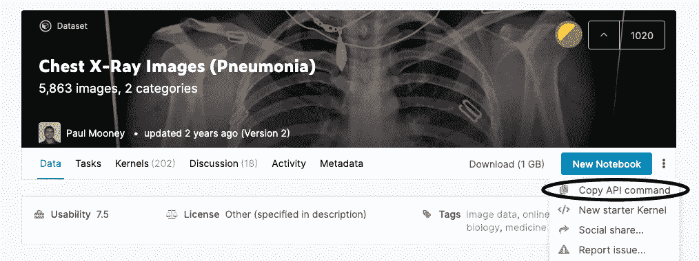
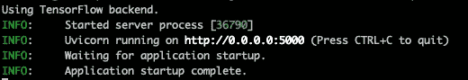
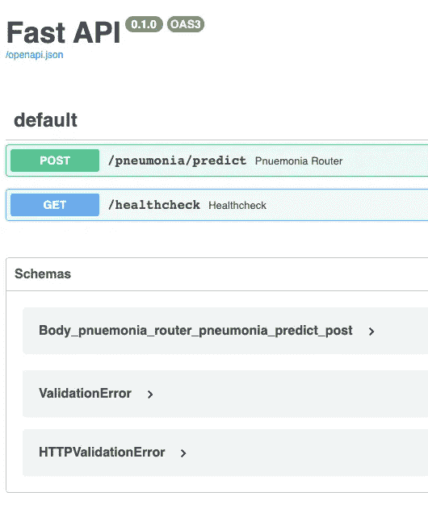
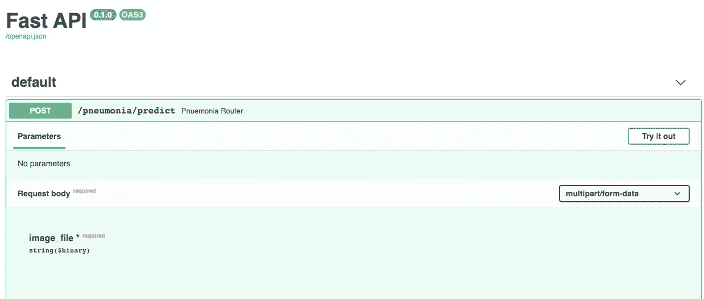
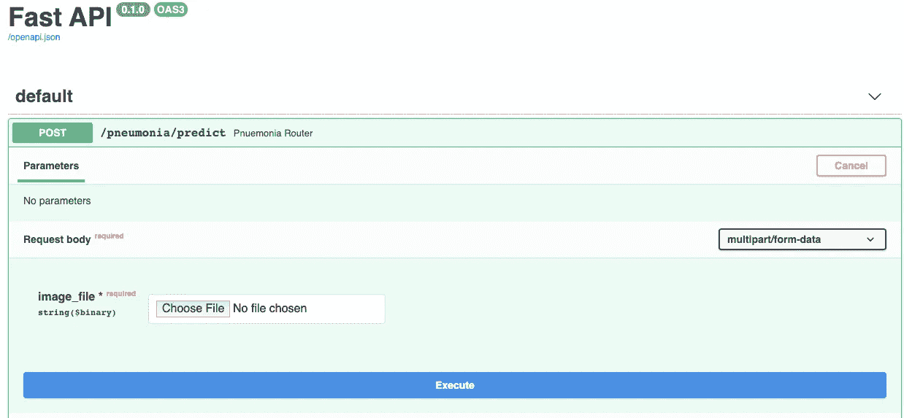
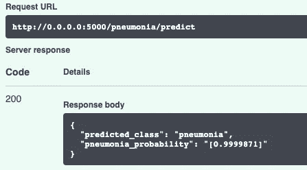

# 肺炎检测的 Web 应用程序

> 原文：<https://towardsdatascience.com/pneumonia-detection-with-keras-and-fastapi-6c10dab657e0?source=collection_archive---------14----------------------->

## *使用 Keras 和 FastAPI 构建一个简单的 web 应用程序，在 x 光图像中检测肺炎。*



所有使用的 Python 3.7 代码都可以在[这里](https://github.com/happilyeverafter95/pneumonia-detection)找到。本文详细介绍了每个步骤，但是您也可以按照 repo 的自述文件中的说明启动本地服务器。Github repo 还带有预先训练的重量，以防您想跳过训练过程。

本文的目标是用一个简单的模型建立框架。有大量的改进可以提高模型的性能！

# 肺炎检测

我们将使用标记的胸部 x 光图像来训练肺炎检测模型。[数据集](https://www.kaggle.com/paultimothymooney/chest-xray-pneumonia)托管在 Kaggle 上，由 5863 张 x 光图像组成。肺炎图像被进一步分类为病毒性或细菌性。忽略这个二级分类，我们的模型将图像分类为*肺炎或正常。*



# 数据集限制

使用 AI 进行疾病诊断的最大挑战之一是缺乏标记数据。数据不容易获得，只有医疗专业人员有资格标记数据。此外，数据收集通常偏向于特定的人口统计数据和用于收集数据的医院设备。

肺炎数据集中的图像来自广州妇女儿童医疗中心 1-5 岁的儿科患者。由“两位专家医生”对这些图像的诊断进行分级。

每个医院使用的影像工具和不同种族、性别和年龄的患者之间的生物因素有很大的差异。有了这些限制，很难理解我们的模型在一般情况下对肺炎的检测有多好。

# 属国

## 码头工人

我们可以在没有 Docker 的情况下启动模型服务器，因此安装 Docker 是完全可选的。如果你想使用 Docker，但还没有安装，请点击[这里](https://runnable.com/docker/getting-started/)并按照你正在使用的操作系统的说明进行操作。

## Kaggle API

Kaggle API 使得以编程方式/通过命令行界面下载 Kaggle 数据集变得很容易。

1.  如果您还没有 Kaggle 帐户，请创建一个
2.  在`kaggle.com/USERNAME/accounts.`生成新令牌这将提示您下载一个`kaggle.json`文件，其中包含访问 API 的凭证
3.  将 json 文件中的凭证作为环境变量导出。最简单的方法是运行:

```
export KAGGLE_USERNAME = [kaggle username]
export KAGGLE_KEY = [generated_key]
```

Github 上的代码使用了 [direnv](https://direnv.net/) ，这是一个用于管理环境变量的 shell 扩展。如果您喜欢使用`direnv`来管理 Kaggle 凭证，那么填充`.envrc`文件并在目录中运行`direnv allow`来接收变量。

## 安装 Python 依赖项

运行传统的`pip install -r requirements.txt`来下载 Python 依赖项。

# 训练分类器

## 记录与打印

您将在代码库中找到几个日志记录实例。日志的使用类似于 print 语句，因为它们提供信息、警告并有助于调试。在生产环境中，日志记录优于打印，因为日志更易于配置(可以将日志发送到目的地进行存储/监控),并提供堆栈跟踪来确定其来源。

## 加载所需的库并设置配置

用于数据处理和模型构建的代码将包含在一个名为`Train`的类中。

## 从 Kaggle 下载数据

当`force_download`参数设置为 *true* 时(或者没有找到数据文件夹时)，脚本从 Kaggle 下载并解压数据。

当我们认证 Kaggle API 时，它会在我们的环境变量中搜索凭证。下一行下载数据集，它从`self.dataset_name`(*paultimothymooney/chest-x-ray-pneumonia)*中识别数据集，并将其保存到指定路径。

数据集名称并不总是直观的。我们可以在 Kaggle UI 上通过点击右边的三个垂直点然后`Copy API command`找到名字。该名称可以从复制的命令中推断出来。



## 将数据载入内存

Kaggle 数据集下载到以下 jpeg 图像目录中:

├──火车
│ ├──正常
│ ├──肺炎
├──测试
│ ├──正常
│ ├──肺炎
├──瓦尔
│ ├──正常
│ ├──肺炎

我们将使用 Keras 的 [ImageDataGenerator](https://keras.io/preprocessing/image/) 将这些图像加载到内存中。数据生成器对象使得将数据加载到内存变得容易，并且通过批量加载数据克服了 RAM 的限制。

我们为训练、测试和验证集定义了一个单独的生成器。ImageDataGenerators 附带了一整套可以应用于图像的预处理步骤。为简单起见，我们将只应用 1/255.0 的重新标度因子。

在生成器中，我们指定每个图像的目标尺寸为 64×64 像素，颜色模式为*灰度。*数据生成器将根据文件夹名推断出类别标签。

## 用计算机视觉表示图像

彩色图像通常使用三个通道(红色、绿色和蓝色)来表示，而灰度图像使用一个通道来表示。这些表示存储在嵌套数组中，其中每个值代表特定通道的像素色调。像素值范围从 0(黑色)到 255(白色)。

## 为什么要除以 255？

将每个像素除以 255.0 是归一化数据的常用方法。这允许分类器更快地收敛(较小的值=更快的计算)。缩放的另一种标准化技术是*定心。*我们可以通过将数据转换成标准的正态分布来集中我们的数据。

## 定义模型

对于这个应用程序，我们将从头开始训练我们的模型。然而，对于少于 6000 个图像，这并不理想。图像分类的复杂性与高维特征空间相结合，使得在小数据集上训练的分类器容易过拟合。

因此，对于小数据集，从预训练模型进行迁移学习是一种非常受欢迎的方法。

## 迁移学习

在迁移学习中，我们采用一个复杂的预训练模型(如 VGG 或 ResNet)，该模型从大型数据集学习复杂的标准对象检测。我们冻结(实质上删除)最后几个层，并根据较小的数据集重新训练这些层。这允许复杂模型理解胸部 X 射线之间的区别。

## 训练模型

我们使用`fit_generator`批量拟合模型。

## “部署”模型

部署步骤将模型权重保存在同一目录中的特定位置。对于一个较大规模的项目，这个位置将是集中的，可能托管在一个云存储服务，如 S3。在下一部分中，应用程序将使用这些权重进行推理来恢复模型。

## 模型性能

第 3 行显示测试准确率为 76%。测试集中有 624 个 x 射线图像(390 个肺炎，234 个正常)。f1 的分数是 72%。

根据记录，我为模型架构创建了一个通用的 CNN，所以提高这个性能应该很容易。

# 部署应用程序

我们将使用 FastAPI 和 Docker 来部署这个应用程序。在本节中，我将大量引用我以前关于 FastAPI 的一篇文章。

## 创建路由器

路由器用于将复杂的 API 分解成更小的部分。每台路由器都有自己的前缀来标记这种分离。虽然这不是立即需要的，但我决定使用路由器，以防我们的 API 变得更加复杂。

创建一个名为`routers`的文件夹来存放我们的路由器。在`routers`文件夹中，定义接收 x 光图像后输出分类结果的 API 端点。

## 向应用程序发送数据

我们不应该要求客户端应用程序发送 numpy 数组来接收分类输出。对于大多数应用程序来说，这将是非常乏味的。

方便的是，FastAPI 接受`File`对象，在这种情况下是图像的二进制表示。使用`PILLOW`库，我们可以将字节转换成 numpy 数组。

## 定义应用程序

在与`routers`文件夹相同的目录下，创建另一个脚本`app.py`。在此脚本中，定义应用程序并指定路由器。

我们还定义了一个`healthcheck`函数。健康检查 API 返回应用程序的运行状态。当应用程序健康时，我们的健康检查返回文本 *Good to go* 。注意，这调用了一个`200`状态代码。

## 在本地运行应用程序

我们可以通过在命令行中运行以下代码来本地启动我们的应用程序:

```
uvicorn --host 0.0.0.0 --port 5000 classifier.app:app
```

日志通知我们服务器正在运行于 [http://0.0.0.0:5000](http://0.0.0.0:5000)



我们可以通过编程向服务器发送 POST 请求，但这需要将图像的字节再现作为参数传递。

方便的是，我们可以去[http://0 . 0 . 0:5000/docs](http://0.0.0.0:5000/docs)获得更友好的 UI。



点击绿色的 POST 按钮，它会把你带到这个页面。



在右侧，单击尝试一下。



这将提示您上传图像。在 Github repo 的 [fixtures 文件夹](https://github.com/happilyeverafter95/pneumonia-detection/tree/master/fixtures)中，您可以找到我从训练集中提取的几张图片(不用于判断模型性能！).该名称表示类别。

我上传了`pneumonia_1.jpeg`，收到了以下结果:



**很好，我们为肺炎检测构建了一个漂亮的本地应用程序！**

repo 更进一步，添加了一个`Dockerfile`来用 Docker 构建应用程序。Dockers 将构建和运行应用程序所需的一切封装在一个地方，使得通过公共 URL 共享和部署变得更加容易。

如果您克隆了 repo，您可以按照 [README](https://github.com/happilyeverafter95/pneumonia-detection) 中的说明构建并运行 Docker 容器。

# 感谢您的阅读！

如果你喜欢这篇文章，可以看看我关于数据科学、数学和编程的其他文章。[请通过媒体](https://medium.com/@mandygu)关注我的最新消息。😃

作为一个业余爱好项目，我还在[www.dscrashcourse.com](http://www.dscrashcourse.com/)建立了一套全面的**免费**数据科学课程和练习题。

如果你想支持我的写作，下次你报名参加 Coursera 课程时，可以考虑使用我的[会员链接](https://click.linksynergy.com/fs-bin/click?id=J2RDo*Rlzkk&offerid=759505.198&type=3&subid=0)。完全公开—我从每一次注册中获得佣金，但不会对您产生额外费用。

再次感谢您的阅读！📕