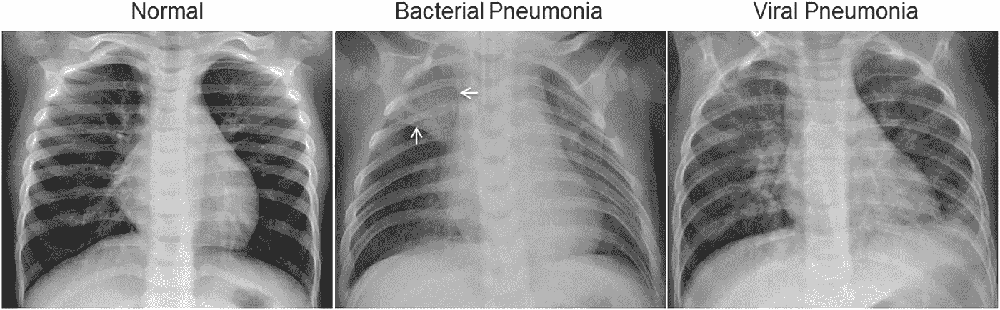
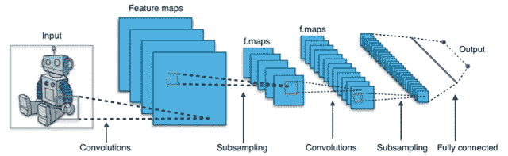
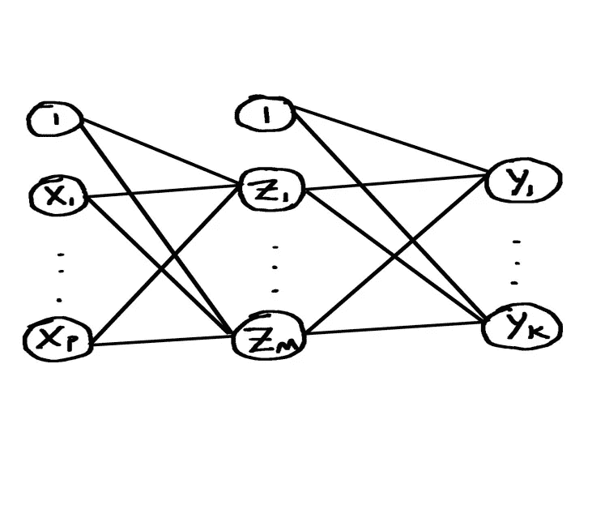

# 使用深度学习的肺炎诊断

> 原文：<https://towardsdatascience.com/pneumonia-diagnosis-using-cnns-bfd71e3c05?source=collection_archive---------20----------------------->

## 用卷积神经网络对胸部 x 光片进行分类

**简介**

在医疗保健领域，医疗专业人员面临的主要问题之一是正确诊断患者的病情和疾病。不能正确诊断病情对病人和医生来说都是一个问题。如果医生误诊了病人，那么医生就没有以适当的方式使病人受益。这可能会导致医疗事故诉讼，并从整体上损害医生的业务。患者因得不到适当的治疗而遭受痛苦，并因病情未被发现而面临更大的健康损害风险；此外，患者经受不必要的治疗并服用不必要的药物，耗费患者的时间和金钱。

如果我们能够正确诊断患者的病情，我们就有可能解决上述问题。如果我们可以产生深度学习模型，可以对患者是否患有某种疾病进行分类，可以确定患者患有哪种特定疾病，并可以确定疾病的严重程度，那么医疗专业人员将能够使用这些模型来更好地诊断他们的患者。通过允许对患者进行及时治疗，准确的诊断也是有用的；被误诊会导致延误接受适当的治疗。

在本文中，我们将对代表来自广州市妇女儿童医疗中心的儿科患者的胸部 x 射线的数据集进行深度学习。

我想应用一个卷积神经网络(CNN)并尝试将一个病人分为肺炎或没有肺炎。这是一个二元分类问题。我还想用 CNN 来给病人分类，要么是细菌性肺炎，要么是病毒性肺炎，要么是没有肺炎。这是一个三级分类问题。

这是 x 光的一个样本:



[来源](https://data.mendeley.com/datasets/rscbjbr9sj/2)【CC BY 4.0】

[正常的胸部 x 光片(左图)描绘了清晰的肺部，图像中没有任何异常浑浊区域。细菌性肺炎(中)典型地表现为局灶性肺叶实变，在本例中为右上叶(白色箭头)，而病毒性肺炎(右)表现为双肺弥漫性“间质”样改变。(克马尼等人，2018 年)]

显然，细菌性肺炎的不透明区域更集中在一个肺叶，而病毒性肺炎的不透明区域更分散在两个肺。右肺分为三叶，左肺分为两叶。对我来说，如何区分这两者当然不是很明显。希望深度学习可以帮助我们区分这两者。

**数据准备**

数据集可以在这里找到:[https://www . ka ggle . com/paultimothymooney/chest-x ray-pneumonia # IM-0007-0001 . JPEG](https://www.kaggle.com/paultimothymooney/chest-xray-pneumonia#IM-0007-0001.jpeg)

数据来自两个文件夹，一个用于训练集，一个用于测试集。训练集文件夹包含用于肺炎病例的图像文件夹和用于正常病例的图像文件夹。训练集总共包括 5216 幅图像。测试集文件夹包含一个肺炎病例图像文件夹和一个正常病例图像文件夹。测试集总共由 624 幅图像组成，约占总图像集的 10.68%。与经典机器学习中的情况不同，我们不必担心数据集的各种属性；在卷积神经网络的情况下，我们只有一组图像。

**卷积神经网络**

然而，在应用人工神经网络之前，需要对图像进行一些准备。需要在称为卷积的过程中使用卷积层来准备图像。这个过程有几个阶段——卷积运算、ReLU 运算、汇集、展平；最终结果是一个向量，我们可以将其输入到人工神经网络中。

这是一个通用 CNN 架构的图像:



[图片来源](https://commons.wikimedia.org/w/index.php?curid=45679374)【By aphex 34—自己的作品，CC BY-SA 4.0】

在卷积操作期间，各种特征检测器被应用于图像，创建一堆特征图-这一堆特征图被称为卷积层。ReLU 被应用于每个特征图以增强非线性。在汇集阶段，也称为子采样，我们将最大汇集(或一些其他类型的汇集)应用于每个特征图，创建较小的特征图，保留图像的相关特征。合并的专题地图的最终堆叠构成了合并图层。

一旦我们到达由汇集的特征地图组成的汇集层，每个汇集的特征地图被展平成一个向量，并且产生的向量被顺序地组合成一个向量。这个向量的输入被送入人工神经网络的输入单元。因此，对应于一个图像的展平向量的条目被馈送到 ANN 的输入单元中。(这与传统数据集上使用的人工神经网络形成对比，在传统数据集上，单个实例的*属性*被输入到人工神经网络的输入单元中)。然后，人工神经网络在训练集上被训练，并在测试集上被测试。这是安将军的图像:



在 CNN 架构图中，人工神经网络从“完全连接”开始。如您所见，卷积神经网络是卷积和人工神经网络的结合。

**用 Python 构建 CNN**

为了构建 CNN，我们导入 Keras 库和包:

```
#Importing the Keras libraries and packagesfrom keras.models import Sequentialfrom keras.layers import Convolution2Dfrom keras.layers import MaxPooling2Dfrom keras.layers import Flattenfrom keras.layers import Dense
```

顺序包用于初始化 CNN。Convolution2D 包用于创建卷积层。MaxPooling2D 包用于创建汇集的要素地图。展平包用于将汇集的要素地图的堆叠展平为一个可输入人工神经网络的矢量。密集包用于向人工神经网络添加层。

接下来，我们通过创建一个 Sequential 类的对象来初始化 CNN。这个对象我们称之为“分类器”:

```
#Initialising the CNNclassifier = Sequential()
```

我们将通过对输入图像应用 32 个 3x 3 维度的过滤器(特征检测器)来添加一个 32 个过滤器映射的卷积层。我们希望我们的输入图像具有 64 乘 64 的尺寸，并被视为具有 3 个通道的彩色图像。我们还使用激活函数“relu”将 ReLU 应用于每个特征图:

```
#Step 1 - Convolutionclassifier.add(Convolution2D(32,(3,3),input_shape=(64,64,3),activation = 'relu'))
```

既然我们在卷积层中有了我们的特征图，我们使用一个 2×2 的网格将最大池应用于每个特征图。

```
#Step 2 - Poolingclassifier.add(MaxPooling2D((2,2)))
```

现在，我们有了一个由汇集的要素地图组成的汇集图层，我们将每个汇集的要素地图展平成一个矢量，并将所有生成的矢量按顺序组合成一个巨大的矢量。

```
#Step 3 - Flatteningclassifier.add(Flatten())
```

接下来，我们将添加我们的人工神经网络。首先，我们添加一个隐藏层的 128 个单位，并使用激活功能' relu '。其次，我们添加由一个输出单元组成的输出层，并使用 sigmoid 函数作为激活函数；我们使用一个输出单位，因为我们的输出是二进制的(正常或肺炎)。

```
#Step 4 - Full connectionclassifier.add(Dense(units=128,activation='relu'))classifier.add(Dense(units=1, activation='sigmoid'))
```

现在，我们需要编译 CNN。我们将使用“adam”作为随机梯度下降中的优化器，使用二进制交叉熵作为损失函数，使用准确性作为性能指标。

```
#Compiling the CNNclassifier.compile(optimizer = 'adam',loss='binary_crossentropy',metrics=['accuracy'])
```

我们的训练集和测试集加起来总共有 5840 幅图像；因此，我们将应用图像增强来增加我们的训练集和测试集的大小，同时减少过度拟合。然后，我们将 CNN 拟合到我们的增强训练集，并在我们的增强测试集上对其进行测试:

```
#Fitting the CNN to the imagesfrom keras.preprocessing.image import ImageDataGeneratortrain_datagen = ImageDataGenerator(rescale=1./255,shear_range=0.2,zoom_range=0.2,horizontal_flip=True)test_datagen = ImageDataGenerator(rescale=1./255)training_set = train_datagen.flow_from_directory('chest_xraybinary/train',target_size=(64, 64),batch_size=32,class_mode='binary')test_set = test_datagen.flow_from_directory('chest_xraybinary/test',target_size=(64,64),batch_size=32,class_mode='binary')classifier.fit_generator(training_set,epochs=25,validation_data=test_set)
```

经过 25 个时期后，我在训练集和测试集上分别获得了 95%和 89%的准确率。

**评估、改进和调整 CNN**

以前，我们建立了一个 CNN，有一个卷积层和一个隐藏层。这一次，我们将添加第二个卷积层，看看它是否能提高性能。我们只需在步骤 2 —池化之后添加以下代码:

```
#Adding a second convolutional layerclassifier.add(Convolution2D(32,(3,3),activation = 'relu'))classifier.add(MaxPooling2D((2,2)))
```

经过 25 个时期后，我们在训练集和测试集上分别获得了 96%和 91.5%的准确率。

接下来，除了第二个卷积层之外，我们还将添加第二个隐藏层，看看它是否能提高性能。要添加第二个隐藏层，我们只需复制添加一个隐藏层的代码:

```
#Step 4 - Full connectionclassifier.add(Dense(units=128,activation='relu'))classifier.add(Dense(units=128,activation='relu'))classifier.add(Dense(units=1, activation='sigmoid'))
```

经过 25 个时期后，我们在训练集和测试集上分别获得了 96%和 91.5%的准确率。添加第二个隐藏层不会提高性能。

**区分细菌性和病毒性肺炎**

我们不仅要区分正常和肺炎 x 射线，还要区分细菌性和病毒性肺炎 x 射线。为此，我们将包含肺炎病例的文件夹分成两个文件夹，一个用于细菌病例，另一个用于病毒病例。现在，我们有一个三类分类问题，其中类是正常、细菌和病毒。就像我们用一个 CNN 解决二分类问题一样，我们可以用一个 CNN 解决三分类问题。除了少数例外，代码保持不变。在 CNN 的人工神经网络阶段，我们将输出单元的数量从 1 更改为 3，并将输出激活函数从“sigmoid”更改为“softmax”。在编译 CNN 时，损失函数从‘二元 _ 交叉熵’变为‘分类 _ 交叉熵’。当将 CNN 拟合到图像时，不使用文件夹“chest_xraybinary ”,而是使用文件夹“chest_xray ”,该文件夹包含训练和测试集文件夹，每个文件夹具有对应于三个类别的三个文件夹。class_mode 从“二进制”更改为“分类”。

经过 25 个纪元，我在训练集上获得了 80.64%的准确率，在测试集上获得了 83.33%的准确率。

添加了第二个卷积层；经过 25 个时期后，我在训练集和测试集上分别获得了 81.33%和 85.9%的准确率。这在性能上是一个微小的改进。

除了第二个卷积层，还增加了第二个隐藏层；经过 25 个时期后，我在训练集和测试集上分别获得了 80.25%和 86.7%的准确率。在测试集上，这是一个轻微的性能改进。

除了第二个卷积层和第二个隐藏层，我还将第二个卷积层的特征检测器数量从 32 个改为 64 个。经过 25 个时期后，我在训练集和测试集上分别获得了 81%和 87%的准确率。这是具有两个卷积层和两个隐藏层的 CNN 的测试集性能的微小改进。然而，这是一个体面的改善测试集的性能从 CNN 的一个卷积层和一个隐藏层。然后，我将输入 CNN 的图像尺寸从 64×64 增加到 128×128；这导致在训练集上的准确率为 80.85%，在测试集上的准确率为 85.74%，比我们迄今为止达到的性能要差。

我将输入图像的尺寸降低到 64 乘 64，并添加了第三个由 128 个特征检测器组成的卷积层。这使得训练集和测试集的准确率分别达到了 81.54%和 87.34%，比我们目前所取得的成绩有了很小的提高。给定当前设置，我运行 CNN 200 个纪元；训练集的准确率稳步上升到 96.32%，而训练集的准确率在 80%和 80%之间波动，最终为 86.54%。

保留三个卷积层，我增加了更多的隐藏层，总共 10 个隐藏层；经过 25 个时代，我得到了 79.54%的训练集准确率和 83.33%的测试集准确率。所以，增加更多的隐藏层并没有带来改善。

**结论**

在本文中，我们将卷积神经网络应用于确定胸部 x 光片属于两个类别(正常或肺炎)中的哪一个的二元分类问题。我们发现，具有一个卷积层和一个隐藏层的 CNN 在训练集上实现了 95%的准确率，在测试集上实现了 89%的准确率。然后，我们在 CNN 中添加了第二个卷积层，并在训练集和测试集上分别获得了 96%和 91.5%的准确率；这稍微提高了性能。接下来，除了有第二个卷积层，我们还增加了第二个隐藏层，并在训练集和测试集上分别达到了 96%和 91.5%的准确率；这并没有提高性能。

我们还将卷积神经网络应用于三类分类问题，以确定胸部 x 光片属于三类中的哪一类——正常、细菌或病毒。我们发现，具有一个卷积层和一个隐藏层的 CNN 在训练集上达到了 80.64%的准确率，在测试集上达到了 83.33%的准确率。然后，我们向 CNN 添加了第二个卷积层，并在训练集和测试集上分别实现了 81.33%和 85.9%的准确率，这是一个微小的改进。接下来，除了有第二个卷积层之外，我们还添加了第二个隐藏层，并在训练集上实现了 80.25%的准确率，在测试集上实现了 86.7%的准确率，这在测试集上的性能略有改善，但在训练集上的改善有所下降。除了第二卷积层和第二隐藏层之外，将第二卷积层中的特征检测器的数量从 32 改变为 64，在 25 个时期之后，在训练集上的准确率为 81%,在测试集上的准确率为 87%。添加 128 个特征检测器的第三卷积层导致训练集的准确率为 81.54%，测试集的准确率为 87.34%。

因为我们的总数据集中只有有限数量的图像，所以使用图像增强来提供更多的图像来训练 CNN 是很重要的；这种缺乏足够数量的医学图像似乎是除肺炎之外的其他医学问题的共同问题。因此，在图像数量不足的情况下，图像增强有望成为一种有用的工具。

考虑到在世界的某些地区，可能缺乏能够阅读和解释 x 射线的训练有素的专业人员，因此有可能根据患者的 x 射线进行自动诊断。

在经典机器学习技术的情况下，有时我们能够识别在确定机器学习模型的输出中有意义的特定属性。另一方面，在卷积神经网络的情况下，没有我们可以识别为在确定 CNN 模型的输出中有意义的属性集；我们有的只是图像和它们的像素。此外，很难直观地理解 CNN 模型是如何进行分类的。

我们培训的 CNN 使用了来自中国广州的 1-5 岁儿童患者的胸部 x 光片。我们的 CNN 能否适用于其他年龄段的孩子，适用于中国以外的孩子，甚至适用于成年人？深度学习如何用于检测特定肺炎病例的严重程度？这些都是值得探讨的开放性问题，以进一步了解如何将图像分类用于医学诊断。

该数据集可在以下位置找到:

[https://www . ka ggle . com/paultimothymooney/chest-x ray-pneumonia # IM-0007-0001 . JPEG](https://www.kaggle.com/paultimothymooney/chest-xray-pneumonia#IM-0007-0001.jpeg)

# 承认

资料:【https://data.mendeley.com/datasets/rscbjbr9sj/2 

执照: [CC BY 4.0](https://creativecommons.org/licenses/by/4.0/)

引用:[http://www . cell . com/cell/full text/s 0092-8674(18)30154-5](http://www.cell.com/cell/fulltext/S0092-8674(18)30154-5)

**参考文献**

肺炎患者胸部 X 线的示例。*确定医疗诊断和可治疗的疾病*

*基于图像的深度学习疾病，* Cell 172，1122–1131，2018 年 2 月 22 日，爱思唯尔公司，[https://doi.org/10.1016/j.cell.2018.02.010](https://doi.org/10.1016/j.cell.2018.02.010)