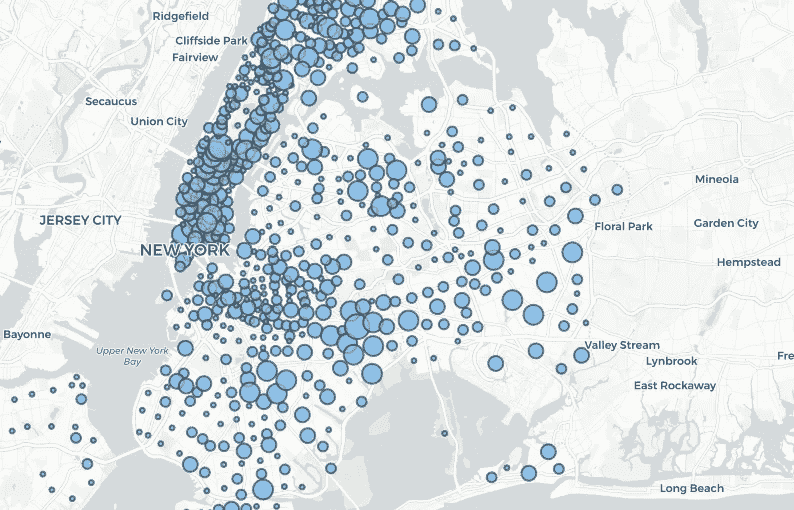
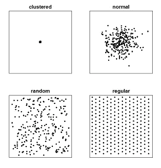
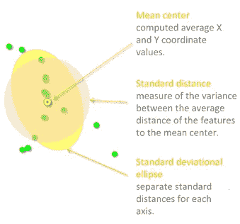
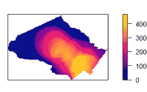
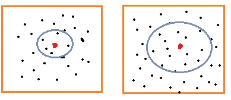

# 位置数据的点模式分析

> 原文：<https://towardsdatascience.com/point-pattern-analysis-of-location-data-1346f318865d?source=collection_archive---------25----------------------->

## 用于测量密度、距离、热点等的空间统计和点模式分析


克里斯·劳顿在 [Unsplash](https://unsplash.com?utm_source=medium&utm_medium=referral) 上的照片

你可能听说过“[位置智能](https://en.wikipedia.org/wiki/Location_intelligence)”——应用地理空间和数据科学工具&技术将位置数据转化为商业价值。[2018 年发表的一项研究](https://go.carto.com/hubfs/The%20State%20of%20Location%20Intelligence%202018%20v10042017.pdf?hsCtaTracking=cb25d151-ee5f-4593-9f6a-5388d9749ebc%7C7320ab2b-7f46-481a-9b8e-a47cc20f70a1)显示，所有公司都在某种程度上收集和维护位置数据。然而，他们中只有少数人能够利用这些有价值的信息进行决策，要么是因为他们不知道如何在业务决策中使用这些信息，要么是因为他们不具备分析地理空间数据的适当技术能力。事情变化很快，每个行业现在都更加重视位置数据的广泛应用。



图:纽约市犯罪地图[ [来源](https://maps.nyc.gov/crime/) ]

# 什么是位置数据？

当我们在智能手机和 GPS 时代提到“位置数据”时，人们往往会认为它们是手机和导航设备产生的数据。相反，我这里指的是静态对象和事件的位置。静态对象的一个例子是位于美国的每一家星巴克店，而事件的位置可以是城市中所有车祸发生的地方。这种位置数据通常与其他数据集结合使用，用于各种各样的应用，我们将在下面看到。

# 如何使用位置数据？

在公共服务或商业中，没有一个领域的位置数据是无用的。下面是这些应用案例中的几个例子。

*   **公共政策**:大部分市县收集并记录犯罪地点的数据(例如)。这些犯罪地点数据随后被用于了解哪里是热点，这有助于有效地分配有限的资源，以改善公共安全。
*   **流行病学**:科技公司手中有一个用户位置信息的宝库，可以通过研究来了解正在进行的疫情新冠肺炎的传播。匿名追踪 30 多万名感染者的位置有助于回答流行病学家仍在思考的许多问题。它可以帮助理解社会距离是否有任何影响。美国政府和科技巨头[正在谈判](https://www.washingtonpost.com/technology/2020/03/17/white-house-location-data-coronavirus/)来解决这个难题。
*   **商业**:位置数据正在改变零售商业。它使他们能够了解自己的客户群，有效地储备库存，并根据需求优化仓库位置。同样，通过使用周围地区的位置数据，企业可以找到做生意的最佳地点(参见 [WeWork 如何利用](https://www.factual.com/case-study/factual-powers-smarter-data-driven-business-intelligence-global-places/)位置智能进行业务扩展)。
*   房地产:当人们寻找房子或其他房地产时，位置可能是最重要的标准。它帮助购房者找到符合他们搜索标准的房产，如学区、社区、到办公室的距离等。
*   **环境管理**:地理空间分析和位置数据是大部分环境管理的核心。康奈尔鸟类学实验室管理的 eBird 平台就是一个例子，观鸟者可以上传他们遇到的鸟的信息。这个公开的数据集被广泛用于科学研究和保护管理。

# 位置数据是如何分析的？

分析位置数据是地理信息系统(GIS)的一个成熟分支，称为“点模式分析(PPA)”。PPA 无非是对二维空间中数据点(纬度/经度)的空间排列的分析。就像统计数据分析一样，在 PPA，位置数据使用探索性数据分析(EDA)技术进行分析。一旦你画出物体和事件的地理坐标，就可以进行各种 EDA 来回答特定的问题或测试假设。分析位置数据的最常用技术如下:



图:点数据在空间中的不同排列方式[ [来源](https://en.wikipedia.org/wiki/Point_pattern_analysis#/media/File:Point_pattern.png)

## **中心图**

中心图测量位置数据的基本描述性统计数据，如中心趋势(如平均中心)、离散度(如标准偏差椭圆)和空间方差，它告诉我们数据在空间中是如何聚集或分散的。



图:空间数据的集中趋势[ [来源](https://mgimond.github.io/Spatial/point-pattern-analysis.html)

## 密度分析

一般来说，密度是指单位面积内的观测次数。例如，如果在 4 平方英里的城市区域有 20 家咖啡店，那么我们会说这个城市每平方英里有 5 家。这是一个计算密度的简单方法，但是“内核密度”可能是所有密度分析中最广为人知的。

密度对于理解观测热点非常有价值。它还用作数据驱动决策的进一步分析的输入(例如，给定车祸热点时部署的交通警察数量)。



图:数据点的核密度

## 距离分析

在基于密度的技术中，数据点的分布与研究区域相关。相比之下，基于距离的方法显示数据点在空间中的相对分布。有一些技巧可以做到这一点:

*   **平均最近邻(ANN)** 测量给定观测值的相邻数据点的平均距离。它能告诉我们数据点是聚集的还是分散的。


图:左侧最近邻的平均距离较短

*   **K 函数**测量空间中所有点之间的距离，而不是像 ANN 那样只测量邻居之间的距离。这也有助于理解数据在距其中心(质心)不同距离处是如何聚集或分散的。有一种标准化的方法来实现 K 函数以增加可解释性——L 函数。



图:K 函数描述了从中心开始的不同扫描范围内聚类是如何发生的

## 建模

不仅仅是测量数据点的空间统计数据。您可以进行许多其他分析，例如观察值(例如犯罪地点)如何与基础协变量(例如人口密度)相关以及它们如何随时间变化等的空间相关性分析。有很多方法可以使用复杂的模型来处理点数据，例如[泊松模型](http://book.spatstat.org/sample-chapters/chapter09.pdf)，但是我将这一点放在另一个讨论中。

# 快速交互式可视化

现在我们知道了什么是位置数据、它们的用途以及如何分析它们，下面简单介绍一下如何用几行代码创建一个交互式地图来可视化位置数据。

数据只有两列——经度和纬度——代表马里兰州 Montgomery 县一些随机选择的犯罪事件的位置。您可以从官方的[空间数据仓库](https://data.montgomerycountymd.gov/Public-Safety/Crime/icn6-v9z3)中找到并下载这些数据。

```
# libraries needed
library(sf)
library(mapview)# download data from the link shown above# import data
df = read.csv("../filename.csv", sep = ",", stringsAsFactors = FALSE )
# randomly sample few datapoints from this big dataset 
d = df[sample(nrow(df), 500), ]# create a dataframe of latitude and longitude columns 
latlong = d[, c(27,28)]# convert the dataset to sf object 
point <- st_as_sf(x = latlong, 
                  coords = c("Longitude", "Latitude"),
                  crs = "+proj=longlat +datum=WGS84")
# create an interactive map:
mapview(point, cex = 1.0)# There!!!
```


图:犯罪地点随机选择的数据点

# 结束注释

一旦您了解了空间统计的基础知识以及如何处理相关的库，点数据分析就会变得非常有趣。在以后的文章中，我将深入研究真实世界数据集的实际应用，所以请保持联系。

最后，大家要坚强，照顾好自己和家人。非常时期需要非常措施，希望我们能尽快度过这一难关。

# 一些有用的资源

1.  [使用](https://cran.r-project.org/web/packages/spatstat/vignettes/shapefiles.pdf) `[spatstats](https://cran.r-project.org/web/packages/spatstat/vignettes/shapefiles.pdf)` [包](https://cran.r-project.org/web/packages/spatstat/vignettes/shapefiles.pdf)处理 shapefiles
2.  Manuel Gimond 的《地理信息系统和空间分析简介》开放访问书
3.  打开 access book: [带 R 的空间数据科学](https://rspatial.org/raster/index.html)
4.  [数据点的非空间可视化示例](https://www.earthdatascience.org/tutorials/visualize-denver-colorado-traffic-crime/)