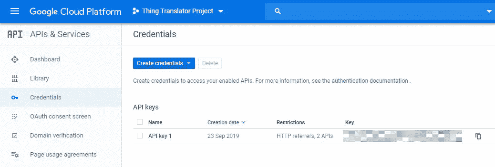

# 把你的相机对准事物，听听它们用另一种语言怎么说

> 原文：<https://towardsdatascience.com/point-your-camera-at-things-to-hear-how-to-say-them-in-another-language-fa6e9f3621a5?source=collection_archive---------59----------------------->

## 通过 Google Cloud Vision 和 Translate API 引入事物翻译器


资料来源:github.com/dmotz

当你去那些你不说他们语言的国家旅行时，谷歌翻译已经成为一个无价的工具。在大多数情况下，你会对着应用说话或输入单词来获得翻译。如今，有了谷歌翻译的相机功能，你就可以把相机对准用另一种语言写的文本，然后翻译成你的母语。

当我想知道我是否可以把这样的相机翻译功能带到网上时，我看到了这个网络应用程序“东西翻译器”。它是作为谷歌[人工智能实验](https://aiexperiments.withgoogle.com/)项目的一部分开发的，它可以让你将手机(或笔记本电脑)指向某些东西，然后听到用不同的语言说出来。

# 东西翻译演示

点击下面的链接亲自尝试一下:

 [## 事物翻译器

### 把你的相机对准事物，听听它们用不同的语言怎么说

thing-translator.appspot.com](https://thing-translator.appspot.com/) 

# 履行

在幕后，Thing Translator 正在使用谷歌的[云视觉](https://cloud.google.com/vision/)和[翻译](https://cloud.google.com/translate/)API。在本文中，我将进一步探索代码，请跟随我，这样您也可以自己构建这个很酷的应用程序。

## #第一步:注册谷歌云 API

因为这个 web 应用程序使用的是 Google 的云 API，所以要开始使用，你需要在 Google 中设置一个项目来使用它的 2 个 API。

你可能害怕谷歌会对你的实验收费，请不要担心，你的实验是免费的:

*   谷歌提供了 300 美元的信用额度来免费使用 GCP
*   [视觉 API](https://cloud.google.com/vision/pricing) 的第一个**1000**请求和[翻译 API](https://cloud.google.com/translate/pricing) 的第一个**500000**字符每月**免费**
*   你可以[限制你的 API 使用](https://cloud.google.com/apis/docs/capping-api-usage)

谷歌提供了如何设置的一步一步的指导，更多细节可以在[谷歌云 API 入门](https://cloud.google.com/apis/docs/getting-started)中找到



在 GCP(谷歌云平台)中设置好 API 后，复制并保存 API 密匙，以便在 web 应用中使用。

## #步骤 2:克隆和构建存储库

接下来，从 GitHub 克隆或下载 [Thing Translator](https://github.com/dmotz/thing-translator) 库

```
git clone [https://github.com/dmotz/thing-translator.git](https://github.com/dmotz/thing-translator.git)
```

您需要在`src/config.js`中设置您的 API 密钥

要在`9966`上启动一个监视代码变更的开发服务器，只需运行:

```
npm start
```

要优化生产输出，请运行:

```
npm run build
```

现在，你可以玩这个摄像头翻译网络应用程序，学习如何用另一种语言说一些事情。

如果你也很好奇它在幕后是如何工作的，请跟随我在下面深入研究代码。

# 谷歌云视觉应用编程接口的使用

通过使用 Google Cloud Vision API，我们希望传递快照图像，并获得图像中有哪些对象的响应。

在`src/effects/snap.js`中，你可以在`snap`函数中找到调用谷歌云视觉 API 的代码。Vision API 可以对图像文件执行`LABEL_DETECTION`,方法是将图像文件的内容作为 base64 编码的字符串发送到请求体中。

```
xhr.post(
    apiUrls.cloudVision,
    {
      json: {
        requests: [
          {
            **image: {
              content: state.canvas
                .toDataURL('image/jpeg', 1)
                .replace('data:image/jpeg;base64,', '')
            },
            features: {type: 'LABEL_DETECTION', maxResults: 10}**
          }
        ]
      }
    }
```

如果请求成功，服务器返回一个`200 OK` HTTP 状态代码和 JSON 格式的响应。`LABEL_DETECTION`响应包括检测到的标签、它们的分数、话题性和不透明标签 ID:

```
{
  "responses": [
    {
      "labelAnnotations": [
        {
          "mid": "/m/0838f",
          **"description": "Water",
          "score": 0.9388793**,
          "topicality": 0.9388793
        },
        {
          "mid": "/m/039jq",
          "description": "Glass",
          "score": 0.85439134,
          "topicality": 0.85439134
        },
        ......
      ]
    }
  ]
}
```

现在，它通过检测快照中的内容完成了一半的工作。接下来，它会把它翻译成另一种语言。

# 谷歌云翻译 API 的使用

通过使用 Google Cloud Translate API，我们希望传递英语单词，并获得另一种语言的翻译结果。

在`src/effects/translate.js`中，可以在`translate`函数中找到调用 Google Cloud Translate API 的代码。下面是我们传递的查询参数:

*   q —要翻译的输入文本。
*   源—源文本的语言。
*   目标—用于翻译输入文本的语言

```
xhr.get(
 **${apiUrls.translate}&q=${term}&source=en&target**=${
   langMap[state.activeLang]
 }
```

如果成功，响应正文包含具有以下结构的数据:

```
{
  "data": {
    "translations": [
      {
        **"translatedText": "水"**
      }
    ]
  }
}
```

一旦它在文本中获得翻译，最后一步是知道如何在选定的语言中发音。

# 浏览器语音合成 API 的使用

它利用浏览器的语音合成 API 将文本转换成语音，并朗读译文。

```
const msg = new SpeechSynthesisUtterance();
msg.text = text;
msg.lang = voices[voiceMap[lang]].lang;
speechSynthesis.speak(msg);
```

语音合成 API 将正常语言文本转换成人工语音，现在大多数现代浏览器都支持它


来源:[caniuse.com/#search=speech-synthesis](https://caniuse.com/#search=speech-synthesis)

# GitHub 知识库

您可以通过下面的链接下载上述演示的完整代码:

[](https://github.com/dmotz/thing-translator) [## dmotz/事物翻译器

### 东西翻译是一个网络应用程序，让你把手机(或笔记本电脑)指向东西，听它用不同的方式说…

github.com](https://github.com/dmotz/thing-translator) 

图片来自 [Pixabay](https://pixabay.com/?utm_source=link-attribution&utm_medium=referral&utm_campaign=image&utm_content=1037868)

# 结论

这是一个例子，说明你可以使用谷歌的机器学习 API，而不需要深入机器学习的细节。毫无疑问，谷歌是在机器学习和人工智能领域领先的全球公司之一。站在巨人的肩膀上，你可以看到更远的未来。

感谢您的阅读。如果你喜欢这篇文章，请在脸书或推特上分享。如果你有任何问题，请在评论中告诉我。在 [GitHub](https://github.com/bensonruan/) 和 [Linkedin](https://www.linkedin.com/in/benson-ruan/) 上关注我。