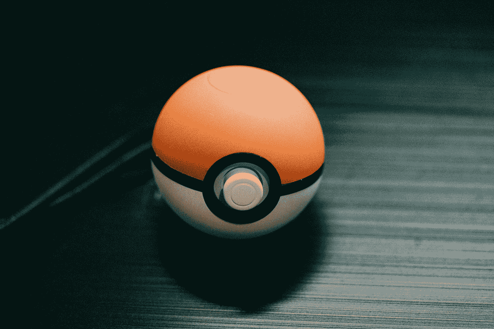
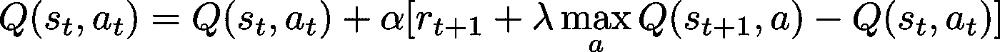
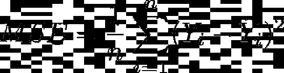
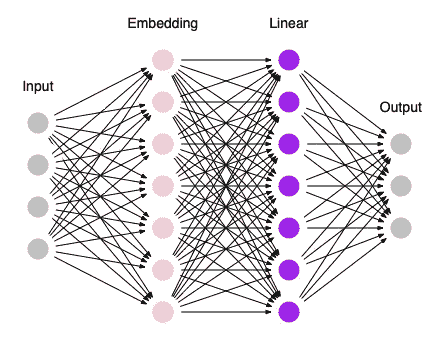
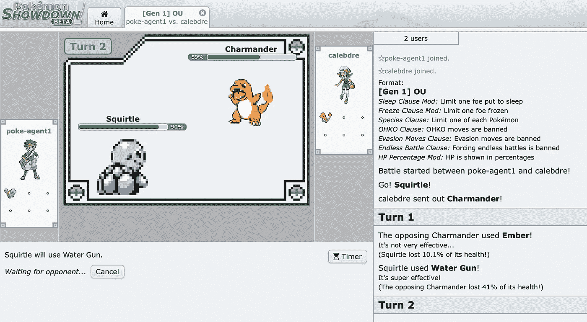
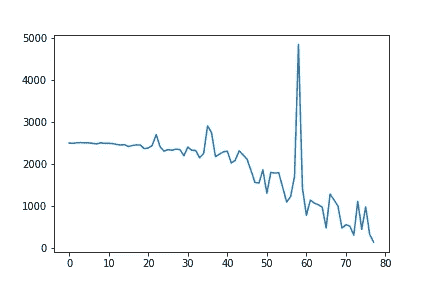

# Poke-Agent:口袋妖怪战斗和机器学习

> 原文：<https://towardsdatascience.com/poke-agent-pokemon-battling-reinforcement-learning-27ef10885c5c?source=collection_archive---------11----------------------->

## 机器学习模型已经在许多游戏中击败了人类——但不是口袋妖怪。让我们解决这个问题。

[杰伦](https://unsplash.com/@filmape?utm_source=medium&utm_medium=referral)在 [Unsplash](https://unsplash.com?utm_source=medium&utm_medium=referral) 上的照片

# **定义问题**

口袋妖怪战斗包括选择每个回合的最佳移动，给定两个队的当前状态。最好的方法是使用超级有效的方法，或者换成另一个口袋妖怪(如果你希望自己的口袋妖怪有超级有效的方法)。

学习玩口袋妖怪是一项复杂的任务，即使对人类来说也是如此，所以我们将在本文中关注一个机制:[类型有效性](https://www.polygon.com/pokemon-sword-shield-guide/2019/11/16/20968169/type-strength-weakness-super-effective-weakness-chart)。

**场景:**我们会给模型 Poke-Agent 一个[杰尼龟](https://bulbapedia.bulbagarden.net/wiki/Squirtle_(Pokémon))，让它试着打败一个[小火龙](https://bulbapedia.bulbagarden.net/wiki/Charmander_(Pokémon))。杰尼龟将会知道[抓伤](https://bulbapedia.bulbagarden.net/wiki/Scratch_(move))、[咆哮](https://bulbapedia.bulbagarden.net/wiki/Growl_(move))和[水枪](https://bulbapedia.bulbagarden.net/wiki/Water_Gun_(move))，做出最佳策略只是垃圾水枪，因为，作为一个水型招式，它对像小火龙这样的火型口袋妖怪是超级有效的。

还有其他策略可以赢，比如发 Scratch 或者综合使用这三种策略，但是，由于这些策略的风险，这些策略会导致更多的损失。最佳策略将在 3 个回合中获胜。

# **学习**

由于 Poke-Agent 正在进行口袋妖怪战斗，我们可以将它的经历分为状态和动作。游戏的状态(剩余的血量，场上有什么口袋妖怪等等。)将通知 Poke-Agent 将采取什么行动。因此，我们可以让 Poke-Agent 为每个状态-动作配对分配一个值，以指示某个动作对于特定状态有多好:值越高，该动作对于该状态越好。当它需要做出决定时，它可以只选择价值最高的动作。

这个过程是一种叫做 [Q-Learning](https://blog.valohai.com/reinforcement-learning-tutorial-part-1-q-learning) 的强化学习，前面提到的值叫做 Q-values。当我们想要更新这些 Q 值时，我们使用这个函数:

q-学习更新功能

这可能看起来令人生畏，但它的直觉很简单。体验之后，我们会根据模型是否表现出想要的行为给予奖励。我们将更新模型经历的状态-动作对的 Q 值，方法是给它加上我们期望在下一个状态得到的奖励。

因此，如果模型执行了一个导致预期结果的动作，例如使用水枪赢得口袋妖怪战斗，我们期望在执行该动作后获得奖励，因此该状态和动作的 Q 值增加。对于消极的结果来说，情况正好相反，比如输掉一场战斗:我们会期待消极的回报，因此该状态和行动的 Q 值会降低。

我们将使用 MSE ( [均方差](https://www.freecodecamp.org/news/machine-learning-mean-squared-error-regression-line-c7dde9a26b93/))作为我们的损失函数:

均方误差

其中 Yᵢ是旧的 q 值，ŷᵢ是新的 q 值。

# **架构**

通常，Q 值保存在内存中的一个表中，然而，口袋妖怪战斗有太多不同的状态-动作对，难以处理。相反，我们将使用神经网络来学习游戏的表示，它可以用来计算好的 Q 值。

戳代理体系结构

我决定保持 Poke-Agent 的架构简单，直到它看起来需要更复杂。

**输入:**首先，每个回合的事件将被转换成向量，并用作模型的输入。

**嵌入:**回合信息将被传递到一个嵌入层，以便模型可以创建口袋妖怪战斗中概念的表示(口袋妖怪名称、招式、状态条件等。)希望这种表示将相似的概念组合在一起:杰尼龟*和水枪*的表示应该相似。

**线性:**这一层将是实际计算 Q 值的地方——它封装了模型的决策过程。

**输出:**线性层将为模型可以采取的每个动作生成 Q 值。我们将把最高值解释为它想要做出的决定。

PyTorch 代码如下:

`vocab_size`是口袋妖怪中的概念数。这是一个口袋妖怪，移动，状态条件和战斗事件名称的汇编。

`[nn.ReLU](https://en.wikipedia.org/wiki/Rectifier_(neural_networks))`是一个[激活函数](https://medium.com/the-theory-of-everything/understanding-activation-functions-in-neural-networks-9491262884e0)，允许模型学习复杂的概念。

# 环境

[口袋妖怪对决](https://play.pokemonshowdown.com)

口袋妖怪摊牌是一个在线口袋妖怪战斗模拟器，我们将用它来模拟战斗。

# 培养

我们将有两个代理:扑克代理，和一个随机代理，它只选择随机移动。

以下是培训过程:

1.  举例说明两个代理之间的战斗
2.  随着时间的推移，随着双方代理人做出决策，让接下来的战斗展开
3.  使用最后 2 个回合作为 Poke-Agent 的输入来更新其 Q 值
4.  重复

我们只使用最后两轮，因为那时我们可以根据模型是否获胜来分配奖励。

大约 80 场战斗后，训练损失如下:

起初，由于随机代理人和扑克代理人基本上都是随机选择移动，所以很公平。在大约 50 场战斗中，这个模型了解到水枪会带来快速的胜利。每场战斗的平均回合数从 10 到 3，每次都是扑克玩家获胜。

不幸的是，我没有一个关于~ 58 战发生了什么导致训练损失如此之大的解释。也许那是它得知水枪的时候！

# **最终想法**

看到损失下降，扑克经纪人开始持续赢钱，真是令人鼓舞！就概念和架构而言，要与人类进行一场真正的口袋妖怪战斗还有很长的路要走。

现在，这个模型只对当前的游戏状态做出决定，但是给这个模型一系列的转折来做决定可能是有用的。让它从一系列动作中学习，而不是像目前的训练模式那样只从一个动作中学习，这也是很有趣的。

仍然有许多研究需要深入和实施，还有许多实验需要尝试。我将教 Poke-Agent 更高级的策略，比如如何切换— [在 twitter 上关注我](https://twitter.com/caleb_dre)关注下一篇文章。

 [## 凯勒·刘易斯

### 凯勒·刘易斯的最新推文(@caleb_dre)。我烘焙&写代码，方程(有时候)，还有@fold_app 的手机…

twitter.com](https://twitter.com/caleb_dre)