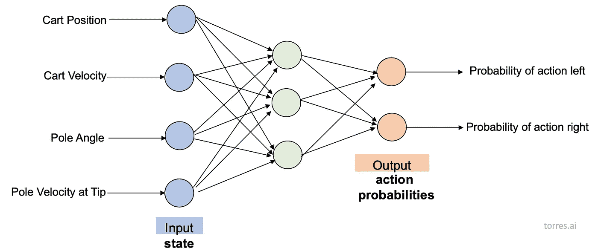
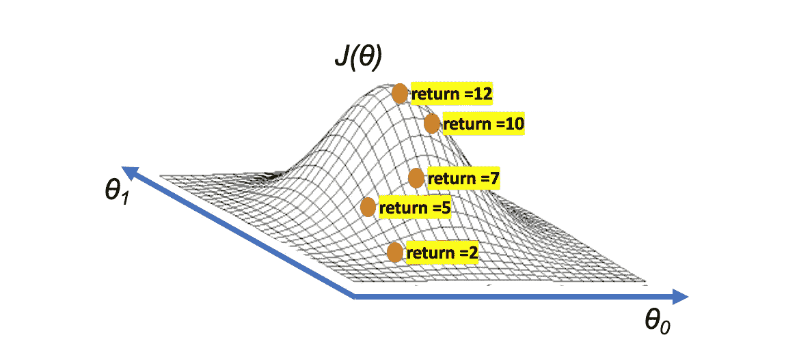
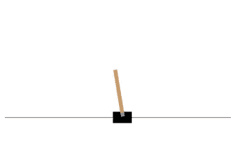
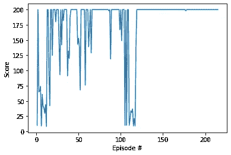
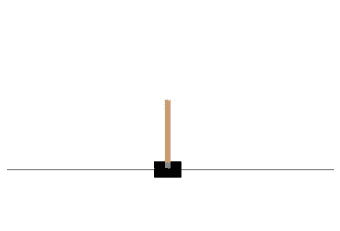

# 基于策略的方法

> 原文：<https://towardsdatascience.com/policy-based-methods-8ae60927a78d?source=collection_archive---------17----------------------->

## [深度强化学习讲解— 18](https://towardsdatascience.com/tagged/deep-r-l-explained)

## 爬山算法


这是一个新的帖子，专门介绍***[*深度强化学习讲解*](https://torres.ai/deep-reinforcement-learning-explained-series/)*系列。这里我们将介绍一类算法，允许我们近似策略函数π，而不是值函数(V 或 Q)。记住，我们将**策略**定义为告诉我们在每个状态下做什么的实体。也就是说，我们将训练一个输出行动值的网络，而不是训练一个输出行动(的概率)的网络，正如我们在第 6 篇文章中用一个例子[推进的那样。](/solving-a-reinforcement-learning-problem-using-cross-entropy-method-23d9726a737)****

# ****基于价值的方法综述****

****在以前的帖子中介绍的[值迭代](/the-value-iteration-algorithm-4714f113f7c5)和 [Q-learning](/deep-q-network-dqn-i-bce08bdf2af) 的中心主题是状态的值(用 V 表示)或状态-动作的值(用 Q 表示)。请记住，价值被定义为我们可以从一个州或通过从该州发布一个特定的行动收集的贴现总奖励。如果价值是已知的，每一步的决定就变得简单而明显:贪婪地考虑价值，这保证了在一集结束时有一个好的总回报。为了获得这些值，我们使用了[贝尔曼方程](/the-bellman-equation-59258a0d3fa7)，它通过下一步的值来表达当前步的值(它根据预测进行预测)。****

# ******基于政策的方法******

****强化学习最终是关于从与环境的交互中学习最优策略，用π*表示。到目前为止，我们一直在学习基于价值的方法，其中我们首先找到最佳行动价值函数 q*的估计，从中我们可以获得最佳策略π*。****

****对于小的状态空间，像[文章 1](/drl-01-a-gentle-introduction-to-deep-reinforcement-learning-405b79866bf4) 中介绍的冰湖例子，这个最优值函数 q*可以用一个表来表示，Q-table，每个状态一行，每个动作一列。在每一个时间步，对于一个给定的状态，我们只需要从表中拉出其对应的行，最优的动作就是具有最大值条目的动作。****

****但是对于具有更大状态空间的环境，比如前几篇文章中介绍的 Pong 环境，该怎么办呢？有大量的可能状态，这使得表格太大，在实践中没有用。因此，我们提出了如何用神经网络来表示最佳动作值函数 q*。在这种情况下，神经网络将环境状态作为输入，并将每个可能动作的值作为输出返回。****

****但重要的是要注意，在这两种情况下，无论我们使用表格还是神经网络，我们都必须首先估计最佳行动值函数，然后才能处理最佳策略π*。然后，一个有趣的问题出现了:我们能直接找到最优策略，而不必首先处理一个价值函数吗？答案是肯定的，完成这一任务的算法被称为基于策略的方法。****

****使用**基于价值的方法**，代理人利用其对环境的经验来维持对最佳行动价值函数的估计。然后从最佳动作值函数估计中获得最佳策略(例如，使用 e-greedy)。****

********

****基于价值的方法****

****相反，**基于策略的方法**直接从与环境的交互中学习最优策略，而不必维护单独的价值函数估计。****

********

****基于政策的方法****

****基于策略的方法的一个例子，在本系列的开始已经介绍过了，在第 6 篇文章[中介绍了交叉熵方法。我们介绍了一个策略，用𝜋(𝑎|𝑠表示)**，**表示代理应该对每个观察到的状态采取什么动作。在实践中，策略通常表示为动作(代理在给定状态下可以采取的动作)的概率分布，类的数量等于我们可以执行的动作的数量。我们称之为随机策略，因为它返回动作的概率分布，而不是返回单个确定性动作。](/solving-a-reinforcement-learning-problem-using-cross-entropy-method-23d9726a737)****

****与价值预测方法相比，基于政策的方法有一些优势，比如 DQN 在之前的三篇文章中提到的方法。一是，正如我们已经讨论过的，我们不再需要担心设计一个像ϵ一样的行动选择策略——贪婪政策；相反，我们直接从策略中抽取动作。这很重要。请记住，我们浪费了大量的时间来修正方法，以提高我们的 DQN 训练的稳定性。例如，我们必须使用经验回放和目标网络，在学术文献中还有其他几种方法可以帮助我们。政策网络有助于简化这种复杂性。****

# ****用神经网络逼近策略函数****

****在深度强化学习中，用神经网络来表示策略是很常见的(就像我们在 Post 6 中第一次做的那样)。让我们以本系列第 12 期文章中的[推车平衡问题](https://gym.openai.com/envs/CartPole-v0)为例，介绍我们如何用神经网络来表示策略。****

****请记住，在本例中，一辆小车位于沿水平轴的无摩擦轨道上，一根柱子固定在小车顶部。目标是通过向左或向右移动小车来防止杆倒下，并且不要从轨道上掉下来。****

****通过对手推车施加+1(左)或-1(右)的力来控制该系统。钟摆开始直立，目标是防止它翻倒。柱子保持直立的每个时间步提供+1 奖励，包括该集的最后一步。当柱子偏离垂直方向超过 15 度，或者手推车偏离中心超过 2.4 个单位时，该集结束。****

****该环境在每个时间点的观察空间是 4 个数字的阵列。在每个时间步，你可以观察它的位置，速度，角度和角速度。这些是这个世界的可观察状态。你可以在[这份文件](https://github.com/openai/gym/wiki/CartPole-v0)中查找这些数字分别代表什么。请注意小车速度和尖端极点速度的最小值(-Inf)和最大值(Inf)。由于数组中对应于这些索引的条目可以是任何实数，这意味着状态空间是无限的！****

****在任何状态下，小车只有两种可能的动作:*向左移动*或*向右移动*。换句话说，车极的状态空间有四维连续值，动作空间有一维两个离散值。****

****我们可以构建一个神经网络来逼近以一个状态作为输入的策略。在本例中，输出层将有两个节点，分别返回每个动作的概率。一般来说，如果环境具有离散的动作空间，如本例所示，输出层对于每个可能的动作都有一个节点，并且包含代理应该选择每个可能的动作的概率。****

********

****来源: [torres.ai](https://torres.ai)****

****使用网络的方法是代理提供当前的环境状态，然后代理从动作的概率(在本例中是左或右)中进行采样，以选择其下一个动作。****

****然后，目标是确定由***θ***(θ)表示的网络权重的适当值。 ***θ*** 对我们传入网络的每个状态进行编码，它返回最有可能选择最优行动的行动概率。所选择的行动会影响用来获得回报的回报。****

****记住代理人的目标永远是期望收益最大化。在我们的例子中，让我们将预期收益表示为 ***J*** 。主要思想是可以把预期收益 ***J*** 写成 ***θ的函数。*** 稍后我们将看到如何表达这种关系， ***J(θ)，*** 用一种更“数学”的方式来寻找使预期收益最大化的权重值。****

# ****无导数方法****

****在上一节中，我们已经看到了神经网络如何表示策略。这个神经网络中的权重最初被设置为随机值。然后，代理在与环境交互时更新权重。本节将概述优化这些权重的方法，即无导数方法，也称为零阶方法。****

****无导数方法直接在参数空间中搜索权重向量，以最大化通过策略获得的回报；通过仅评估参数空间的一些位置，而没有计算梯度的导数。让我们解释一下这一类别中最简单的算法，这将有助于我们稍后理解政策梯度方法如何工作，即爬山法。****

# ****爬山****

****[爬山](https://en.wikipedia.org/wiki/Hill_climbing)是一种迭代算法，可用于找到最优策略的权重 *θ* 。它是一个相对简单的算法，代理可以使用它在与环境交互的同时逐渐提高其策略网络中的权重 ***θ*** 。****

****顾名思义，直观地说，我们可以看到算法制定了一个到达一座山的最高点的策略，其中 ***θ*** 表示我们在给定时刻所处的坐标，G 表示我们在该点的高度:****

********

****爬山例子:代理的目标是最大化期望收益 j，这个例子的神经网络中的权重是 *θ = (θ1，θ2)。*****

****这个可视化的例子表示两个参数的函数，但是相同的思想可以扩展到两个以上的参数。该算法从对***【θ】****(随机权重集)的值的初始猜测开始。我们收集具有对应于那些权重 ***θ*** 的策略的单个剧集，然后记录返回 ***G*** 。*****

****这个返回是对表面在θ值的估计。这不会是一个完美的估计，因为我们刚刚收集的回报不太可能等于预期回报。这是因为由于环境中的随机性(以及政策，如果它是随机的)，如果我们收集第二集的 *θ* 值相同，我们很可能会得到不同的回报值*g*，但在实践中，即使(采样)回报不是预期回报估计的完美估计，但它通常证明是足够好的*。*****

*****在每一次迭代中，我们稍微扰动权重 *θ* 的当前最佳估计值(添加一点随机噪声)，以产生一组我们可以尝试的新的候选权重。这些新的权重然后被用于收集一集。为了看看这些新的权重有多好，我们将使用它们给我们的策略，再次与一集的环境进行交互，并累加回报。*****

****在增加新的权重，给我们比当前最佳估计更多的回报时，我们将注意力集中在新的价值上，然后我们只是重复迭代地提出新的政策，希望它们优于现有的政策。如果他们做得不好，我们就回到上一次对最优策略的最佳猜测，反复迭代，直到得到最优策略。****

****现在我们对爬山算法应该如何工作有了直观的理解，我们可以用下面的伪代码来总结它:****

1.  ****用随机权重 ***θ*** 初始化策略 **π******
2.  ****初始化 ***θbest*** (我们对权重的最佳猜测 ***θ*** )****
3.  ****初始化 ***Gbest*** (我们目前得到的最高回报 ***G*** )****
4.  ****用 ***θbest、*** 收集单集并记录返回的 ***G*******
5.  ****如果 ***G > Gbest*** 那么***θ最好* ← *θ*** 和 ***Gbest ← G*******
6.  ****给 ***的θbest*** 添加一点随机噪声，得到一组新的权重 ***θ*******
7.  ****重复步骤 4–6，直到解决环境问题。****

> ****在我们的例子中，我们假设一个表面只有一个最大值，其中爬山算法非常适合*。*注意， ***而不是*** 保证总是在具有多个局部最大值的曲面上产生最优策略的权重。这是因为如果算法开始于一个差的位置，它可能会收敛到较低的最大值。****

# ****编码爬山****

****本节将基于前面的伪代码探索应用于 [*小车*环境](/a-pair-of-interrelated-neural-networks-in-dqn-f0f58e09b3c4)的爬山实现。这里的神经网络模型非常简单，只使用了最简单的形状矩阵`**[4x2]**`(*state _ space x action _ space)，*不使用张量(不需要 PyTorch，甚至也不需要 GPU)。****

****本节介绍的代码可以在 GitHub 上找到[(而](https://github.com/jorditorresBCN/Deep-Reinforcement-Learning-Explained/blob/master/DRL_18_Policy_Based_Methods.ipynb)[可以使用这个链接](https://colab.research.google.com/github/jorditorresBCN/Deep-Reinforcement-Learning-Explained/blob/master/DRL_18_Policy_Based_Methods.ipynb)作为 Colab google 笔记本运行)。****

****在这篇文章中，由于它重复了我们一直在使用的许多东西，我们将不详细描述代码；我认为这是不言自明的。****

****和往常一样，我们将从导入所需的包开始，并创建环境:****

```
****import** **gym**
**import** **numpy** **as** **np**
**from** **collections** **import** deque
**import** **matplotlib.pyplot** **as** **plt**env = gym.make('CartPole-v0')**
```

****策略π(及其用随机权重 ***θ*** 初始化)可以编码为:****

```
****class** **Policy**():
    **def** __init__(self, s_size=4, a_size=2):
        *# 1\. Initialize policy π with random weights*
        self.θ = 1e-4*np.random.rand(s_size, a_size)  

    **def** forward(self, state):
        x = np.dot(state, self.θ)
        **return** np.exp(x)/sum(np.exp(x))

    **def** act(self, state):
        probs = self.forward(state)
        action = np.argmax(probs) *# deterministic policy*
        **return** action**
```

****为了可视化训练的效果，我们绘制了训练前后的权重 ***θ*** ，并呈现了代理如何应用策略:****

```
****def** watch_agent():
  env = gym.make('CartPole-v0')
  state = env.reset()
  rewards = []
  img = plt.imshow(env.render(mode='rgb_array'))
  **for** t **in** range(2000):
    action = policy.act(state)
    img.set_data(env.render(mode='rgb_array')) 
    plt.axis('off')
    display.display(plt.gcf())
    display.clear_output(wait=**True**)
    state, reward, done, _ = env.step(action)
    rewards.append(reward)
    **if** done:
        print("Reward:", sum([r **for** r **in** rewards]))
        **break** 
  env.close()policy = Policy()
print ("Policy weights θ before train:**\n**", policy.θ)
watch_agent()Policy weights θ before train:
 [[6.30558674e-06 2.13219853e-05]
 [2.32801200e-05 5.86359967e-05]
 [1.33454380e-05 6.69857175e-05]
 [9.39527443e-05 6.65193884e-05]]
Reward: 9.0**
```

********

****运行 collab 中的代码，您将能够看到代理如何处理横拉杆。****

****以下代码定义了训练代理的函数:****

```
****def** hill_climbing(n_episodes=10000, gamma=1.0, noise=1e-2):
    *"""Implementation of hill climbing.* 
 *Params*
 *======*
 *n_episodes (int): maximum number of training episodes*
 *gamma (float): discount rate*
 *noise(float): standard deviation of additive noise*
 *"""*
    scores_deque = deque(maxlen=100)
    scores = []

    *#2\. Initialize θbest* Gbest = -np.Inf
    *#3\. Initialize Gbest*
    θbest = policy.θ **for** i_episode **in** range(1, n_episodes+1):
        rewards = []
        state = env.reset()
        **while** **True**:
        *#4.Collect a single episode with θ,and record the return G*
            action = policy.act(state)
            state, reward, done, _ = env.step(action)
            rewards.append(reward)
            **if** done:
                **break** 
        scores_deque.append(sum(rewards))
        scores.append(sum(rewards))

        discounts = [gamma**i **for** i **in** range(len(rewards)+1)]
        G = sum([a*b **for** a,b **in** zip(discounts, rewards)])

        **if** G >= Gbest: *# 5\. If G>Gbest then θbest←θ & Gbest←G*
            Gbest = G
            θbest = policy.θ

        *#6\. Add a little bit of random noise to θbes
*        policy.θ = θbest + noise * np.random.rand(*policy.θ.shape)

        **if** i_episode % 10 == 0:
            print('Episode {}\tAverage Score: 
                  {:.2f}'.format(i_episode,   
                  np.mean(scores_deque)))

        *# 7\. Repeat steps 4-6 until Environment solved.* 
        **if** np.mean(scores_deque)>=env.spec.reward_threshold:
            print('Environment solved in {:d} episodes!\tAverage     
                   Score: **{:.2f}**'.format(i_episode, 
                   np.mean(scores_deque)))
            policy.θ = θbest
            **break**

    **return** scores**
```

****代码不需要太多的解释，因为它非常清楚，并且用相应的伪代码步骤进行了注释。也许要注意一些细节。例如，该算法寻求最大化*累积折扣奖励、*和*它在 Python 中看起来如下:*****

```
**discounts = [gamma**i **for** i **in** range(len(rewards)+1)]
G = sum([a*b **for** a,b **in** zip(discounts, rewards)])**
```

****请记住，爬山是一个简单的无梯度算法(即，我们不使用梯度上升/梯度下降方法)。我们试图通过仅改变目标函数 ***G*** 的自变量，权重矩阵 ***θ*** 来达到曲线的顶端，使用某个噪声来确定我们模式中的神经网络:****

```
**policy.θ = θbest + noise * np.random.rand(*policy.θ.shape)**
```

****与前面的一些例子一样，我们试图超过某个阈值来考虑解决的环境。对于 *Cartpole-v0* ，该阈值分数为`**195**`，用`env.spec.reward_threshold`表示。在我们用来写这篇文章的例子中，我们只需要 215 集来解决环境问题:****

```
**scores = hill_climbing(gamma=0.9)Episode 10	Average Score: 59.50
Episode 20	Average Score: 95.45
Episode 30	Average Score: 122.37
Episode 40	Average Score: 134.60
Episode 50	Average Score: 145.60
Episode 60	Average Score: 149.38
Episode 70	Average Score: 154.33
Episode 80	Average Score: 160.04
Episode 90	Average Score: 163.56
Episode 100	Average Score: 166.87
Episode 110	Average Score: 174.70
Episode 120	Average Score: 168.54
Episode 130	Average Score: 170.92
Episode 140	Average Score: 173.79
Episode 150	Average Score: 174.83
Episode 160	Average Score: 178.00
Episode 170	Average Score: 179.60
Episode 180	Average Score: 179.58
Episode 190	Average Score: 180.41
Episode 200	Average Score: 180.74
Episode 210	Average Score: 186.96Environment solved in 215 episodes!	Average Score: 195.65**
```

****使用下面的代码，我们可以绘制训练期间每集获得的分数:****

```
**fig = plt.figure()
plt.plot(np.arange(1, len(scores)+1), scores)
plt.ylabel('Score')
plt.xlabel('Episode #')
plt.show()**
```

********

****现在，在培训之后，我们再次绘制权重 ***θ*** 以及代理如何应用这一策略并显得更聪明:****

```
**print ("Policy weights θ after train:\n", policy.θ)
watch_agent()Policy weights θ after train:
 [[0.83126272 0.83426041]
 [0.83710884 0.86015151]
 [0.84691878 0.89171965]
 [0.80911446 0.87010399]]Reward: 200.0**
```

********

****运行 collab 中的代码，您将能够看到代理如何处理横拉杆****

> ****虽然在这个例子中，为了简单起见，我们编码了确定性策略，但是基于策略的方法可以学习随机或确定性策略，并且它们可以用于解决具有有限或连续动作空间的环境。****

# ****无梯度策略优化****

****爬山算法不需要可微或者甚至是连续的，但是因为它采取随机的步骤，这可能不会产生最有效的上山路径。在文献中有许多对这种方法的改进:自适应噪声缩放、最速上升爬山、随机重启、模拟退火、进化策略或交叉熵方法(在帖子 6 中介绍了[)。](/solving-a-reinforcement-learning-problem-using-cross-entropy-method-23d9726a737)****

****然而，这个问题的通常解决方案考虑**政策梯度方法**，该方法通过梯度上升来估计最优政策的权重。策略梯度方法是基于策略方法的一个子类，我们将在下一篇文章中介绍。****

# ****帖子摘要****

****在这篇文章中，我们介绍了基于策略的方法的概念。我们之所以考虑基于策略的方法，而不是基于价值的方法，有几个原因，因为基于价值的方法看起来工作得很好，就像我们在上一篇文章中看到的那样。主要是因为基于策略的方法直接解决手边的问题(估计最佳策略)，而不必存储额外的数据，即可能没有用的动作值。与基于值的方法相比，基于策略的方法的另一个优点是非常适合连续的动作空间。正如我们将在未来的帖子中看到的，与基于价值的方法不同，基于政策的方法可以学习真正的随机政策。****

****下一篇见[！](/policy-gradient-methods-104c783251e0)****

# ****深度强化学习讲解系列****

******由** [**UPC 巴塞罗那理工**](https://www.upc.edu/en) **和** [**巴塞罗那超级计算中心**](https://www.bsc.es/)****

****一个轻松的介绍性[系列](https://torres.ai/deep-reinforcement-learning-explained-series/)以一种实用的方式逐渐向读者介绍这项令人兴奋的技术，它是人工智能领域最新突破性进展的真正推动者。****

****[](https://torres.ai/deep-reinforcement-learning-explained-series/) [## 深度强化学习解释-乔迪托雷斯。人工智能

### 本系列的内容](https://torres.ai/deep-reinforcement-learning-explained-series/) 

# 关于这个系列

我在五月份开始写这个系列，那是在巴塞罗那的封锁期。老实说，由于封锁，在业余时间写这些帖子帮助了我 [**#StayAtHome**](https://twitter.com/hashtag/StayAtHome?src=hashtag_click) 。感谢您当年阅读这份刊物；它证明了我所做的努力。

**免责声明** —这些帖子是在巴塞罗纳被封锁期间写的，目的是分散个人注意力和传播科学知识，以防对某人有所帮助，但不是为了成为 DRL 地区的学术参考文献。如果读者需要更严谨的文档，本系列的最后一篇文章提供了大量的学术资源和书籍供读者参考。作者意识到这一系列的帖子可能包含一些错误，如果目的是一个学术文件，则需要对英文文本进行修订以改进它。但是，尽管作者想提高内容的数量和质量，他的职业承诺并没有留给他这样做的自由时间。然而，作者同意提炼所有那些读者可以尽快报告的错误。****