# 多任务/元学习中的策略梯度

> 原文：<https://towardsdatascience.com/policy-gradient-in-multi-task-meta-learning-2aeeaf23817d?source=collection_archive---------47----------------------->

## 这个故事介绍了多任务强化学习问题和策略梯度&它们的多任务/元对应物。第二部分介绍 Q-学习和多任务 Q-学习。这个故事是对课程'[斯坦福 CS330:多任务和元学习，2019 |第六讲—强化学习入门'](https://www.youtube.com/watch?v=UPT4Rndftc8&list=PLoROMvodv4rMC6zfYmnD7UG3LVvwaITY5&index=6)的简短总结。

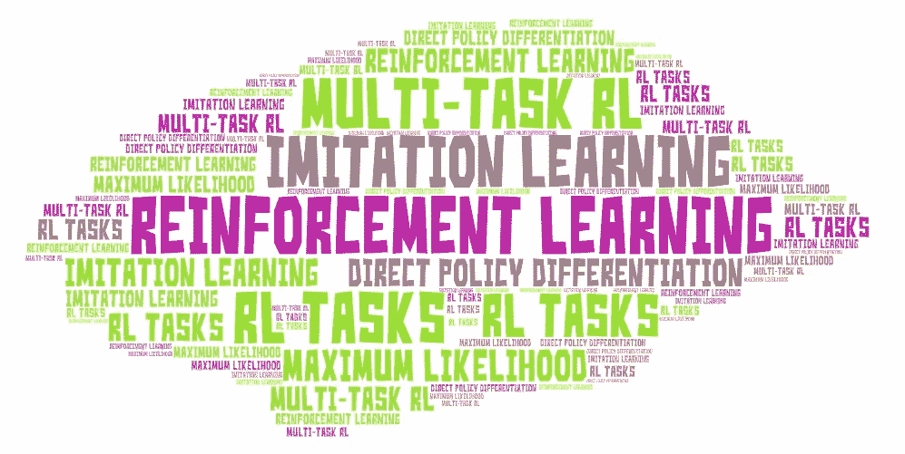

via [艺术字](https://wordart.com/)

什么时候不需要顺序决策？当您的系统正在做出一个单独的决策(例如分类、回归)，并且该决策不影响未来的输入或决策时，您不需要进行顺序决策。常见的应用领域包括机器人、语言和对话、自动驾驶、商业运营和金融。

这个故事将涵盖

*   多任务强化学习问题
*   策略梯度及其多任务/元对应物

这个故事的第二部分将涵盖 Q-学习和多任务 Q-学习。这个故事是课程' [Stanford CS330:多任务和元学习，2019 |第六讲—强化学习入门'](https://www.youtube.com/watch?v=UPT4Rndftc8&list=PLoROMvodv4rMC6zfYmnD7UG3LVvwaITY5&index=6)的简短总结。

# 多任务强化学习问题

在监督学习中，数据是 iid，我们需要一个大的带标签的、精选的数据集，而在顺序决策中，操作影响下一个状态而不是 iid，对于数据集，如何收集数据？有哪些标签？

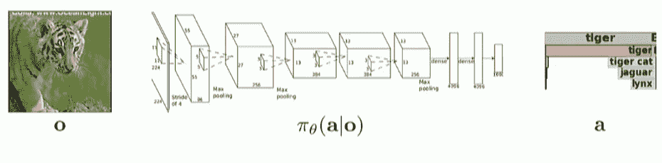

监督学习

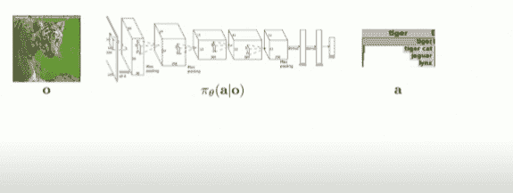

RL 设置。来源:[课程幻灯片](http://cs330.stanford.edu/slides/cs330_mtrl.pdf)

对于监督学习，我们有一个由θ参数化的函数π，它接受 o 并生成输出 a。例如，输入可以是图像，而输出可以是图像类(s.t. tiger)。在 RL 中，我们使用将采取行动的策略，这些行动将影响下一个状态。这将是一个从行动到观察的反馈循环，我们的类(a)将是行动，比如“逃跑”、“忽视”或“抚摸老虎”。o 表示代理(系统)作为输入接收的观察值，a 表示动作，π表示由θ参数化的策略。 ***通常我们假设世界 s 存在某种潜在状态，在完全观测的情况下，s 被观测到。在部分观察设置中，观察到 o。***

o 和 s 的具体区别是什么？例如，你试图追逐一只鬣狗，如果给你一张图像，那么这些图像将是一个观察 o，而相反，如果给你相应动物的姿势，那么这些姿势将是 s。你基本上能够完全观察到系统的潜在状态以及世界上对决策有影响的事情。

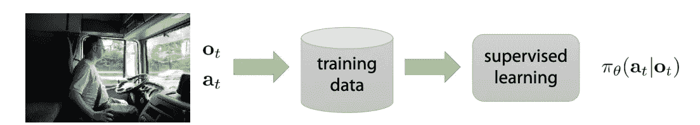

模仿学习。来源:[课程幻灯片](http://cs330.stanford.edu/slides/cs330_mtrl.pdf)

解决顺序决策问题的一个基本方法是将其视为监督学习(SL)问题。 比如**你想模仿某些专家**。[也许您可以收集一组驾驶数据](https://images.nvidia.com/content/tegra/automotive/images/2016/solutions/pdf/end-to-end-dl-using-px.pdf)，收集人们看到的观察结果，并收集他们在这些状态下采取的行动，将其放入一些大的训练数据集中，然后在监督学习期间从这些训练数据集中采样 iid，以训练您的策略根据观察结果预测行动。如果您有大量关于执行正确操作的专家数据，这种方法在某些情况下很有效。但是这些系统不以任何方式推理结果，而只是模仿数据在做什么。

在 RL 中，需要**奖励函数**。这些奖励函数应该捕捉什么样的状态和行为对系统更好或更坏。它通常接受状态和动作(`r(s,a)`)，并告诉我们哪些状态和动作更好。例如，如果我们在开车，如果我们开得平稳，我们可能会得到很高的奖励，如果我们发生车祸，我们会得到很低的奖励。

总的来说，状态`s`、行动`a`和回报`r(s,a)`，以及系统的动态`p(s'|s,a)`定义了一个**马尔可夫决策过程，**因为这包含了顺序决策问题的概念。

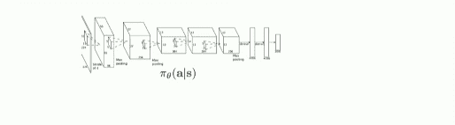

RL 示例。来源:[课程幻灯片](http://cs330.stanford.edu/slides/cs330_mtrl.pdf)

因此，强化学习的目标通常是学习作为输入的策略参数。 在这种情况下，我们将把完全观察到的设定值作为输入状态，并对动作做出预测。目标是了解政策的参数。在深度 RL 设置中，您的策略可能会被参数化为神经网络，其中状态作为输入被处理，动作作为输出。行动反馈给世界，然后世界给你下一个状态，反馈给你的政策。

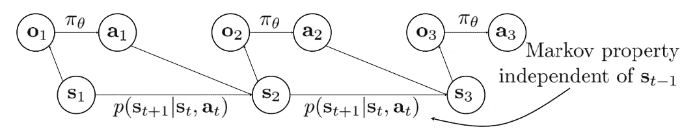

RL 图形模型。来源:[课程幻灯片](http://cs330.stanford.edu/slides/cs330_mtrl.pdf)

实际上，我们可以将系统描述为图形模型，其中我们有一个策略，它接受观察并产生一个动作(部分观察的设置)，动态接受当前状态，当前动作产生下一个状态的分布。 ***动态函数独立于前一状态，这就是所谓的马尔可夫性质。*** 基本上一个 ***马尔可夫决策过程*** 中的一个状态的定义就是 ***你可以从那个状态变量中的信息独立于之前的状态来完全定义奖励函数和动力学。*** 你看这里的图，只取决于 St 和 at，不取决于 st-1。

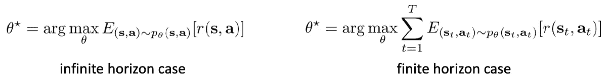

无限/有限视野情况下的 RL 目标。来源:[课程幻灯片](http://cs330.stanford.edu/slides/cs330_mtrl.pdf)

RL 的具体目标是最大化政策下的期望报酬。在无限期的情况下，我们希望在平稳分布下最大化回报函数，平稳分布在政策产生的状态和行动上。在有限范围的情况下，我们可能有一些范围资本 T，当推出我们的政策时，您希望最大化州和行动的回报。

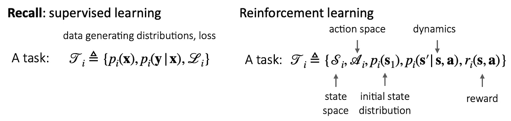

SL 任务和 RL 任务

我们已经讨论了 RL 问题，那么 RL 的任务是什么呢？*如果将 RL 与监督学习设置进行比较，初始状态分布和动态基本上与数据生成分布相同。回报函数对应于损失函数，状态和行为空间只是告诉你，你的状态和行为所处的一般集合。*所以这只是作为一个马尔可夫决策过程。但是如果不同的 MDP 是不同的任务，那么这就不仅仅是任务的语义意义了。因为不同的任务可能有相同的确切奖励函数，但有不同的行动空间或不同的动态。因此，我们不严格地使用术语“任务”来描述这些不同的马尔可夫决策过程。

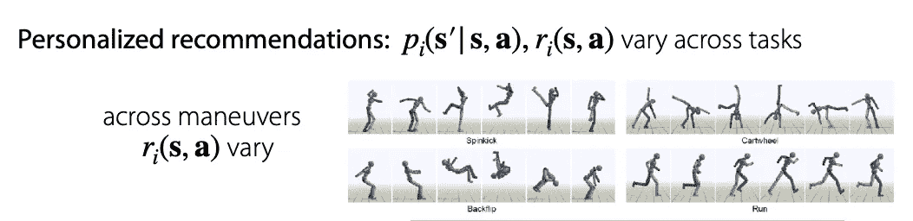

个性化推荐和跨策略。来源:[课程幻灯片](http://cs330.stanford.edu/slides/cs330_mtrl.pdf)

如何在元学习中应用 RL？**的一个应用是个性化推荐，**不同的人有不同的任务。动力对应于那个人将如何对你采取的特定行动作出反应，奖励函数对应于你是否在一个好的状态下向结果推荐一些东西。在某些情况下，初始状态分布也可能因人而异，这取决于你如何表述你的问题。另一个应用是跨机动，例如，跨不同机动在计算机图形中制作不同角色的动画。如果你把这当成一个多任务学习问题，不同的任务在环境中会有不同的奖励函数，但是动力是一样的，状态和动作空间也是一样的。

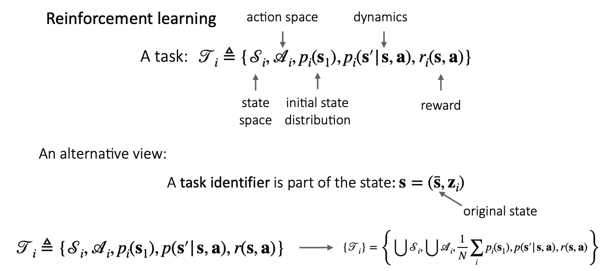

RL 的另类观点。来源:[课程幻灯片](http://cs330.stanford.edu/slides/cs330_mtrl.pdf)

查看多任务 RL 的另一种方法如下。 ***我们通常有某种任务标识符，它是状态的一部分，这是使它成为完全可观察的设置或完全可观察的 MDP*** 所必需的。s 条表示原始状态，zi 表示任务标识符。基本上，任务被视为标准的马尔可夫决策过程，其中状态空间和动作空间是原始任务中的状态空间和动作空间的并集。初始状态分布恰好对应于初始状态分布上的混合分布。对于这些任务中的每一个，动态和奖励函数是单个动态和单个奖励函数，其将任务标识符作为输入，并产生下一个状态或奖励。所以你基本上可以应用标准的单任务 RL 算法来解决多任务问题。

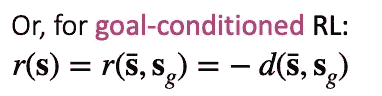

以目标为条件的强化学习的奖励函数

**多任务 RL** 与单任务 RL 问题相同，**除了任务标识符是状态的一部分(s = (s bar，zi))。**例如，任务标识符可以是一次性任务 ID、任务的语言描述或您想要达到的目标状态。*这个* ***目标状态*** *会被称为* ***目标制约 RL*** *其中你把它限制在你希望将来能够达到的特定状态*。**奖励函数可以与之前的相同** w *这里，它将任务 id 作为输入，并输出对应于该状态的任务的奖励函数，或者对于像目标条件 RL 这样的事情，它可以简单地对应于您的(原始)当前状态和目标状态之间的负距离。*距离函数的一些例子可以是某个潜在空间中的欧几里德距离或稀疏 0/1，其中 1 表示 s 条等于 sg，0 表示不相等。如果这仍然是标准的马尔可夫决策过程，那么为什么不应用标准的 RL 算法呢？你可以，但这将比单独的任务更具挑战性，因为你将有更广泛的事情要做。

# 策略梯度及其多任务/元对应项

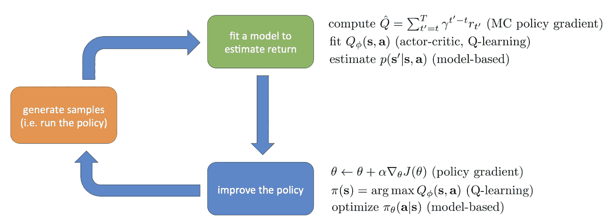

强化学习算法的剖析。来源:[课程幻灯片](http://cs330.stanford.edu/slides/cs330_mtrl.pdf)

*您通常可以在下面的流程图中查看 RL 算法，我们首先在环境中生成样本，这通常只是向前运行策略，然后我们拟合一些模型来估计回报，然后我们使用该模型来改进策略。* *不同的算法通常只对应这个绿框和这个蓝框的差异*。例如，拟合模型的一个例子可能是估计经验回报，如使用蒙特卡罗政策梯度。估计回报的另一个例子可能是尝试拟合 Q 函数，例如使用动态编程算法。拟合模型的另一个例子是估计模拟动态的函数。例如，一旦我们有了这些模型，我们就可以将策略梯度应用于我们的策略参数，我们可以通过取当前 Q 函数的最大 Q 值来改进策略，或者在基于模型的算法的情况下，我们可以通过将模型反向传播到策略中来优化策略。

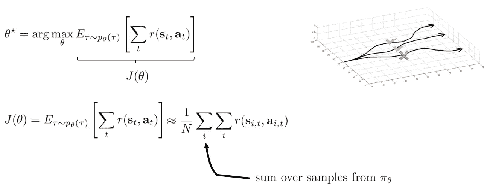

评估目标。来源:[课程幻灯片](http://cs330.stanford.edu/slides/cs330_mtrl.pdf)

所以先说政策梯度。以上是我们在 RL 中的目标，所以我们希望能够从我们的策略中采样轨迹并估计回报。我们将这个目标称为θ的 J。我们可以重写θ的 J。例如，您可以将此视为或估计为滚动和轨迹，如右图所示，这是计算每个轨迹的奖励，可能第一个轨迹的奖励高，中间轨迹的奖励中等，最后一个轨迹的奖励差。 ***第一个总和是我们策略中样本的总和，第二个总和是一段时间的总和。***

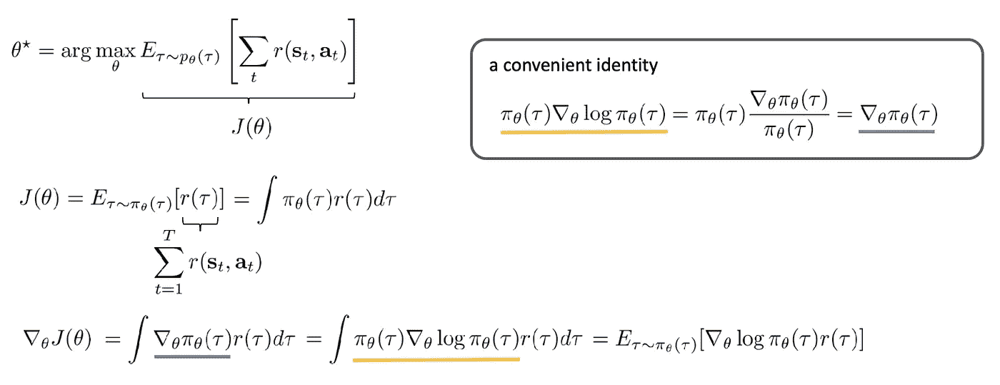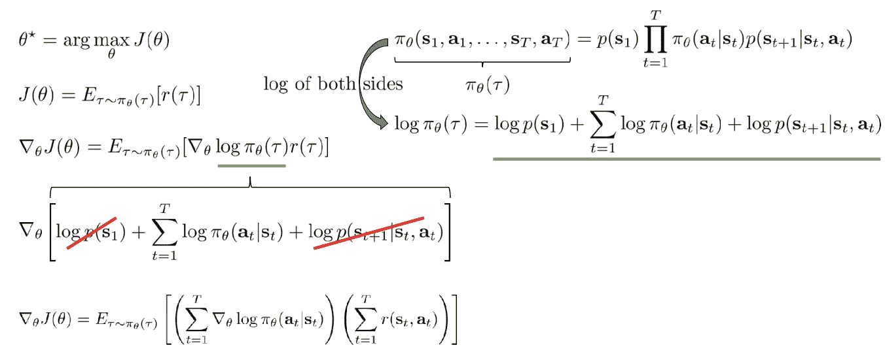

直接政策分化。来源:[课程幻灯片](http://cs330.stanford.edu/slides/cs330_mtrl.pdf)

***我们能否将这一目标直接转化为我们的政策？*** 所以*如果我们的目标是预期收益，我们可以用轨迹*的收益来估计。你可以把这个期望看作π θ上的积分，因为这个期望是关于τ的π θ的。如果您想要计算该目标相对于我们的政策参数的梯度，您可以*将梯度移入积分中，因为这是一个线性操作，然后您基本上就有了政策乘以回报函数的梯度在轨迹上的积分*。我们如何评估这个梯度呢？我们不需要对所有可能的轨迹进行积分。所以我们打算 ***使用似然比技巧。*两个π被抵消，它等于π的梯度或策略的梯度与策略参数的比值。在应用方便的恒等式之后， ***我们可以简单地评估梯度，或者通过对从我们的策略中采样的轨迹进行期望来估计梯度，并使用这些样本来评估我们的策略的对数概率的梯度，该对数概率由该轨迹的回报进行加权。***π的完整轨迹可以分解为初始态密度乘以一个随时间乘积的政策概率和动力学概率。经过计算，最终的梯度是我们可以评估的。**

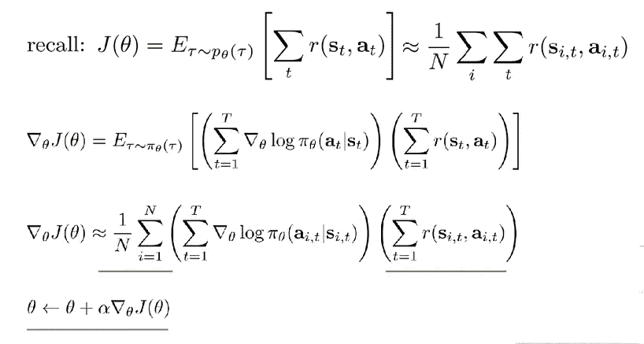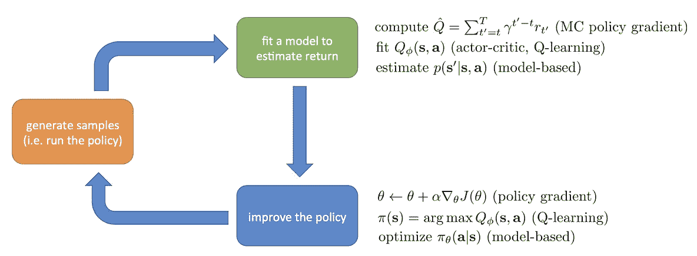

评估政策梯度。来源:[课程幻灯片](http://cs330.stanford.edu/slides/cs330_mtrl.pdf)

我们基本上可以排除我们的策略来获得轨迹，然后通过在 log π乘以奖励函数的时间内对这些轨迹进行平均来估计策略梯度，然后将梯度应用于我们的策略参数。如果我们回到图中，收集数据对应于橙色框(对应于右侧公式中的橙色下划线部分)，评估回报对应于绿色框(对应于绿色下划线部分)，在最后一步中实际使用它来改进策略对应于蓝色框(对应于蓝色下划线部分)。 ***增强算法是从您的策略中显式采样轨迹，然后使用这些轨迹计算梯度，然后使用估计的梯度更新您的策略参数。然后你可以重复这一步来迭代改进你的策略*** 。

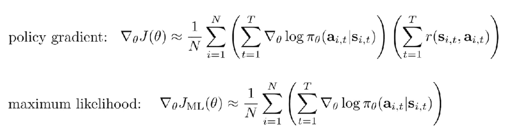

与最大似然比较。来源:[课程幻灯片](http://cs330.stanford.edu/slides/cs330_mtrl.pdf)

这与模仿学习，如专家行动的最大可能性相比如何？ ***最大似然目标看起来非常类似于*** 的策略形式。特别是，区别在于右边的奖励项。所以基本上政策梯度将对应于最大化有高回报的行动的概率。如果他们有一个低回报，那么你将试图最大化它本质上更少。因为它基本上是一种梯度下降算法，所以很容易将多任务学习算法应用于它。

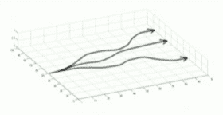

来源:[课程幻灯片](http://cs330.stanford.edu/slides/cs330_mtrl.pdf)

如果我们进行最大似然模仿学习，我们只是试图模仿最佳轨迹，而在政策梯度中，我们在这些轨迹上有一些分布，然后我们将试图增加具有高回报的行动的概率，并在具有低回报的行动上放置较少的概率质量。因此，我们基本上只是让好的东西更有可能，让坏的东西得到坏的回报的可能性更小，并使“试错”的概念正式化。

这就是政策梯度。这很容易与多任务学习结合起来。它也很容易与元学习结合起来。元学习算法(如 MAML 和黑盒方法)假设你可以得到你的目标的一些梯度。因此，我们可以很容易地将这些算法与策略梯度算法结合使用。

例如，让我们把 MAML 和政策梯度结合起来。有两个任务:向前跑和向后跑。我们不以任何方式评价泛化。我们只是要看看它是否能学会用一个单一的梯度步长来适应这两个任务中的一个。

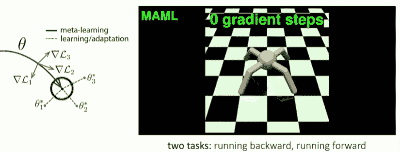

在元学习结束时，但在对其中一个任务采取梯度步骤之前，我们得到了一个看起来正确的策略:原地运行，准备向两个方向中的任何一个方向运行。来源:[课程幻灯片](http://cs330.stanford.edu/slides/cs330_mtrl.pdf)

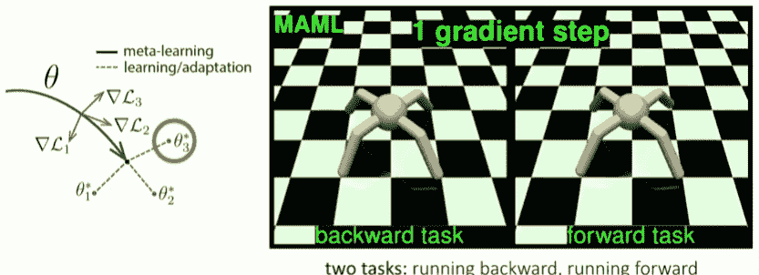

如果我们对具有向后/向前运行的奖励函数的任务取一个梯度，我们得到在相应方向上运行的策略。来源:[课程幻灯片](http://cs330.stanford.edu/slides/cs330_mtrl.pdf)

上面的例子表明，存在一种表示，在这种表示下，RL 是快速和有效的。

我们还可以结合黑盒元学习和政策梯度。这是迷宫的例子。这个实验是学习走迷宫，它在 1000 个小迷宫上训练，在伸出的小迷宫和大迷宫上测试。

在这种情况下，它不知道任务，它需要在迷宫中导航。左边是代理人的观点，右边是迷宫。在它获得经验之后，它就能够学习如何用基本上只有一条轨迹的方法来解决迷宫。所以首先在迷宫中导航探索，然后在这一集结束时，建筑的记忆不会被重置。来源:[课程幻灯片](http://cs330.stanford.edu/slides/cs330_mtrl.pdf)

MAML 在监督学习环境中很有表现力，但由于策略梯度，它在 RL 中实际上不是很有表现力。基本上，如果你所有轨迹的回报函数都是 0，那么你的梯度将永远是 0。因此，即使它在零回报的情况下获得了大量丰富的环境经验，它实际上也无法将这些经验融入到政策的更新中。因此， ***带有政策梯度的 MAML 实际上并不是很有表现力。*** *一般来说，这些针对 RL 设置的元学习算法很容易与策略梯度相结合，将它们与 Q-learning 和 actor-critic 算法等方法相结合则更具挑战性*。

# 汇总策略梯度

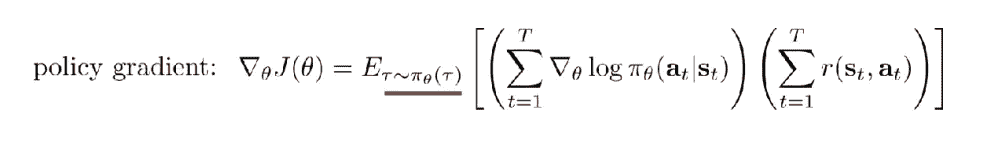

政策梯度。来源:[课程幻灯片](http://cs330.stanford.edu/slides/cs330_mtrl.pdf)

**策略梯度方法简单**且**易于与现有的多任务和元学习算法**相结合。但是**它产生了一个高方差梯度，**它可以用基线或信赖域来减轻。政策梯度的另一个缺点是**它需要政策数据**。你可以看到对ωθ的期望，ωθ是你当前的政策。因此，为了改进您的策略，您需要来自您当前策略的数据。这真的很重要，因为这意味着你不能重复使用以前政策中的任何数据来试图改进你的政策。结果，这些算法往往比能够重用来自先前策略和其他经验等的数据的其他算法的样本效率低。像重要性权重这样的东西可以对此有所帮助。因此，您基本上可以添加一个权重，该权重对应于您当前的策略与您用来收集数据的策略之间的比率。但是这些重要性权重也给了你很高的方差，特别是当这两个策略非常不同时。

# 参考

1.  [斯坦福 CS330:多任务和元学习，2019 |讲座 6 —强化学习入门’](https://www.youtube.com/watch?v=UPT4Rndftc8&list=PLoROMvodv4rMC6zfYmnD7UG3LVvwaITY5&index=6)。
2.  T [他航向滑梯](http://cs330.stanford.edu/slides/cs330_mtrl.pdf)
3.  [自动驾驶汽车的端到端学习](https://images.nvidia.com/content/tegra/automotive/images/2016/solutions/pdf/end-to-end-dl-using-px.pdf)
4.  [用于深度网络快速适应的模型不可知元学习](https://arxiv.org/abs/1703.03400)
5.  [一个简单的神经注意力元学习者](https://arxiv.org/abs/1707.03141)