# 政策梯度方法

> 原文：<https://towardsdatascience.com/policy-gradient-methods-104c783251e0?source=collection_archive---------2----------------------->

## [深度强化学习讲解— 19](https://towardsdatascience.com/tagged/deep-r-l-explained)

## 强化算法


这是一个新帖子，专门介绍**的【梯度法】、*、*、[、*深度强化学习讲解*、](https://torres.ai/deep-reinforcement-learning-explained-series/)、*、*系列。策略梯度方法是基于策略方法的一个子类，通过**梯度上升来估计最优策略的权重。****

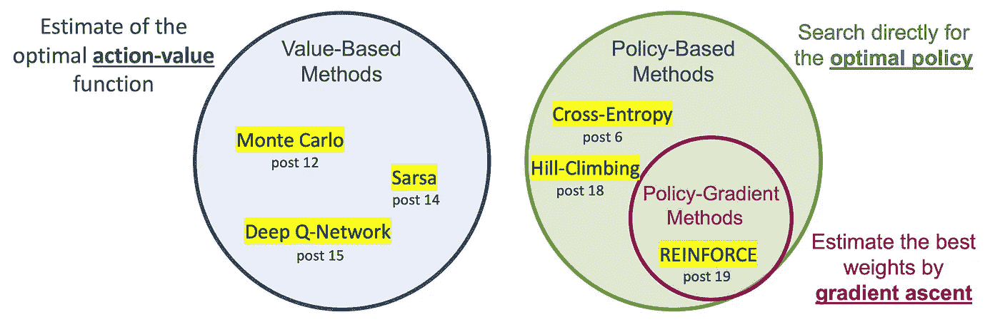

本系列中介绍的强化学习方法的总结。分类是基于我们是否想要对价值或策略建模(来源: [https://torres.ai](https://torres.ai) )

直观地说，梯度上升始于对使预期回报最大化的政策权重值的初步猜测，然后，算法评估指示预期回报函数最陡增长方向的点处的梯度，因此我们可以在该方向上迈出一小步。我们希望最终得到一个新的政策权重值，这个值的预期收益函数值会稍微大一点。然后，该算法重复评估梯度和采取步骤的过程，直到它认为最终达到了最大预期回报。

> [本出版物的西班牙语版本](https://medium.com/aprendizaje-por-refuerzo/10-m%C3%A9todos-policy-based-reinforce-2f13c11b290f)

[](https://medium.com/aprendizaje-por-refuerzo/10-m%C3%A9todos-policy-based-reinforce-2f13c11b290f) [## 10.梅托多斯基于政策:加强

### 获得第 10 版图书介绍

medium.com](https://medium.com/aprendizaje-por-refuerzo/10-m%C3%A9todos-policy-based-reinforce-2f13c11b290f) 

# 介绍

尽管我们在[之前的文章](/policy-based-methods-8ae60927a78d)中编写了确定性策略，但是基于策略的方法可以学习随机或确定性策略。对于随机策略，我们的神经网络的输出是表示概率分布的动作向量(而不是返回单个确定性动作)。

在这篇文章提出的新方法中，我们将遵循的策略是从这个概率分布中选择一个动作。这意味着，如果我们的代理两次处于相同的状态，我们可能不会每次都采取相同的行动。将动作表示为概率有许多优点，例如平滑表示的优点:如果我们稍微改变我们的网络权重，神经网络的输出就会改变，但可能只是一点点。

在确定性策略的情况下，利用离散数字输出，即使对权重进行小的调整也可能导致跳转到不同的动作。但是，如果输出是概率分布，则权重的小变化通常会导致输出分布的小变化。这是一个非常重要的属性，因为梯度优化方法都是关于调整模型的参数来改善结果。

但是如何改变网络的参数来改进策略呢？如果你还记得第 6 篇的[文章，我们使用交叉熵方法解决了一个非常相似的问题:我们的网络将观察结果作为输入，并返回行动的概率分布。事实上，交叉熵方法在某种程度上是我们将在本文中介绍的方法的初级版本。](/cross-entropy-method-performance-analysis-161a5faef5fc)

政策梯度背后的关键思想是**强化好的行为:**提高导致更高回报的行为的概率，降低导致更低回报的行为的概率，直到你达到最优政策。策略梯度方法将迭代地修改策略网络权重(平滑更新)，以使导致正回报的状态-动作对更有可能，并使导致负回报的状态-动作对更不可能。

为了介绍这个想法，我们将从政策梯度方法的一个普通版本(基本版本)开始，称为**强化算法** ( [原文](http://www-anw.cs.umass.edu/~barto/courses/cs687/williams92simple.pdf))。该算法是基本的策略梯度算法，几乎所有的高级策略梯度算法都基于该算法。

# 强化:数学定义

让我们来看看算法的更数学的定义，因为这将有助于我们在后面的文章中理解最先进的算法。

## 轨道

我们需要定义的第一件事是一个**轨迹**，只是一个状态-行动-奖励序列(但是我们忽略了奖励)。轨迹比一集更灵活一点，因为它的长度没有限制；它可以对应于完整的一集或只是一集的一部分。我们用大写 ***H*** 表示长度，其中 ***H*** 代表*视界*，用 ***τ*** 表示轨迹:

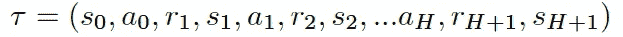

加强方法建立在**轨迹而不是事件**上，因为最大化轨迹(而不是事件)上的预期回报使该方法能够为事件和连续任务搜索最佳策略。

虽然对于绝大多数情节任务来说，只有在情节结束时才会给予奖励，但仅仅使用完整的情节作为轨迹是有意义的；否则，我们没有足够的回报信息来有意义地估计预期收益。

## 轨迹的返回

我们用***(τ)、*** 来表示轨迹 ***τ*** 的**返回** **，并将其计算为该轨迹 ***τ:*** 的总回报**

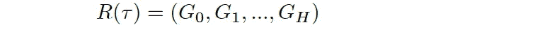

参数 ***Gk*** 称为总收益，或未来收益，在时间步长 ***k*** 为过渡 ***k***

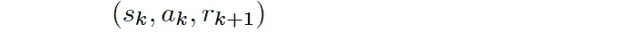

这是我们期望从时间步 *k* 直到轨迹结束时收集的回报，并且可以通过使用 gamma *γ:* 将剧集中某个状态直到剧集结束时的回报相加来近似得到

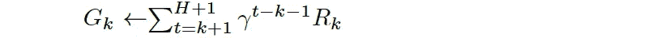

## 预期收益

请记住，该算法的目标是找到使我们用***【θ】***表示的**预期收益**最大化的神经网络的权重 ***θ*** ，并且可以定义为:

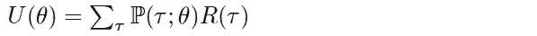

为了查看它如何对应于预期回报，请注意，我们已经将回报 *R* ( *τ* )表示为轨迹 *τ* 的函数。然后，我们计算加权平均值，其中权重由P( *τ* 给出； *θ* )，每个可能轨迹的概率，返回 *R* ( *τ* )可以取的所有可能值。请注意，概率取决于神经网络中的权重 *θ* ，因为 *θ* 定义了用于选择轨迹中的动作的策略，这也在确定代理观察的状态中起作用。

## 梯度上升

正如我们已经介绍的，确定最大化***【θ】***函数的 ***θ*** 值的一种方法是通过**梯度上升**。

相当于[上一篇文章](/policy-based-methods-8ae60927a78d)中介绍的爬山算法，我们可以直观地看到，梯度上升制定了一个到达一座山的最高点的策略，***【θ】***，只是在梯度的方向上迭代地迈出小步:

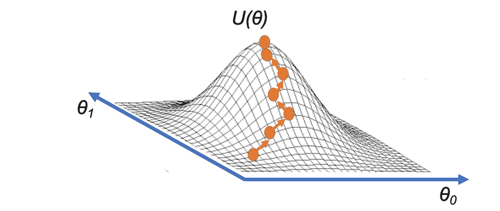

来源: [https://torres.ai](https://torres.ai)

数学上，我们的梯度上升的更新步骤可以表示为:

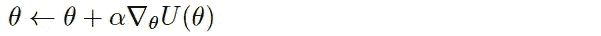

其中 *α* 是一般允许随时间衰减的步长(相当于深度学习中的学习率衰减)。一旦我们知道如何计算或估计这个梯度，我们可以重复应用这个更新步骤，希望 *θ* 收敛到使 *U* ( *θ* )最大化的值。

> **梯度上升**与**梯度下降**密切相关，不同之处在于梯度下降旨在寻找函数的**最小值**(朝**负梯度方向的步长)**，而梯度上升将寻找**最大值(**朝**梯度方向的步长)**。我们将在 PyTorch 的代码中使用这种方法。

## 抽样和估计

为了应用这种方法，我们将需要能够计算梯度∇*u*(*θ*)；然而，我们将无法计算出梯度的精确值，因为这在计算上过于昂贵，因为为了精确计算梯度，我们将不得不考虑每一个可能的轨迹，这在大多数情况下成为一个棘手的问题。

该方法不是这样做，而是使用该策略对轨迹进行采样，然后仅使用这些轨迹来估计梯度。这种抽样相当于本系列文章第 13 篇[中介绍的蒙特卡洛方法，因此，方法强化也被称为蒙特卡洛策略梯度。](/monte-carlo-methods-9b289f030c2e)

## 伪代码

总之，更详细地描述该方法行为的伪代码可以写成:

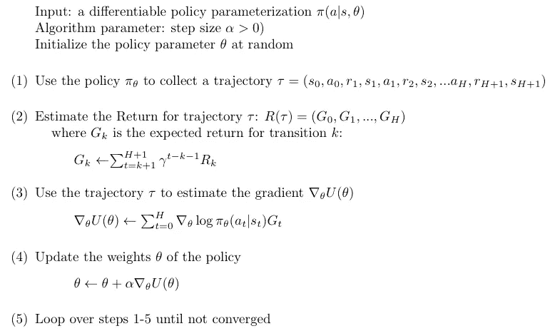

## 梯度估计公式

让我们更仔细地看看伪代码中步骤 3 的等式，以便理解它。我们首先做一些简化的假设，例如，假设这对应于一个完整的情节。

记住 *R* ( *τ* )只是每个时间步从轨迹 *τ* (唯一一条轨迹)得到的累计奖励。假设在时间步 *t* 的奖励信号和我们正在处理的样例游戏，如果我们赢了游戏，给代理一个正 1 的奖励( *Gt* =+1)，如果我们输了，给代理一个负 1 的奖励( *Gt* =-1)。另一方面，这个术语

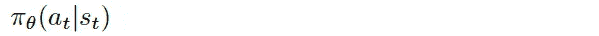

查看代理在时间步长**中从状态***st*** 选择动作*的概率。记住带下标 *θ* 的 *π* 是指由 *θ* 参数化的策略。然后，完整的表达式取该概率的*对数*的梯度为***

**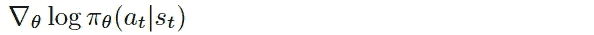**

**这将告诉我们，如果我们想要增加从状态****【ST】***在 选择动作 ***的*日志概率，我们应该如何改变策略 *θ* 的权重。具体来说，假设我们通过朝着这个梯度的方向迈出一小步来推动政策权重。在这种情况下，它将增加从该状态选择动作的 *log* 概率，如果我们向相反的方向前进，将降低 log 概率。*******

以下等式将为每个状态-动作对一次完成所有这些更新，轨迹中的 *处的 ***和* ***处的*** *，*处的每个时间步长*:****

*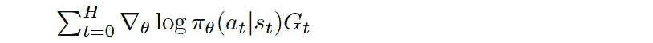*

*要看到这种行为，假设代理赢得了该集。然后， *Gt* 只是一个正的(+1)，sum 做的是把我们应该介入的所有梯度方向加起来，以增加选择每个状态-动作对的 *log* 概率。这相当于只采取 *H+1* 个同步步骤，其中每个步骤对应于轨迹中的一个状态-动作对。*

*相反，如果代理丢失， *Gt* 变为负值，这确保了该方法不是在对数概率最陡增加的方向上步进，而是在最陡减少的方向上步进。*

> *如何推导近似梯度的方程的证明可以安全地跳过，我们更感兴趣的是这个表达式的意义。*

## *为什么优化对数概率而不是概率*

*在梯度法中，我们可以制定一些应该最大化的概率 **𝑝** ，实际上我们将优化对数概率 **log𝑝** 而不是概率 ***p*** 用于一些参数𝜃.*

*原因是，一般来说，更好地优化 log𝑝(𝑥)比𝑝(𝑥)由于 log𝑝(𝑥)的梯度一般更*良好*。请记住，根据定义，概率受 0 和 1 的限制，因此优化器可以操作的值的范围有限且很小。*

*在这种情况下，有时概率可能非常小或非常接近于 1，当在数值精度有限的计算机上进行优化时，这会遇到数值问题。如果我们改为使用替代目标，即 *log p* (自然对数)，我们有一个比原始概率空间具有更大“动态范围”的目标，因为概率空间的 log 范围从(-∞，0)，这使得 log 概率更容易计算。*

# *编码增强*

*现在，我们将探索一个增强的实现来解决 OpenAI 健身房的 [*侧翻*环境](/a-pair-of-interrelated-neural-networks-in-dqn-f0f58e09b3c4)。*

> *这篇文章的[完整代码可以在 GitHub](https://github.com/jorditorresBCN/Deep-Reinforcement-Learning-Explained/blob/master/DRL_19_REINFORCE_Algorithm.ipynb) 上找到，并且[可以使用这个链接](https://colab.research.google.com/github/jorditorresBCN/Deep-Reinforcement-Learning-Explained/blob/master/DRL_19_REINFORCE_Algorithm.ipynb)作为一个 Colab google 笔记本运行。*

## *初始化*

*首先，我们将用下面几行代码导入所有必需的包:*

```
***import** **numpy** **as** **np**
**import** **torch**
**import** **gym**
**from** **matplotlib** **import** pyplot **as** plt*
```

*还有露天健身房的钢管舞环境:*

```
*env = gym.make('CartPole-v0')*
```

## *政策网络*

*我们将建立一个神经网络作为政策网络。策略网络将接受状态向量作为输入，并且它将在可能的动作上产生(离散的)概率分布。*

```
*obs_size = env.observation_space.shape[0] 
n_actions = env.action_space.n  
HIDDEN_SIZE = 256model = torch.nn.Sequential(
             torch.nn.Linear(obs_size, HIDDEN_SIZE),
             torch.nn.ReLU(),
             torch.nn.Linear(HIDDEN_SIZE, n_actions),
             torch.nn.Softmax(dim=0)
     )*
```

*该模型只有两个线性层，第一层是 ReLU 激活函数，最后一层是 Softmax 函数。默认情况下，初始化使用随机权重)。*

```
*print (model)*
```

*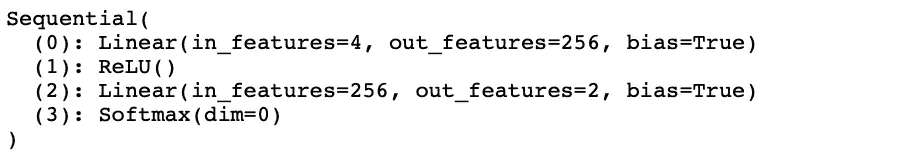*

*根据神经网络的结果，代理从概率分布中采样，以采取将在环境中执行的动作。*

```
*act_prob = model(torch.from_numpy(curr_state).float())
action = np.random.choice(np.array([0,1]),p=act_prob.data.numpy())
prev_state = curr_state
curr_state, _, done, info = env.step(action)*
```

*这段代码的第二行从第一行获得的策略网络产生的概率分布中抽取一个动作。然后在这段代码的最后一行，代理采取了行动。*

## *训练循环*

*训练循环通过更新参数 *θ* 来训练策略网络，以遵循上一节中描述的伪代码步骤。*

*首先，我们定义优化器并初始化一些变量:*

```
*learning_rate = 0.003
optimizer = torch.optim.Adam(model.parameters(), lr=learning_rate)Horizon = 500
MAX_TRAJECTORIES = 500
gamma = 0.99
score = []*
```

*其中`learning_rate`是步长 *α* ，`Horizon`是前面伪代码*中的 *H* ，`gamma`是 *γ* 。*使用这些变量，迭代次数由`MAX_TRAJECTORIES`定义的主循环编码为:*

```
***for** trajectory **in** range(MAX_TRAJECTORIES):
    curr_state = env.reset()
    done = **False**
    transitions = [] 

    **for** t **in** range(Horizon):
        act_prob = model(torch.from_numpy(curr_state).float())
        action = np.random.choice(np.array([0,1]), 
                 p=act_prob.data.numpy())
        prev_state = curr_state
        curr_state, _, done, info = env.step(action) 
        transitions.append((prev_state, action, t+1)) 
        **if** done: 
            **break**
    score.append(len(transitions))
    reward_batch = torch.Tensor([r **for** (s,a,r) **in** 
                   transitions]).flip(dims=(0,))     batch_Gvals =[]
    **for** i **in** range(len(transitions)):
        new_Gval=0
        power=0
        **for** j **in** range(i,len(transitions)):
             new_Gval=new_Gval+
                      ((gamma**power)*reward_batch[j]).numpy()
             power+=1
        batch_Gvals.append(new_Gval)
    expected_returns_batch=torch.FloatTensor(batch_Gvals)
    expected_returns_batch /= expected_returns_batch.max() state_batch = torch.Tensor([s **for** (s,a,r) **in** transitions]) 
    action_batch = torch.Tensor([a **for** (s,a,r) **in** transitions])    pred_batch = model(state_batch) 
    prob_batch = pred_batch.gather(dim=1,index=action_batch
                 .long().view(-1,1)).squeeze() 

    loss= **-**torch.sum(torch.log(prob_batch)*expected_returns_batch) 

    optimizer.zero_grad()
    loss.backward()
    optimizer.step()*
```

*使用`score`列表，我们将跟踪训练时间内的轨迹长度。对于当前轨迹的事务，我们跟踪列表`transactions`中的动作和状态。*

*接下来，我们计算每笔交易的预期回报(前面清单中的代码片段):*

```
*batch_Gvals =[]
**for** i **in** range(len(transitions)):
   new_Gval=0
   power=0
   **for** j **in** range(i,len(transitions)):
       new_Gval=new_Gval+((gamma**power)*reward_batch[j]).numpy()
       power+=1
   batch_Gvals.append(new_Gval)
expected_returns_batch=torch.FloatTensor(batch_Gvals)
expected_returns_batch /= expected_returns_batch.max()*
```

*列表`batch_Gvals`用于计算每笔交易的预期收益，如前面的伪代码所示。列表`expected_return`存储当前轨迹所有交易的预期收益。最后，这段代码将奖励归一化到[0，1]区间内，以提高数值稳定性。*

*损失函数需要一系列行动概率，`prob_batch`，用于已采取的行动和贴现回报:*

```
*loss = **-** torch.sum(torch.log(prob_batch) * expected_returns_batch)*
```

*为此，我们重新计算轨迹中所有状态的动作概率，并使用以下两行代码对与实际采取的动作相关联的动作概率进行子集划分:*

```
*pred_batch = model(state_batch) 
prob_batch = pred_batch.gather(dim=1,index=action_batch
                 .long().view(-1,1)).squeeze()*
```

*一个重要的细节是这个代码的损失函数中的负号:*

```
*loss= **-**torch.sum(torch.log(prob_batch)*expected_returns_batch)*
```

*为什么我们在`log_prob`中引入了`*-*`？总的来说，我们更喜欢将目标函数最小化，而不是最大化，因为这与 PyTorch 的内置优化器(使用随机梯度下降)配合得很好。我们应该告诉 PyTorch 最小化 1-π。当π接近 1 时，该损失函数接近 0，因此我们鼓励梯度使我们采取的行动的π最大化。*

*此外，让我们记住，我们使用一个替代目标，即–logπ(其中 log 是自然对数)，因为我们有一个比原始概率空间(根据定义以 0 和 1 为界)具有更大动态范围的目标，因为概率空间的对数范围从(–∞，0)，这使得对数概率更容易计算。*

*最后，提到我们在代码中包含了以下代码行来控制训练循环的进度:*

```
***if** trajectory % 50 == 0 **and** trajectory>0:
   print('Trajectory **{}\t**Average Score: **{:.2f}**'
          .format(trajectory, np.mean(score[-50:-1])))*
```

*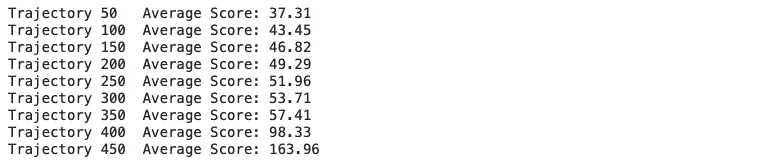*

*我们可以看到运行以下代码的结果:*

```
***def** running_mean(x):
    N=50
    kernel = np.ones(N)
    conv_len = x.shape[0]-N
    y = np.zeros(conv_len)
    **for** i **in** range(conv_len):
        y[i] = kernel @ x[i:i+N]
        y[i] /= N
    **return** y score = np.array(score)
avg_score = running_mean(score)plt.figure(figsize=(15,7))
plt.ylabel("Trajectory Duration",fontsize=12)
plt.xlabel("Training Epochs",fontsize=12)
plt.plot(score, color='gray' , linewidth=1)
plt.plot(avg_score, color='blue', linewidth=3)
plt.scatter(np.arange(score.shape[0]),score, 
            color='green' , linewidth=0.3)*
```

*你应该能够得到一个轨迹持续时间趋势增加很好的图。*

*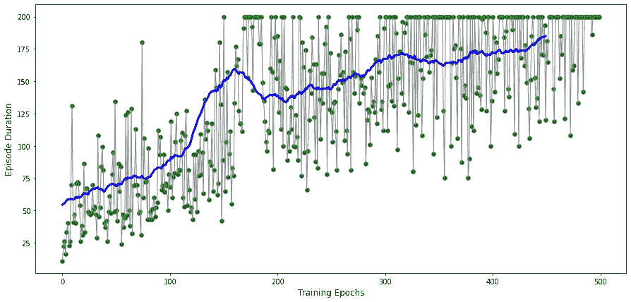*

*我们还可以使用以下代码呈现代理如何应用策略:*

```
***def** watch_agent():
  env = gym.make('CartPole-v0')
  state = env.reset()
  rewards = []
  img = plt.imshow(env.render(mode='rgb_array'))
  **for** t **in** range(2000):
    pred = model(torch.from_numpy(state).float())
    action = np.random.choice(np.array([0,1]), 
             p=pred.data.numpy()) img.set_data(env.render(mode='rgb_array')) 
    plt.axis('off')
    display.display(plt.gcf())
    display.clear_output(wait=**True**) state, reward, done, _ = env.step(action)
    rewards.append(reward)
    **if** done:
        print("Reward:", sum([r **for** r **in** rewards]))
        **break** 
  env.close()watch_agent()*
```

*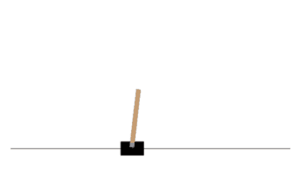*

# *基于策略的方法与基于价值的方法*

*现在我们知道了这两类方法，它们之间的主要区别是什么？*

*   *这种强化的政策方法直接优化了政策。价值方法，如 DQN，间接地做同样的事情，首先学习价值，然后根据这个价值得到政策。*
*   *策略方法是基于策略的，并且需要来自环境的新鲜样本(通过策略获得)。相反，价值方法可以受益于从旧政策中获得的旧数据。*
*   *政策方法通常样本效率较低，这意味着它们需要与环境进行更多的交互。请记住，值方法可以从大的重放缓冲区中受益。*

*在某些情况下，政策方法将是更自然的选择，而在其他情况下，价值方法将是更好的选择。在任何情况下，正如我们将在下一篇文章中看到的，这两类方法可以结合起来实现混合方法，利用它们各自的特性。*

# *摘要*

*在这篇文章中，我们已经详细解释了加固算法，并编写了代码。作为一种随机梯度方法，加强法适用于简单问题，并具有良好的理论收敛性。*

> *正如 R. Sutton 和 G. Barton 在教科书[强化学习:介绍](http://www.incompleteideas.net/book/the-book-2nd.html)中指出的，通过构建，轨迹上的预期更新与性能梯度方向相同。这保证了对于足够小的期望性能的改善，并且在标准随机近似条件下收敛到局部最优。然而，作为蒙特卡罗方法，强化可能具有高方差，因此产生缓慢的学习。*

*但是因为我们使用完全蒙特卡罗返回来计算梯度，所以该方法可能具有很高的方差，并且对于学习来说是一个问题。*

*此外，还有一些与增强算法相关的限制:*

1.  *更新过程非常**低效。**我们运行一次策略，更新一次，然后扔掉轨迹。*
2.  *梯度估计很**吵**。所收集的轨迹有可能不代表策略。*
3.  *没有明确的**信用分配**。一个轨迹可能包含许多好的/坏的行为，这些行为是否被加强只取决于最终的总产出。*

*总的来说，对于像 CartPole 这样的小问题，REINFORCE 工作得很好，但是对于更复杂的环境，例如 Pong 环境，它会非常慢。加固可以改进吗？是的，研究界创造了许多训练算法: [A2C、A3C、DDPG、TD3、SAC、PPO](https://docs.ray.io/en/latest/rllib-toc.html#algorithms) 等等。然而，对这些算法进行编程需要更复杂的数学处理，并且其编程变得比 REINFORCE 更复杂。正因如此，在[下期](/reinforcement-learning-frameworks-e349de4f645a)中，我们将介绍 [**强化学习框架**](/reinforcement-learning-frameworks-e349de4f645a) 简化了这些高级方法的使用，以上，均为分布式算法。*

*下一期在[见！](/reinforcement-learning-frameworks-e349de4f645a)*

# *深度强化学习讲解系列*

***由** [**UPC 巴塞罗那理工**](https://www.upc.edu/en) **和** [**巴塞罗那超级计算中心**](https://www.bsc.es/)*

*一个轻松的介绍性[系列](https://torres.ai/deep-reinforcement-learning-explained-series/)以一种实用的方式逐渐向读者介绍这项令人兴奋的技术，它是人工智能领域最新突破性进展的真正推动者。*

*[](https://torres.ai/deep-reinforcement-learning-explained-series/) [## 深度强化学习解释-乔迪托雷斯。人工智能

### 本系列的内容](https://torres.ai/deep-reinforcement-learning-explained-series/) 

# 关于这个系列

我在五月份开始写这个系列，那是在巴塞罗那的封锁期。老实说，由于封锁，在业余时间写这些帖子帮助了我 [**#StayAtHome**](https://twitter.com/hashtag/StayAtHome?src=hashtag_click) 。感谢您当年阅读这份刊物；它证明了我所做的努力。

**免责声明** —这些帖子是在巴塞罗纳封锁期间写的，目的是分散个人注意力和传播科学知识，以防对某人有所帮助，但不是为了成为 DRL 地区的学术参考文献。如果读者需要更严谨的文档，本系列的最后一篇文章提供了大量的学术资源和书籍供读者参考。作者意识到这一系列的帖子可能包含一些错误，如果目的是一个学术文件，则需要对英文文本进行修订以改进它。但是，尽管作者想提高内容的数量和质量，他的职业承诺并没有留给他这样做的自由时间。然而，作者同意提炼所有那些读者可以尽快报告的错误。*