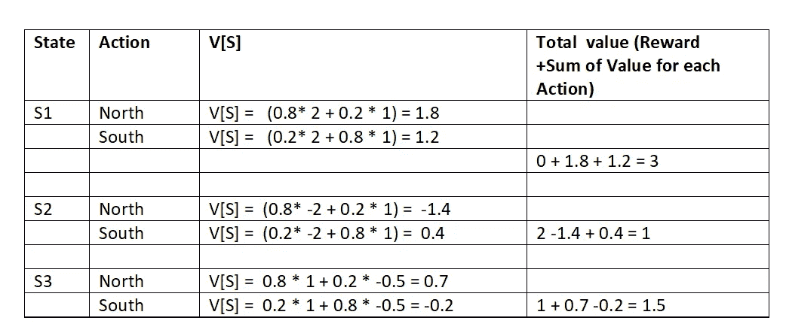

# RL 中的策略迭代:一步一步的说明

> 原文：<https://towardsdatascience.com/policy-iteration-in-rl-an-illustration-6d58bdcb87a7?source=collection_archive---------1----------------------->

## 强化学习

## 策略迭代算法指南

来源:图片由来自 [Pixabay](https://pixabay.com/?utm_source=link-attribution&amp;utm_medium=referral&amp;utm_campaign=image&amp;utm_content=3946618) 的 [Annalise Batista](https://pixabay.com/users/AnnaliseArt-7089643/?utm_source=link-attribution&amp;utm_medium=referral&amp;utm_campaign=image&amp;utm_content=3946618) 提供

策略迭代是“强化学习”中的一种算法，它有助于学习使长期贴现回报最大化的最优策略。当有多个选项可供选择，并且每个选项都有自己的回报和风险时，这些技术通常是有用的。

在本文中，我们将把“策略迭代”算法应用到一个简单的游戏中，这个游戏涉及一些海盗，他们必须在冒险和有利的情况下到达目的地。

# **游戏概述:**

让我们考虑一艘海盗船，它现在停泊在一个岛上，必须安全到达它的祖国。有两条路线可供选择。

如果它走向北的路线，那么它可以到达一个满是黄金的岛屿，它可以收集黄金，然后向南移动到达家园。然而，在黄金岛的北面有一个重力非常高的区域(像百慕大三角)。如果船误到了那里，那么它就会被吸进去，船就永远失去了。

如果它走向南的路线，那么它可以到达一个满是白银的岛屿，它可以收集这些白银，然后向北移动到达家园。在银岛的南面有一个监狱岛。如果船误落在那里，那么船将被捕获，船员将被监禁。

到目前为止，一切看起来都很好，然而，游戏中有一个转折。如果我们的生活是确定的，那就没有乐趣。让我们在游戏中引入随机性。

还记得电影《加勒比海盗》中的杰克·斯派洛吗？！。假设我们的船长有一个破罗盘，类似于杰克的罗盘。所以，每次，船长向北移动，他向北移动的概率是 0.8，然而，他可能会错过标记，以 0.2 的概率到达南方。同样，如果他往南走，有 0.8 的概率往南走，有 0.2 的概率往北走。

## **奖励(正面和负面):**

让我们给每一次登陆的船只分配一些奖励。

*   到达家园将允许海盗船收集+1 点。
*   登陆金岛将允许海盗船收集+2 点积分。
*   登陆银岛将允许海盗船收集+1 点。
*   如果船被吸进百慕大三角，那么船得-2 分。
*   如果这艘船是在监狱岛被捕获的，那么这艘船得-0.5 分。

在这种情况下，我们的目标是找到最优策略，使船只安全到达其祖国，并获得最大回报。

# **快速回顾“策略迭代”算法:**

策略迭代有三个步骤:

1.  初始化随机策略
2.  政策评价
3.  政策改进

## **什么是政策？**

策略是动作到系统中每个可能状态的映射。最优策略是使长期回报最大化的策略。因此，对于这个例子，我们可以有多个策略。即，在每个州(岛)有多组动作，然而，可能只有一个策略给我们最终的最大回报。我们的目标是找到最佳策略。

## **第一步:**

随机初始化策略。在系统的每个状态下随机初始化动作。

## **第二步:**

步骤 2 基于贝尔曼方程，该方程如下:

政策评价

获取策略中每个状态的动作，并使用上面的等式评估值函数。这里 p 是转移概率，也用 t 表示。

## **第三步:**

对于每个状态，使用以下公式从价值函数中获得最佳行动:

政策改进

如果最佳操作优于当前策略操作，则用最佳操作替换当前操作。

## **策略迭代:**

重复步骤 2 和 3，直到收敛。如果策略在整个迭代过程中没有改变，那么我们可以认为算法已经收敛。

# **状态转换图:**

首先要做的是理解状态和动作，并构建一个状态转换图。在我们的例子中，每个岛屿是一个州，有两个动作，“北”和“南”。每个州的奖励如上图所示。基于这些事实，我们可以构建如下的状态转换图:

有六个州，包括起始州和目的地州，以及四个中间岛屿，他们可以在那里上车。让我们将从 S1 到 S6 的状态标记如下:

1.  S1:开始状态
2.  S2:黄金岛登陆状态
3.  S3:登陆银岛的状态
4.  S4:登陆百慕达三角岛的状态
5.  S5:目的岛的着陆状态
6.  S6:在监狱岛登陆的状态

状态转移图

# **转移概率矩阵:**

由于游戏是随机的，我们需要计算每个状态/动作对的转移概率。基于上面提供的概率和状态转移图，我们可以绘制如下图。注意，有两个动作，我们需要这两个动作的转移概率矩阵。注意，在应用贝尔曼方程时，T(S，a，S’)指的是在采取动作‘a’之后从状态 S 移动到状态 S’的转移概率。

北部行动的转移概率矩阵

南方行动的转移概率矩阵

# 策略迭代算法:

有了这些信息，让我们一步一步地应用上述算法。我们可以假设贴现因子(γ)为 1。

## **初始随机策略:**

让我们随机初始化策略(状态到动作的映射),对于所有的状态都是向北移动。

P = {N，N，N，N，N，N}

如果我们观察状态转换图，状态 S4、S5、S6 在这些状态中没有任何支持的动作，因为这些是结束状态。因此，让我们缩减我们的政策，仅适用于我们可以采取行动的前三个州。

P = {N，N，N}

## **第一次迭代:**

让我们假设所有状态的初始值 V(s)为 0。因此，贝尔曼方程将简化为 V(s) = R(s)，其中 R(s)是进入一种状态的回报。

首次迭代的策略评估:

v[S1]= 0；V[S4] = -2

v[S2]= 2；V[S5] = 1

v[S3]= 1；V[S6] = -0.5

首次迭代的策略改进:

让我们应用上面提供的公式来改进政策。

I 迭代:政策改进

根据上表获得的策略如下:

P = {N，S，N}

## **第二次迭代:**

第二次迭代的策略评估:

II 迭代:策略评估

每个状态的值可以总结如下:

v[S1]= 3；V[S4] = -2

v[S2]= 1；V[S5] = 1

v[S3]= 1.5；V[S6] = -0.5

第二次迭代的策略改进:

二次迭代:政策改进

基于上表获得的策略如下:

P = {S，S，N}

## **第三次迭代:**

第三次迭代的策略评估:

III 迭代:策略评估

每个状态的值可以总结如下:

v[S1]= 2.5；V[S4] = -2

v[S2]= 1；V[S5] = 1

v[S3]= 1.5；V[S6] = -0.5

第三次迭代的策略改进:

III 迭代:政策改进

基于上表获得的策略如下:

P = {S，S，N}

如果我们将此策略与我们在第二次迭代中获得的策略进行比较，我们可以观察到策略没有改变，这意味着算法已经收敛，这是最优策略。

# **结论:**

通过应用该算法，我们得到了最优策略为{南，南，北}。如果我们观察这个例子，最初可能会很想去北方，因为金岛有更多的奖励，但它充满了风险，因为我们可能会失去 2 分，并结束游戏。因此，最好是牺牲短期回报，选择最终能让我们的长期回报最大化的南线。

我希望这个例子有助于更好地理解这个算法。

# **参考文献:**

1.  萨顿和巴尔托(2018 年)。强化学习:导论。麻省理工出版社。
2.  翁，莉莲。(2018 年 2 月 19 日)。对强化学习的(长)窥视。检索自[https://lilian Weng . github . io/lil-log/2018/02/19/a-long-peek-into-reinforcement-learning . html](https://lilianweng.github.io/lil-log/2018/02/19/a-long-peek-into-reinforcement-learning.html)