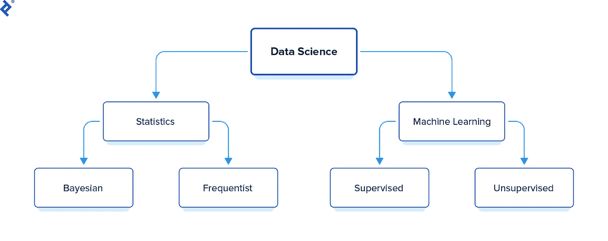
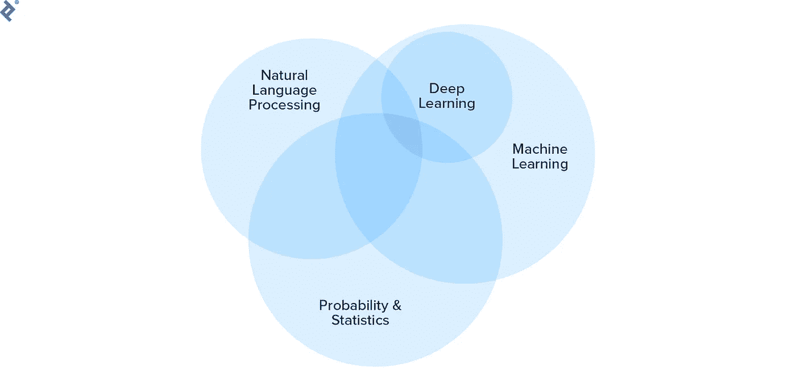
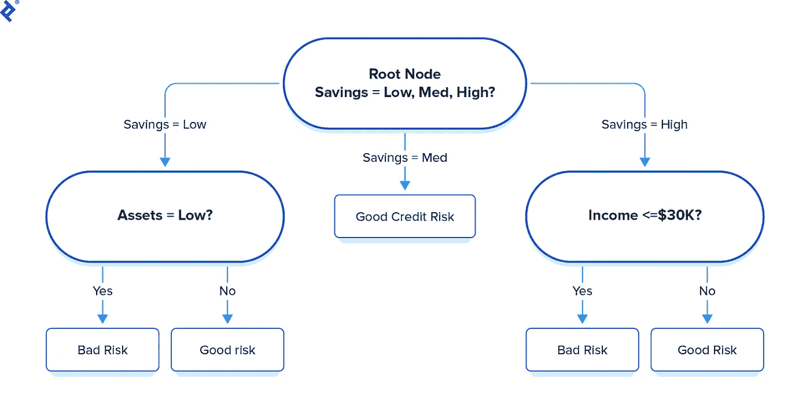
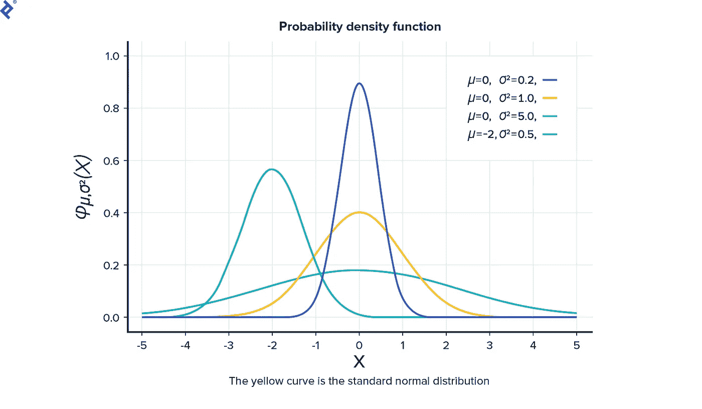
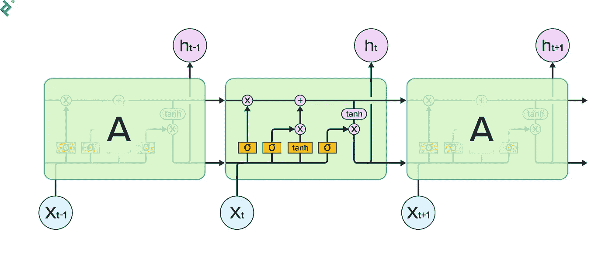

# 通过了解招聘人员在寻找什么来提高你的数据科学能力

> 原文：<https://towardsdatascience.com/polish-your-data-science-competencies-by-knowing-what-recruiters-are-looking-for-6f9ceafe8413?source=collection_archive---------26----------------------->

## 招聘人员提出的 17 个数据科学面试问题

是什么造就了伟大的数据科学家？答案取决于所讨论的数据科学分支和您的具体需求，但所有数据科学家都不可避免地拥有一套核心技能。这本全面的招聘指南，**从招聘人员的角度撰写，**概述了关键技能，并解释了如何为工作挑选合适的数据科学家。

**如果你读这篇文章只是为了了解招聘人员在下次面试时可能会问你什么问题，那就去“问正确的问题”吧。**

# 如何雇佣一名优秀的数据科学家

数据科学是一个飞速发展的领域。根据 [Linkedin 劳动力报告](https://economicgraph.linkedin.com/resources/linkedin-workforce-report-august-2018)，2018 年对数据科学家的需求超出了图表。

> 数据科学是一个多学科领域，使用科学方法、流程、算法和系统从结构化和非结构化数据中提取知识和见解。 [*(维基百科)*](https://en.wikipedia.org/wiki/Data_science)

该行业正朝着人工智能和数据科学的民主化方向发展。这意味着现在比以往任何时候都更容易掌握相关技能，越来越多的人试图进入这一领域。这是一个积极的趋势，但同时也是一把双刃剑。由于高需求和不断涌入该领域的新人，雇佣数据科学家变得更加困难。

这份数据科学招聘指南应该能帮助你为这份工作选择合适的人。

# 数据科学家是你真正需要的吗？

在我们深入研究*如何*之前，你确实需要回答*为什么*。数据科学家真的是你需要的吗？随着数据科学的民主化，出现了大量可以用作黑盒的工具和解决方案。像 Google Vision API 和 [Cloud AutoML](https://cloud.google.com/automl/) 这样的工具可以帮助你实现很多目标，而不必担心幕后发生的事情。

在您开始全面寻找数据科学家之前，了解您的需求，并搜索是否有办法使用现有的 API 和工具来获得与内部定制解决方案相同(在某些情况下甚至更好)的结果。古老的格言“不要重新发明轮子”在这种情况下非常适用。

# 雇佣数据科学家的挑战

雇用数据科学家的挑战之一是判断候选人是否有深入的知识，或者只是依赖于为你做所有工作的黑盒库。这些工作，但如果候选人不知道它是如何工作的，调试任何问题都将是一个问题。

另一个挑战是知道你需要数据科学家做什么，因为在数据科学的保护伞下有许多问题(例如，自然语言处理(NLP)，计算机视觉(CV)等)。).雇佣数据科学家之前的第一步是定义你试图解决的问题的范围。

显然，寻找候选人的传统方式仍然存在——比如口口相传或在 LinkedIn 或 Stack Overflow 等各种网站上发帖——但找到优秀数据科学家的一个新地方是 [Kaggle](https://www.kaggle.com/) 。

Kaggle 是一个面向数据科学家和 ML 从业者的在线社区。然而，这并不是一个适合所有人的建议。有些候选人很擅长 Kaggle，但可能不适合你的公司。另一方面也是如此，因为有些候选人是伟大的数据科学家，但却不在 Kaggle 上。

你需要做的第一件事是定义一个数据科学家将为你解决的问题，然后尝试找到它所属的数据科学领域。如果你有一个语言任务，比如关键词分类或者构建一个文本摘要器，你需要一个 NLP 专家。如果任务更多的是处理图片和照片，你需要一个计算机视觉专家。同样，如果工作涉及处理标记数据(面部识别、垃圾邮件分类等。)，你需要在监督学习方面有专长的人。如果工作更符合统计学，比如 A/B 测试或分析受控试验的结果，你需要一个非常擅长统计学的人(理想情况下，所有数据科学候选人都应该具备统计学知识)。

该图很好地概括了数据科学的不同分支:

平心而论，这是一种概括；实际上，这些线是模糊的，并且有一些重叠，所以技能图表看起来像这样:

**注:** *一个优秀的数据科学家应该了解所有这些技能和分支，并在其中一个或多个方面有专长。*

# 数据科学家的硬技能和经验

任何数据科学家都应该具备统计学知识，并理解他们所使用的算法背后的数学原理。除此之外，Python、R、MATLAB 或 Octave 的编码经验是必须的。

如果你想雇佣一个 NLP 专家，候选人应该理想地使用过 NLTK，斯坦福 NLP 等 NLP 包。

对于计算机视觉，他们应该有使用 CNN(卷积神经网络)、OpenCV 等的经验。

随机森林、决策树、朴素贝叶斯、线性回归或 SVM(支持向量机)等算法的经验也是必要的。

如果工作更多的是在使用深度学习和神经网络方面，他们应该有使用 TensorFlow，PyTorch，Theano，Torch，Sonnet，Keras 和 MXNet 构建神经网络的经验。

# 问正确的问题

## **1)有监督和无监督的机器学习有什么区别？**

在*监督的*机器学习中，算法在带标签的数据集上训练，任务是算法将在给定新数据的情况下找到标签。

在*无监督*学习中，数据是无标签的。

## **2)能否提供一些有监督和无监督 ML 算法的例子？**

*有监督*:随机森林、决策树、朴素贝叶斯、线性回归、SVM、KNN (K 近邻)。

*无监督* : K 均值聚类，自动编码器，DBSCAN，层次聚类。

## **3)什么是“爆炸渐变”？**

梯度是在训练神经网络时计算的更新的幅度和方向。

*爆炸梯度*是当梯度累积并且值变得太大而导致溢出时发生的问题，并且梯度变成 NaN，导致训练停止。

## **4)什么是混淆矩阵？**

混淆矩阵是一个 2×2 的表格，包含了判断二元分类器性能的度量。

*   **真阳性**:属于阳性类的值，分类器标记正确。
*   **假阴性**:属于阳性类的值，但分类器将它们标记为阴性。
*   **假阳性**:属于阴性类别但分类器将其标记为阳性的值。
*   **真阴性**:属于阴性类的值，分类器标记正确。

## 什么是 ROC 曲线，它是如何工作的？

ROC 曲线是一个图表，它告诉我们在不同阈值下的真阳性率(TPR)和假阳性率(FPR)。它用于说明 TPR(灵敏度)和 FPR(1-特异性)之间的权衡。

## 什么是决策树，它是如何工作的？

决策树是一种分类/回归算法，它使用类似树的结构来学习数据中的结构。

树中的每个节点代表一个测试。例如，一个节点可以是资产的输入是否低，根据答案(是或否)，决策树将输出*坏风险*或*好风险*。

## **7)随机森林算法是如何工作的？**

*随机森林算法*是一种集成学习技术，它创建多个决策树，并根据给定的数据对它们进行训练。在分类问题的情况下，最终预测是决策树预测的所有类的模式，在回归问题的情况下，是所有值的平均值。

## **8)什么是过度拟合和欠拟合？**

*过拟合*是一种机器学习算法与训练数据集过于拟合的现象，这导致训练集的高精度/低损失，但测试/验证集的低精度/高损失。

*欠拟合*是一种机器学习算法无法学习数据集结构的现象，因此这会导致低精度/高损失。

## 如何在决策树中防止过度拟合？

有两种方法可以防止决策树中的过拟合现象:*预修剪*和*后修剪*。

在*预修剪*中，我们在决策树变成一棵成熟的树之前停止它。

以下是节点的典型停止条件:

1.  如果所有实例属于同一个类，则停止。
2.  如果所有属性值都相同，则停止。

在*后期修剪*中，我们让决策树增长到全长，然后以自下而上的方式修剪树的节点。

## 什么是正态分布？

数据的分布通常偏向平均值的左边或右边。当数据围绕平均值对称时，即在平均值附近更频繁，远离平均值时更少，则数据遵循*正态分布*。

## 深度神经网络中过高的学习率会产生什么问题，为什么？

如果学习率太高，损失会在最小值附近跳跃。由于学习率决定了网络权重的更新量有多大，因此高学习率会导致大量更新，进而导致发散行为。

## 处理数据集时，您发现两个变量的皮尔逊相关值可以忽略不计。这是否意味着这两个变量是相互独立的？为什么/为什么不？

*相关性*定义为两个变量之间的关系。正相关是当一个变量增加时，促使另一个变量也增加。同样，负相关是指一个变量减少，而另一个变量增加。

皮尔逊相关是两个变量之间线性关系的量度。仅仅因为两个变量具有接近零的皮尔逊相关性并不意味着它们是独立的；只是说明两者之间没有线性关系，但是更高阶的关系还是可以存在的。

## **13)有一个 15 个隐层的深度神经网络，所有的神经网络都有相同的激活函数，即 tanh。训练时，你注意到训练损失保持不变。问题出在哪里？解决这个问题最简单的方法是什么？**

这是一个消失梯度问题。通常使用基于梯度的训练方法和反向传播来训练神经网络。本质上，我们向每个权重发送与相对于当前权重的误差偏导数成比例的更新。有时，当误差反向传播时，这种更新变得如此之小，以至于权重不变，因此，训练损失保持不变。

要修复这个问题，可以减少层数，用 ReLU 激活函数代替 tanh。

## **14)您正在训练一个简单的 RNN 网络来预测句子中的新单词，但在训练时，准确性并不好。经过调试后，您发现 RNN 除了几个词之外无法理解上下文。你用哪个深度学习模型来修复这个？**

*递归神经网络(RNN)* 是一种深度神经网络，其结构使得它们能够使用其内部状态来记忆先前的输入。与前馈神经网络不同，在 RNN 中，前一步骤的输出作为输入被馈送到当前步骤。这形成了一个允许信息持续的循环。

这幅图展示了一个简单的 RNN 的样子。

由于结构简单，rnn 存在不能“记住”大量数据的问题。使用类似 LSTM(长短期记忆)的东西可以帮助解决这个问题。

LSTMs 是一种能够学习长期依赖性的特殊 rnn。

在 LSTM，有一个明确的记忆状态，可以由 LSTM 细胞使用精心控制的门来更新。这种存储器状态允许 LSTM 保留存储器更长的时间，因此，它可以跟随上下文更长的序列。

## **15)在对二进制数据集进行训练的过程中，您发现您的算法的准确性很高，但是在分析数据集时，您发现一个类别的样本之间存在非常高的不平衡。例如，阳性样本几乎占了数据集的 99%。你还能相信准确性指标吗？如果不是，您应该使用什么指标？**

当处理不平衡数据集时，准确性不是性能的最佳衡量标准，因为如果在这种情况下，算法将所有数据标记为正，它仍将获得 99%的正确答案，因此将具有 99%的准确性。在这种情况下，会使用平衡准确度、f1 分数等指标。

*   *精度*:真阳性值/(真阳性+假阳性)
*   *回忆*:真阳性/(真阳性+假阴性)的值
*   *F1 得分*:精确度和召回率的调和平均值
*   *平衡精度*:数据集中每个类的平均召回率

## **16)你正在处理一个聚类问题，你有一个高维数据集。在对数据训练基本的 k-means 聚类算法时，您会注意到，无论您对超参数做了多少调整，聚类都会在运行之间不断变化。你觉得为什么会这样？你能做什么来克服这个问题？**

K-means 聚类使用基于距离的度量。在处理高维数据集时，由于维数灾难，基于距离的度量变得几乎无用，因为数据集中的所有数据点由于维数很大而看起来是等距的。因此，在多次运行中，该算法无法获得一致的结果。要解决这个问题，您应该尝试应用 PCA/t-SNE 或其他一些降维算法。

## **17)在一个有大量参数的优化问题上使用随机梯度下降时，你发现算法是振荡的，无法达到全局最优。这是为什么呢？你将如何修理它？**

随机梯度下降(SGD)的最大缺点之一是所有参数的学习速率都是相同的。因此，如果其中一个参数需要较小的学习速率，而另一个参数需要较大的学习速率，那么 SGD 在这种情况下就不能很好地运行。

这个问题随着具有许多参数的优化问题而被放大，因为出现这种情况的概率也很大。在这种情况下，您应该使用 Adam optimizer 等具有自适应学习率的算法。

# 不要

这是雇佣数据科学家的一些常见问题，你应该尽可能避免它们。

## **不要问“抓住你的问题”**

疑难问题是很难解决的问题，除非你知道一种特殊的技巧。这些问题看起来很诱人，但是要避免它们，因为知道或不知道这类问题的答案并不能很好地反映候选人的知识水平。

## **不要以表面价值来看待项目。**

项目是伟大的，但现在，比以往任何时候都更容易只用几行代码来进行机器学习。虽然这是一个好消息，但这也意味着一些候选人可能只是使用预构建的 Python 库，而没有真正理解其工作原理。你必须提出问题，让候选人解释他们所做的工作。

## **不要坚持让候选人知道你的确切技术水平。**

你应该调查候选人学习新技术和新方法的意愿和能力，而不是坚持让他们知道你一直在使用什么。你可能会找到一个很棒的候选人，他不了解你的技术，但能很快学会。

# 包扎

组织中不断增长的数据量创造了对数据科学家不断增长的需求。

随着机器学习的民主化，现在比以往任何时候都更容易获得该领域的相关技能。但是为你的团队寻找合适的候选人也是一个挑战——就像大海捞针一样。

我们选择的提示和问题有助于为您的团队雇佣合适的数据科学家；然而，这是你整体招聘策略的一个补充，因为只有你知道谁是你团队的合适人选。本指南旨在帮助您做出决定，我们希望上述问题和提示能够帮助您为您的组织和项目找到合适的候选人。

*原载于 https://www.toptal.com***和 https://www.stratascratch.com**