# 政治数据科学:推特的故事

> 原文：<https://towardsdatascience.com/political-data-science-a-tale-of-tweets-75b762224e56?source=collection_archive---------31----------------------->

## 分析对新苏格兰独立公投的情绪

*关键词:Twitter，tweepy，Bayes 情操论，nltk，scikit learn，keras，机器学习，深度学习，LSTM，RNN，SVM，朴素贝叶斯，geoplot，geopy，nominatim，folium，pygeocoder。*

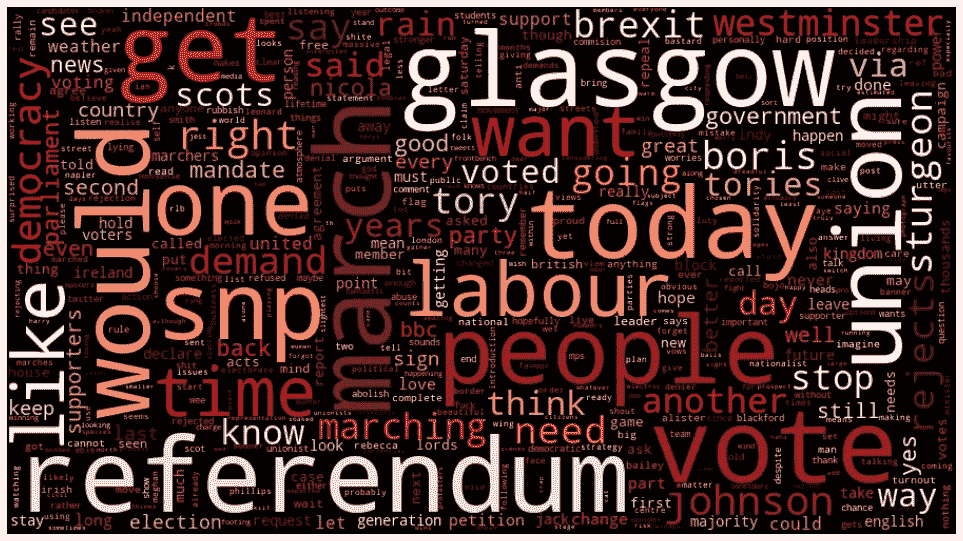

推特上的文字云

我们都很熟悉数据驱动的政治竞选在选民中的巨大力量。我们只要看看 2016 年美国总统大选，希拉里·克林顿和唐纳德·特朗普针锋相对，最终彻底改变了美国政治家赢得选举的方式。

他们的竞选活动没有使用传统策略，而是利用数据，这些数据赋予了他们微观锁定选民的能力。耶鲁大学教授艾坦·赫什(Eitan Hersh)在他的著作《黑掉选民**中总结道，如果你有足够的数据，你就可以预测人们会如何表现，甚至他们会如何投票。竞选团队已经发展出复杂的方式来做到这一点。**

**尽管选民最终会支持与他们的优先事项最相符的政治家或想法，但重要的是要知道数据给了我们发现这些优先事项是什么的方法。**

****

**照片由[元素 5 数码](https://unsplash.com/@element5digital?utm_source=medium&utm_medium=referral)在 [Unsplash](https://unsplash.com?utm_source=medium&utm_medium=referral) 上拍摄**

**在英国，事情进行得并不容易，英国退出欧盟的支持者从川普的竞选中吸取了很多经验教训并加以利用。快进到 2020 年，英国退出欧盟的主要人物鲍里斯·约翰逊现在是分裂的“联合”王国新当选的保守党首相。**

**英国退出欧盟投票后，以及最近鲍里斯·约翰逊在 2019 年冬季大选中获胜后，苏格兰当前的政治局势非常激烈。**

**苏格兰选民在 2014 年 9 月的公投中首次被问及是否希望苏格兰成为独立国家；结果是 55%对 45%反对独立。**

****

**FT 蒙太奇/Getty/PA**

**苏格兰民族党(SNP)2019 年大选宣言称，该党打算在 2020 年举行第二次公投；他们赢得了苏格兰在英国下议院 59 个席位中的 48 席。因此，很自然地，首席部长尼古拉·斯特金现在声称**苏格兰大多数人期望的未来与英国其他大部分人喜欢的非常明显不同。本月早些时候，她正式要求在 2020 年底前举行独立公投，但不久后被鲍里斯·约翰逊(Boris Johnson)否认。****

**所有这些在鲍里斯约翰逊(Boris Johnson)领导下的英国制造了一个复杂的环境，这个国家似乎处于非常困难(也不是非常有利)的境地。**

# **内容**

1.  **[提问](#2d05)**
2.  **[为什么是推特？](#428b)**
3.  **[ETL:提取、加载、转换](#f1f4)**
4.  **[特色工程](#ea26)**
5.  **[模型定义和训练](#9617)**
6.  **[模型评估](#d886)**
7.  **[未知建模:公投推特数据。](#e55e)**
8.  **[地理空间分析](#1b98)**
9.  **[结论](#d2b0)**

# ****提问****

**鉴于这种情况，我想知道我们是否能了解苏格兰人民在这个动荡时期的反应。尤其是在鲍里斯·约翰逊(Boris Johnson)获胜并拒绝允许苏格兰人再次公投之后。**

**所以我的问题是:**

> **英国人民如何应对当前关于苏格兰独立公投的政治气候？鲍里斯·约翰逊拒绝允许吗？**
> 
> **苏格兰、英格兰、威尔士和北爱尔兰人的反应有何不同？对苏格兰特别感兴趣。**

**于是，我用关键词*“indyref 2”**“苏格兰独立”**“scot ref”*下载了 2020 年 1 月 8 日至 1 月 15 日一周的推文。我收集数据和分析情绪的过程可以在任何 twitter 账户或媒体页面上重复。**

**使用 [**情感分析**](/sentiment-analysis-concept-analysis-and-applications-6c94d6f58c17) (也称为意见挖掘)，一个**自然语言处理**子领域，我把推特作为苏格兰独立的一种政治晴雨表。我训练了两个有监督的机器学习模型:**支持向量机** (SVM)和**朴素贝叶斯分类器**。然后，我与一个被称为长短期记忆(LSTM)网络的**深度学习递归神经网络** (RNN)进行了系统的比较。在对模型进行评估后，我选择并使用 LSTM 模型来预测 twitter 数据集中的情绪。**

**您可以在 [Github 库](https://github.com/gracecarrillo/Political-Data-Science)中查看完整的项目及其技术细节。**

****

**乔治·帕甘三世在 [Unsplash](https://unsplash.com?utm_source=medium&utm_medium=referral) 上的照片**

# **为什么是 twitter？**

**我选择关注 Twitter 是因为它——以及一般的社交媒体——正日益成为日常生活的一部分，这在政治领域也是如此。此外，情感分析项目主要使用 Twitter 数据，因为这些数据(几乎)是公开的，而从脸书收集任何有用的数据(几乎)是不可能的。**

# **ETL:提取、加载、转换**

****训练数据**是从[感知 140](http://help.sentiment140.com/) 中获得的，由大约 160 万条随机推文组成，相应的二进制标签“0”表示负面情绪，“4”表示正面情绪。原始数据集由 80k 条标注为正面的推文和 80k 条标注为负面的推文组成。推文真多。所以我从更大的训练数据集中抽取了一个样本，以避免长时间的等待。最后，我用 25160 条标注为负面的推文和 24840 条标注为正面的推文进行训练。**

**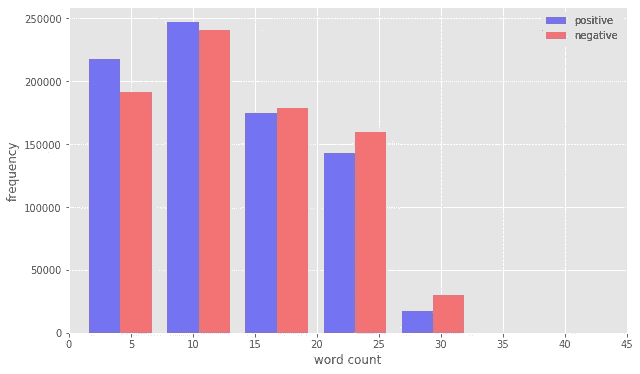**

**按字数统计的训练数据集中正面和负面推文的分布。**

**一个非常平衡的训练数据集，如上图直方图所示。**

**在任何自然语言处理任务中，清理原始文本数据都是重要的一步。它有助于去掉不需要的单词和字符，从而有助于获得更好的特征。对于这一步，我使用了一个类似于**管道的预处理**步骤，使用一些辅助函数来去除 tweets 中不需要的噪声:**

**[预处理流水线](https://gist.github.com/gracecarrillo/53ab0c64121514abe02a74e483fd29ce#file-preprocessing-pipeline)**

**经过这一步，你可以非常清楚地看到原始推文和干净推文之间的差异。只有推文中的重要单词被保留，噪音(数字、标点符号和特殊字符)被删除。**

**对于**测试数据，**我使用 twitter 的 API 下载了数据集，并用它来测试模型的真实性能。我使用了`tweepy`,这是 Twitter API 的一个 python 包装器库，可以让你更好地控制如何查询它。为了获得测试数据集的大量数据，我通过 API 搜索函数使用关键字`'indyref2'`、`'scottish independence'`和`'scotref'`下载了数据。不过 Twitter 的 REST API 在其免费版本中有一个限制。它搜索过去 7 天内发布的推文样本。所以我只能收集到 636 条推文的样本。尽管如此，我还是从他们身上提取了一些有趣的信息。**

**要了解这一部分的详细步骤，请查看我的 Github 中的[笔记本。](http://ETL_Sentiment_Analysis_Scotref2.ipynb)**

# **特征工程**

**为了分析预处理过的数据，需要将其转换成特征。根据使用情况，可以使用各种技术构建文本特征，如[单词包](https://machinelearningmastery.com/gentle-introduction-bag-words-model/)(BoG)[TF-IDF](https://machinelearningmastery.com/gentle-introduction-bag-words-model/)和[单词嵌入](https://machinelearningmastery.com/what-are-word-embeddings/)。**

**为了使项目简单，我去找了一大堆单词。但是，一种基本的方法无法捕捉到像*“我喜欢你”*这样的短语之间的差异，其中*“喜欢”*是一个带有积极情绪的动词，而*“我喜欢你”*，其中*“喜欢”*是一个表达不同情绪的介词。**

**为了改进这项技术，我使用**维达的极性分数**和**词性(POS)标签提取特征。****

**[**维达情绪分析工具**](https://github.com/cjhutto/vaderSentiment) 产生四个情绪指标。前三个，积极的，中性的和消极的，这是不言自明的。最后一个指标，复合得分，是所有词汇等级的总和，然后标准化为-1 到 1 之间的范围。我使用这些分数来创建基于推文情感指标的特征，这些特征被用作建模的附加特征。如果你想对一个给定的句子进行多维度的情感测量，这些是非常有用的指标。我用下面的辅助函数提取并创建了新特性:**

**[Vader 情操助手功能](https://gist.github.com/gracecarrillo/2eb646cad60a146d5b93fa2e3c6213fb#file-vadersentiment-helper-function)**

**[**【词性标注(POS)**](https://www.geeksforgeeks.org/nlp-part-of-speech-tagged-word-corpus/) 是使用上下文线索将词性分配给列表中的每个单词。这很有用，因为同一个词有不同的词性，可能有两种完全不同的意思。是根据上下文和定义将语料库(一串文本)中的单词标记为语音标签的相应部分的过程。这项任务并不简单，因为一个特定的单词根据其使用的上下文可能有不同的词性。对于这个项目，我使用了一个简单的基于词汇的方法，将 POS 标签分配给训练语料库中最频繁出现的单词，并将标签作为特征添加到我们的模型中。关于助手功能，请参见下文:**

**[POS 助手功能](https://gist.github.com/gracecarrillo/f1f56ad0a369781fd1030362e9b8f983#file-pos-helper-function)**

**查看我的 Github 中的[笔记本，了解这一部分的分步操作。](http://Feature_Engineering_Sentiment_Analysis_Scotref2.ipynb)**

# **模型定义和培训**

## **监督机器学习**

**在完成所有的预建模阶段后，我们构建模型，训练它们并测试它们。对于这项任务，我首先定义并训练了两个有监督的机器学习算法:**

*   **朴素贝叶斯分类器**
*   **支持向量机分类器**

**它们可以说是任何分类任务中最常用的两种技术。**

****朴素贝叶斯**是一种利用贝叶斯定理的分类器。它预测每个类的成员概率，例如给定记录或数据点属于特定类的概率。具有最高概率的类被认为是最可能的类。**

**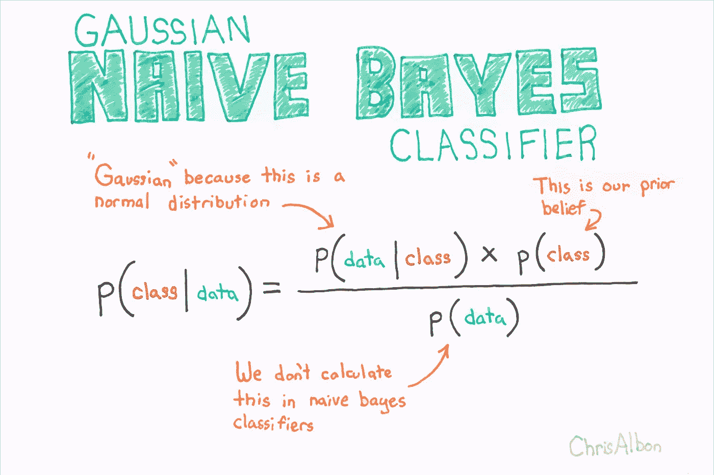**

**版权克里斯·阿尔邦，2020。**

****SVM 分类器**的工作原理是将数据映射到一个高维特征空间，这样即使数据不是线性可分的，也可以对数据点进行分类。找到类别之间的分隔符，然后对数据进行转换，使得分隔符可以绘制为超平面。在此之后，新数据的特征可以用于预测新记录应该属于哪个组。**

****

**版权克里斯·阿尔邦，2020。**

**定义模型后，我使用 Scikit Learn [GridSearchCV](http://scikit-learn.org/stable/modules/generated/sklearn.model_selection.GridSearchCV.html) 进行交叉验证，同时选择最佳的超参数配置。使用网格搜索，您可以设置超参数值的网格，并为每个组合训练一个模型，并根据验证数据进行评分。在这种方法中，尝试了超参数值的每一个组合。**

**我为每个分类器将组合的超参数传递给 GridsearchCV 对象，并为交叉验证传递 10 个折叠，这意味着对于每个参数组合，网格每次都用不同的测试集运行 10 次不同的迭代(这需要一段时间……)。**

**[交叉验证](https://gist.github.com/gracecarrillo/84218a4403b2165fa6d44ba7736598fd#file-cross-validation-txt)**

**在尝试了不同的模型参数组合之后，GridsearchCV 返回了每个分类器的最佳性能模型。然后，我保存模型进行评估。如果我们计划部署模型，这是一个必要的步骤。**

## **深度学习**

**为了比较，我还实现了一个**递归神经网络(RNN)** ，称为**长短期记忆(LSTM)。****

**为了快速描述它，想想我们是如何思考的。我们不是每秒钟都从零开始思考。我们以此为基础。就在你读这篇文章的时候，你在阅读的过程中增加了对它的理解。**

**[传统神经网络做不到这一点](https://colah.github.io/posts/2015-08-Understanding-LSTMs/)。**

**如果我们想要一个神经网络来理解我们的推文，我们需要一个可以从它读取的内容中学习并建立在其上的神经网络。rnn 解决了这个问题。它们是带有环路的网络，允许信息持续存在。但是我们也需要我们的网络使用一些推文中的上下文来学习。也就是说，我们需要它比其他 RNN 兄弟姐妹能记住更长时间的信息。**

**进入 LSTMs！他们是我们需要的孩子。**

**我使用的网络架构如下:**

*   **首先，我们将单词传递给一个嵌入层，**我们的第一个隐藏层。****
*   **在输入单词被传递到嵌入层之后，新的嵌入被传递到 LSTM 单元，**我们的第二个隐藏层**。**
*   **最后，LSTM 输出到 **softmax 输出层。****

****

**来源:[https://colah.github.io/posts/2015-08-Understanding-LSTMs/](https://colah.github.io/posts/2015-08-Understanding-LSTMs/)**

**为了让推文准备好进入 LSTM 网络，需要做大量的数据准备。我必须将推特上的文字编码成整数。因此，我不得不使用 Keras 中的`Tokenizer`将 tweets 转换成整数序列。然后，编码后的推文可以传入网络。**

**使用 Keras 构建网络相当容易。您可以简单地将多层堆叠在一起:**

**[LSTM 网络与 Keras](https://gist.github.com/gracecarrillo/45279ecc33f3a7d217ac76ff44273735#file-lstm-network-with-keras)**

**我运行了 10 个时期的模型，并观察到验证数据的损失在时期 1 之后开始增加，这表明过度拟合。在助手函数`eval_metric`和`optimal_epoch`的帮助下，我稍微调整了一下模型，解决了这个问题。**

**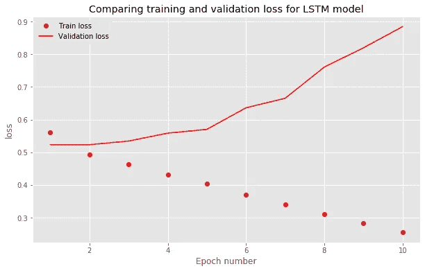**

**在时段 1 中达到最小验证损失**

**我们从图表中观察到两件事:**

*   **训练损失在每个时期之后保持减少。我们的模型正在学习识别训练集中的特定模式。**
*   **验证损失在每个时期之后持续增加。我们的模型在验证集上不够通用。**

**训练损失继续下降，在第 10 个时期几乎为零。这是正常的，因为模型被训练以尽可能好地适应训练数据。**

**所以，我们是**过度训练(又称，模型过度拟合)。****

**为了解决这个问题，我应用了正则化，这可以归结为对大权重的损失函数增加一个成本。**

**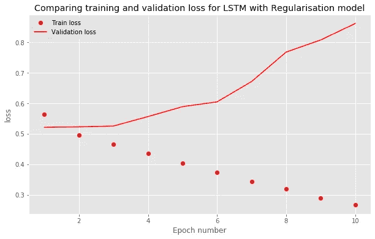**

**在时段 2 中达到最小验证损失**

**我们可以看到，它在第二个时期开始过拟合，之后验证损失增加较慢。**

**乍一看，简化的模型似乎是概括的最佳模型。但后来我使用`test_model`辅助函数检查了测试集，它给出了第一个 LSTM 的测试准确率为 74.81%，LSTM 的测试准确率为 74.47%。**

**因此，应用正则化有助于过度拟合，但对模型在测试数据上的准确性没有太大影响。**

**查看我的 Github 中的[笔记本，了解这一部分的分步操作。](http://Models_Definition_&_Training_Sentiment_Analysis_Scotref2.ipynb)**

# **模型评估**

**模型评估是模型开发过程不可或缺的一部分。它有助于找到代表我们的数据的最佳模型，以及所选模型在未来的工作情况。对于此分类任务，我使用了以下评估指标:**

*   **混淆矩阵**
*   **准确度、召回率、精确度和 F1 分数**

****混淆矩阵**显示了与数据中的实际结果(目标值)相比，分类模型做出的正确和错误预测的数量。**

**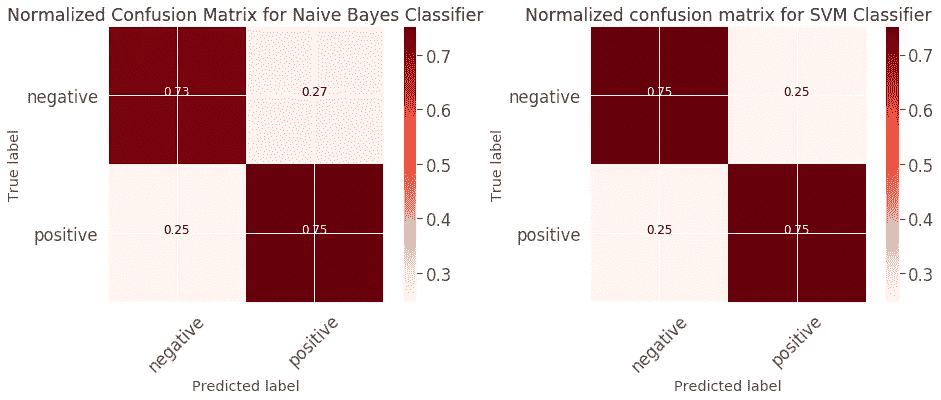**

**我们的监督机器学习模型的混淆矩阵**

**从上面可以看出:**

*   ****朴素贝叶斯分类器**:该模型正确预测 76%的标签为阴性，73%正确预测为阳性。该模型预测 27%的标签为阴性，但它们是阳性的(假阴性)。当它们是阴性(假阳性)时，该模型预测 24%的标记为阳性。**
*   ****SVM 分类器**:模型正确预测 75%的标签为阴性，75%正确预测为阳性。该模型预测 25%的标签为阴性，但它们是阳性的(假阴性)。当它们是阴性(假阳性)时，该模型预测 25%的标记为阳性。**

**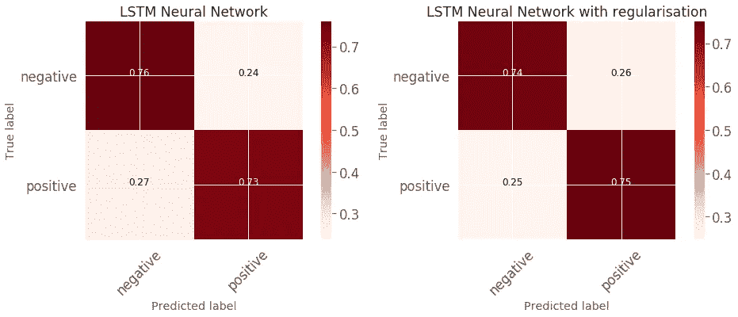**

**我们的 LSTM 递归神经网络的混淆矩阵**

**从上面可以看出:**

*   ****LSTM 神经网络**:该模型预测 76%的标签正确为阴性，73%正确为阳性。该模型预测 27%的标签为阴性，但它们是阳性的(假阴性)。当它们是阴性(假阳性)时，该模型预测 24%的标记为阳性。**
*   ****具有正则化的 LSTM 神经网络**:该模型正确预测 74%的标签为阴性，73%正确预测为阳性。该模型预测 25%的标签为阴性，但它们是阳性的(假阴性)。当标签为阴性(假阳性)时，该模型预测 26%的标签为阳性，这比第一个 RNN 模型在准确性上有一点提高。**

**接下来，我们查看**分类报告**中的**准确度、召回率、精确度**和**F1-分数**。这些指标之间的差异以及我们为什么不简单地依赖准确性得分在这篇文章中有很好的解释。**

**对于朴素贝叶斯和 SVM:**

**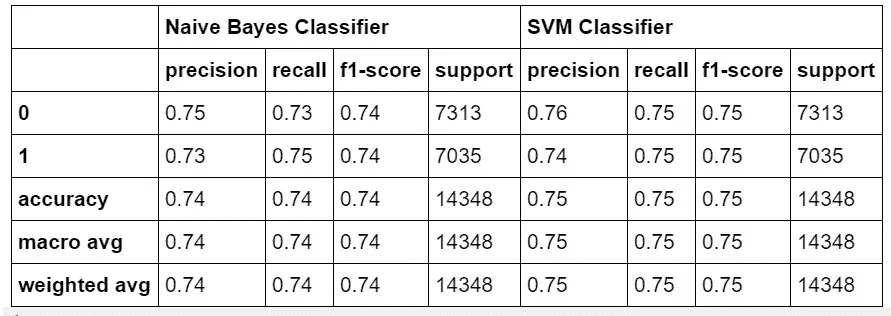**

**监督机器学习模型的分类报告**

**对于 LSTM 车型:**

**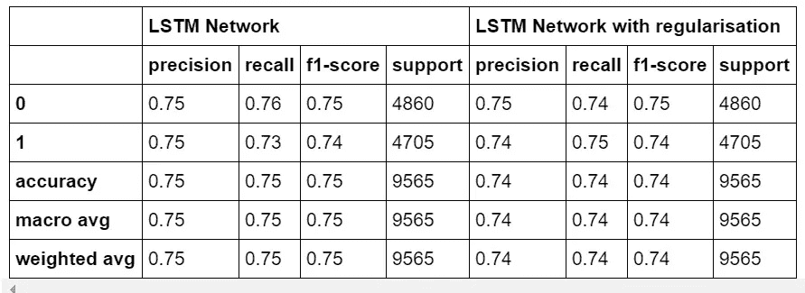**

**LSTM 车型的分类报告**

**从上述指标来看，我们的模型似乎表现得相对较好。请注意，在所有四个模型中，宏观和微观平均得分相同。这意味着我们的数据非常平衡，也就是说，我们训练数据集中的类分布是对称的。但是我们已经知道了。关键是，一个平衡的数据集允许我们依靠整体准确性指标来选择模型。**

**相比之下，在这篇论文中，研究人员发现人类评分者通常在 80%的情况下会同意。**

**因此，一个 75%准确的模型几乎和人类评分员一样好。**

**没有正则化的 SVM 和 LSTM 网络分类器都优于其他模型 1%，实现了 75%的总准确率。**

**下一步我选择了 LSTM 而不是 SVM 模型，因为一般来说，[深度学习在处理复杂问题时真的很出色](/why-deep-learning-is-needed-over-traditional-machine-learning-1b6a99177063)，比如自然语言处理。另一个优势是，当涉及到模型部署时，我们不太担心特性工程部分。**

**最终，真正的测试是在看不见的真实世界数据上使用模型。**

**查看我的 Github 中的[笔记本，了解模型评估部分的详细步骤。](http://Model_Evaluation_Sentiment_Analysis_Scotref2.ipynb)**

# **未知建模:公投推特数据。**

**最后，我们到了有趣的部分。我们的话题相关的 twitter 数据！**

**让我们先浏览一下数据，看看数据集中最常见的单词是什么:**

**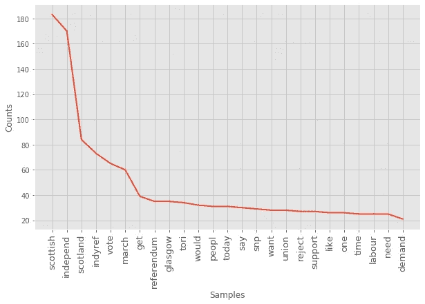**

**理解推文中的常用词**

**我们可以看到，“indyref2”、“scottish”、“independent”和“scotland”这几个词出现的频率高得不成比例。他们当然是。它们是我下载推文的关键词的一部分！所以我把它们排除在外，再看一看:**

**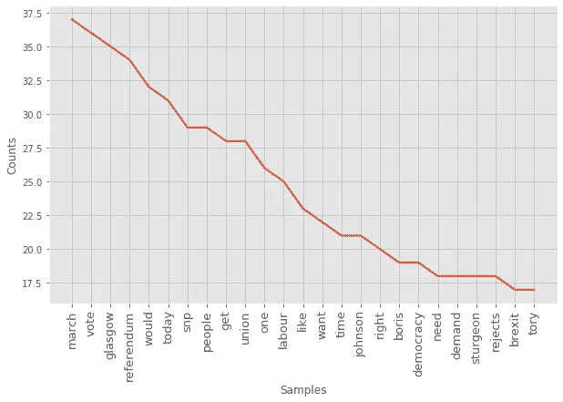**

**理解没有关键词的推文中使用的常用词**

**三月？为什么这个词是用得最多的？**

**啊！如果你住在英国，你可能会注意到 1 月 11 日， [**数千名苏格兰独立支持者游行穿过格拉斯哥，这是计划于 2020 年举行的一系列抗议活动的第一场。**并且该日期落在下载的推文的时间范围内。](https://www.theguardian.com/politics/2020/jan/11/thousands-scottish-independence-supporters-march-glasgow)**

****

**图片来源:罗伯特·佩里**

**所以是的…三月。**

**让我们用单词云图来形象化所有的单词，因为它们很酷:**

****

***词频词云***

**你可以看到，像“格拉斯哥”、“snp”、“人民”、“今天”、“工会”、“游行”、“公投”这些词是出现频率最高的。然而，它并没有给我们任何关于推文相关情绪的想法。所以让我们继续预测吧。**

**我使用 LSTM 训练模型来创建推文数据集的预测。我必须强调的是**这个模型通常检测消极或积极情绪**。它不会检测某人是否在推特上发布了反对或支持该话题的内容。**

**我还必须做一些清理，使它对神经网络友好。基本上相同的预处理应用于训练数据。**

**预测之后，正面标签推文的数量是 263 条
，负面标签推文的数量是 373 条:**

**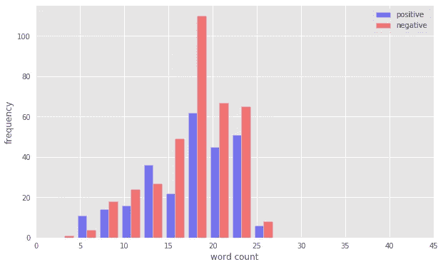**

**twitter 数据集中正面和负面推文的字数分布。**

**与被标记为正面的推文相比，被标记为负面的推文数量更多，尤其是当推文的字数更高时。对于我们的数据来说，推文越长，越有可能是负面的。**

**快速查看推文和它们的标签也很好。**

**以下推文被标记为负面:**

> **@anninnis @BBCPolitics 投票反对留在欧盟他们在 2014 年说过。世事变迁，因缘际会**
> 
> **对于@BorisJohnson 拒绝了@NicolaSturgeon 持有#Indyref2 的请求，我一点也不感到意外。**

**他们读起来确实有点生气或不安，尽管这取决于读者的视角。**

**以下内容被我们的模型标记为阳性:**

> **@CoyJudge 因为那次投票已经结束并且失败了，所以我继续前进，现在我们有了英国退出欧盟，我是获胜的一方。**
> 
> **我是工党，在这一点上我完全同意鲍里斯。SNP 整理出他们在苏格兰创造的所有 sh*t。Indyref2 死了。**

**没错。所以第二条推特预测对我来说有点奇怪，我不会把它归类为积极情绪。**

**唉，为了这个项目的目的，我继续用这个模型预测。**

# **地理空间分析**

**因为我喜欢地图，我不得不创建地理可视化来探索它们在苏格兰和英国的分布情况，因为推文围绕着苏格兰和英国的新闻。**

**值得一提的是，我们的数据集在发展过程中存在局限性。大多数 twitter 用户不广播他们的地理位置，但我的搜索标准只提取了一些信息，让我可以得到它。**

**因此，我可能错过了很多没有地理标签的推文，这些推文描绘的画面可能与我在地图上绘制的画面不同。**

**了解这一点不仅对解释结果至关重要，而且对理解我们如何在未来的分析中使模型更加稳健也至关重要。**

**策划这一切并不容易。数据有几个问题，缺少形状文件和其他问题。例如，一个位置被指示为位于格拉斯哥的 Kelvingrove 公园，因此它应该被替换为格拉斯哥标签。或者一些推文展示了小城镇，比如属于法夫地区的巴尔戈尼镇。为了保持一致，我还得重新命名它。**

**在这之后，我终于为一些地块和地质地块做好了准备。**

**首先，让我们看看大多数推文来自哪里。**

**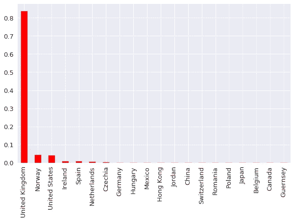**

***来源国推文统计直方图***

**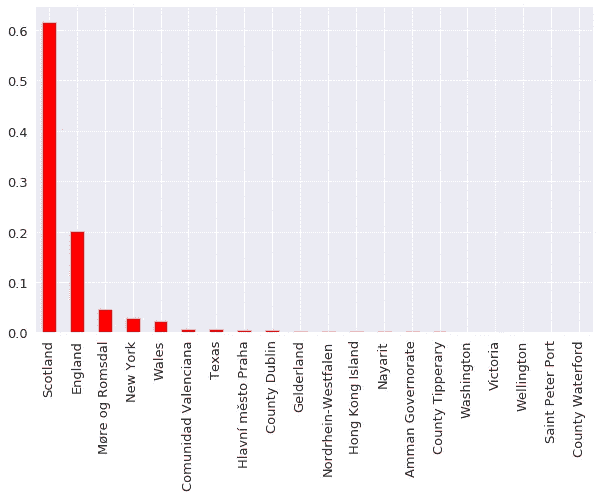**

***按国家/州划分的推文统计直方图***

**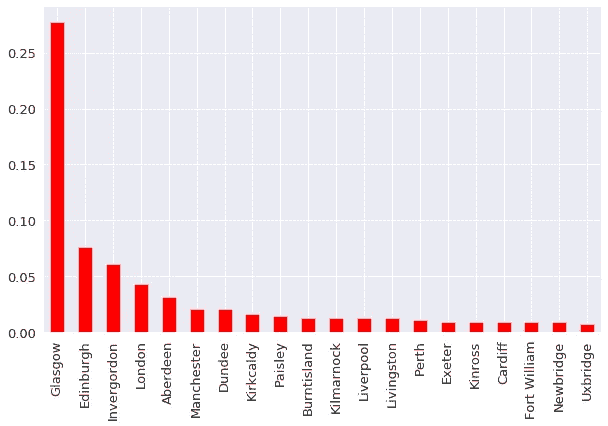**

***来源城市的推文统计直方图***

**大多数推文来自苏格兰，具体来说，来自格拉斯哥，不是首都，而是苏格兰最大的城市，以其高比例的独立支持者而闻名。然而，相当一部分来自英国。**

**接下来，我提取了英国每个城市的总体情绪，将正面情绪与负面情绪相加，最终的数字是一个+/-指标。**

**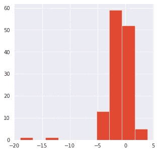**

***总情绪直方图***

**从直方图中可以清楚地看出，大多数值位于`-5`和`5`之间，总体情绪稍微偏向负面。平均情绪是负面情绪(`-1`)。与数据框架中的其他城市相比，还有几个城市的总体负面情绪值较大。**

**然后，我生成了下面的地图，通过这些消极和积极的情绪维度来可视化数据框架中城市的空间分布。点击此处查看[互动地图。](https://gracecarrillo.github.io/Political-Data-Science/twitter_uksentiment_map.html)**

**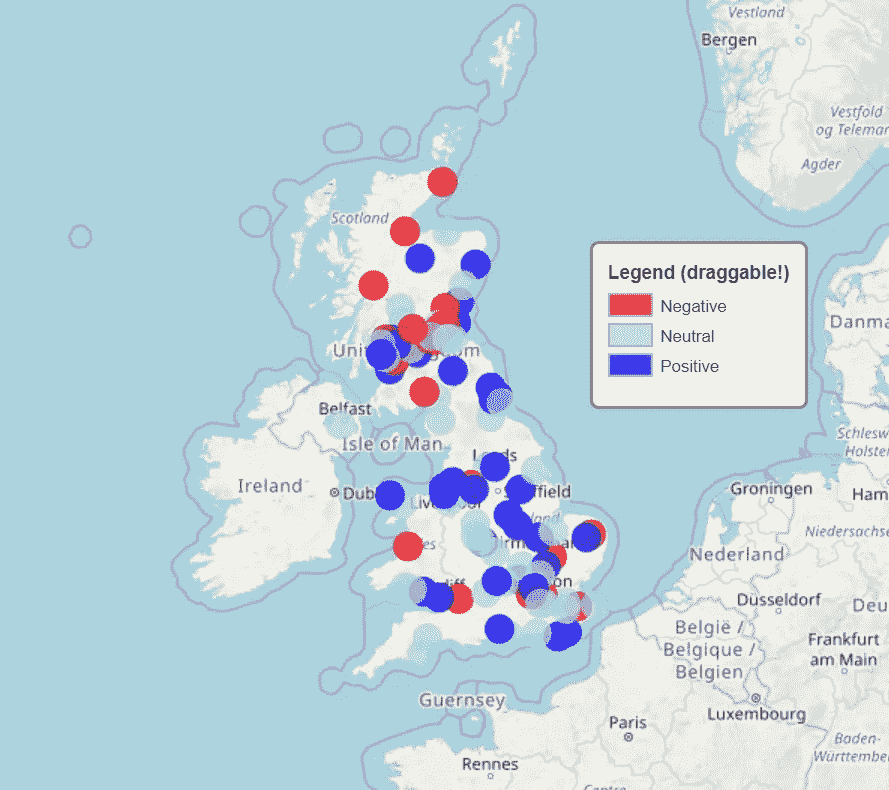**

***情感分布图***

**提醒一下，所用的总情绪是通过对每个城市的积极和消极因素求和得出最终数字。**

**我设置了一个颜色等级，其中任何低于`-1`的情绪都被标记为红色和消极，在`-1`和`1`之间的情绪是浅蓝色和中性，最后，高于`1`的情绪被认为是积极的，并被涂上蓝色。**

**总体而言，似乎来自苏格兰城市的推文比来自英格兰和威尔士的推文有更多的负面情绪。北爱尔兰有一个城市的推文总体上给人一种中性的感觉。总体负面情绪最高的城市(`-19`)是格拉斯哥，其次是苏格兰北部的因弗戈登(`-13`)。**

**总之，来自爱丁堡、格拉斯哥、邓迪和斯特灵的推文显示负面情绪，阿伯丁是唯一一个正面情绪的主要城市。对于英格兰来说，我们可以看到更多的蓝点而不是红色。然而，来自曼彻斯特、伦敦和布里斯托尔等大城市的推文总体上有负面情绪。来自威尔士首府卡迪夫的推文总体上情绪积极。没有足够的发自北爱尔兰的推文来了解整体情绪。**

**接下来，我生成了一个热图，以查看数据集中来自各自地理位置数据的每条推文，并观察推文的密度。点击这里查看[互动地图。](https://gracecarrillo.github.io/Political-Data-Science/twitter_uk_map.html)**

**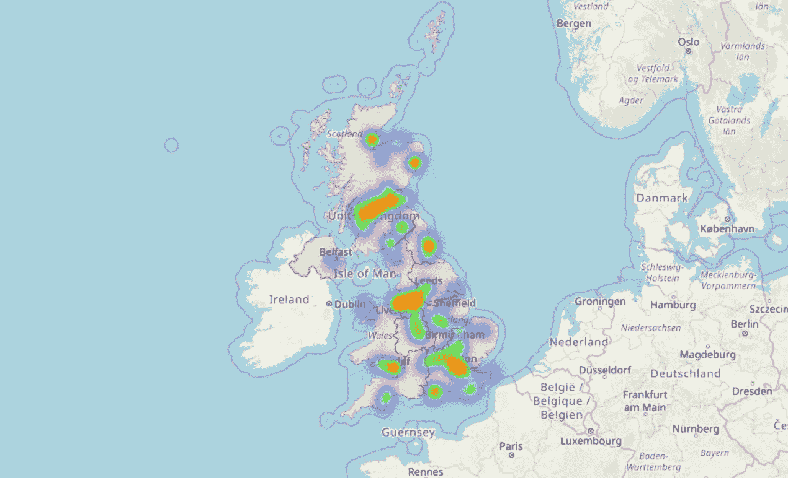**

**带有*的热图英国地图数据集中的所有推文来源***

**热图显示，正如预期的那样，许多推文来自人口密度高的城市地区。这些地区是格拉斯哥、爱丁堡、伦敦、利物浦、曼彻斯特和卡迪夫。这是可以预料的。很可能大多数 twitter 用户都居住在城市地区。**

**查看我的 Github 中的[完整笔记本和代码。](http://Model_Deployment_Sentiment_Analysis_Scotref2.ipynb)**

# **结论**

**在这篇文章的开始，我开始回答两个问题:**

> **英国人对当前要求苏格兰独立公投的政治气候有何反应？鲍里斯·约翰逊拒绝允许吗？**

**发自苏格兰的推文告诉我们，总的来说，人们的反应是消极的。鲍里斯·约翰逊宣布拒绝在 1 月 14 日举行全民公决。因此，可以解释为这些反应与该公告有关，因为它在我们下载的推文的时间范围内。**

> **苏格兰、英格兰、威尔士和北爱尔兰人的反应有何不同？对苏格兰特别感兴趣。**

**与来自英格兰城镇的推文相比，来自苏格兰的推文的情绪似乎有明显的差异。来自威尔士和北爱尔兰的信息不多。**

**一个有趣的步骤可能是在地图上添加一个时间维度，以可视化时间序列中的推文，并观察宣布前后推文情绪的变化。**

> **现在，这些结果并不意味着苏格兰发推文的人对第二次苏格兰独立公投持负面看法，而英格兰发推文的人持正面看法。**

**重要的是要记住，在最基本的形式下，情感分析算法是一种根据文本包含的被分类为正面或负面的单词的相对数量来确定文本内容正面或负面程度的方法。**

**我使用了一个超越基础的 LSTM 网络，因为它已经显示出[在给定足够的训练数据的情况下，它可以有效地学习社交媒体环境中的单词用法。](https://www.aclweb.org/anthology/O18-1021.pdf)**

**但它在确定推文是否对正在讨论的话题持负面态度方面是有限的。更像是，推文的意图是消极的还是积极的。**

**格拉斯哥的整体负面情绪可以解释为格拉斯哥人在推特上发布了很多负面词汇。当我们看一些推文时，非常愤怒的话。**

**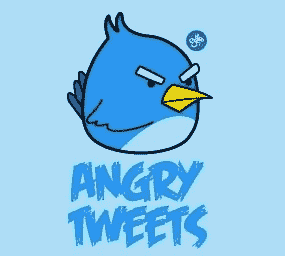**

**图片:[https://cinismoilustrado.com/](https://cinismoilustrado.com/)**

**利益相关者可能对苏格兰独立的具体情绪感兴趣，而不是极性本身。他们可能想了解**人们对这个话题**的感受，意识到与之相关的日益增长的愤怒、恐惧或失望。**

**在这篇[论文](http://emnlp2014.org/papers/pdf/EMNLP2014127.pdf)中，研究人员能够训练一个模型来学习三种类型的推文情绪指标:标签、标签模式和五种情绪之一的短语:喜爱、愤怒/愤怒、恐惧/焦虑、快乐或悲伤/失望。**

**用情感短语和它们的上下文来训练我们的分类器将是非常有益的。特别是用特殊的社区行为和特定区域的情感词汇来训练它。单词 *soft* 在很多情况下可能会唤起温暖的积极含义，但称橄榄球运动员 *soft* 是一种侮辱。**

**一个使用了反映愤怒、快乐、失望和其他情绪的苏格兰特有单词和短语的训练数据集可能会帮助我们了解苏格兰人对当前事态的真实看法。**

**仅此而已。我对政治非常有热情，所以这是一个非常令人兴奋的项目。**

**如果你设法看完了整本书，并且正在阅读这篇文章，感谢你的时间！非常感谢任何反馈。**