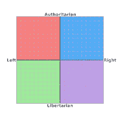
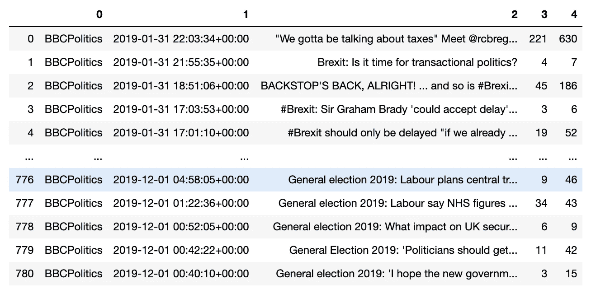

# 2019 年英国媒体的政治情绪

> 原文：<https://towardsdatascience.com/political-sentiment-of-british-media-in-2019-5c94fca7112f?source=collection_archive---------30----------------------->

图片来自[皮克斯拜](https://pixabay.com/?utm_source=link-attribution&utm_medium=referral&utm_campaign=image&utm_content=3509489)的马赫什·帕特尔

## 将 VADER 情感分析应用于政治观点

情感分析(意见挖掘)是自然语言处理(NLP)的一个分支，它评估给定文本的基本情感。它检测它是否有积极或消极的内涵。 **VADER** (Valence Aware 字典和情感推理器)是一个情感分析工具，旨在确定社交媒体上发布的短文本的情感。你可以在 GitHub 上找到 VADER 项目的完整文档。VADER 的主要优势在于，它不仅基于单词本身来评估情感，还会考虑大小写、标点符号和表情符号。帕鲁尔·潘迪写了一本非常好的 VADER 指南。

在这篇文章中，我将根据英国媒体在 2019 年发布的推文内容，用 VADER 来预测英国媒体的政治情绪。该项目的想法是，当将情感分析应用于包含某些词的文本时，例如，对立政党领导人的名字，我们可以测量不同媒体对不同政治家表达的情感的差异。通过将这些政客与他们的政治阵营联系起来，我们可以评估媒体的政治倾向。

# 方法

在分析中，我简化了什么是对的、左的、自由的或专制的定义。我完全明白这一点。然而，我的主要目的是测试 VADER 方法是否可以用来识别政治倾向，而不是精确地定义它们。然而，我认为我用来划分政治场景的方法很好地反映了现实生活中的分歧。

我将这种情绪分析为二维景观:左/右和威权/自由主义观点。在英国，两个主要政党是:保守党(又名托利党，右翼)和工党(左翼)。保守党和工党的领袖分别是:鲍里斯·约翰逊和杰里米·科尔宾。提到“**鲍里斯·约翰逊**的推文被用来评估右翼情绪，包括“**杰里米·科尔宾**的推文被用来评估左翼情绪。

杰里米·科尔宾和鲍里斯·约翰逊在他们自己的政治阵营中都被认为是有争议的人物。正因为如此，甚至来自左翼媒体的关于杰里米·科尔宾的推文也可能带有负面情绪。然而，来自同一家出版商的关于鲍里斯·约翰逊的推文可能会更加负面。为了解释这种相对消极性，我计算了每个出版商的左右情绪，从鲍里斯·约翰逊的情绪中减去杰里米·科尔宾的情绪。

例如，如果鲍里斯·约翰逊的情绪是-0.15，杰里米·科尔宾的情绪是-0.05，那么左右情绪= -0.1。任何低于 0 的都被归类为左翼情绪，任何高于 0 的都是右翼情绪。我还假设在-0.05 到 0.05 之间的任何值都是中性的。

识别威权-自由主义情绪更加困难。经过深思熟虑，我决定用对**欧盟**(欧盟)的态度作为自由主义观点的代理。我认为亲欧盟的观点更接近于亲自由主义的观点。另一方面，反欧盟的观点更有可能是更亲威权主义观点的结果。它可能不反映每个人的意见，但让我们接受它纯粹是为了测试的目的。

为了识别与 EU-相关的推文，我将提到**让-克洛德·容克(**欧盟委员会 2014-2019**主席)、唐纳德·图斯克**(欧洲理事会 2014-2019 主席)、**迈克尔·巴尼耶**(欧盟首席英国退出欧盟谈判代表)或简称为“**欧盟**”的推文分类为关于欧盟的推文。

为了评估政治情绪，我选取了 2019 年由 10 家媒体发布的推文(按字母顺序排列): **BBC** ，**每日快报，每日邮报，每日镜报，(The)经济学人，金融时报，(The)卫报，(The)独立报，(Daily)电讯报**和 **(The)时报**。

从历史的左右角度来看，英国媒体的政治倾向如下:
**右**:每日快报、每日邮报、电讯报和泰晤士报、经济学人、金融时报 **左**:卫报、镜报
**中间派** : BBC、独立报

如果你想了解英国的政治光谱，有一份关于政治同情的好报告，涵盖了一些用于分析的媒体。

我发现，当涉及到自由主义/威权主义的分裂时，很难判断这些标题。然而，我认为《每日快报》、《每日邮报》和《每日电讯报》更倾向于威权主义，而《经济学人》、《金融时报》和《独立报》则倾向于自由主义。其他头衔通常混合了自由主义者和权威主义者的观点。

# 数据准备

为了提取推文，我使用了 *GetOldTweets3* 库。似乎你不能一次抽出太多，因此，对于每个用户名(媒体标题)，我分别提取了每个月的推文，并在过程结束时合并它们。下面是 BBC 2019 年 9 月的一个例子。

保存到数据框中的推文如下所示(BBC 示例)。

最后，我把所有的媒体合并成一个文件。我做了一点清理，从正文中删除了 http 链接。此外，我已经删除了相同文本的重复推文。我没有做任何额外的文本清理，因为 VADER 更好地处理带有感叹号、大写字母、表情符号等的文本。你可以在这里找到最终文件。

VADER 产生积极的、中立的和消极的分数，这些分数代表属于每个类别的文本的比例。它还产生复合得分，这是推文单词的所有词典评级的标准化总和。复合评估文本的整体色调，范围从-1(负)到 1(正)，介于-0.05 和 0.05 之间的值归类为中性。

VADER 的伟大之处在于，分数不仅能告诉你文章是正面还是负面，还能告诉你文章是正面还是负面。我曾用复合分数来评价情感，作为四个中最全面的一个。

这个化合物的初始标度在-1 和 1 之间。正如我之前提到的，为了计算左右情绪，我从约翰逊的得分中扣除了科尔宾的得分。通过这样做，我已经将情绪得分的整体范围更改为-2 到 2。然而，我想比较一下左右派情绪和威权-自由主义情绪(等级为 1 比 1)。为了让这两个尺度可以直接比较，我使用了一个 *tanh* 变换，将左右情绪重新调整回-1 到 1 之间的值。

我还调整了欧盟情绪的最终得分，将它除以-1。用这种方法，我把积极的一面转化为消极的一面，反之亦然。我这样做是为了让我的图表与互联网上的其他政治罗盘图表兼容，这些图表在 Y 轴的顶端是专制主义，底部是自由主义。

我们现在可以创建最终图表了…

# 结果

VADER 准确地预测了政治情绪的走向。我们可以争论相对比例(例如，一个标题是否比另一个更右翼)。尽管如此，总的来说，左翼头衔在左边，右翼头衔在右边。唯一的两个潜在的奇怪之处(在我看来)是:《独立报》似乎比《卫报》更左翼，此外，在独裁主义方面。另一个奇怪的是《经济学人》,它可能更接近中间立场。

*   图表上显示的名称是 Twitter 账户的名称。

## 4 个最重要的发现是:

*   英国媒体偏向于威权主义观点——大多数人坐在图表的顶部。
*   他们也更倾向于右翼而不是左翼
*   小报(《每日快报》、《每日邮报》和《每日镜报》)倾向于呈现不均衡的观点——它们位于图表的外围
*   《金融时报》是最平衡的标题——几乎是一个完美的中心！

# 结论

使用非常简单的标准(“约翰逊”、“科尔宾”和“欧盟”)，我可以创建一个政治同情地图，这可能离现实不远。通过对左右派和威权-自由派分裂的一些额外研究，VADER 方法可以成为评估政治情绪的有力工具。

# 参考

[1]克莱顿·j·休顿，埃里克·吉伯特， [VADER:一种基于简约规则的社交媒体文本情感分析模型](http://comp.social.gatech.edu/papers/icwsm14.vader.hutto.pdf)(2014 年 7 月)，美国安阿伯 AAAI 网络日志和社交媒体国际会议

[2]帕鲁尔·潘迪，[使用 Python 中的 VADER 简化情感分析(在社交媒体文本上)](https://medium.com/analytics-vidhya/simplifying-social-media-sentiment-analysis-using-vader-in-python-f9e6ec6fc52f)，【2018 年 9 月】分析 Vidhya

[3]马丁·贝克，[如何从推特上抓取推文](/how-to-scrape-tweets-from-twitter-59287e20f0f1)(2019 年 1 月)，走向数据科学

# 附加说明

分析中使用的推特账号:
@TheEconomist、@TheTimes、@guardian、@FT、@BBCpolitics、@DailyMailUK、@Daily_Express、@Independent、@DailyMirror、@Telegraph