# Python 中从头开始的多项式回归

> 原文：<https://towardsdatascience.com/polynomial-regression-from-scratch-in-python-1f34a3a5f373?source=collection_archive---------18----------------------->


照片由[雷德查理](https://unsplash.com/@redcharlie?utm_source=medium&utm_medium=referral)在 [Unsplash](https://unsplash.com?utm_source=medium&utm_medium=referral) 上拍摄

## 学习用一些简单的 python 代码从头开始实现多项式回归

线性回归的改进版本中的多项式回归。如果你知道线性回归，对你来说就简单了。如果没有，我将在本文中解释这些公式。还有其他更先进、更有效的机器学习算法。但是学习基于线性的回归技术是一个好主意。因为它们简单、快速，并且与众所周知的公式一起工作。尽管它可能无法处理复杂的数据集。

# 多项式回归公式

只有当输入变量和输出变量之间存在线性相关性时，线性回归才能表现良好。正如我之前提到的，多项式回归建立在线性回归的基础上。如果你需要复习线性回归，这里有线性回归的链接:

[](/basic-linear-regression-algorithm-in-python-for-beginners-c519a808b5f8) [## Python 中的线性回归算法

### 学习线性回归的概念，并使用 python 从头开始开发一个完整的线性回归算法

towardsdatascience.com](/basic-linear-regression-algorithm-in-python-for-beginners-c519a808b5f8) 

多项式回归可以更好地找到输入特征和输出变量之间的关系，即使这种关系不是线性的。它使用与线性回归相同的公式:

Y = BX + C

我确信，我们在学校都学过这个公式。对于线性回归，我们使用这样的符号:

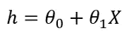

这里，我们从数据集中得到 X 和 Y。x 是输入要素，Y 是输出变量。θ值是随机初始化的。

对于多项式回归，公式如下:

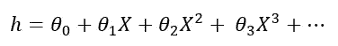

我们在这里添加了更多的术语。我们使用相同的输入特征，并采用不同的指数来产生更多的特征。这样，我们的算法将能够更好地学习数据。

幂不必是 2、3 或 4。它们也可以是 1/2、1/3 或 1/4。那么该公式将如下所示:

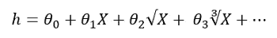

# 成本函数和梯度下降

成本函数给出了预测的假设离值有多远的概念。公式是:

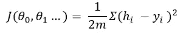

这个等式可能看起来很复杂。它正在做一个简单的计算。首先，从原始输出变量中扣除假设。取一个正方形来消除负值。然后将该值除以训练样本数量的 2 倍。

什么是梯度下降？它有助于微调我们随机初始化的θ值。我不想在这里讲微积分。如果对每个θ取成本函数的偏导数，我们可以导出这些公式:

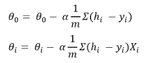

这里，α是学习率。你选择α的值。

# 多项式回归的 Python 实现

下面是多项式回归的逐步实现。

1.  在这个例子中，我们将使用一个简单的虚拟数据集来给出职位的工资数据。导入数据集:

```
import pandas as pd
import numpy as np
df = pd.read_csv('position_salaries.csv')
df.head()
```

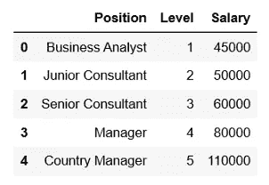

2.添加θ0 的偏移列。这个偏置列将只包含 1。因为如果你用一个数乘以 1，它不会改变。

```
df = pd.concat([pd.Series(1, index=df.index, name='00'), df], axis=1)
df.head()
```

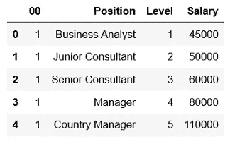

3.删除“职位”栏。因为“位置”列包含字符串，而算法不理解字符串。我们用“级别”栏来表示职位。

```
df = df.drop(columns='Position')
```

4.定义我们的输入变量 X 和输出变量 y。在本例中，“级别”是输入特征，“薪金”是输出变量。我们想预测工资水平。

```
y = df['Salary']
X = df.drop(columns = 'Salary')
X.head()
```

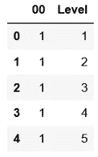

5.取“级别”列的指数，得到“级别 1”和“级别 2”列。

```
X['Level1'] = X['Level']**2
X['Level2'] = X['Level']**3
X.head()
```

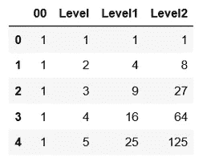

6.现在，将数据标准化。将每列除以该列的最大值。这样，我们将得到每一列的值，范围从 0 到 1。即使没有归一化，该算法也应该工作。但它有助于更快地收敛。此外，计算数据集长度 m 的值。

```
m = len(X)
X = X/X.max()
```

7.定义假设函数。会用 X 和θ来预测 y。

```
def hypothesis(X, theta):
    y1 = theta*X
    return np.sum(y1, axis=1)
```

8.用上面的成本函数公式定义成本函数:

```
def cost(X, y, theta):
    y1 = hypothesis(X, theta)
    return sum(np.sqrt((y1-y)**2))/(2*m)
```

9.写出梯度下降的函数。我们将不断更新θ值，直到找到最佳成本。对于每一次迭代，我们将计算未来分析的成本。

```
def gradientDescent(X, y, theta, alpha, epoch):
    J=[]
    k=0
    while k < epoch:
        y1 = hypothesis(X, theta)
        for c in range(0, len(X.columns)):
            theta[c] = theta[c] - alpha*sum((y1-y)* X.iloc[:, c])/m
        j = cost(X, y, theta)
        J.append(j)
        k += 1
    return J, theta
```

10.所有函数都已定义。现在，初始化θ。我正在初始化一个零数组。您可以采用任何其他随机值。我选择α为 0.05，我将迭代 700 个时期的θ值。

```
theta = np.array([0.0]*len(X.columns))
J, theta = gradientDescent(X, y, theta, 0.05, 700)
```

11.我们得到了最终的θ值和每次迭代的成本。让我们用最终的θ找到工资预测。

```
y_hat = hypothesis(X, theta)
```

12.现在绘制原始工资和我们预测的工资水平。

```
%matplotlib inline
import matplotlib.pyplot as plt
plt.figure()
plt.scatter(x=X['Level'],y= y)           
plt.scatter(x=X['Level'], y=y_hat)
plt.show()
```

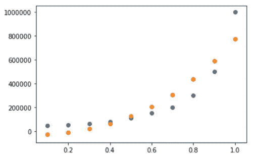

我们的预测不完全符合工资的趋势，但也很接近。线性回归只能返回一条直线。但是在多项式回归中，我们可以得到这样的曲线。如果直线不是一条漂亮的曲线，多项式回归也可以学习一些更复杂的趋势。

13.让我们在梯度下降函数中绘制我们在每个时期计算的成本。

```
plt.figure()
plt.scatter(x=list(range(0, 700)), y=J)
plt.show()
```

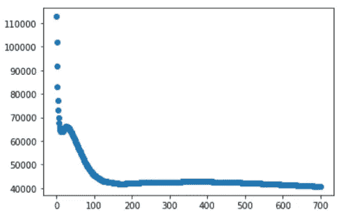

成本在开始时急剧下降，然后下降缓慢。在一个好的机器学习算法中，成本应该保持下降，直到收敛。请随意用不同的历元数和不同的学习率(alpha)来尝试。

下面是数据集:[薪资 _ 数据](https://github.com/rashida048/Machine-Learning-With-Python/blob/master/position_salaries.csv)

点击此链接获取完整的工作代码:[多项式回归](https://github.com/rashida048/Machine-Learning-With-Python/blob/master/polynomial%20regression.ipynb)

## 推荐阅读:

[](/interactive-geospatial-data-visualization-in-python-490fb41acc00) [## Python 中的交互式地理空间数据可视化

### 绘制世界特定地区的地图，在地图上展示活动，并四处导航

towardsdatascience.com](/interactive-geospatial-data-visualization-in-python-490fb41acc00) [](https://medium.com/towards-artificial-intelligence/similar-texts-search-in-python-with-a-few-lines-of-code-an-nlp-project-9ace2861d261) [## 用几行代码在 Python 中搜索相似的文本:一个 NLP 项目

### 使用 Python 中的计数矢量器和最近邻法查找类似的维基百科简介，这是一个简单而有用的…

medium.com](https://medium.com/towards-artificial-intelligence/similar-texts-search-in-python-with-a-few-lines-of-code-an-nlp-project-9ace2861d261) [](/logistic-regression-in-python-to-detect-heart-disease-2892b138d0c0) [## Python 中用于检测心脏病的逻辑回归

### 发展逻辑回归演算法的重要方程式和如何发展逻辑回归演算法

towardsdatascience.com](/logistic-regression-in-python-to-detect-heart-disease-2892b138d0c0) [](https://medium.com/towards-artificial-intelligence/build-a-neural-network-from-scratch-in-python-f23848b5a7c6) [## 用 Python 从头开始构建神经网络

### 神经网络的详细说明和逐步实现

medium.com](https://medium.com/towards-artificial-intelligence/build-a-neural-network-from-scratch-in-python-f23848b5a7c6) [](https://medium.com/towards-artificial-intelligence/build-a-simple-recommendation-system-in-python-7747be06a2f2) [## 使用 Python 中的简单代码构建一个推荐系统

### 如何用 Python 构建电影推荐系统

medium.com](https://medium.com/towards-artificial-intelligence/build-a-simple-recommendation-system-in-python-7747be06a2f2)