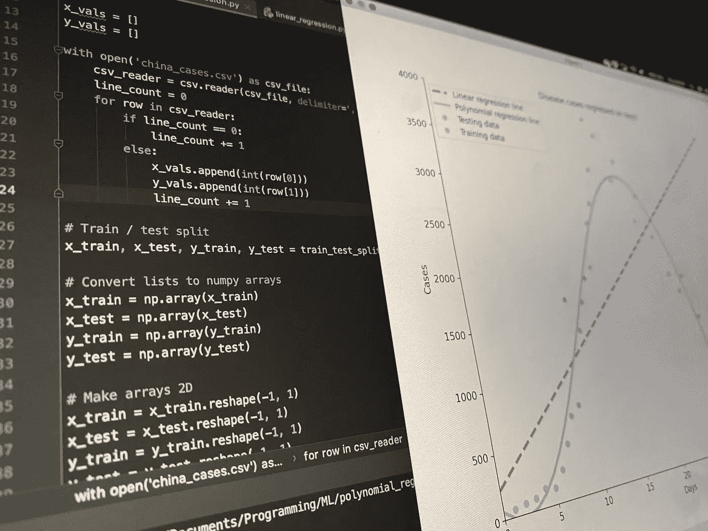
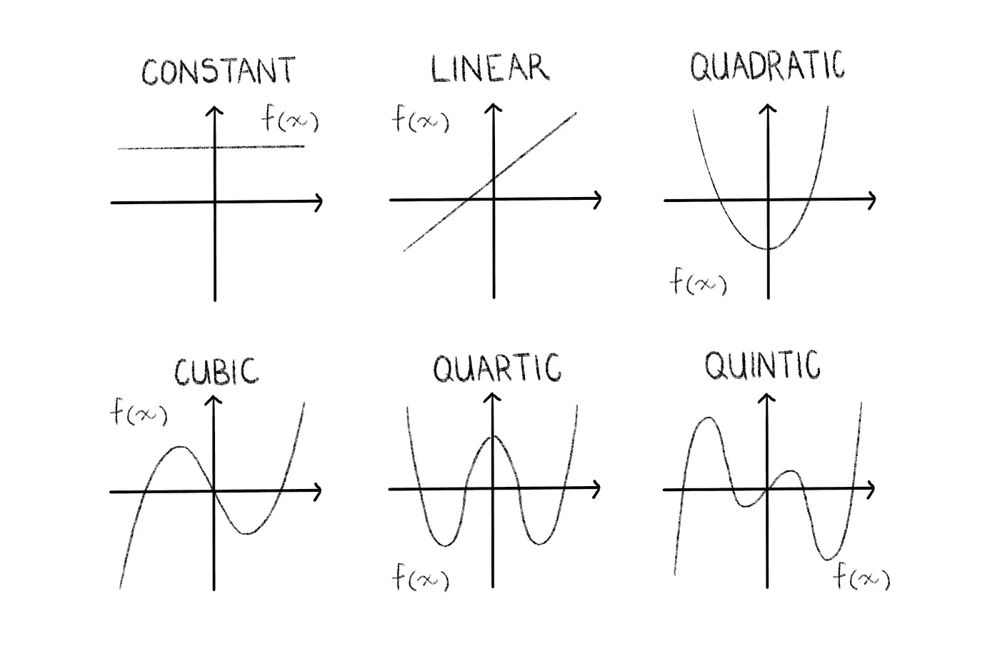
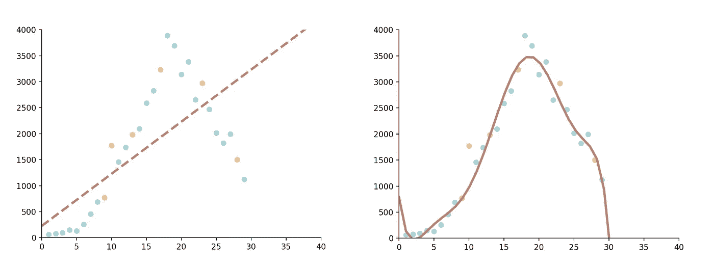
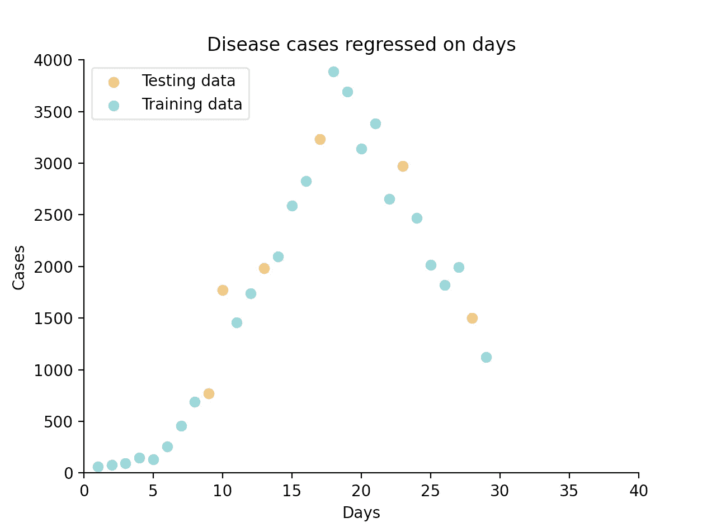
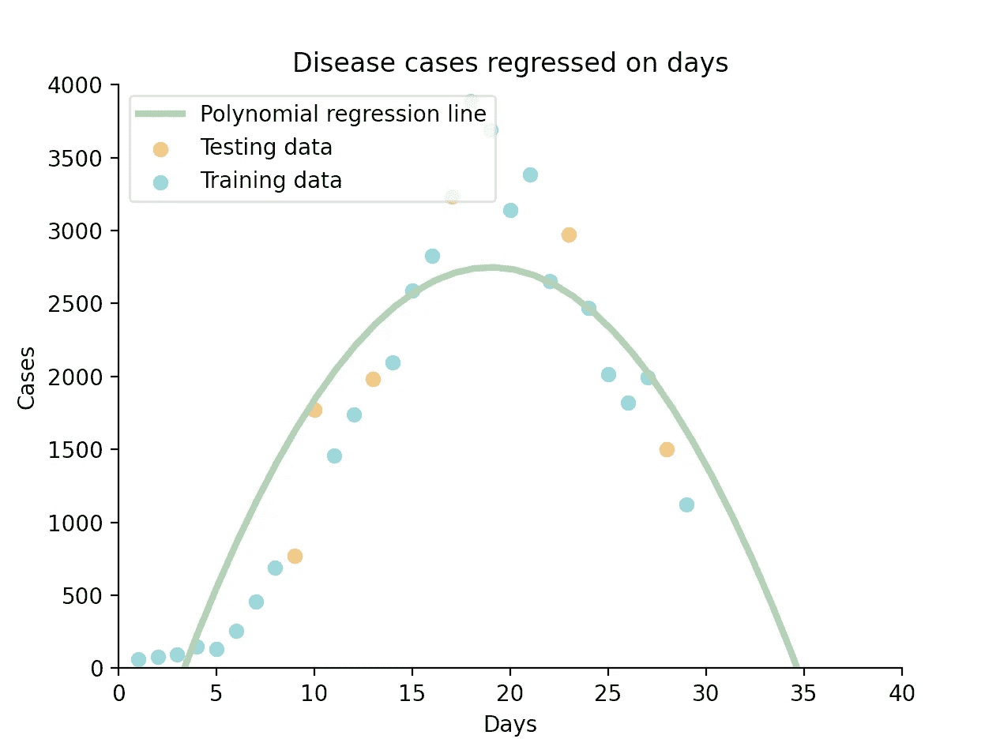
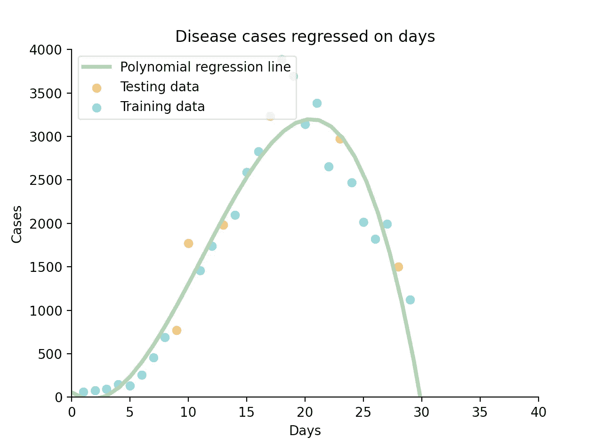

# 多项式回归:你需要的唯一介绍

> 原文：<https://towardsdatascience.com/polynomial-regression-the-only-introduction-youll-need-49a6fb2b86de?source=collection_archive---------19----------------------->

## 一名学生对 Python 中机器学习算法背后的理论和应用的深入探究



Python 多项式回归代码(所有照片由作者提供)

# 介绍

在我看来，多项式回归是机器学习过程中自然的第二步。在现实世界中比线性回归有用得多，但仍然易于理解和实现。

作为一名学生，我觉得自己处于一个独特的位置，可以向你们解释这个概念，因为我希望有人向我解释这个概念。

**我在这里的目标是在理论和实现之间取得平衡，不遗余力地解释这种算法的内部工作原理、术语、它所基于的数学，最后是编写它的代码，以一种完全全面但对初学者友好的方式。** *一个学生对另一个学生。*

> **因此，欢迎阅读我希望在构建第一个多项式回归模型时能够读到的文章。**

## 重要提示:

如果你是初学者，我建议你先阅读我关于线性回归的文章，我在下面有链接。在这本书里，我讲述了一些基本的回归知识和术语，我将在整篇文章中以这些知识和术语为基础，例如:

*   回归分析概述。
*   回归工作原理的解释。
*   重要术语包括 R、均方误差和方差。
*   一个详细的线性回归例子。

如果你不熟悉我上面提到的任何东西，请先阅读这篇文章，因为我不会再详细解释这些概念，它们是至关重要的。

[](/linear-regression-the-actually-complete-introduction-67152323fcf2) [## 线性回归:(实际上)完全介绍

### 一位同学用 Python 对这个简单的机器学习算法进行了全面、深入的解释

towardsdatascience.com](/linear-regression-the-actually-complete-introduction-67152323fcf2) 

# 该理论

P 多项式回归是一种回归分析形式，其中自变量 *x* 和因变量 *y* 之间的关系被建模为*n 次*多项式在 *x* 中。

***那么是什么意思呢？***

你可能还记得，从高中开始，以下功能:

```
Degree of 0 —> Constant function —> f(x) = a
Degree of 1 —> Linear function (straight line) —> f(x) = mx + c
Degree of 2 —> Quadratic function (parabola) —> f(x) = ax^2 + bx+ c
Degree of 3 —> Cubic function —> f(x) = ax^3 + bx^2 + cx + d
```

当编写多项式回归脚本时，在某个阶段，我们必须选择我们想要绘制图形的*次*，我将在后面演示。现在，让我们看看这对我们的函数意味着什么:

***什么是度？***

嗯，你可能已经注意到上面的模式:*一个多项式的次数就是它的任何一项的最高次幂。因此，我们选择的程度将决定我们用哪个函数来拟合数据。*



0–5 次多项式函数

**以上都是多项式。**

多项式的简单意思是*【多项】*，在技术上定义为由变量和系数组成的表达式，只涉及变量的加、减、乘和非负整数指数的运算。

值得注意的是，虽然线性函数确实符合数学中多项式的定义，但在机器学习的背景下，我们可以将它们视为回归分析的两种不同方法。

实际上，多项式回归在技术上是一种线性回归。尽管多项式回归将非线性模型拟合到数据，但作为统计估计问题，它是线性的，因为回归函数 *E(y|x)* 在根据数据估计的未知参数中是线性的。因此，多项式回归被认为是多元线性回归的特例。

> **简而言之:**把多项式回归想成包含二次和三次函数，把线性回归想成线性函数。

# 术语

让我们快速浏览一些重要的定义:

## 单变量/双变量

*   一个*单变量数据集*只涉及一个量，如倍数或权重，从中我们可以确定均值、中值、众数、范围和标准差等，并可以表示为条形图、饼图和直方图。
*   一个*双变量数据集*有两个量，例如一段时间内的销售额，我们可以用它来比较数据和寻找关系，并且可以用散点图、相关性和回归来表示。

## 装配不足/过度装配

*   当我们的统计模型不能充分捕捉数据的基本结构时，就会出现欠拟合。
*   相反，过度拟合会产生与特定数据集过于接近的分析，因此可能无法拟合额外的数据或可靠地预测未来的观察结果。



欠装配(左)和过装配(右)的示例

# 该算法

那么，我们什么时候会选择多项式而不是线性回归呢？

*在 3 种主要情况下，多项式回归会超过线性回归:*

1.  理论上的原因。研究者(你)可能会假设数据是曲线，在这种情况下，你显然应该用曲线来拟合它。
2.  对数据进行目视检查后，可能会发现一种曲线关系。这可以通过简单的散点图来实现(这就是为什么在应用回归分析之前，您应该始终对您的数据进行单变量和双变量检查)。
3.  检查模型的残差。试图用线性模型拟合曲线数据会导致高正负残差和低 R 值。

让我们更进一步。我们如何选择多项式的次数？

你可以做各种数学分析来决定你的模型的最佳程度，但归结起来就是要确保你不会低估或过度拟合数据。出于我们的目的，简单地检查散点图将揭示合适的选项。

记住，我们执行回归分析的方法是通过确定最小化残差平方和的系数。

# 这个例子

首先，进口:

1.  熊猫——创建一个数据框架
2.  numpy——做科学计算
3.  Matplotlib (pyplot 和 RC params)-创建我们的数据可视化
4.  Skikit-Learn(线性回归、train_test_split 和多项式特征)-执行机器学习

```
import pandas as pd
import matplotlib.pyplot as plt
from matplotlib import rcParams
from sklearn.model_selection import train_test_split
from sklearn.linear_model import LinearRegression
from sklearn.preprocessing import PolynomialFeatures
```

在这个例子中，我创建了自己的数据集，代表了中国 30 天内记录的新冠肺炎新增病例数量，并将其存储在一个 csv 文件中。该文件如下所示:

```
x,y
1,59
2,77
3,93
...,...
```

接下来，我们使用 pandas 将 *x* an *y* 值读入两个数组。你也可以用 pandas 的 iloc 来做这件事，甚至在没有 pandas 的情况下，手动从文件中读取数据。这个 pandas 方法非常方便，因为我们可以通过名称来访问列。

```
data = pd.read_csv('china_cases.csv')x = data['x'].values
y = data['y'].values
```

我们现在有两个如下所示的数组:

```
[1 2 3 4 5 ...]
[59 77 93 149 131 ...]
```

让我们将数据分成训练集和测试集。为此，我们将使用 Skikit-Learn 方便的 train_test_split 函数。我们将数组 *x* 和 *y* 值作为参数传递给它，此外还有一个*测试大小*(您希望测试部分包含多少数据)和一个*随机状态*(一个整数，表示数据在被分割之前如何被混洗。如果您忽略它，每次运行回归时，您的结果都会略有不同，因此保留它以重现您的结果，但您可以将其删除以用于生产)。

```
x_train, x_test, y_train, y_test = train_test_split(x, y, test_size=0.2, random_state=42)
```

现在是通过散点图对数据进行双变量检验的好时机。我将使用 rcParams 和图例添加一些样式，使它在视觉上更具吸引力。

```
rcParams['axes.spines.top'] = False
rcParams['axes.spines.right'] = Falseplt.scatter(x_test, y_test, c='#edbf6f', label='Testing data')
plt.scatter(x_train, y_train, c='#8acfd4', label='Training data')
plt.legend(loc="upper left")
plt.show()
```

下面，您可以清楚地看到，线性模型不会精确地适合该数据集，但看起来二次或三次函数会很好地工作。



训练和测试数据的散点图

在这一点上，我们想增加我们的数组的维数到 2D，因为这是多项式特征类所要求的必要的矩阵格式。我们可以简单地通过调用 *reshape()* 函数来实现这一点，在这里我们定义我们希望我们的数据如何被整形。

```
x_train = x_train.reshape(-1, 1)
y_train = y_train.reshape(-1, 1)
```

我们的数组现在看起来像这样(这是 *x_train* ):

```
[[22]
 [ 1]
 [27]
 [14]
 [16]
  ...]
```

然而，正如你所看到的， *train_test_split* 打乱了我们的数据，所以不再排序。Matplotlib 将按照接收到的顺序绘制点，所以如果我们像现在这样给它输入数组，我们会得到一些非常奇怪的结果。为了对数组重新排序，我们按照 *x_train 的*索引对 *y_train* 进行排序，并对 *x_train* 本身进行排序。

```
y_train = y_train[x_train[:,0].argsort()]
x_train = x_train[x_train[:, 0].argsort()]
```

正如我前面提到的，我们必须设置多项式的次数。我们通过创建一个 PolynomialFeatures 类的 object *poly* 来实现这一点，并将我们需要的能力作为参数传递给它。

```
poly = PolynomialFeatures(degree=2)
```

此外，我们必须将输入数据矩阵转换成给定阶数的新矩阵。

```
x_poly = poly.fit_transform(x_train)
```

我们剩下要做的就是训练我们的模型。我们创建一个 LinearRegression 类的对象 *poly_reg* (记住多项式回归在技术上是线性的，所以它属于同一个类),并使我们转换的 *x* 值和 *y* 值适合模型。

```
poly_reg = LinearRegression()
poly_reg.fit(x_poly, y_train)
```

现在我们简单地绘制我们的线:

```
plt.title('Disease cases regressed on days')
plt.xlabel('Days')
plt.ylabel('Cases')
plt.plot(x_train, poly_reg.predict(x_poly), c='#a3cfa3', label='Polynomial regression line')
plt.legend(loc="upper left")
plt.show()
```



二次多项式回归

这就是了，一个符合我们数据的二次函数。

**如果我们把度数设为 3 呢？**



三次多项式回归

这个三次函数似乎更适合我们的数据。让我们通过使用*线性回归*类*来检查他们各自的 R 分数，以更清楚地了解他们的准确性。score()* 功能:

```
print(poly_reg.score(x_poly, y_train))
```

我们二次函数的 R 值是 0.81，而三次函数的 R 值是 0.93。在这种情况下，我会说第三度是一个更合适的选择。

*注意:如果您选择 1 作为度数，您将执行线性回归，但这将是一种非常迂回的方式。*

**如果你想了解另一个有用的最大似然算法，K-Means，看看这篇文章:**

[](/k-means-clustering-for-beginners-ea2256154109) [## 适用于初学者的 k-均值聚类

### 一个深入的解释和一步一步的指导这个有趣和有用的机器学习算法在 Python 中，由…

towardsdatascience.com](/k-means-clustering-for-beginners-ea2256154109) 

# 结论

这就结束了对机器学习的第二简单算法多项式回归的全面介绍。我希望，作为一名学生，我能够相关而全面地解释这些概念。

让我们来复习一下我们学过的内容:

1.  提醒一下什么是二次函数。
2.  一些重要的术语。
3.  对算法的解释，包括何时使用多项式回归以及如何选择次数。
4.  实际例子。
5.  对我们的模型使用不同程度的比较。

如果你觉得这篇文章有帮助，我很乐意与你合作！关注我 [Instagram](https://www.instagram.com/adenhaus/) 了解更多机器学习、软件工程和创业内容。

编码快乐！

[**订阅**](https://medium.com/subscribe/@adenhaus) 📚为了不错过我的一篇新文章，如果你还不是中等会员，请加入 🚀去读我所有的，还有成千上万的其他故事！

# 资源

**分析因子** *回归模型:*[https://www . The Analysis Factor . com/Regression-model show-do-you-know-you-need-a-polynomial/](https://www.theanalysisfactor.com/regression-modelshow-do-you-know-you-need-a-polynomial/)

**维基** *过度拟合:*[https://en.wikipedia.org/wiki/Overfitting](https://en.wikipedia.org/wiki/Overfitting)

**数学很好玩** *单变量和双变量数据:*[https://www.mathsisfun.com/data/univariate-bivariate.html](https://www.mathsisfun.com/data/univariate-bivariate.html)

**堆栈溢出** *随机状态:*[https://Stack Overflow . com/questions/28064634/Random-State-pseudo-Random-number-in-scikit-learn](https://stackoverflow.com/questions/28064634/random-state-pseudo-random-number-in-scikit-learn)

**sci kit-Learn***sk Learn . preprocessing . polynomial features:*[https://sci kit-Learn . org/stable/modules/generated/sk Learn . preprocessing . polynomial features . html # sk Learn . preprocessing . polynomial features . fit _ transform](https://scikit-learn.org/stable/modules/generated/sklearn.preprocessing.PolynomialFeatures.html#sklearn.preprocessing.PolynomialFeatures.fit_transform)

**Scikit-Learn***sk Learn . linear _ model。线性回归:*[https://sci kit-learn . org/stable/modules/generated/sk learn . linear _ model。LinearRegression.html](https://scikit-learn.org/stable/modules/generated/sklearn.linear_model.LinearRegression.html)

**Scikit-Learn***sk Learn . model _ selection . train _ test _ split:*[https://Scikit-Learn . org/stable/modules/generated/sk Learn . model _ selection . train _ test _ split . html](https://scikit-learn.org/stable/modules/generated/sklearn.model_selection.train_test_split.html)

**栈溢出** O *排序点:*[https://Stack Overflow . com/questions/31653968/matplotlib-connecting-error-Points-in-line-graph](https://stackoverflow.com/questions/31653968/matplotlib-connecting-wrong-points-in-line-graph)

**堆栈溢出** *根据另一个列表的索引对一个列表排序:*[https://Stack Overflow . com/questions/6618515/Sorting-list-based-on-values-from-other-list](https://stackoverflow.com/questions/6618515/sorting-list-based-on-values-from-another-list)

**堆栈溢出** *按第二列排序 2D 数组:*[https://Stack Overflow . com/questions/22698687/how-to-sort-2d-array-numpy-ndarray-based-to-the-second-column-in-python](https://stackoverflow.com/questions/22698687/how-to-sort-2d-array-numpy-ndarray-based-to-the-second-column-in-python)