# ML 从零开始-使用 PyTorch 的多项式回归

> 原文：<https://towardsdatascience.com/polynomial-regression-using-pytorch-from-scratch-500b7887b0ed?source=collection_archive---------26----------------------->

来自 [Pexels](https://www.pexels.com/photo/aerial-photography-of-island-3427774/?utm_content=attributionCopyText&utm_medium=referral&utm_source=pexels) 的 [Lukas Rodriguez](https://www.pexels.com/@lukas-rodriguez-1845331?utm_content=attributionCopyText&utm_medium=referral&utm_source=pexels) 摄影

## 如何编写多项式回归模型及其背后的数学的完整指南

说到预测分析，回归模型被证明是最具成本效益的方法之一。虽然线性回归模型可以提供一些很好的预测，但在某些情况下，多项式回归模型可以大大优于简单的线性模型。在下面的项目中，我们将看看如何在 PyTorch 中从头开始创建多项式回归模型。

# 项目目标

*   在 **PyTorch** 中实现机器学习模型，使用多项式回归算法进行预测。

我们将使用基本的 PyTorch 张量运算，完全从头开始创建模型。

*   利用该模型对汽车价格进行预测分析。在项目的最后，我们的目标是开发一个高效的 ML 模型，它可以根据汽车的特征预测汽车的价格。
*   对数据进行可视化和描述性分析，以预测哪些功能在确定汽车价格时起着关键作用。

# 导入项目依赖关系

在我们开始这个项目之前，让我们导入所有必要的库和函数。

现在，让我们导入数据集。

如果你打算自己动手，这里有数据集的[链接。](https://www.kaggle.com/goyalshalini93/car-data)

我还会在本文末尾将 GitHub repo 与项目笔记本和数据集链接起来。

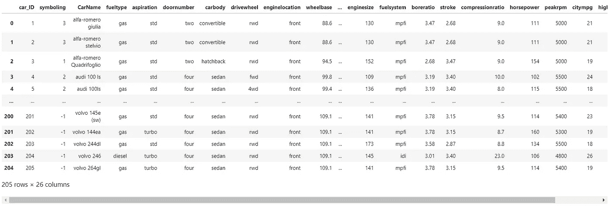

在我的笔记本中看到的数据框

由于多项式回归模型对于初学者来说已经有点太难了，因此，为了简单起见，我们将在项目中只使用连续变量。

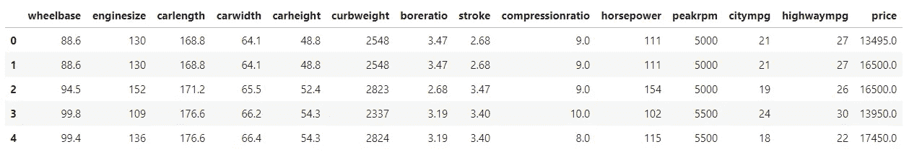

我们将着手更新数据框

# 数据争论

现在，让我们分析数据，看看是否需要清理或修改。首先，让我们检查数据帧中每一列的数据类型。

*需要注意的一点是，数据集没有空值。

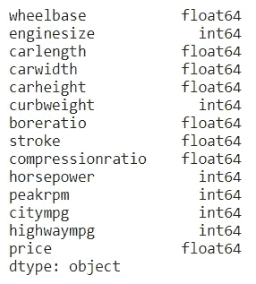

不同列的数据类型

正如我们所看到的，一些数据是' *int64 '，*类型，而一些数据是' *float64'* 类型。由于我们将使用张量，我们可能希望在我们的特征集中有一个统一的数据类型。因此，我们将在后面的步骤中将整个数据帧转换为' *float64'* 。

现在，我们将看看数据框的描述性分析。

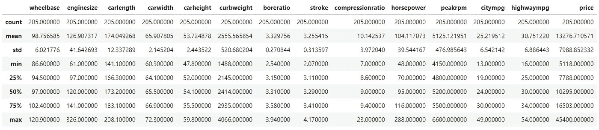

显示我们的数据框的描述性分析的表格

正如我们所看到的，不同列中的数据在规模上有很大差异。在我们的数据集中，在较低范围上有顺序为 *1e+0* 的元素，在较高范围上有顺序为 *1e+3* 的元素。**我们可能想要将数据标准化**。我们将在项目的后续步骤中处理这个问题。

# 特征选择

让我们首先绘制每个独立变量相对于目标变量(质量)的曲线图。

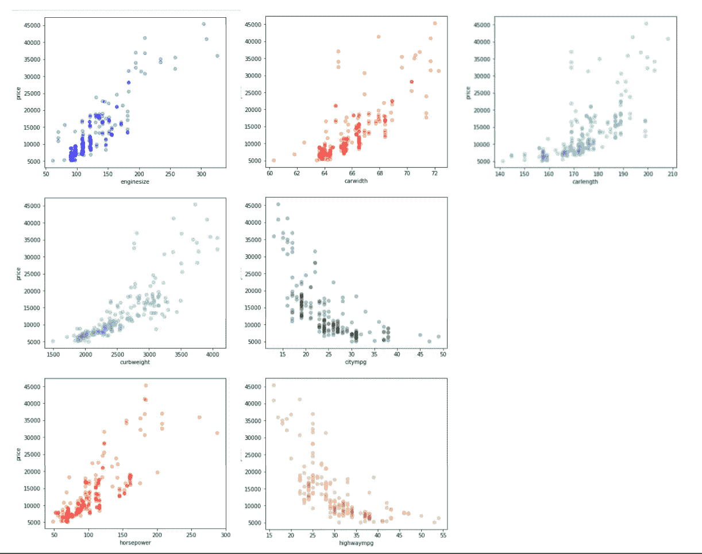

所有情节的截图

现在，让我们看看数据集的相关值。

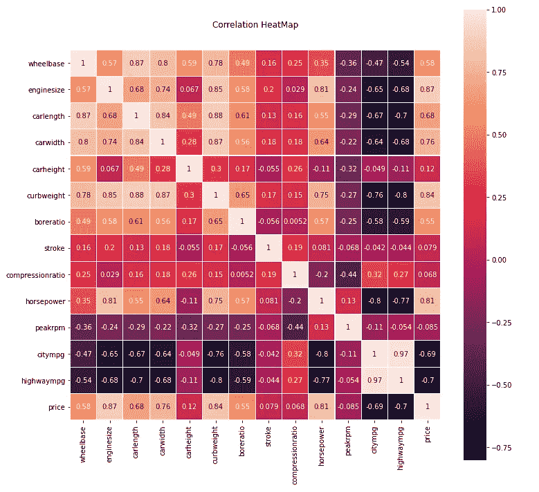

> 从上面的直观分析中，我们可以清楚地看到**发动机尺寸** (++0.87)、**整备质量** (+0.84)和**马力** (+0.81)与因变量**价格**呈现出非常强的相关性。
> 
> **车宽** (0.76)、**城市 mpg** (-0.69)、**公路 mpg** (-0.70)和**汽车长度** (0.68)表现出相对较强的相关性。因此，在本例中，我们将选择这 7 项作为我们的培训功能。

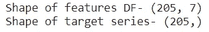

特征测向和目标系列的形状

> 现在，我们将研究我们的模型。但在此之前，首先让我们再一次观察目标的特征图。

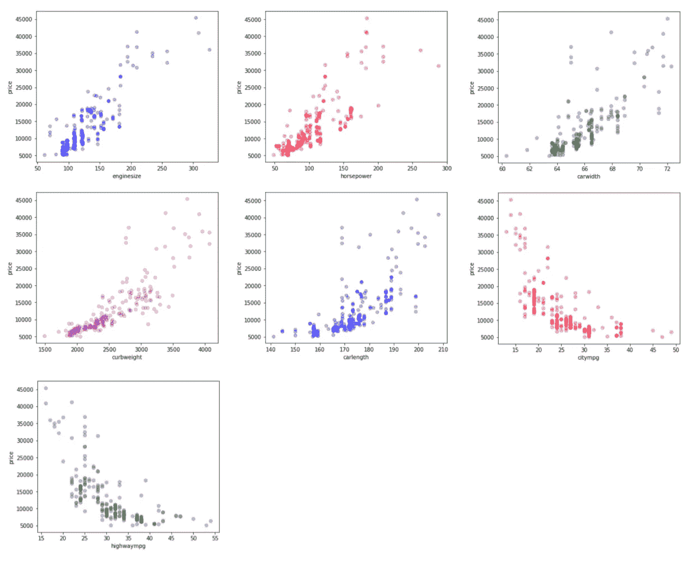

我们的自变量对因变量的图表

> 如果我们仔细观察图表，我们会注意到特征**发动机尺寸**、**整备重量**、马力、**车长**和**车宽**具有类型 **y = x2** 的图表。
> 
> 另一方面， **citympg** 和 **highwaympg** 具有类型 **y = 1 / x2** 的图形。
> 
> 因此，我们将相应地处理这些特性。

# 从头开始构建模型

下面给出了我们的多项式回归模型将工作的公式。

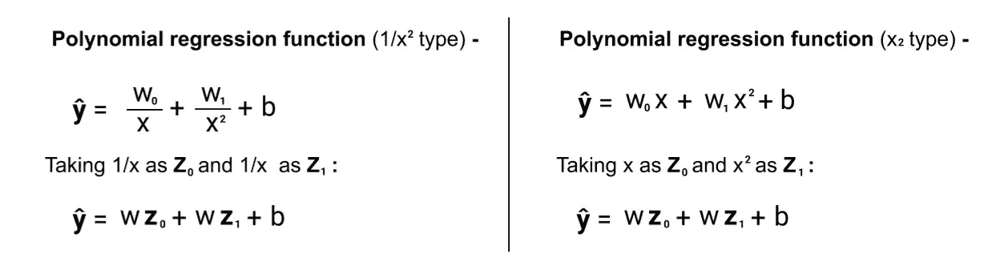

根据我们的特征集的多项式回归公式

> 正如我们所看到的，多项式回归函数可以替换为线性回归函数

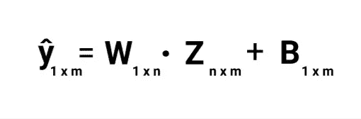

这里，

*   **ŷ** -目标变量的预测值
*   **W** -这是一个(1 x m)矩阵，包含与每个多项式变换的因变量相关的所有权重
*   **X** -包含所有多项式变换特征变量的矩阵转置
*   **B** - A (1 x m)矩阵，其中每个元素都是我们函数的偏差值。
*   **m**——训练/测试集中的行数
*   **n** -多项式变换特征的数量

> 现在让我们将特征(Pandas Dataframe 对象)和目标(Pandas Series 对象)转换为张量对象，这样我们就可以用它们来训练 PyTorch 的模型。

张量特征 _x2 和特征 _ 1byX2 的大小

> 现在，对于激活函数类型为 **y = x2** 的特征，我们首先创建 x2 特征，然后将其连接到我们的张量对象。

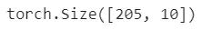

> 现在，对于激活函数类型为 **y = 1/x2** 的特征，我们首先创建 1/x2 特征，然后将其连接到我们的张量对象。

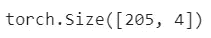

> 有了这个，我们已经多项式变换了我们的特征。
> 
> 最后，我们将把所有转换后的特征张量连接成一个单一的张量对象。

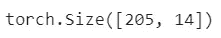

# 特征缩放

由于我们将使用随机梯度下降(SGD)算法作为我们模型的优化算法，缩放可以显著改善优化过程和我们模型的性能。

在这个项目中，我们将执行最小-最大缩放。最小-最大归一化转换数据，使所有值都在[0，1]之间。

最小-最大归一化的数学公式如下:

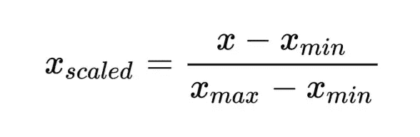

这里，

*   **X** =观察值
*   **X** min =在列中观察到的最小值
*   **X** max =列中观察到的最大值
*   **X** *比例值* =比例值

现在，让我们对我们的特征集执行最小-最大归一化。

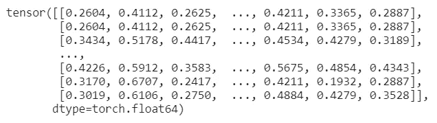

所有值都在[0，1]之间的缩放特征集

> 现在，我们将创建一个张量对象，它保存与多项式变换的归一化特征相关联的权重。这些权重是随机生成的，非常小。

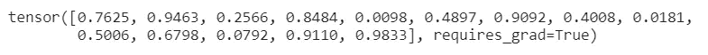

> 现在，让我们为我们的模型初始化一个随机偏差。

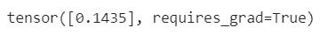

> 最后，将目标数组转换成张量。

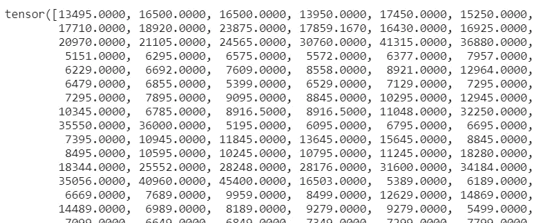

目标张量的屏幕截图

**现在，让我们定义回归函数**。

为我们的特征集运行多元回归函数

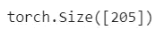

现在，我们将定义我们的均方差( **MSE** )函数。MSE 是计算总模型损耗最常用的方法之一。下面给出了 MSE 的计算公式。

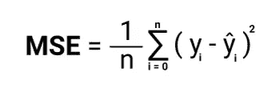

在为我们的模型运行 MSE 函数时-

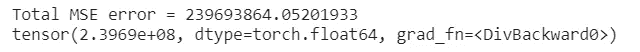

> 正如我们所见，我们的模型目前给出了一个非常大的 MSE。因此，我们需要优化我们的模型权重和偏差，以提高其性能。

# 优化模型

为了优化我们的模型，我们将使用随机梯度下降(SGD)算法。下面给出了与 SGD 优化器算法相关的数学。

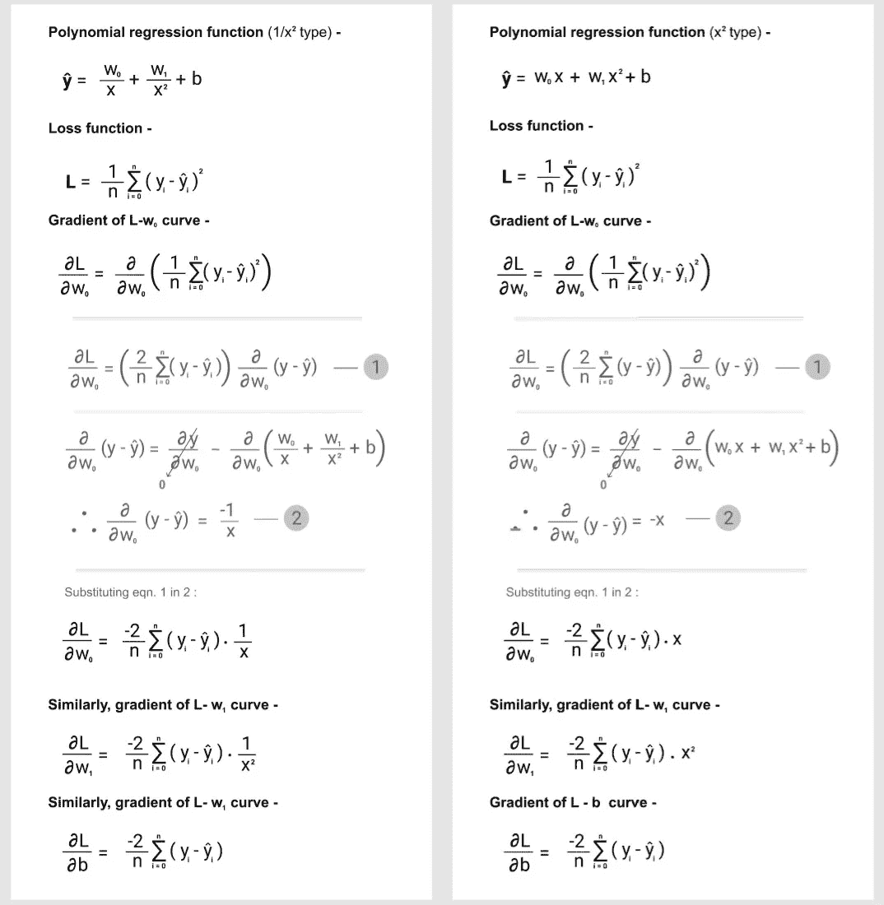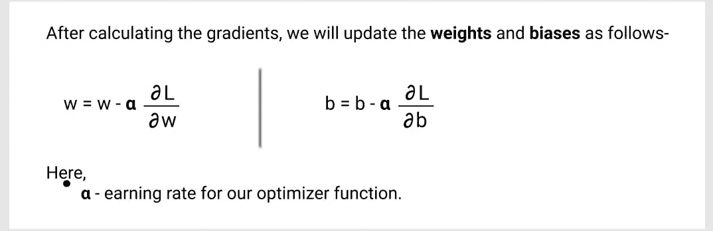

有关 SGD 的更多信息，请访问[此](https://medium.com/bayshore-intelligence-solutions/why-is-stochastic-gradient-descent-2c17baf016de)链接。

在我们的模型中，我们将使用 PyTorch 内置的梯度计算函数来计算和更新权重和偏差。

完成所有这些后，我们将最终为我们的模型运行优化器函数。

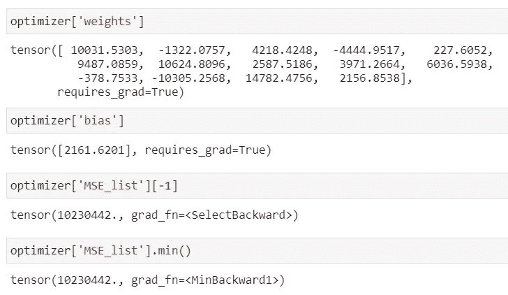

通过为我们的模型运行优化器函数获得的结果

现在，为了检查我们模型的准确性，我们将计算它的 r 平方得分。以下是 r2 得分的公式-

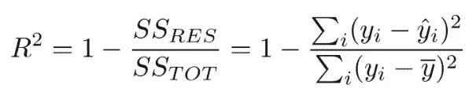

现在，让我们检查模型的性能。我们将使用通过优化函数获得的更新模型和权重。

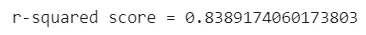

我们模型的 r 平方分数

正如我们所见，我们的多项式回归模型可以解释因变量约 83–84%的方差。这是一个相当有效的模型。

这里需要注意的一点是，我们在同一个数据集上执行了训练和测试，这是一种糟糕的做法。相反，您应该将数据集分为测试集和训练集。然而，在这个例子中，当从头开始创建模型时，我跳过了这一步，以使事情简单易懂。

在项目的最后，让我们为模型的所有多项式变换特征绘制回归图。

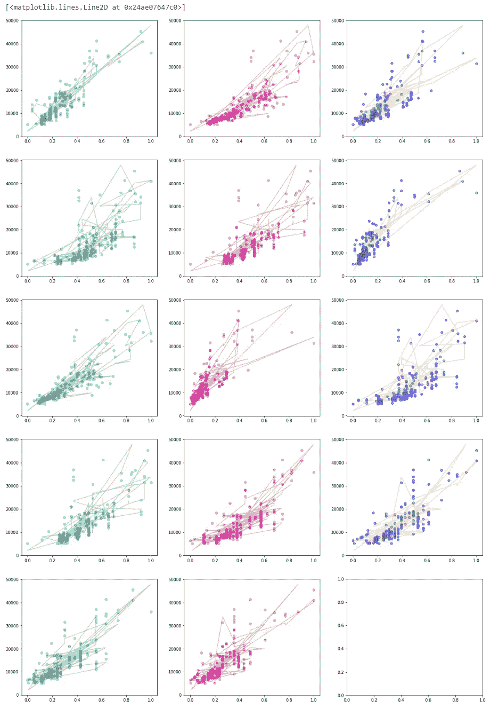

从上面的图表中，我们可以看到我们的模型表现得相当好。

这样，我们的项目就结束了。更多像这样有趣的项目，请查看[我的简介](https://medium.com/@amansharma2910)。

我只是机器学习和数据科学领域的新手，所以任何建议和批评都将真正帮助我提高。

点击以下链接，继续关注更多 ML 内容！

**数据集和 Jupyter 笔记本的 GitHub repo 链接-**

 [## aman Sharma 2910/多项式回归 _ 从头开始 _ 使用 _PyTorch

### repo 包含我的项目的 Jupyter 笔记本，在那里我从头开始创建了一个多项式回归模型，使用…

github.com](https://github.com/amansharma2910/PolynomialRegression_from_scratch_using_PyTorch)