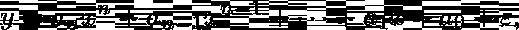
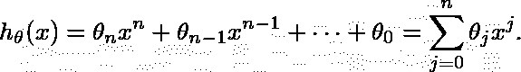
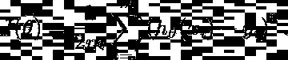
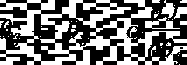
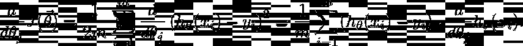
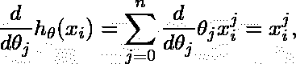
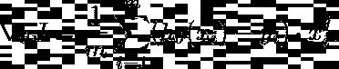
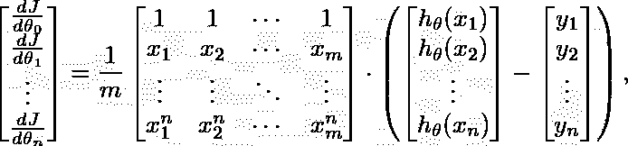

# 多项式回归-使用哪个 python 包？

> 原文：<https://towardsdatascience.com/polynomial-regression-which-python-package-to-use-78a09b0ac87b?source=collection_archive---------21----------------------->

## 用 numpy、scipy、sklearn、tensorflow 表达的“Hello world”。


“协同捕鱼”。葡萄牙 [2019](https://private.zerowithdot.com/travelling/) 。(作者私人收藏)

# 介绍

多项式回归是数据分析和预测中最基本的概念之一。不仅任何(无限可微的)函数至少在一定区间内可以通过[泰勒级数](https://en.wikipedia.org/wiki/Taylor_series)表示为多项式，这也是机器学习初学者首先面临的问题之一。它被用于各种学科，如金融分析、信号处理、医学统计等。

虽然多项式回归是一个相对简单的概念，但它成为了机器学习中的一种“hello world”问题，因为它涉及到许多核心概念。尽管如此，有些部分可能听起来令人困惑，尤其是因为:

*   它一次引入了几个东西，尽管只有一些是多项式回归特有的。
*   它通常以多种不同的方式实现。

在这篇博文中，我们将使用这两个方程从头构建它，并通过代码来表达它们。然后，我们将我们的实现与数据科学中最广泛使用的四个 python 库进行比较:

*   numpy，
*   暴躁，
*   scikit-learn，
*   张量流，

并讨论它们之间的差异，同时指出基本层面上的相似之处。

# 问题是

先讨论数学基础。

从数学上讲，*回归*的问题是试图对自变量 *x* 和因变量 *y* 之间的关系进行建模。假设 *y'* s 依赖于 *x* 用以下形式表示:



我们称之为*多项式回归*(ε表示噪声项)。自然，如果最大值 *n = 1* ，问题就变成了*线性回归*。

解决问题意味着确定所有*和* ₙ's 的值来很好地表示数据。它可以归结为以下步骤的要素:

*   关于 *y* 形式的一个“猜想”。它叫做一个*假设*函数 *h(x)* 。
*   在给定真实数据值的情况下，衡量假设有多“差”的一种方法。使用所谓的*损失*函数 *J* 来量化这种“不良”。
*   关于我们如何潜在地“调整”假设，使我们更好地逼近数据点的想法。换句话说，我们需要有某种*最小化* *J* 的方法。

# 选择假设

说到多项式回归，我们首先需要假设的是我们将用作假设函数的多项式的*次。如果我们选择成为度，假设将采取以下形式:*



# 成本函数和均方误差

接下来，我们选择用来表示成本函数的度量。对于回归问题，选择所谓的*均方误差(MSE)* 是有意义的，它衡量单个点与我们的预测之间的平均距离，达到二次幂。



这里 *m* 与数据点个数相关，为了方便引入 *1* /2 因子(见后)。我们还将所有参数表示为参数向量 *θ = (θ₁、θ₂、……、θₙ)* 。

MSE 指标只是一种选择，但由于以下原因，它是合理的:

*   MSE 在误差方向上是不可知的(例如不像*平均误差*在一次幂中只与 *h-y* 成比例)。
*   MSE 会因二次幂而严重惩罚较大差异(异常值)(例如，与 abs 成比例的*平均绝对误差*(*h-*y))不同。
*   对于均方误差，更容易获得梯度(例如不像*均方根误差*那样为ìMSE)。

# 梯度下降

一旦我们建立了成本函数并设置了一些随机的初始值 *θ* ，我们就希望最小化 *J* 。其中一个可能的选择是*梯度下降*优化算法。顾名思义，它要求我们计算 *∇J* 并随后相应地更新所有 *θ* 。

换句话说，我们需要计算每一个 *θ* ₖ的 *J* 的导数，并用它们来改变 *θ* 的值:



从而使得假设越来越好地表示数据。

幸好 *d* J/d *θ* 很容易计算:



最后一项是假设函数相对于 *θ* 的导数。因为我们假设它是一个多项式:



整个梯度变成:



如果我们把所有的 *x* 组织成一个例子向量，我们可以用向量矩阵乘法来表示上面的公式:



或者以更紧凑的形式


这里**、 X 、表示由上升到连续幂的示例向量组成的矩阵 *j = 0、1、…、n* 。**

# 基本实现(幼稚)

我们称这种实现方式*为幼稚的*，因为它并没有针对性能进行优化。相反，重点是强调代码和基本方程之间的对应关系。

首先，我们将使用符号多项式的自定义实现(参见[要点](https://gist.github.com/OlegZero13/8295d18d5339a96a8dee596d1189d0d6))。`Polynomial`类基于多项式表达式(第一个等式)定义了一个可调用对象。它实现了许多类似于我们的[四元数例子](https://levelup.gitconnected.com/using-dunder-methods-to-refine-data-model-c58ee41102e9)的代数方法，但是现在最重要的部分是初始化。

我们从创建一个具有随机系数 *θ* 的`Polynomial`对象开始。

```
import numpy as np
from nppoly import Polynomial

np.random.seed(42)

def hypothesis(degree):
    return Polynomial(*np.random.rand(degree + 1))
```

此方法接受并返回一个具有随机系数的多项式。接下来，我们定义我们的 MAE 成本函数:

```
def cost(h, X, y):
    return 0.5 / len(y) * ((h(X) - y) ** 2).sum()
```

这里的`len(y)`相当于和`h`、`X`和`y`是假设，那么 **x** 和**y**——自变量和值的向量。请注意，大写`X`更多的是一种传统，以强调其类似矩阵的特征。然而，在我们的例子中，`X`只与一维数据相关联。

接下来，我们需要表达 *J* 的梯度。多亏了这个推导，我们已经知道了这个表达式:

```
def grad_theta(h, X, y):
    diff = (h(X) - y).reshape(-1, 1)

    X = X.reashape(1, -1)
    X = list(map(lambda i: x ** i, reversed(range(h.shape))))
    X = np.concatenate(X)

    return 1 / len(y) * (X @ (diff)).reshape(1, -1)
```

在这个函数中，我们需要执行几次整形，以确保我们可以将矩阵乘以一个向量。第 4-6 行负责构造 **X** ，`reversed`函数用于遵守 *θ* ₙ站在 *θ* ₙ₋₁.之前的约定

最后，使用以下函数完成优化例程:

```
def optimize(h, X, y, epochs=5000, lr=0.01):
    theta = h._coeffs.reshape(1, -1)
    for epoch in range(epochs):
        theta -= lr * grad_theta(h, X, y)
        h = Polynomial(*theta.flatten())
    return h
```

这里，第 2 行只是假设的初始化。然后，在 for 循环内部，我们执行 *θ ←θ - α∇J* ，其中 *α* 是所谓的学习率`lr`，重复周期传统上称为“epochs”。

可以通过执行一个小脚本来验证优化:

```
# fake data
X = np.linspace(0, 10, num=5)
y = 4 * X - 2 + np.random.randn(len(X))

h = hypothesis(1)
h = optimize(h, X, y)

# prediction
X_test = np.linspace(-5, 25, num=31)
y_pred = h(X_test)
```

# Python 库

## Numpy

第一个实现多项式回归的库是 [numpy](https://numpy.org/doc/stable/reference/generated/numpy.polyfit.html) 。它使用`numpy.polyfit`函数来执行此操作，该函数给出数据(`X`和`y`)以及度数，执行该过程并返回系数数组 *θ* 。

```
import numpy as np
from numpy import polyfit

# fake data
X = np.linspace(0, 10, num=5)
y = 4 * X - 2 + np.random.randn(X)

u = polyfit(X, y, deg=1)

# prediction
X_test = np.linspace(-5, 25, num=31)
y_pred = u[0] * X_test + u[1]
```

如果`full`设置为`True`，该功能将提供额外的诊断，为我们提供与不确定性相关的信息。

## Scipy

解决多项式回归问题的另一个“配方”是 [scipy](https://docs.scipy.org/doc/scipy/reference/generated/scipy.optimize.curve_fit.html) 中的`curve_fit`。与`polyfit`相比，该函数更加通用，因为它不需要我们的“模型”采用多项式形式。它的界面也不一样。

```
import numpy as np
from scipy.optimize import curve_fit

def linear_function(x, a, b):
    return a * x + b

def quadratic_function(x, a, b, c):
    return a * x**2 + b * x + c

# fake data
X = np.linspace(0, 10, num=5)
y1 = 4 * X - 2 + np.random.randn(len(X))
y2 = 5 * X ** 2 - 3 * X + 10 + np.random.randn(len(X))

u = curve_fit(linear_function, X, y1)[0]
v = curve_fit(quadratic_function, X, y2)[0]

# prediction
X_test = np.linspace(-5, 25, num=31)
y_pred_1 = linear_function(X_test, u[0], u[1])
y_pred_2 = quadratic_function(X_test, v[0], v[1], v[2])
```

与`polyfit`相反，这个函数首先需要一个模型函数作为参数传入。它可以是任何参数化的数学公式，然而，`curve_fit`强加了一个条件:模型函数本身接受数据`x`作为它的第一个参数。最后，它返回优化的系数，类似于`polyfit`，尽管它也返回诊断信息(因此在最后用`[0]`来抑制它)。

## sci kit-学习

就机器学习而言，Scikit-learn (或 sklearn)是一个“首选”库。它非常注重接口的一致性，这意味着它试图使用相同的方法(如`.fit`、`.transform`、`.fit_transform`和`.predict`)来统一对不同特性和算法的访问。求解线性回归解是相当容易的，然而，多项式回归的情况需要一点思考。

让我们从线性回归开始。

```
import numpy as np
from sklearn.linear_model import LinearRegression

# fake data
X = np.linspace(0, 10, num=5).reshape(-1, 1)
y = 4 * X - 2 + np.random.randn(len(X))

linreg = LinearRegression()
linreg.fit(X, y)

# prediction
X_test = np.linspace(-5, 25, num=31).reshape(-1, 1)
y_pred = linreg.predict(X_test)
```

这里，解决方案是通过`LinearRegression`对象实现的。按照 scikit-learn 的逻辑，我们首先使用`.fit`方法将对象调整到我们的数据，然后使用`.predict`呈现结果。注意`X`需要被重新整形为一个`(m, 1)`向量列。

为了解决更一般的多项式回归情况，我们需要将`LinearRegression`与`PolynomialFeatures`对象结合起来，因为没有直接的解决方案。事实上，sklearn 的构建意图是处理与数据相关的问题，而不是成为一个方程求解器。更多的差异可以在这个[帖子](/polynomial-regression-with-scikit-learn-what-you-should-know-bed9d3296f2)中找到。

```
import numpy as np
from sklearn.preprocessing import PolynomialFeatures
from sklearn.linear_model import LinearRegression
from sklearn.pipeline import make_pipeline

# fake data
X = np.linspace(0, 10, num=5).reshape(-1, 1)
y = 5 * X ** 2 - 3 * X + 10 + np.random.randn(len(X))

polyreg = make_pipeline(
        PolynomialFeatures(degree=2),
        LinearRegression()
        )
polyreg.fit(X, y)

# prediction
X_test = np.linspace(-5, 25, num=31).reshape(-1, 1)
y_pred = polyreg.predict(X_test)
```

起点是 [PolynomialFeatures](https://scikit-learn.org/stable/modules/generated/sklearn.preprocessing.PolynomialFeatures.html) 类，它基于通用变量和创建“混合”术语。这里，我们把这个变换应用到，这个获得一个特征向量(矩阵)(1， **x** ， **x** )，因为 *n = 2* ，并且 **x** 是一维的。然后，使用 sklearn 的[管道](https://scikit-learn.org/stable/modules/generated/sklearn.pipeline.make_pipeline.html)，我们将 **x** 与线性系数 *θ* 结合起来，基本上将每个 **x** 视为一个单独的变量。最后，我们解决它，就像我们面对标准的线性回归问题，获得 *θ* 。

我们可以看到这里采用的方法与 numpy 和 scipy 都有很大的不同。因为 sklearn 更多地从连续调整(`fit`)、数据转换(这里不需要)和预测(`predict`)的角度“看待”问题。无论哪种方式，结果都是一样的。

# 张量流

我们在这里介绍的最后一个软件包是 [Tensorflow 2.0](https://www.tensorflow.org/) 。由于在 2.0 版本中引入的 API 已经有了实质性的变化，我们不打算呈现 1.x 版本中提供的解决方案。但是，如果你感兴趣，请参考 trần ngọc·明的这篇精彩的[帖子](https://www.codeproject.com/Tips/5263107/Updating-Linear-Regression-Model-To-TensorFlow-2-0)。

流程的外观与我们最初的实现非常相似。事实上，在引擎盖下，它非常不同。我们先来看看下面的片段:

```
import numpy as np
import tensorflow as tf

LEARNING_RATE = 0.0001
N_EPOCHS = 100000
DEGREE = 2

X = np.linspace(0, 10, num=5).reshape(-1, 1)
y = 5*X**2 - 3*X + 10 + np.random.randn(len(X))

theta = tf.Variable([0.0] * (DEGREE + 1), name='parameters')

def hypothesis(x):
    return sum([theta[i] * x**i for i in range(DEGREE + 1)])

def cost(y_pred, y):
    return tf.reduce_mean(tf.square(y_pred - y))

for epoch in range(N_EPOCHS):
    with tf.GradientTape() as tape:
        y_predicted = h(X)
        cost_value = cost(y_predicted, y2)
    gradients = tape.gradient(cost_value, theta)
    theta.assign_sub(gradients * LEARNING_RATE)

X_test = np.linspace(-5, 25, num=31)
y_test = hypothesis(X_test).numpy()
```

与假设和成本函数相关的逻辑是相同的。此外，使用相同的方法执行训练，只有函数名称不同。然而，事实是 tensorflow 试图通过构建所谓的图来象征性地解决问题。该图是所有数学依赖关系的表示，以便导数可以很容易地计算出来。例如，`theta.assign_sub(...)`转化为用梯度更新 *θ* ，而`tf.`前缀函数是 numpy 已知函数的张量流符号对应物。

# 结论

在本文中，我们从数学和编程的角度重新审视了多项式回归问题。此外，我们使用数据项目中常用的四个 python 库比较了它的实现。我们还将它们与一个定制的、面向演示的实现进行了比较，讨论了它们的异同。

如果你仍然不知道该选择哪一个，这里是我们的建议:

*   除非你想拟合一个非多项式函数，否则就用 numpy。您的项目可能无论如何都需要它。
*   如果您确实有一个更奇特的函数或不容易转换成多项式的函数，请使用 scipy。它的界面非常清晰，安装速度也非常快。
*   如果你用 sklearn 做一个更大的机器学习项目，并且你的一个步骤需要某种多项式回归，这里也有一个解决方案。尽管如此，仅仅为了进行回归而安装这个库是没有意义的。
*   这同样适用于 tensorflow。除非这不是一个需求，否则不要把事情复杂化。
*   最后，说到复杂性，不要在你的实现上浪费时间——当然，除非你正在学习。

如果这篇文章已经帮助你抓住了一个更大的画面，加深了你的理解，那是很好的。这意味着它的主要目标已经实现。无论哪种方式，欢迎评论或分享！

# 还会有更多…

我计划把文章带到下一个层次，并提供简短的视频教程。

如果您想了解关于视频和未来文章的更新，**订阅我的** [**简讯**](https://landing.mailerlite.com/webforms/landing/j5y2q1) **。**您也可以通过填写[表格](https://forms.gle/bNpf9aqZJGLgaU589)让我知道您的期望。回头见！

*原载于*[*https://zerowithdot.com*](https://zerowithdot.com/polynomial-regression-in-python/)*。*