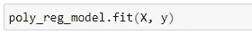

# 具有机器学习流水线的多项式回归

> 原文：<https://towardsdatascience.com/polynomial-regression-with-a-machine-learning-pipeline-7e27d2dedc87?source=collection_archive---------19----------------------->

## 依次应用多个转换器和一个最终回归器来构建您的模型

约书亚·索蒂诺在 [Unsplash](https://unsplash.com/?utm_source=unsplash&utm_medium=referral&utm_content=creditCopyText) 上拍摄的照片

欢迎回来！应用我们已经拥有的知识，用一些真实的数据建立机器学习模型，这是非常令人兴奋的。 ***多项式回归*** ，我们今天讨论的主题，就是这样一个模型，它可能需要一些复杂的工作流程，这取决于问题陈述和数据集。

今天我们讨论如何建立多项式回归模型，以及在做模型之前如何对数据进行预处理。实际上，我们按照特定的顺序应用一系列步骤来构建完整的模型。Python Scikit-learn 机器学习库中提供了所有必要的工具。

## 先决条件

如果你不熟悉 Python、numpy、pandas、机器学习和 Scikit-learn，请阅读我以前的文章，这些是本文的先决条件。

*   [使用 Scikit-learn 进行主成分分析(PCA)](https://medium.com/data-science-365/principal-component-analysis-pca-with-scikit-learn-1e84a0c731b0?source=friends_link&sk=1405bca22ed8b76f0100b5093b56b36e)
*   [带梯度下降的线性回归](https://medium.com/data-science-365/linear-regression-with-gradient-descent-895bb7d18d52?source=friends_link&sk=085716d97c63a0419a8323520a889c4a)
*   [数据科学的数字:第一部分](https://medium.com/data-science-365/numpy-for-data-science-part-1-21e2c5ddbbd3?source=friends_link&sk=bbaaf3a0894ef18e15ebfc5c53fb5c3b)
*   [数据科学的熊猫:第一部分](https://medium.com/data-science-365/pandas-for-data-science-part-1-89bc231b3478?source=friends_link&sk=9a2fd6ff88dda68a561dce240a8cd9d5)

不再拖延，让我们进入问题定义。

# 问题定义

我们有一个数据集，其中包含 71 人的年龄、身高和体重信息。我们希望建立一个回归模型，根据年龄和身高捕捉一个人的体重，并评估其性能。然后我们用这个模型来预测新病例。

事实上，在我们绘制数据之前，我们不知道数据的性质或复杂性。有时候，我们可以很容易地拟合出一条直线来描述模型。但大多数时候，现实世界的数据并非如此。数据可能很复杂，您需要考虑不同的方法来解决问题。

# 数据集

我们有一个名为***person _ data . CSV***([在此下载](https://drive.google.com/file/d/1U-Wj1nYje_1EZ2HA0hZ86tEEyWA_lKGH/view?usp=sharing))的数据集，其中包含 71 个人的年龄、身高和体重信息。让我们使用 pandas***read _ CSV()***函数加载它，并将其存储在 ***df*** 变量中。

让我们检查一下数据是否有缺失值。

太好了！这 3 列的所有值都有 71 个非空值，这意味着没有缺失值。

让我们定义我们的特征矩阵和目标向量。根据问题定义，特征矩阵— **X** 包含年龄和身高的值。目标向量— **y** 包含权重值。构建回归模型是一项监督学习任务，因此我们将输入 **X** 映射到输出 **y=f(X)** 。

我们数据的维数是 2，因为 **X** 是二维的。那么，我们如何用 **y** 绘制出 **X** 的二维数据呢？显然，我们需要创建一个 3D 图。但是还有另一种方法。我们可以将年龄和身高组合成一个变量，称为 **Z** ，然后用 **Z** 和 **y** 绘制 2D 图。通过减少 **X** 中的特征数量将年龄和身高组合成一个变量，称为*降维，我们用来执行降维的技术是利用这两个变量相关性的***【PCA】***。*

*我们在建立模型之前执行降维有两个优点:*

1.  *这对于在 2D 图中可视化我们的数据是非常有用的，这样可以更容易地看到重要的模式*
2.  *去除特征矩阵 **X** 中的相关变量极其有用。这样做可以避免误导性的预测*

*让我们检查年龄和身高是否相关。*

****

*这两个特征似乎高度相关。自变量(特征矩阵中的变量 **X** )之间存在显著相关性或关联性的情况称为*。多重共线性会导致误导性预测。**

**在制作模型之前，我们的下一个任务是移除这些相关变量。正如我前面所说的，我们使用主成分分析(PCA)来做这件事。但是，在运行 PCA 之前，如果数据集的要素之间的比例存在显著差异，则有必要执行要素缩放。这是因为 PCA 对原始特征的相对范围非常敏感。因此，我们通过使用 Scikit-learn 中*预处理*子模块中的 Scikit-learn**standard scaler()**类，应用 ***z 分数标准化*** 以将所有特征纳入相同的尺度。**

****注意:**我们仅对特征矩阵 **X** 应用特征缩放。我们不需要将它应用于我们的目标向量 **y** 。**

**因此，构建我们的模型的工作流程如下。它包含一系列应该按照给定顺序应用的步骤。建立一个机器学习模型不是一次性的任务，你可能会回到前面的步骤并做一些修改，然后你会再次经历接下来的步骤。**

## **一般的工作流程是:**

1.  **对特征矩阵 X 应用特征缩放[使用 Scikit-learn**standard scaler()**class]。**
2.  **运行 PCA 算法[使用 Scikit-learn**PCA()**class]。**
3.  **创建散点图并确定关系的性质[使用 Seaborn **散点图()**函数]。**
4.  **我们可以用直线拟合数据吗？还是需要添加多项式要素来精确拟合模型？**
5.  **如果我们可以对我们的数据拟合一条直线，然后运行线性回归算法[使用 Scikit-learn**Linear Regression()**class]**
6.  **如果我们不能用直线拟合我们的数据，那么我们需要添加多项式特性[使用 Scikit-learn**polynomial features()**class]**
7.  **添加多项式特性后，运行线性回归算法[使用 Scikit-learn**Linear Regression()**类]**

****

**作者图片**

# **应用要素缩放**

**我们通过使用 Scikit-learn**standard scaler()**应用 ***z-score 标准化*** 将所有特征纳入同一尺度。所有特征都根据以下公式进行缩放。**

********

****X** 的缩放值存储在 ***X_scaled*** 变量中，该变量是一个二维 numpy 数组。**

**让我们检查缩放后的 **X** 值的平均值和标准偏差。**

****

**现在，您可以看到在 ***X_scaled*** 矩阵中，每个变量的均值为零，标准差为 1。**

**现在，我们的数据可以运行 PCA 了。**

# **运行 PCA 算法**

**现在，我们准备对数据集应用 PCA。我们需要将 ***X_scaled*** 矩阵中的二维数据缩减为一维数据。**

**在 Scikit-learn 中，使用 **PCA()** 类来应用 PCA。该类中最重要的*超参数*是 **n_components** 。由于我们对获取一维数据感兴趣，所以 **n_components** 的值为 1。**

****

**我们对 ***X_scaled*** 值应用了 PCA，输出值存储在 ***X_pca*** 变量中，该变量现在是一维数组。**

**我们降低了数据的维度，与原始数据集相比，也损失了一些信息。在 PCA 中，算法找到数据的低维表示，同时尽可能多地保留变化。**

**让我们检查算法在运行时保留了多少变化。**

****

**哇！超值！可以看到，第一个主成分保留了数据集中约 97.36%的可变性，同时减少了数据集中的 1(2–1)个特征。所以 ***X_pca*** 的值更准确地表示特征矩阵 **X** 的值。**

**让我们把我们的数据绘制成散点图。**

# **绘制数据**

**现在我们有了一维数据( ***X_pca*** )，分别代表 ***X*** 。现在我们可以用我们在 2D 图中的 **y** (权重)值绘制 ***X_pca*** 。**

********

**很明显，一条直线永远不会完全符合这些数据。让我们看看，如果我们试图用一条直线来拟合我们的数据，会发生什么。**

****

**其中 ***θ* 1** 和 **𝛼** 是在训练过程中学习的模型*参数*。**

********

**拟合如此之差，以至于直线法永远不会为我们的数据提供最佳模型。**

****

**我们的模型只能解释或捕捉到约 61%的重量变化。RMSE 值为 10.99。这意味着平均而言，模型的预测值与实际值相差 10.99 个单位。**

**让我们尝试一种称为 ***多项式回归*** 的不同方法，以获得最适合我们的数据。**

# **多项式回归**

**您可以使用线性模型来拟合非线性数据。一种简单的方法是将每个特征的幂作为新特征添加，然后在这个扩展的特征集上训练线性模型。这种技术叫做 ***多项式回归*** 。**

**因此，使用多项式的多项式回归在参数方面仍然是线性的。这是因为你只需将各项相加就能建立方程。因此，像 R 平方(R 决定系数)这样的性能指标对于多项式回归仍然有效。不要混淆多项式回归和非线性回归，其中 R 是无效的！**

## **为每个变量添加幂**

**在我们的模型中，唯一的变量是**T5 X _ PCAT7。为该变量增加幂后，模型变为:****

****

**其中 ***θ* 1** ， ***θ* 2** ， ***θ* 3** 和 **𝛼** 是在训练过程中学习的模型*参数*。**

**让我们使用 Scikit-learn**polynomial features()**类将多项式特征添加到我们的数据中。**

****

****多项式 Features()** 类中最重要的*超参数*是 ***次*** 。我们设置 ***degree=4*** ，这样当输入(***x _ PCA***， ***X_pca*** ， ***X_pca⁴*** )是一维时，它创建了 3 个额外的特征，称为***x _ PCA**。 ***X_poly*** 变量保存特征的所有值。*****

## *运行算法*

*现在，我们已经将数据转换为多项式特征。所以，我们可以再次使用 **LinearRegression()** 类来构建模型。*

****

*哇！似乎多项式方法给了我们一个更好的模型。*

**

*我们的模型解释或捕获了重量中观察到的约 90%的可变性。RMSE 值为 5.526。这意味着平均而言，模型的预测值与实际值相差 5.526 个单位。*

*因此，我们通过多项式回归显著提高了模型的性能。*

*让我们检查残差(误差)的分布。*

****

*通过查看直方图，我们可以验证残差近似正态分布，平均值为 0。*

# *超参数调谐*

## *模型参数与超参数*

*模型参数是在训练过程中学习的参数。我们不手动设置参数值，它们从我们提供的数据中学习。比如 ***θ* 1** ， ***θ* 2** ， ***θ* 3** 和 **𝛼** 都是我们多项式回归模型中的参数。*

*相反，模型超参数是不从数据中学习的参数。因此，我们必须手动为它们设置值。我们总是在创建特定模型时和开始训练过程之前设置模型超参数的值。例如，在从 **PCA()** 类创建 ***pca*** 对象时，我们已经手动设置了 **n_components=** 1。我们还在从 **PolynomialFeatures()** 类创建***poly _ features***对象时手动设置了 **degree=4** 。*

*在大多数情况下，为模型超参数设置正确的值是最具挑战性的任务之一。这背后没有什么神奇的公式。您可以尝试不同的值，并获得可视化表示来验证您的选择。有时，您可能会尝试不同的值，评估模型性能并选择最佳值。有时，问题的领域知识将帮助您推导出超参数的正确值。*

*让我们为超参数*尝试一些不同的值(2–9)(最初，我将此设置为 **degree=4** )并获得一些可视化表示和模型评估指标。**

****

**作者图片**

****

**度数过高会导致 ***过拟合*** 。过拟合问题是指统计模型开始描述数据中的随机误差，而不是变量之间的关系。在过度拟合中，该模型非常适合训练数据，但无法对不在我们的数据集中的新输入数据进行归纳。**

**降低度数会导致 ***欠配合*** 。在欠拟合中，模型不能很好地拟合训练数据和新数据。**

**当我们设置 ***度*** 超参数的值时，我们应该总是尽量避免过拟合和欠拟合的情况**

**通过查看可视化表示和性能指标的值，我们可以确定 degree=4 或 degree=5 是 ***degree*** 超参数的理想值。**

# **根据新数据做出预测**

**假设我们有 5 个新的观察值，我们想使用我们的模型预测权重。新的输入数据存储在二维的 ***X_new*** 数组中。第一列是年龄，第二列是身高。**

****

**新输入数据**

**当我们构建模型时，我们已经对原始数据进行了 3 次缩放和转换。因此，当我们使用我们的模型对新数据进行预测时，有必要使用相同的方法对新数据进行缩放和转换。所以，我们必须调用 ***fit_transform()*** 方法 3 次，然后调用 ***predict()*** 方法 1 次。所以，这对我们来说很烦人。为了克服这个问题，我们可以为我们的多项式回归模型建立一个机器学习管道。**

# **构建机器学习管道**

**Scikit-learn 将机器学习算法称为**估计器**。有三种不同类型的估计器:**分类器**、**回归器**和**变压器**。分类器和回归器被称为**预测器**。**

**随着我们的分析和工作流变得越来越复杂，您可能需要在数据准备好用于受监督的机器学习模型之前对其进行多次转换。管道依次应用一系列转换器和最终预测器(分类器或回归器)。管道的中间步骤必须是“transformers”，即它们必须实现 **fit(** )和 **transform()** 方法。最终预测器只需要实现 **fit()** 方法。**

**在我们的工作流程中:**

1.  ****StandardScaler()** 是变压器。**
2.  ****PCA()** 是变压器。**
3.  ****多项式特性()**是变压器。**
4.  ****LinearRegression()** 是预测器。**

**因此，我们可以使用 Scikit-learn**Pipeline()**类为我们的模型构建一个管道。它依次应用上面的变压器列表和最终预测值。这是代码。**

****

**通过使用管道，我们可以用更少的代码轻松构建复杂的模型！**

**让我们调用我们管道的 **fit()** 方法。**

****

**当调用 ***poly_reg_model.fit(X，y)*** 时，会发生以下过程:**

*   **X_scaled = sc.fit_transform(X)**
*   **X _ PCA = PCA . fit _ transform(X _ scaled)**
*   **X _ poly = poly _ features . fit _ transform(X _ PCA)**
*   **lin_reg.fit(X_poly，y)**

**让我们调用我们管道的 **predict()** 方法。**

****

**当调用***poly _ reg _ model . predict(X _ new)***时，发生以下过程:**

*   **X_new_scaled = sc.transform(X)**
*   **X _ new _ PCA = PCA . transform(X _ scaled)**
*   **X _ new _ poly = poly _ features . transform(X _ PCA)**
*   **lin_reg.predict(X_new_poly)**

**所以，***poly _ reg _ model . predict(X _ new)***返回对我们新数据的预测。**

****

# **保存我们的模型**

**让我们用 Python ***dill*** 包保存我们的模型。**

****

**运行完这段代码后，***poly _ reg _ model . dill***([此处下载](https://drive.google.com/file/d/1C3_GAgJtrBiJWNxkBMI30SpUtnAP538r/view?usp=sharing))文件会出现在你当前的工作目录下。**

**让我们加载我们的模型。**

****

**就是这样。您可以与他人共享***poly _ reg _ model . dill***文件，他们可以使用该模型而无需重新构建。它在内存中只有 743 字节！**

**本教程由 [*鲁克山·普拉莫迪塔*](https://www.linkedin.com/in/rukshan-manorathna-700a3916b/)*[数据科学 365 博客](https://medium.com/data-science-365)作者设计创作。***

# ***本教程中使用的技术***

*   *****Python** (高级编程语言)***
*   *****numPy** (数值 Python 库)***
*   *****熊猫** (Python 数据分析与操纵库)***
*   *****matplotlib** (Python 数据可视化库)***
*   *****seaborn** (Python 高级数据可视化库)***
*   *****Scikit-learn** (Python 机器学习库)***
*   *****Jupyter 笔记本**(集成开发环境)***

# ***本教程中使用的机器学习***

*   *****主成分分析*****
*   *****多项式回归*****

***2020–10–12***