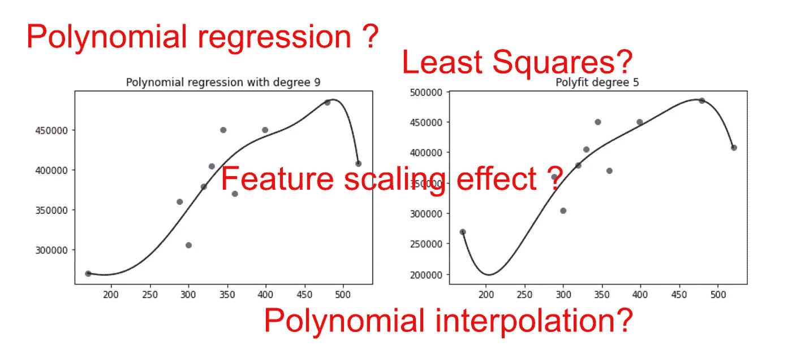
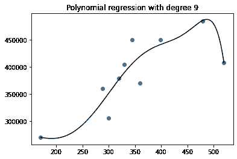
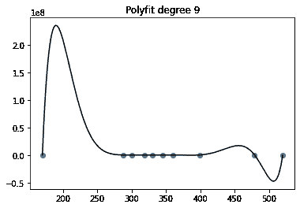
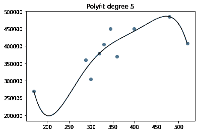
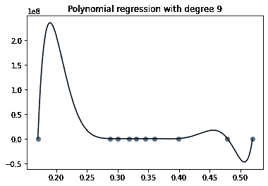

# 用 Scikit 学习多项式回归:你应该知道什么

> 原文：<https://towardsdatascience.com/polynomial-regression-with-scikit-learn-what-you-should-know-bed9d3296f2?source=collection_archive---------2----------------------->



## 一个奇怪的结果让我更好的理解了多项式回归…

# 多项式回归的一个简单例子

多项式回归是一种众所周知的算法。这是线性回归的一个特例，因为我们在创建线性回归之前创建了一些多项式特征。或者可以认为是具有 [*特征空间映射*](/overview-of-supervised-machine-learning-algorithms-a5107d036296) (又名**多项式核**)的线性回归。使用这个内核技巧，在某种程度上，可以创建一个次数无限的多项式回归！

在本文中，我们将处理经典的多项式回归。通过 scikit learn，可以结合这两个步骤在流水线中创建一个(**多项式特性**和**线性回归**)。我将展示下面的代码。让我们看一个例子，一些简单的玩具数据，只有 10 分。我们也考虑一下度数是 9。你可以在下面看到最终的结果。



你看出什么不对了吗？

嗯，理论上，这是错误的！**对于 10 个点，一个 9 次多项式应该可以完美拟合！**

或者，我确信你们中的一些人在想:为什么你说这是错的？这可能是正确的模式。你认为模型应该是完美拟合的，但不是，你被**多项式插值**搞糊涂了！

首先，您可以自己尝试使用下面的代码来创建模型。

## 创建一些玩具数据

```
import pandas as pdxdic={'X': {11: 300, 12: 170, 13: 288, 14: 360, 15: 319, 16: 330, 17: 520, 18: 345, 19: 399, 20: 479}}ydic={'y': {11: 305000, 12: 270000, 13: 360000, 14: 370000, 15: 379000, 16: 405000, 17: 407500, 18: 450000, 19: 450000, 20: 485000}}X=pd.DataFrame.from_dict(xdic)y=pd.DataFrame.from_dict(ydic)import numpy as npX_seq = np.linspace(X.min(),X.max(),300).reshape(-1,1)
```

## 创建模型

```
from sklearn.preprocessing import PolynomialFeaturesfrom sklearn.pipeline import make_pipelinefrom sklearn.linear_model import LinearRegressiondegree=9polyreg=make_pipeline(PolynomialFeatures(degree),LinearRegression())polyreg.fit(X,y)
```

## 创造情节

```
import matplotlib.pyplot as pltplt.figure()plt.scatter(X,y)plt.plot(X_seq,polyreg.predict(X_seq),color="black")plt.title("Polynomial regression with degree "+str(degree))plt.show()
```

# 你不应该这样做！

先说**多项式回归**和**多项式插值**的区别。先说一个我从 scikit learn 团队得到的答案:*你不应该这样做，展开到 9 次多项式是扯淡。scikit learn 是为实际用例构建的，它使用有限精度的表示，而不是理论表示。*

是的，他们完全正确！看看这些数字，它们有多大:1e24！

但是如果他们不能处理大数字，他们不应该抛出一个错误或警告吗？如果没有任何信息，人们会认为这个模型是正确的，然而，它实际上是错误的。

好吧好吧，我知道，你们中的一些人不相信结果是错误的，或者也许是不可能处理大的数字，让我们看看另一个包，numpy！

# 但是 polyfit 做得很好

对于同一个示例，numpy 的 polyfit 找到模型没有问题。你可以看到下面的情节和代码。



```
coefs = np.polyfit(X.values.flatten(), y.values.flatten(), 9)plt.figure()plt.plot(X_seq, np.polyval(coefs, X_seq), color="black")plt.title("Polyfit degree "+str(degree))plt.scatter(X,y)plt.show()
```

现在我知道你们中的一些人在想: *polyfit 是一个非常不同的东西，它是一个插值而不是回归。*

因为在四处打听的时候，我得到了一些这样的答案(但并不准确，或者说是错误的):

> polyfit 正在做一件完全不同的事情。它对某个向量 X 到向量 y 执行单变量多项式拟合。这里，我们对某个特征空间 X 执行多项式展开，以便为多变量拟合表示高阶交互项(相当于用多项式核学习)。

好了，什么是**多项式插值**？

# 什么是多项式插值？

嗯，对于这种问题，维基百科是一个很好的来源。

> 在数值分析中，**多项式插值**是通过穿过数据集点的**最低**可能次数的多项式对给定数据集的插值。

并且我们有这样的结果被证明:给定 n+1 个不同的点 x_0，x_0，…，x_n 和相应的值 y_0，y_1，…，y_n，存在一个至多 n 次的唯一多项式来插值数据(x_0，y_0)，…，(x_n，y_n)。

回到我们的例子:有 10 个点，我们试图找到一个 9 次多项式。所以从技术上讲，我们是在做多项式插值。而 **polyfit** 找到了这个唯一的多项式！对于 **scikit learn 的多项式回归管道**，情况并非如此！

这正是为什么你们中的一些人会想: **polyfit** 不同于 **scikit learn 的多项式回归管道！**

现在，等等！

在 **polyfit** 中，有一个自变量，叫做*度*。所以可以修改度数，我们用 5 试试。



是的，用`polyfit`，可以选择多项式的次数，我们正在用它做**多项式回归**。而用户选择的 9 次是多项式插值的**特例。**

这是令人放心的，因为线性回归试图最小化平方误差。而且我们知道，如果有 10 个点，我们试着求一个 9 次多项式，那么误差可以是 0(不能再低了！)因为多项式插值的定理。

对于那些还在怀疑的人，polyfit 有一个官方文档:最小二乘多项式拟合。将一个*度*的多项式`p(x) = p[0] * x**deg + ... + p[deg]`拟合到点 *(x，y)* 。按照*度*、*度-1* 、… *0* 的顺序返回最小化平方误差的系数矢量 *p* 。

好了，是时候回到我们的 **scikit learn 的多项式回归管道了。**那么现在，为什么会有区别呢？真的有两种不同的多项式回归(或拟合)，都使用最小二乘法，但使用方式不同吗？

我找到了这个答案，但我还没有得到它。

> 两个模型都使用最小二乘法，但是使用这些最小二乘法的方程是完全不同的。polyfit 将其应用于 vandemonde 矩阵，而线性回归则不能。

# 特征比例效应

在深入研究的同时，应该提到另一个重要的特性转换:特性缩放。

在几本关于机器学习的书中，当执行多项式回归时，特征被缩放。也许从一开始，你们中的一些人就在说应该这样做。

而且没错， **scikit learn 的多项式回归管道带特征缩放**，好像相当于 polyfit！根据剧情(我没有真的去查，但是目测他们是一样的)。

您可以使用下面的代码:

```
from sklearn.preprocessing import PolynomialFeaturesfrom sklearn.pipeline import make_pipelinefrom sklearn.linear_model import LinearRegressionfrom sklearn import preprocessingscaler = preprocessing.StandardScaler()degree=9polyreg_scaled=make_pipeline(PolynomialFeatures(degree),scaler,LinearRegression())polyreg_scaled.fit(X,y)
```

现在，我们没有回答之前的问题，我们有更多的问题:**特征缩放对线性回归有影响吗**？

答案是否定的。

为了讨论这一点，可以写另一篇文章，对于我们关于多项式回归效果的讨论，我们可以只做另一个变换。

```
X=pd.DataFrame.from_dict(xdic)/1000
```

没错，你只是把预测值除以 1000。现在，你知道对线性回归模型的影响只是成比例的，但实际上，差别是巨大的。



**这就是为什么我们可以得出结论，对于 scikit learn 来说，初始数字太大了。**

# 结论

最后我们可以说 **scikit learn 的多项式回归管道(有无缩放)**，应该和 numpy 的 polyfit 是等价的，只是在大数处理方面的区别可以产生不同的结果。

我个人认为，在这种情况下，scikit learn 应该抛出一个错误或至少一个警告。

我真的很想知道你的意见！

如果你想了解更多关于多项式回归与其他监督学习算法的关系，你可以阅读这篇文章:

[](/overview-of-supervised-machine-learning-algorithms-a5107d036296) [## 监督机器学习算法综述

### 大图如何通过连接点给我们洞察力和对 ML 的更好理解

towardsdatascience.com](/overview-of-supervised-machine-learning-algorithms-a5107d036296) 

你会看到多项式回归是一种特殊的**特征空间映射**。