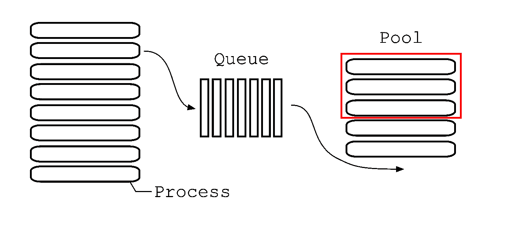

# Python 中的池限制队列处理

> 原文：<https://towardsdatascience.com/pool-limited-queue-processing-in-python-2d02555b57dc?source=collection_archive---------6----------------------->

## 如何使用预定义数量的线程并行处理数据

我最近遇到了一个问题:我需要构建大量(大约 100 个)Docker 容器，然后将它们推送到注册中心。Docker SDK for Python 提供了一个很好的处理方法，再加上“多重处理”库，可以非常有效地并行处理任务。然而，经过一些初步测试后，我发现将多个图像推送到注册表可能由于同时上传的过载而停止。在我的测试中，我只能同时运行 2-3 个`docker push`命令，直到我添加的所有新命令都停止。在这一点上，我决定将同步上传限制在少量的并行线程上，同时仍然利用大量的线程来促进映像构建。将工作从构建线程传递到推进线程的队列(`multiprocessing.Queue`)和线程池(`multiprocessing.Pool`)的组合看起来是一个最佳选择。然而，文档中有一些细微差别和空白，这让我花了一些时间去理解(尤其是在 Windows 上使用`multiprocessing`的时候)。下面，我提供了一个关于如何使用这些数据结构和对象的小教程。

**问题公式化**



算法设计

在这个玩具问题中，我们有大量并行进程将结果写入队列。除了它们之外，还有一个单线程读取器进程检查队列中的新项目，并将它们分配给池中的新进程，这样，只有一小部分固定数量的进程同时运行。让我们看一下下面的所有元素。

# `Process`


弗兰克·麦肯纳在 [Unsplash](https://unsplash.com?utm_source=medium&utm_medium=referral) 上拍摄的照片

对于左侧的大量并行线程，我们将使用`multithreading.Process()`。来自官方[参考](https://docs.python.org/3.7/library/multiprocessing.html#multiprocessing.Process):

> `Process`对象表示在独立进程中运行的活动。

启动一个进程需要两件事:调用**目标函数**和`**Process**` **调用**本身。让我们来看看:

```
from multiprocessing import Processdef proc(i):
    print(f'I am Process {i}')if __name__ ==  '__main__':
    for i in range(10):
        Process(target=proc, args=(i,)).start()
```

在上面的例子中，我们创建了 10 个`Process` es 并同时启动它们。每个进程都运行一个`proc()`函数的实例，其参数来自`arg`。因为执行的顺序没有得到保证，所以当我们运行它时，我们会得到类似这样的结果:

```
I am Process 6
I am Process 2
I am Process 0
I am Process 3
I am Process 7
I am Process 4
I am Process 8
I am Process 1
I am Process 5
I am Process 9
```

还要注意`args=(i,)`有趣的语法。`Process`要求`args`是可迭代的，所以把它改成`args=(i)`或者`args=i`就会产生一个`TypeError`。

# 长队


照片由[哈尔·盖特伍德](https://unsplash.com/@halgatewood?utm_source=medium&utm_medium=referral)在 [Unsplash](https://unsplash.com?utm_source=medium&utm_medium=referral) 上拍摄

现在，是时候介绍一个`multithreading.Queue()`了。根据[参考](https://docs.python.org/3.7/library/multiprocessing.html#multiprocessing.Queue):

> `Queue()`返回一个使用管道和一些锁/信号量实现的进程共享队列。

队列允许我们将对象放入队列，并在别处异步处理它们。重要的是，队列是线程和进程安全的。让我们修改前面的例子，添加`Queue`对象，并将其传递给我们的并行`Process` es:

```
from multiprocessing import Process, Queuedef writer(i,q):
    message = f'I am Process {i}'
    q.put(message)if __name__ ==  '__main__':
    # Create multiprocessing queue
    q = Queue()

    # Create a group of parallel writers and start them
    for i in range(10):
        Process(target=writer, args=(i,q,)).start() # Read the queue sequentially
    for i in range(10):
        message = q.get()
        print(message)
```

记住`Queue.get()`是一个阻塞方法，所以我们不会错过队列中的任何消息。

解决我们问题的下一步是切换到从队列中并行读取。我们可以像产生写进程一样产生读进程，但是这将允许 10 个线程并行运行。如果像原问题描述中那样受限于较小的读者数量，该怎么办？

# 泳池


[李中清](https://unsplash.com/@picsbyjameslee?utm_source=medium&utm_medium=referral)在 [Unsplash](https://unsplash.com?utm_source=medium&utm_medium=referral) 上的照片

输入`[multithreading.Pool()](https://docs.python.org/3.7/library/multiprocessing.html#multiprocessing.pool.Pool)`:

> "一个进程池对象，它控制一个可以提交作业的工作进程池。它支持带有超时和回调的异步结果，并具有并行映射实现”。

使用`Pool`,我们可以分配尽可能多的并行进程，但是在任何给定的时刻，只有“进程”数量的线程是活动的。

让我们看看，如果我们把所有的读者都扔到“池子”里，情况会怎样:

```
from multiprocessing import Process, Queue, Pooldef writer(i,q):
    message = f’I am Process {i}’
    q.put(message)def reader(i,q):
    message = q.get()
    print(message)if __name__ == ‘__main__’:
    # Create multiprocessing queue
    q = Queue() # Create a group of parallel writers and start them
    for i in range(10):
        Process(target=writer, args=(i,q,)).start() # Create multiprocessing pool
    p = Pool(10) # Create a group of parallel readers and start them
    # Number of readers is matching the number of writers
    # However, the number of simultaneously running
    # readers is constrained to the pool size

    for i in range(10):
        p.apply_async(reader, (i,q,))
```

然而，如果我们运行上面的代码，我们将不会得到任何输出。发生了什么事？当我们调用`apply_async`时，代码执行立即继续，因为主函数中没有留下任何东西，所以退出。谢天谢地，`multiprocessing`提供了一种等待执行结果的参考方式:

```
from multiprocessing import Process, Queue, Pooldef writer(i,q):
    message = f’I am Process {i}’
    q.put(message)def reader(i,q):
    message = q.get()
    print(message)if __name__ == ‘__main__’:
    # Create multiprocessing queue
    q = Queue() # Create a group of parallel writers and start them
    for i in range(10):
        Process(target=writer, args=(i,q,)).start() # Create multiprocessing pool
    p = Pool(10) # Create a group of parallel readers and start them
    # Number of readers is matching the number of writers
    # However, the number of simultaneously running
    # readers is constrained to the pool size readers = []
    for i in range(10):
        readers.append(p.apply_async(reader, (i,q,))) # Wait for the asynchrounous reader threads to finish
    [r.get() for r in readers]
```

这一次，如果我们运行代码，我们将得到下面的错误:`RuntimeError: Queue objects should only be shared between processes through inheritance`。`multiprocessing.Manager`将使我们能够管理队列，并使不同的工作人员也可以访问它:

```
from multiprocessing import Process, Queue, Pool, Managerdef writer(i,q):
    message = f’I am Process {i}’
    q.put(message)def reader(i,q):
    message = q.get()
    print(message)if __name__ == ‘__main__’:
    # Create manager
    m = Manager() # Create multiprocessing queue
    q = m.Queue() # Create a group of parallel writers and start them
    for i in range(10):
        Process(target=writer, args=(i,q,)).start() # Create multiprocessing pool
    p = Pool(10) # Create a group of parallel readers and start them
    # Number of readers is matching the number of writers
    # However, the number of simultaneously running
    # readers is constrained to the pool size readers = []
    for i in range(10):
        readers.append(p.apply_async(reader, (i,q,))) # Wait for the asynchrounous reader threads to finish
    [r.get() for r in readers]
```

最后，我们能够得到我们期望的结果:

```
> python pl.pyI am Process 1
I am Process 4
I am Process 9
I am Process 8
I am Process 0
I am Process 5
I am Process 7
I am Process 2
I am Process 6
I am Process 3
```

# 与 Windows 相关的怪癖

我最初在基于 Linux 的机器上着手解决这个问题，但后来在 Windows 上继续。不幸的是，许多事情并没有立即见效。以下是你需要知道的事情:

1.对于上面的代码，中断程序执行(Ctrl+C)不会立即生效。[解决方法](https://stackoverflow.com/a/6191991)是添加初始化器工人:

```
def init_worker():
    """
    Pool worker initializer for keyboard interrupt on Windows
    """ signal.signal(signal.SIGINT, signal.SIG_IGN)p = Pool(num_readers, init_worker)
```

2.我无法在 Windows 上运行 Jupyter 笔记本中的代码，除非我将工人函数移动到单独的`.py`文件中，并将它们导入我的笔记本。与此相关，如果不将主代码打包到`if __name__ == ‘main':`中，您将无法运行上面的脚本。

# 决赛成绩

作为收尾工作，让我们添加以下内容:
延迟以模拟读取器和写入器上 CPU 受限的工作
等待读取线程完成时的异常处理
可配置的写入器和读取线程数量
一些函数文档

以下是最终结果:

```
from multiprocessing import Pool, Queue, Process, Manager
import random
import signal
import timenum_writers = 10
num_readers = 3def writer(i,q):
    # Imitate CPU-bound work happening in writer
    delay = random.randint(1,10)
    time.sleep(delay)

    # Put the result into the queue
    t = time.time()
    print(f’I am writer {i}: {t}’)
    q.put(t)def init_worker():
    """
    Pool worker initializer for keyboard interrupt on Windows
    """
    signal.signal(signal.SIGINT, signal.SIG_IGN)def reader(i, q):
    """
    Queue reader worker
    """

    # Read the top message from the queue
    message = q.get()

    # Imitate CPU-bound work happening in reader
    time.sleep(3)
    print(f’I am reader {i}: {message}’)if __name__ == ‘__main__’:
    # Create manager
    m = Manager()

    # Create multiprocessing queue
    q = m.Queue() # Create a group of parallel writers and start them
    for i in range(num_writers):
        Process(target=writer, args=(i,q,)).start()

    # Create multiprocessing pool
    p = Pool(num_readers, init_worker) # Create a group of parallel readers and start them
    # Number of readers is matching the number of writers
    # However, the number of simultaneously running
    # readers is constrained to the pool size
    readers = []
    for i in range(10):
        readers.append(p.apply_async(reader, (i,q,)))

    # Wait for the asynchrounous reader threads to finish
    try:
        [r.get() for r in readers]
    except:
        print(‘Interrupted’)
        p.terminate()
        p.join()
```

如果您运行它，您将得到类似如下的结果:

```

```
> python final.pyI am writer 8: 1580659076.783544
I am writer 3: 1580659076.783544
I am reader 0: 1580659076.783544
I am reader 1: 1580659076.783544
I am writer 7: 1580659079.7990372
I am writer 2: 1580659080.7971141
I am writer 1: 1580659081.785277
I am writer 4: 1580659082.7955923
I am reader 2: 1580659079.7990372
I am reader 3: 1580659080.7971141
I am writer 6: 1580659083.800029
I am writer 0: 1580659084.7862694
I am reader 4: 1580659081.785277
I am writer 9: 1580659085.7819643
I am writer 5: 1580659085.7919443
I am reader 5: 1580659082.7955923
I am reader 6: 1580659083.800029
I am reader 7: 1580659084.7862694
I am reader 8: 1580659085.7819643
I am reader 9: 1580659085.7919443
```

这篇文章最初发表在[我的博客](https://taletskiy.com/posts/python-pool-limited-queue-processing/)上。