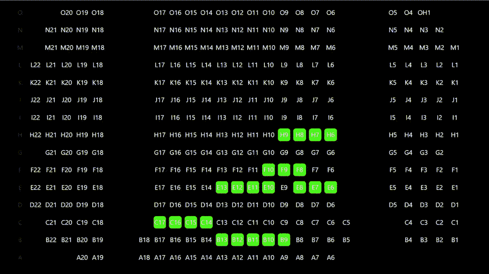

# 爆米花数据——分析电影院座位模式(上)

> 原文：<https://towardsdatascience.com/popcorn-data-analysing-cinema-seating-patterns-part-1-a0b2a5c2c19a?source=collection_archive---------44----------------------->

## 数据分析能揭示你的观影习惯的哪些方面？

诺埃尔·马修·艾萨克和[万什卡·阿格拉瓦尔](https://medium.com/u/19e9504cf53f?source=post_page-----a0b2a5c2c19a--------------------------------)

*在* [*第二部分*](https://medium.com/popcorndata/popcorn-data-analysing-cinema-seating-patterns-part-ii-987fbde9d363) *中，我们分析数据，将其可视化，然后为我们的发现建立一个网站。*



*作者图片*

# 第一部分——获取分析数据

## 发现你最喜欢的剧院座位已经被预订时，你有没有感到极度失望？

## 你最喜欢的座位到底有多受欢迎？

我们想更多地了解新加坡的电影趋势——人们喜欢从哪个座位观看不同的电影。所以我们创建了[PopcornData](https://popcorn-data.herokuapp.com/)——一个通过搜集数据、发现有趣的见解并将其可视化来一窥新加坡电影趋势的网站。


照片由 [Krists Luhaers](https://unsplash.com/@kristsll?utm_source=medium&utm_medium=referral) 在 [Unsplash](https://unsplash.com?utm_source=medium&utm_medium=referral) 拍摄

在网站上，你可以看到人们如何在不同的大厅、剧院和时间观看不同的电影！一些独特的方面包括**热图**显示**最受欢迎的座位**和**动画**显示购买座位的顺序**。这两篇文章详细阐述了我们是如何获得网站数据的，以及我们对数据的分析。**

# **抓取数据**

**为了实现我们的想法，第一步，也许是最关键的一步是收集数据。我们决定删除新加坡最大的连锁影院之一**邵氏影院**的网站。**

**从 python 中抓取的基础知识开始，我们最初尝试使用 python 的 **requests** 库来获取网站的 HTML，并使用 **BeautifulSoup** 库来解析它，但很快意识到我们需要的数据在我们请求的 HTML 中并不存在。这是因为网站是动态的— ***它使用 Javascript 从外部来源请求数据，并动态呈现 HTML***。当我们直接请求 HTML 时，网站的动态部分没有被呈现，因此丢失了数据。**

**为了解决这个问题，我们使用了**Selenium**——一种 web 浏览器自动化工具，它可以在获取 HTML 之前首先呈现网站的动态内容。**

## **硒的问题**

**让 selenium 驱动程序工作并解决一些小问题是一个很大的学习过程。在无数次 StackOverflow 搜索和多次“放弃”后，我们设法勉强通过(双关语)并让它工作。**

**我们面临的主要问题是:**

1.  **滚动到屏幕的特定部分单击按钮，以便在 HTML 中找到数据。**
2.  **弄清楚如何在云上运行 headless Selenium。**
3.  **在 Heroku 上部署脚本后，当脚本在本地机器上正常运行时，一些数据没有被擦除。绞尽脑汁之后，我们发现 Selenium 加载的一些页面默认为移动版本的页面。我们通过明确提到屏幕尺寸来解决这个问题。**

*****有了 Selenium 和 BeautifulSoup，我们终于能够获得某一天所有可用电影会话的数据了！*****

## **电影会话数据示例:**

```
{
   "theatre":"Nex",
   "hall":"nex Hall 5",
   "movie":"Jumanji: The Next Level",
   "date":"18 Jan 2020",
   "time":"1:00 PM+",
   "session_code":"P00000000000000000200104"
}
```

**我们已经成功了一半！现在，我们需要收集每个电影时段的座位数据，以查看哪些座位被占用以及何时被购买。在开发者工具中浏览了网站的网络选项卡后，我们发现 Shaw 的 API 正在请求座位数据。**

**可以通过请求 URL*https://www.shaw.sg/api/SeatingStatuses?recordcode=<session _ code>*来获得数据，其中 session code 是我们之前已经搜集的每个电影会话的唯一代码。**

**我们得到的数据是 JSON 格式的，我们对其进行解析，并按照座位购买时间的升序对座位进行重新排序，以获得一个 JSON 对象数组，其中每个对象都包含关于电影厅中每个座位的信息，包括 seat_number、seat_buy_time 和 seat_status。**

## **样本座位数据:**

```
[
  {   
     "seat_status":"AV",
     "last_update_time":"2020-01-20 14:34:53.704117",
     "seat_buy_time":"1900-01-01T00:00:00",
     "seat_number":"I15",
     "seat_sold_by":""
  },
   ...,
  {  
     "seat_status":"SO",
     "last_update_time":"2020-01-20 14:34:53.705116",
     "seat_buy_time":"2020-01-18T13:12:34.193",
     "seat_number":"F6",
     "seat_sold_by":""
  }
]
```

*   ****座位号**:大厅座位的唯一标识符**
*   ****seat_status** :表示有座位可用(**SO**-座位已被占用，**AV**-可用)**
*   ****seat_buy_time** :客户购买座位的时间**
*   ****last_update_time:** 座位数据最后被删除的时间**

**大厅有 28 到 502 个座位，每个座位对应于数组中的一个 JSON 对象。此外，一天之内有超过 350 个电影时段，产生的数据量相当大。存储一天的数据大约需要 10MB。电影会话数据与座位数据相结合，并存储在 MongoDB 数据库中。**

****我们设法从肖那里收集了 2020 年 1 月的所有电影数据。****

## **数据库中的单个文档**

```
{
   "theatre":"Nex",
   "hall":"nex Hall 5",
   "movie":"Jumanji: The Next Level",
   "date":"18 Jan 2020",
   "time":"1:00 PM+",
   "session_code":"P00000000000000000200104"
   "seats":[
   {   
     "seat_status":"AV",
     "last_update_time":"2020-01-20 14:34:53.704117",
     "seat_buy_time":"1900-01-01T00:00:00",
     "seat_number":"I15",
     "seat_sold_by":""
   },
   ...,
   {  
     "seat_status":"SO",
     "last_update_time":"2020-01-20 14:34:53.705116",
     "seat_buy_time":"2020-01-18T13:12:34.193",
     "seat_number":"F6",
     "seat_sold_by":""
   }
 ]
}
```

**要查看完整文档，请点击此链接:[https://gist . github . com/noelmathewisac/31 a9d 20 a 674 f 6 DD 8524 ed 89d 65183279](https://gist.github.com/noelmathewisaac/31a9d20a674f6dd8524ed89d65183279)**

**收集的完整原始数据可在此下载:**

 **[## 原始电影数据. zip

drive.google.com](https://drive.google.com/file/d/1K7Vv88SnmWarf6rOre2ijA-Qq7Dv2sNp/view?usp=sharing)** 

# **是时候把手弄脏了**

****

**由[马库斯·斯皮斯克](https://unsplash.com/@markusspiske?utm_source=medium&utm_medium=referral)在 [Unsplash](https://unsplash.com?utm_source=medium&utm_medium=referral) 上拍摄**

***现在是通过**清理数据**并提取相关信息来弄脏*我们的手的时候了。使用 pandas，我们解析了 JSON，清理了它，并用数据制作了一个 DataFrame，以提高可读性并方便过滤。**

**由于座位数据占用了大量内存，我们无法将所有数据包含在数据帧中。相反，我们使用 python 聚合座位数据，以获得以下内容:**

1.  ****总座位数** : 电影时段的总座位数**
2.  ****售出座位数**:一场电影的售出座位数**
3.  ****座位购买顺序**:显示座位购买顺序的二维数组**

```
[['A_10', 'A_11'], ['A_12'], ['B_4', 'B_7', 'B_6', 'B_5'], ['C_8', 'C_10', 'C_9'], ['B_1', 'B_2'], ['C_6', 'C_7'], ['C_5', 'C_4'], ['B_8', 'B_10', 'B_9'], ['D_8'], ['A_15', 'A_14', 'A_13']]
```

**数组中的每个元素代表同时购买的座位，元素的顺序代表座位购买的顺序。**

**4.**座位分布**:显示一起购买的座位数量的字典(1、2、3 或更多组)**

```
{
   'Groups of 1': 8,
   'Groups of 2': 30,
   'Groups of 3': 9,
   'Groups of 4': 3,
   'Groups of 5': 1
}
```

**5.座位频率:显示大厅中每个座位在一个月内被购买的次数的字典**

```
{'E_7': 4, 'E_6': 5, 'E_4': 11, 'E_5': 9, 'E_2': 2, 'E_1': 2, 'E_3': 7, 'D_7': 15, 'D_6': 17, 'C_1': 33, 'D_2': 15, 'D_1': 14, 'B_H2': 0, 'B_H1': 0, 'D_4': 45, 'D_5': 36, 'D_3': 32, 'C_3': 95, 'C_4': 94, 'A_2': 70, 'A_1': 70, 'B_2': 50, 'B_1': 47, 'C_2': 37, 'C_6': 53, 'C_5': 61, 'B_4': 35, 'B_3': 40}
```

**6.**购买率** : 两个字典，第一个字典显示电影放映的剩余时间(以天为单位)，第二个字典显示相应的累积购票数。**

```
{“1917”: [4.1084606481481485..., 2.566423611111111, 2.245578703703704, 2.0319560185185184, 1.9269907407407407, 1.8979513888888888....],
...}
{“1917”: [1, 3, 8, 10, 11, ...],
...}
```

**可以在此处查看清理的数据:**

**[](https://docs.google.com/spreadsheets/d/1pLNbwfnrmfpyA7sxtRyB1P6iHuSFyUPEerwW7f3fEWU/edit?usp=sharing) [## 清理的电影数据

docs.google.com](https://docs.google.com/spreadsheets/d/1pLNbwfnrmfpyA7sxtRyB1P6iHuSFyUPEerwW7f3fEWU/edit?usp=sharing)** 

# **最后，我们完成了！(完成 20%的工作)**

**我们的数据被收集和清理后，我们现在可以进入有趣的部分了— *分析数据*在爆米花垃圾中寻找模式。**

**要找到我们对数据的分析和我们发现的有趣模式，请查看本文的第二部分:**

**[](https://medium.com/popcorndata/popcorn-data-analysing-cinema-seating-patterns-part-ii-987fbde9d363) [## 爆米花数据——分析电影院座位模式(下)

### 数据分析能揭示你的观影习惯的哪些方面？

medium.com](https://medium.com/popcorndata/popcorn-data-analysing-cinema-seating-patterns-part-ii-987fbde9d363)** 

**刮刀的代码可以在下面的 GitHub repo 中找到:**

**[](https://github.com/PopcornData/shaw-scraper) [## PopcornData/肖氏刮刀

### 在 GitHub 上创建一个帐户，为 PopcornData/shaw-scraper 的开发做出贡献。

github.com](https://github.com/PopcornData/shaw-scraper) 

**别忘了查看我们的网站:http://popcorn-data.herokuapp.com**[](http://popcorn-data.herokuapp.com/)****！******