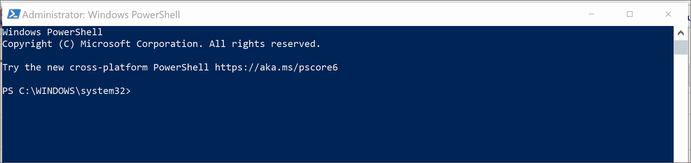
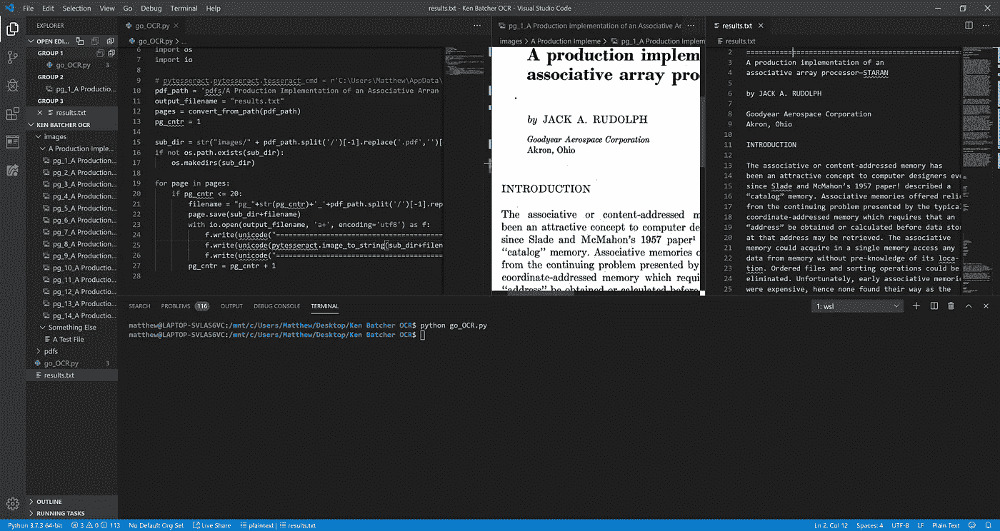

# Windows 上的 Poppler

> 原文：<https://towardsdatascience.com/poppler-on-windows-179af0e50150?source=collection_archive---------7----------------------->

## Python、pdf 和 Window 的 Linux 子系统

Windows 上的 Poppler

# 简介:

[可移植文档格式(pdf)](https://en.wikipedia.org/wiki/PDF)无处不在，导入一个流行的 python 包，如 [PDF2Image](https://pypi.org/project/pdf2image/) 、[pdf text](https://pypi.org/project/pdftotext/)或 [PopplerQt5](https://pypi.org/project/python-poppler-qt5/) 是处理它们的常用方法。不幸的是，除非您使用的是 Linux 机器，否则许多用户都报告说这些包返回了错误，因为它们依赖于 Poppler。

没听说过[波普勒](https://en.wikipedia.org/wiki/Poppler_(software))？

Poppler 是一个用于渲染 pdf 的工具，在 Linux 系统中很常见，但在 Windows 中并不常见。因此，自然地，如果您想使用 Poppler 及其相关的包，我们需要弥补这个差距。

让我们访问谷歌，看看我们有什么选择…

在谷歌上快速搜索一下，就会发现还有很多人有这个问题，他们仍在寻找解决方案。

*   [PDF 到 JPG(波普勒)](https://stackoverflow.com/questions/46184239/extract-a-page-from-a-pdf-as-a-jpeg)
*   [在 Windows 上安装 Poppler？](https://stackoverflow.com/questions/18381713/how-to-install-poppler-on-windows)
*   [无法在 Windows (Poppler)上安装“PDFtoText”](https://stackoverflow.com/questions/52336495/cannot-install-pdftotext-on-windows-because-of-poppler)
*   [在 Windows 上运行 PyPDFOCR 需要 Poppler？](https://stackoverflow.com/questions/31817070/running-pypdfocr-on-windows-via-python-requiring-poppler)
*   [ModuleNotFoundError —没有名为‘SipDistUtils’(Poppler)的模块](https://stackoverflow.com/questions/51420803/modulenotfounderror-no-module-named-sipdistutils-while-install-python-poppler)

# 问题是:

Poppler 和 Python 的 PDF 库利用了 Linux 实用程序，但不能很好地与 Windows 兼容。

当我们寻找解决方案时，许多方案已经过时、无效、太难了，等等…

# **解决方案:**

在提出的解决方案中，有一个解决方案似乎效果不错。

**Windows Linux 子系统(WSL)。**

实际上，由于 Linux 的 Windows 子系统是如此强大，它对于需要在 Windows 机器上使用 Linux 工具的其他问题是一个很好的解决方案。

# **那么，WSL 是什么？**

Windows Subsystem for Linux 是 Windows 10 上的 Linux 二进制可执行文件的兼容层。它最近进入了版本二(WSL 2)并引入了真正的 Linux 内核。简单地说，WSL 让你感觉像是在一台真正的 Linux 机器上工作(你确实是)。

# **安装和使用指南— WSL**

[**参考**](https://docs.microsoft.com/en-us/windows/wsl/install-win10)

在本节中，我们将通过五个简短的步骤来安装和设置 WSL。之后，我们将通过几个简单的步骤来安装和设置 Poppler。

## **第一步:**

以管理员身份运行 Window 的 Powershell。

## **第二步:**

通过执行“Enable-WindowsOptionalFeature”命令启用 WSL:

启用 WSL

## **第三步:**

通过重新启动计算机来激活更改。

注意，微软说，“为了确保 WSL 能够启动一个可信的执行环境，这个重启是必需的”

## **第四步:**

现在，您从重启中回来了，您的系统的 WSL 已经启用，并且您已经准备好安装 Linux 发行版了。

去橱窗商店搜索 WSL。

从 Windows 应用商店获取 WSL

## **第五步(最终):**

点击 Ubuntu，选择安装。注意，我的已经安装了，所以你必须在这里做一些想象。

安装 Ubuntu

# **安装和使用指南— Poppler:**

## 第一步:

在 VS 代码中，通过类似这样的终端输入 WSL。注意，一旦输入 WSL，终端提示符将会改变。您现在正在 Linux 机器中操作！激动人心！

输入 WSL

## **第二步:**

在 WSL-prompt 中执行以下命令。请注意，您可以忽略一些处理 Tesseract-OCR 和 PyTesseract 的步骤。这些是我在文章结尾分享的演示项目。

## **步骤 3——测试(最终):**

使用新获得的现成 Poppler 实用程序运行程序。

我已经创建了这个**演示脚本**，所以如果你没有自己的也可以用。虽然你需要一个 PDF 文件来处理。

这段代码的工作原理是将 PDF 转换成 JPG。然后，它进行 OCR，并将 OCR 结果写入输出文件。

# **结论:**

就是这样。你通过了 Windows 上的 Poppler 认证。

享受战利品吧！你已经获得了一些全新而强大的技能。你正在成为一个更灵活的开发人员(如果你还没有的话)。

**新获得的技能:**

*   用 Python 成功操作 pdf 的能力。
*   访问 PDF2Image、PDFToText 或其他 Poppler-utils。
*   Linux 的 Windows 子系统。**非常强大的开发工具**

# 现在，你能建造什么？

尝试这些新技能并巩固你的理解是非常重要的。真正的理解来自经验。

## 我的 Poppler-On-Windows 项目:

我构建了一个 OCR 应用程序来帮助记录退休教授和著名计算机科学家【Kenneth E. Batcher 博士的历史工作。它使用一个 PDF 到图像的 JPEG 转换工具。然后，它对图像进行 OCR，并将结果写入输出文件。由于这种概念证明工作得足够好，它最终将被用于文档扫描，而不是 pdf。

你可以在这里找到[的项目。](https://github.com/matmill5/KenBatcherPP-OCR)

OCR 应用程序—开发中