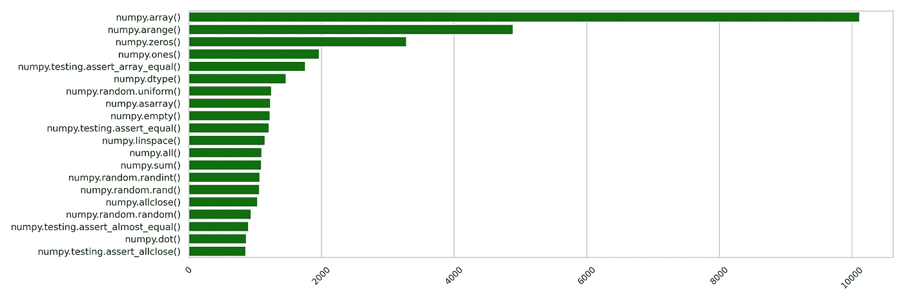

# 流行的 NumPy 函数以及在哪里可以找到它们

> 原文：<https://towardsdatascience.com/popular-numpy-function-and-where-to-find-them-6d170b7e6ba1?source=collection_archive---------31----------------------->


最流行的 NumPy 函数(图片由作者提供)

探索，还是剥削？

如果有用，那就足够了。如果你能把事情做好，为什么要寻找其他方法来解决同样的问题呢？这是看待事物的一种方式。反对这种做法的理由是，这样你会错过更有效、更易读的选择。

即使在与 NumPy、Pandas 和其他相关库一起工作了近三年之后，我仍然经常找到解决问题的替代方法，至少可以说，这些方法大大减少了运行时间或者可读性更好。

那么，在开始工作之前，我们应该努力探索其他功能吗？绝对不行！浏览整个文档会花很多时间。

那我们该怎么办？

我决定看看最常用的函数，看看我是否知道它们。假设是**最有用的功能可能会被大多数人使用**。

让我们来了解一下这些功能是什么！我们将分三步走。

1.  使用 Github 搜索 API 来查找使用 NumPy 的存储库
2.  从这些存储库中，下载相关的文件
3.  浏览代码库，找到最常用的函数

## 使用 Github 搜索 API 来查找使用 NumPy 的存储库

要使用 Github API，首先需要创建一个 [API 令牌](https://docs.github.com/en/free-pro-team@latest/github/authenticating-to-github/creating-a-personal-access-token)。我们将把这个令牌放入请求的头部。

```
# I put the API token in a txt file, which I read in the next line
with open('../../api_keys/github.txt', "r") as f:
    API_KEY = f.read()

headers = {'Authorization': 'token %s' % API_KEY}
```

现在我们来声明一些变量。

```
# We will look for python codebases that use the NumPy library
LIBRARY = ‘numpy’
LANGUAGE = ‘python’# This is how the basic search URL looks like. We need to append the page number with it in order to get the paginated search results
URL = '[https://api.github.com/search/repositories?q=%s+language:%s&sort=stars&order=desc&page='](https://api.github.com/search/repositories?q=%s+language:%s&sort=stars&order=desc&page=') % (LIBRARY, LANGUAGE)
```

现在，我们将使用请求库发送一个 GET 请求，然后检查响应。

```
r = requests.get(URL + '1', headers=headers)
json_response = r.json()print(json_response.keys())
print('Total Repositories:', json_response['total_count'])
print('Total number of items in a page:', len(json_response['items']))print('Keys in a item:', json_response['items'][0].keys())
```

输出:

```
dict_keys(['total_count', 'incomplete_results', 'items'])
Total Repositories: 10853
Total number of items in a page: 30
Keys in a item: dict_keys(['id', 'node_id', 'name', 'full_name', 'private', 'owner', 'html_url', 'description', 'fork', 'url', 'forks_url', 'keys_url', 'collaborators_url', 'teams_url', 'hooks_url', 'issue_events_url', 'events_url', 'assignees_url', 'branches_url', 'tags_url', 'blobs_url', 'git_tags_url', 'git_refs_url', 'trees_url', 'statuses_url', 'languages_url', 'stargazers_url', 'contributors_url', 'subscribers_url', 'subscription_url', 'commits_url', 'git_commits_url', 'comments_url', 'issue_comment_url', 'contents_url', 'compare_url', 'merges_url', 'archive_url', 'downloads_url', 'issues_url', 'pulls_url', 'milestones_url', 'notifications_url', 'labels_url', 'releases_url', 'deployments_url', 'created_at', 'updated_at', 'pushed_at', 'git_url', 'ssh_url', '**clone_url**', 'svn_url', 'homepage', 'size', 'stargazers_count', 'watchers_count', 'language', 'has_issues', 'has_projects', 'has_downloads', 'has_wiki', 'has_pages', 'forks_count', 'mirror_url', 'archived', 'disabled', 'open_issues_count', 'license', 'forks', 'open_issues', 'watchers', 'default_branch', 'permissions', 'score'])
```

我们看到响应是一个包含三个键的字典:total_count、incomplete_results 和 items。

我们观察到有 10853 个存储库匹配我们的查询。但是我们不会深入研究这么多的存储库！假设我们将只研究 N 个最流行的。怎样才能找到最受欢迎的？嗯，我们已经在我们的 **URL** 中指定了根据**星星**对结果进行排序，按照**降序**的顺序。

```
URL = '[https://api.github.com/search/repositories?q=%s+language:%s&**sort=stars**&**order=desc**&page='](https://api.github.com/search/repositories?q=%s+language:%s&sort=stars&order=desc&page=') % (LIBRARY, LANGUAGE)
```

现在我们只需要这些存储库的 URL，这样我们就可以克隆它们了。你可以看到每一项都有一个“ **clone_url** ”键，它服务于这个目的。我们将为每个存储库保留一些额外的密钥，以防我们以后需要它们。现在，我们将迭代前 35 页。

```
keys = ['name', 'full_name', 'html_url', 'clone_url', 'size', 'stargazers_count']
NUMBER_OF_PAGES_TO_ITERATE = 35# We will declare a dictionary to store the items
repo_dict = dict([(key, []) for key in keys])
```

我们需要发送每个页面的请求，并保存结果！不要忘记在每个请求之间等待几秒钟，以免 API 不堪重负。

```
for page_num in tqdm(range(0, 35)):
    r = requests.get(URL + str(page_num))
    contents = r.json()

    for item in contents['items']:
        for key in keys:
            repo_dict[key].append(item[key])

    if page_num % 5 == 0:
        time.sleep(60)
```

现在我们已经有了存储库信息，让我们把它保存在一个数据帧中，我们稍后会用到它。

```
repo_df = pd.DataFrame(repo_dict)
repo_df.to_csv('../../data/package_popularity/numpy/repo_info.csv')repo_df.head()
```

在下面的要点中，您可以查看搜索查询返回的存储库。

## 从这些存储库中下载相关文件

如果您运行下面的命令，您将会看到一些存储库不止一次出现在那里。我还没有发现为什么会发生这种情况。如果你知道任何关于这件事的情况，请让我知道。

```
repo_df[‘full_name’].value_counts()
```

现在，我们将只考虑这些存储库中的一个，最先出现的那个。

您可以编写一个 bash 脚本来克隆这些存储库，或者使用 Github 库。要使用 Github 库，您必须提供 Github API。

```
with open('../../api_keys/github.txt', "r") as f:
    API_KEY = f.read()

g = Github(API_KEY)
```

在这些文件中，我们将只下载那些带有。py 或者。ipnyb 扩展。

```
ext_set = set(['ipnyb', 'py'])
# The directory where we will store the repositories
REPO_DIR_PARENT = ‘../../data/package_popularity/numpy/clones/’
```

接下来，我们将只考虑至少有 100 颗星的存储库。

```
repo_df = repo_df[repo_df['stargazers_count'] >= 100]
```

要获得回购的文件，我们可以使用下面的代码片段。这将返回目录中的所有文件，作为 int get_contents 函数的参数。例如，下面的代码片段将返回根目录中的文件。

```
repo = git_client.get_repo(full_name)
contents = repo.get_contents("")
```

我们需要从目录结构中递归收集所有文件。让我们编写一个助手函数来处理这个问题。

```
def get_relevant_files (full_name, git_client, ext_set):
    repo = git_client.get_repo(full_name)
    contents = repo.get_contents("")
    files = []

    while contents:
        file_content = contents.pop(0)
        if file_content.type == "dir":
            contents.extend(repo.get_contents(file_content.path))
        elif file_content.name.split('.')[-1] in ext_set:
            files.append((file_content.name, file_content.download_url))

    return files
```

让我们调用存储库，看看会发生什么。

```
files = get_relevant_files('ddbourgin/numpy-ml', git_client, ext_set)
print(len(files))
print(files[0])
```

输出:

```
89
('setup.py', '[https://raw.githubusercontent.com/ddbourgin/numpy-ml/master/setup.py'](https://raw.githubusercontent.com/ddbourgin/numpy-ml/master/setup.py'))
```

存储库中有 89 个文件。py 或者。ipnyb 扩展。该列表包含文件的 URL，我们可以使用请求库轻松下载这些文件。

```
for name, download_url in files:
    r = requests.get(download_url, allow_redirects=True)
```

最后，我们需要将文件的内容保存在本地目录中。我们将简单地使用存储库的全名来创建一个目录，然后将所有文件放在这个特定的目录中。

```
os.path.join(REPO_DIR_PARENT, '_'.join(full_name.split('/')))
```

你可以在下面的要点中找到完整的代码。

## 探索仓库

现在我们将深入挖掘下载的文件。首先，让我们看看 import 语句，了解 NumPy 库通常是如何导入的。我们已经知道流行的“import numpy as np”语句。但是有没有人把它进口当 pd，甚至熊猫？🤔

查看导入语句，我发现有三种最常用的类型。

1.  import numpy
    处理这个问题非常简单。我们将只看形式为 **numpy 的语句。***
2.  import numpy.abc
    这个也很直接。
3.  从 numpy 导入 abc
    我们将通过处理每个实例 **abc 来处理这个问题。*** 为 **numpy.abc.***
4.  从 numpy.abc 导入 xyz
    我们将处理 **xyz。*** 为 **numpy.xyz.abc.***

所有这些语句都可以用“as”来修改，如“import numpy as np”或“from numpy import abc as def”我们也需要解决这个问题！

我们将保留一本字典，在那里我们将记录这些缩写以及它们代表什么。然后看到 def，就用 numpy.abc 代替，以此类推。

导入的模块实例可以有两种类型。

1.  它们可以是函数，我们可以通过寻找左括号来识别。
2.  它们可以是类，我们可以通过检查它们的属性是否被访问来识别它们。

我们现在非常接近最终解决方案。

对于每个文件，我们将首先构建一组导入的实例。

然后我们将遍历每一行，并检查“numpy.xyz.abc.*(”，这是一个简单的正则表达式，其中星号可以由任意数量的字符替换。

如果我们找到一行包含“numpy.xyz.abc.*(”，我们就知道这一行使用的是“numpy.xyz.abc.*()”函数。

**限制**:我们只看单行语句。如果一个函数调用或导入语句跨越多行，这段代码不会计算在内。我没处理过一些边缘案件。如果你想的话，可以随意修改代码！

现在我们有了 20 个最常用的函数！

1.  numpy.array()
2.  numpy.arange()
3.  numpy.zeros()
4.  numpy.ones()
5.  numpy . testing . assert _ array _ equal()
6.  numpy.dtype()
7.  numpy.random.uniform()
8.  numpy.asarray()
9.  numpy.empty()
10.  numpy.testing.assert_equal()
11.  numpy.linspace()
12.  numpy.all()
13.  numpy.sum()
14.  numpy.random.randint()
15.  numpy.random.rand()
16.  numpy.allclose()
17.  numpy.random.random()
18.  numpy . testing . assert _ almost _ equal()
19.  numpy.dot()
20.  numpy.testing.assert_allclose()



图一。最常用的 NumPy 函数(图片由作者提供)

结果，我用了 18 个。我不知道 [numpy.all_close()](https://numpy.org/doc/stable/reference/generated/numpy.allclose.html) 函数和它的断言变量。看起来很有帮助！

你知道多少？

感谢阅读！