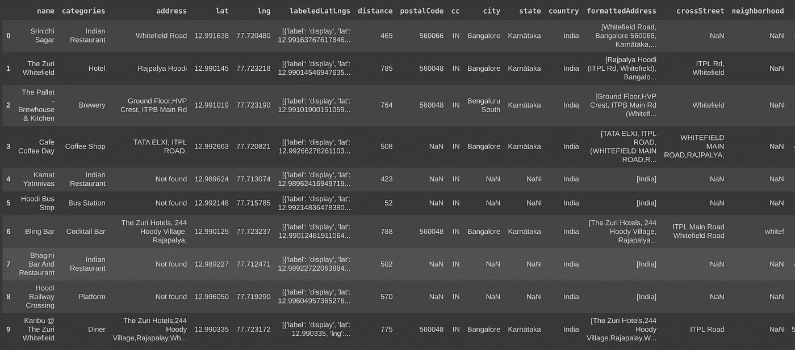
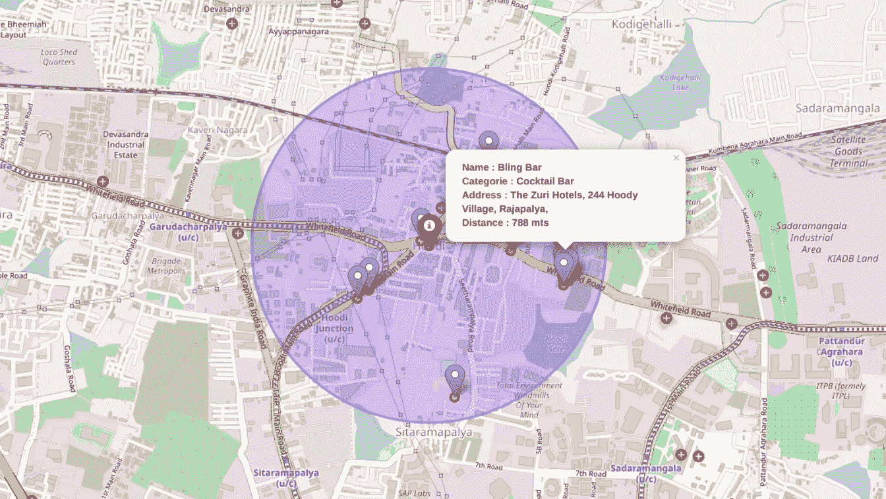

# 我附近的热门地点—使用 Python 和 FourSquare API 的数据可视化

> 原文：<https://towardsdatascience.com/popular-places-near-me-data-visualization-using-python-and-foursquare-api-4d1683cd62d1?source=collection_archive---------43----------------------->

## 本文教你如何使用 python 和 FourSquare API 可视化你所在位置附近指定半径范围内的所有热门地点，在本文结束时，你将能够创建如下所示的地图


作者图片

# A.介绍

人们往往倾向于从一个地方旅行到另一个地方，探索新事物，在旅途中，他们需要了解周围所有受欢迎的地方，这样他们就不会错过任何地方。所以这个应用程序是为那些需要知道他们周围所有人口密集地区的人准备的。

这个模型的输入是你当前的位置和你需要的推荐地点的搜索半径。我们使用 FourSquare API，它给出了给定位置周围所有受欢迎的地方，并用 python 来可视化这些东西。

# B.数据要求:

为了构建这个应用程序，我们采用了 FourSquare API 的帮助，所以你需要在 FourSquare 开发者门户有一个开发者帐户，不要担心它是免费使用的。

下面是如何获得 FourSquare API 证书的方法

1.  访问 [FourSquare 开发者网站](https://developer.foursquare.com/places)。
2.  创建一个帐户，它是免费使用的(你可以找到一步一步的指南[这里](https://docs.mageplaza.com/social-login-m2/how-to-configure-foursquare-api.html)
3.  因此，最终您将拥有一个**客户端 ID** 和**客户端秘密**凭证，它们将在后续步骤中使用。

因此，为了探索一个位置，我们使用 FourSquare API 提供的 URL

```
[https://api.foursquare.com/v2/venues/explore?client_id={**CLIENT**](https://api.foursquare.com/v2/venues/explore?client_id={CLIENT) **ID**}&client_secret={**CLIENT SECRET**}&ll={**Latitude**},{**Longitude**}&v={**VERSION**}&radius={**RADIUS**}&limit={**LIMIT**}
```

1.  您将从您的 FourSquare 开发者帐户获得客户 ID 和客户密码。
2.  纬度和经度是您当前的位置坐标，您可以使用 python **geopy** 库获得这些坐标，该库将位置转换为坐标。
3.  半径是用户给出的输入之一。
4.  LIMIT 是您希望从 API 获取的结果数

现在我们已经准备好了我们的需求，所以让我们开始编码…

# C.模型开发

## 1.导入所有重要的 python 库

## 2.定义四方 API 凭证

## 3.从用户处读取当前位置，并将其转换为坐标

.

## 4.从 FourSquare API 获取数据，结果是一个 JSON 数据

## 5.从 JSON 文件中获取相关数据，

原始数据是从 FourSquare API 获取的，如下所示


作者图片

## 6.清洗数据并转换成数据帧

终于！我们的数据已经可以可视化了，看看吧...



作者图片

## 7.我附近的热门地点的可视化

万岁！我们成功了，这是我们的最终输出

1.  位置的名称
2.  它以什么类别而闻名
3.  位置的地址
4.  离当前位置的距离

**注**:红色标记显示当前位置，而蓝色标记显示附近的著名地点



作者图片

# 摘要

1.  我们创建了一个 FourSquare API 帐户，并获得了我们唯一的凭证。
2.  我们将用户提供的地址转换为位置坐标。
3.  我们从 FourSquare API 获取数据，并将其转换为数据帧。
4.  最后将数据框可视化在地图上。

# 结论

本文展示了找到您附近所有热门地点的最佳和明智的方法，这可能是初学者开始数据科学项目的最佳方法之一。

你可以在这里获得完整的源代码

## **感谢阅读😃**

[](/impact-of-covid-19-data-visualization-using-python-6f8e3bdc860b) [## 新冠肺炎的影响-使用 Python 进行数据可视化

### 使用 python 在印度地图上可视化冠状病毒爆发的初级方法。当你到达…的终点时

towardsdatascience.com](/impact-of-covid-19-data-visualization-using-python-6f8e3bdc860b)