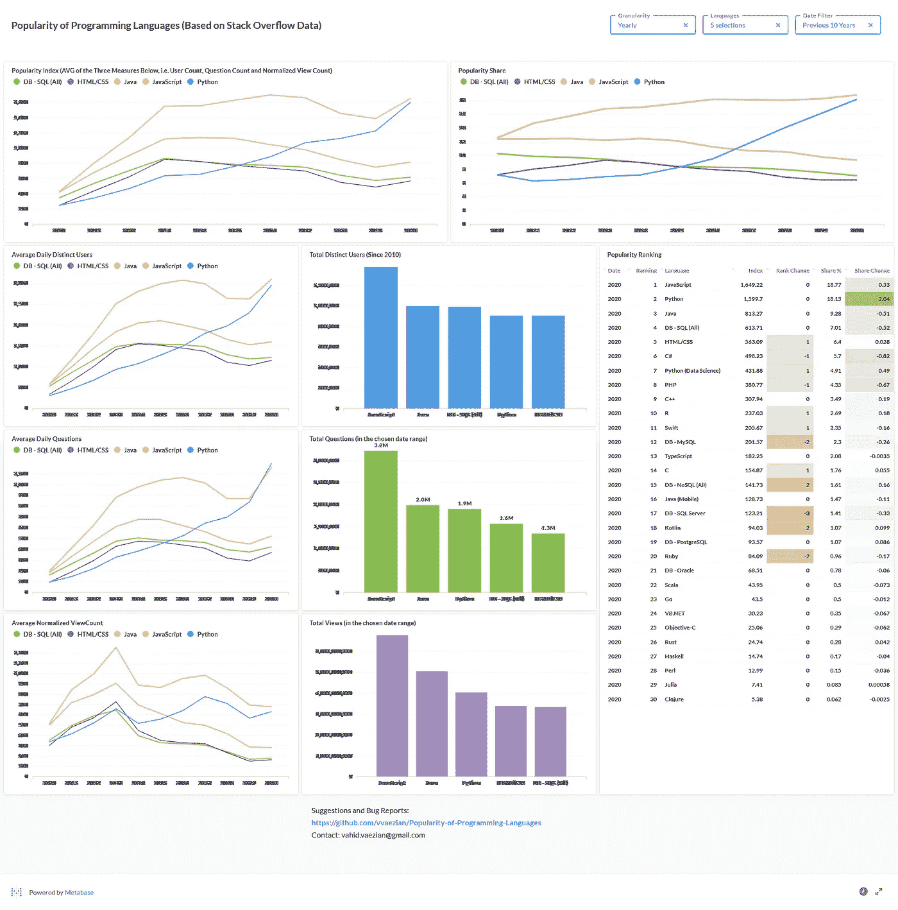
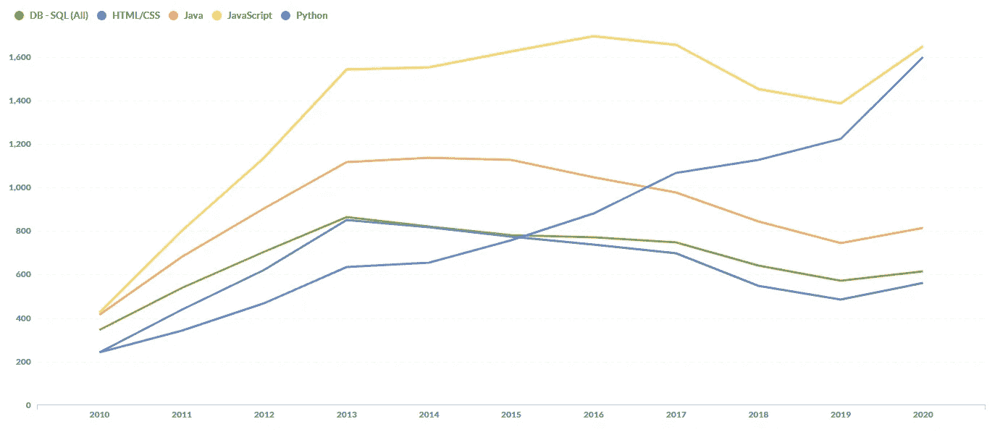
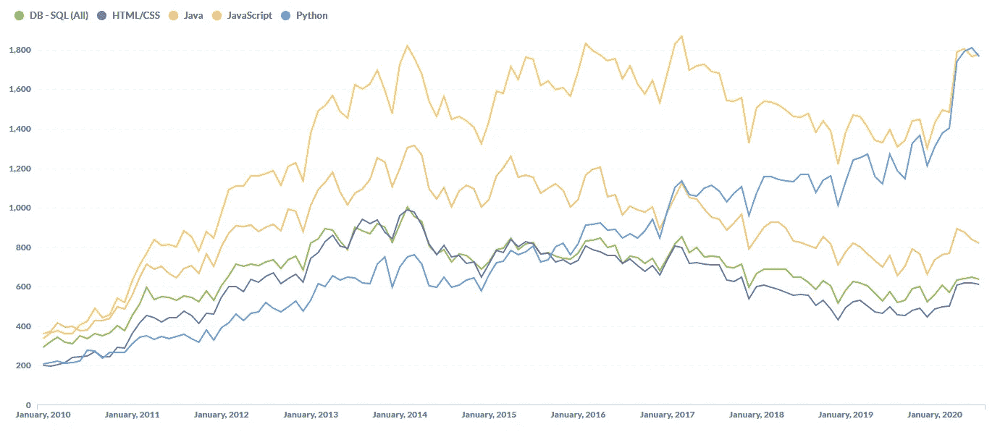
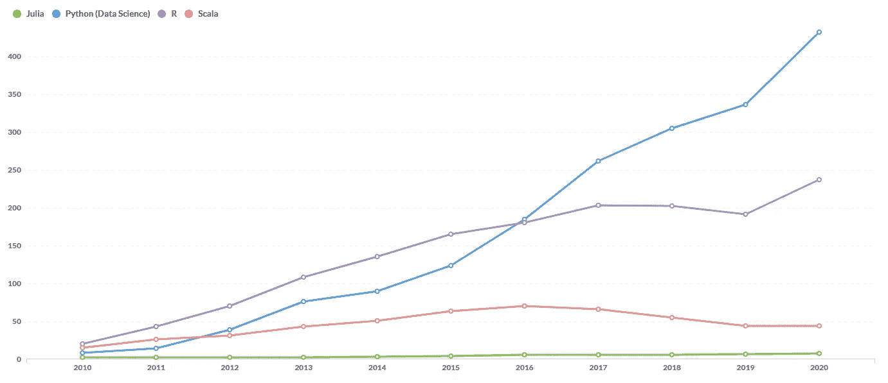
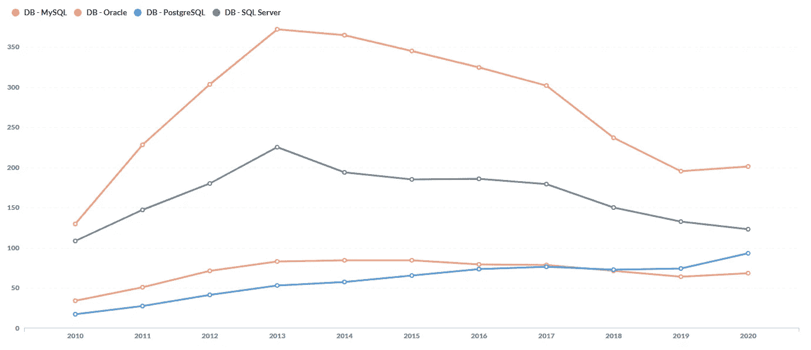
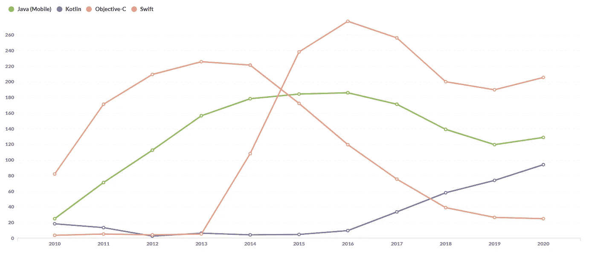

# 编程语言流行度排名

> 原文：<https://towardsdatascience.com/popularity-ranking-of-programming-languages-72bcf697ea20?source=collection_archive---------36----------------------->

## Python 和 JavaScript 争夺桂冠


图片由 [ILLUSTRIS](https://illustris.ca/)

对于什么是最流行的编程语言，从来没有一致的意见，也许永远也不会有一致的意见。然而，我们认为，尝试找出对编程语言的流行程度进行排名的方法是有价值的。它有助于我们看到一段时间内的趋势，并提示我们应该关注什么。在不断变化的技术世界中，保持领先是非常重要的。

接下来的分析是关于堆栈溢出(SO)的数据。SO 网站可以说是开发者社区中最大、最受欢迎的问答网站(“开发者”是任何写代码的人的一般意义)。目前，该网站每天的访问量约为 1，000 万次，除了简单的访问外，还有 1，260 万用户活跃在该网站上(例如，张贴问题/答案或发表评论/编辑)。我们相信基于编程语言在 SO 上的受欢迎程度来对它们的实际受欢迎程度进行排名是一个很好的估计。

我们已经为编程语言计算了一个**流行指数**，它是三个因素的平均值:每天问的问题数量、每天不同用户的数量和问题的查看次数。为了识别一种语言，我们考虑分配给帖子的标签。例如，对于 JavaScript，我们考虑以下标签:

```
 tags like ‘%javascript%’ 
or tags like ‘%jquery%’ 
or tags like ‘%js>%’ — tag ends with ‘js’ e.g. ‘node.js’
or tags like ‘%extjs%’ — includes ‘extjs4’ and others
```

对于每日问题计数，我们计算每种编程语言每天被问到的问题数量。

为了计算不同用户数，我们计算每天针对每种编程语言提问/回答问题、发表评论或编辑问题/答案的不同用户的数量。

SO 中的每个帖子都有一个属性，显示该帖子被查看了多少次。我们通过将这个数字除以帖子可见的天数来标准化这个数字。这为我们提供了该帖子的归一化视图计数。然后，我们对每种编程语言每天的视图计数求和。请注意，由于最近帖子的标准化视图计数的方差很高，我们没有将这些帖子包括在计算中。因此，这项措施比其他两项措施晚了两个月。

关于指数如何计算的更多细节，请参见 [GitHub 知识库](https://github.com/vvaezian/Popularity-of-Programming-Languages)。

现在让我们使用一些折线图来探索趋势。请注意，您可以使用这个 [**交互式仪表板**](http://metabase.intellimenta.com/public/dashboard/f9b5e04b-9755-489d-9f5d-6adc3e3806fd) (从右上角选择所需的过滤器。)



人气指数仪表板(作者图片)

*注:以下分析基于截至 2020 年 7 月底的 SO 数据。交互式仪表盘背后的数据将每季度更新一次。*

# 前五名

从最受欢迎的五种编程语言(基于我们的指数)开始，如果我们看一下年度数据，我们会发现 JavaScript 在过去 10 年中一直占据冠军宝座，尽管 Python 现在紧随其后，正在迅速赶上。其他三个，即 Java、SQL 和 HTML/CSS，在过去的七年中受欢迎程度略有下降。



当前年度前五名(图片由作者提供)

如果从季度数据来看，JavaScript 虽然与 Python 并驾齐驱，但仍然位居榜首。有趣的部分是月度数据。【2020 年 6 月是过去 10 年来 JavaScript 第一次失去榜首位置。鉴于 Python 的发展速度，Python 似乎将在一段时间内成为顶级竞争者。



当前前五名—每月(图片由作者提供)

# 数据科学

数据科学是近年来的热门话题。在下面的图表中，我们可以看到 Python 和 R 在过去几年中有了很高的增长率。Scala 或多或少保持了它的受欢迎程度，而 Julia 的受欢迎程度到目前为止微乎其微。注意，为了进行公平的比较，本次比较只考虑了 Python 的数据科学部分(更多细节请参见 GitHub 资源库)。



数据科学(作者图片)

# 关系型数据库管理系统

在关系数据库管理系统(RDBMS)中，MySQL 仍然是最受欢迎的，尽管它的受欢迎程度一直在下降。这同样适用于 SQL Server。另一方面，PostgreSQL 的受欢迎程度在过去十年中不断增加。甲骨文的受欢迎程度没有太大变化。



RDDMS(图片由作者提供)

# 移动开发

关于移动开发语言，我们看到了一些相当大的变化。Swift 于 2014 年 6 月推出，对 Objective-C 的受欢迎程度造成了重大打击。类似的故事也发生在 Kotlin 和 Java(移动)上。2017 年，谷歌将 Kotlin 纳入 Android Studio，自 2019 年 5 月以来，它是 Android 应用程序开发者的首选编程语言。



移动开发(图片由作者提供)

# 我们比赛吧！

要查看计算出的过去 10 年的流行指数，请点击下方图表左下角的播放按钮。您也可以使用底部的滑块移动到特定的时间范围。

*注意:图表将在每个季度开始后一个月用新数据更新(如上所述，ViewCount 指标落后于其他两个指标两个月，这导致指数也落后两个月，因为它是三个指标的平均值)。*

(用繁荣条形图比赛创建)

如果你有改进索引的建议，请让我知道，或者在评论中或者在 GitHub 库中创建一个问题。

*   [交互式仪表盘](http://metabase.intellimenta.com/public/dashboard/f9b5e04b-9755-489d-9f5d-6adc3e3806fd)
*   [GitHub 资源库](https://github.com/vvaezian/Popularity-of-Programming-Languages)