# 用命名实体填充网络图

> 原文：<https://towardsdatascience.com/populating-a-network-graph-with-named-entities-fb8e3d2a380f?source=collection_archive---------31----------------------->

## 数据科学/ Python NLP 片段

## 使用 networkx 可视化自然语言处理结果的早期尝试。


照片由 [Unsplash](https://unsplash.com/s/photos/news?utm_source=unsplash&utm_medium=referral&utm_content=creditCopyText) 上的 [Utsav Srestha](https://unsplash.com/@utsavsrestha?utm_source=unsplash&utm_medium=referral&utm_content=creditCopyText) 拍摄

*我做了很多自然语言处理，通常结果看起来很无聊。当我了解网络图时，我开始思考，为什么不用关键词作为节点，把它们连接起来，创建一个网络图呢？*

*Yupp，有何不可！*

在这篇文章中，我们会做到这一点。我们将从关于冠状病毒的新闻文章中提取命名实体，然后使用它们的关系在网络图中将它们连接在一起。

# 简介

网络图是包含节点(顶点)和边(线)的很酷的视觉效果。它经常用于社交网络分析和网络分析，但数据科学家也将其用于自然语言处理。

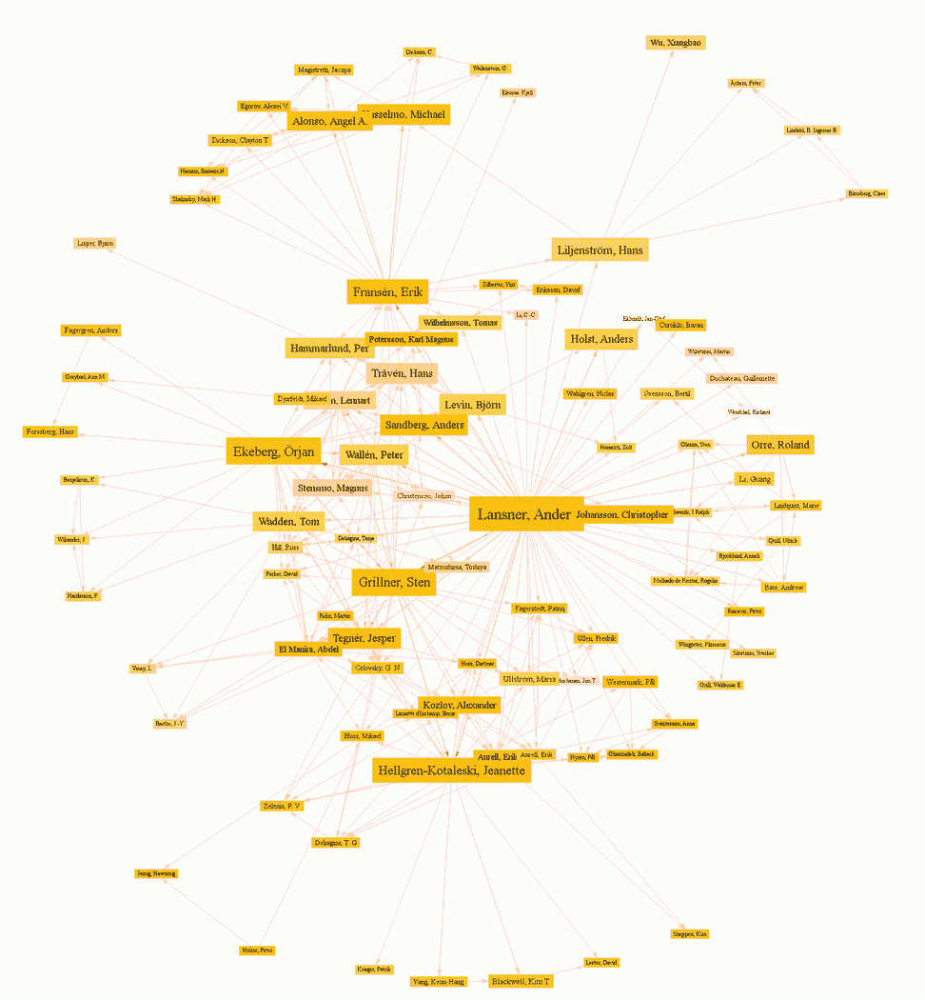

安德斯·桑德伯格在[闪烁](https://www.flickr.com/photos/arenamontanus/268427309/in/photolist-pHL64-pHM2v-6tMfEz-4WFXny-869jFp-5RKqLt-cAT173-bWngsQ-5UT2bk-a1Jv37-a1Kpgb-22X1B-QmWPYi-c19Geu-2N9Z6h-6UVCQJ-pNWn9-44h6ju-btejyK-9M2QU4-7A9A3C-74oaKo-jR9gc-pNUDF-dHMZYj-t7tgKB-29KdY5-bkztuc-66JvbF-4CS4g3-5RKqMK-bWN8Sm-33Nf4C-7UYR2T-x9m1S-2N5zxK-bS9WnP-ciKZHy-5J95ED-n3DZZ-aFhJjH-THTRQG-SxKctc-btTTPU-TDNAMg-7yZcaX-29Kted-9pT4Ni-91471X-26ary2u)上拍摄的照片

自然语言处理或 NLP 是人工智能的一个分支，它处理编程计算机来处理和分析大量文本并从中获取意义。换句话说，就是教计算机如何理解人类语言……像个老板一样！

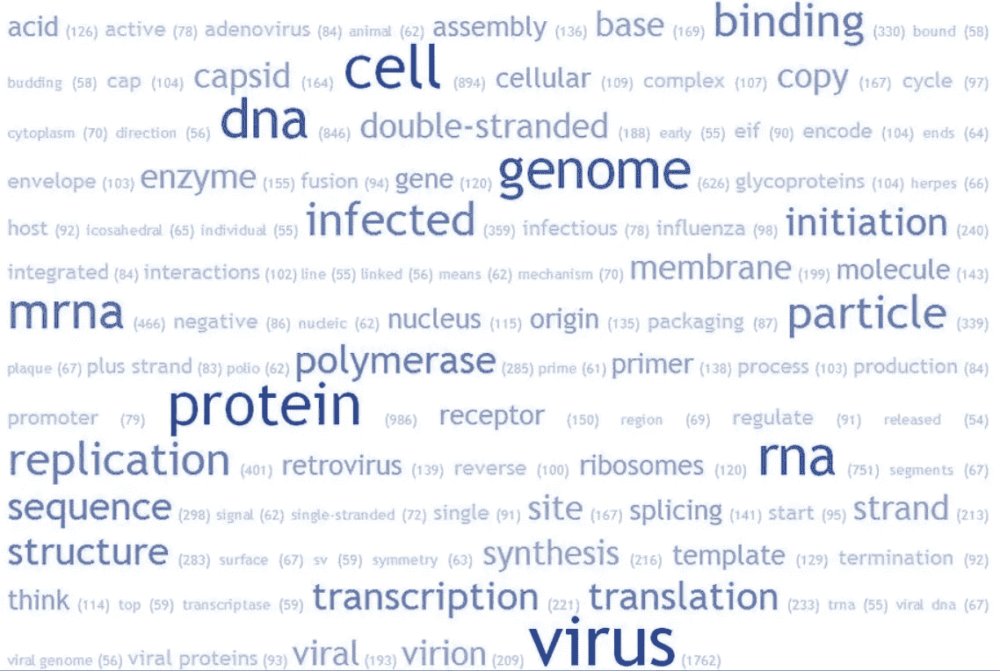

照片由 [brewbooks](https://www.flickr.com/photos/brewbooks/) 在 [Flickr](https://www.flickr.com/photos/brewbooks/10805411174/in/photolist-UKMdza-hsQyhE-2iCStmP-2iStoUE-2e5EAr1-2iw1pBb-2iUPEcB-2iXqdWL-PaWqhd-2iJbARo-2iNM3hT-FdCYsS-2iQNUxy-Jec8po-2iMvVpU-2iL4DjL-2iARgAa) 上拍摄

介绍够了，开始编码吧！

首先，让我们确保处理好所有的依赖关系。打开终端并执行以下命令:

```
pip install -U spacy
python -m spacy download en
pip install networkx
pip install fuzzywuzzy
```

这将安装 spaCy 并下载英语的训练模型。第三个命令安装 networkx。这应该适用于大多数系统。如果它对你不起作用，检查一下[空间](https://spacy.io/usage)和[网络 x](https://networkx.github.io/documentation/stable/install.html) 的文档。此外，我们使用 [fuzzywuzzy](https://pypi.org/project/fuzzywuzzy/) 进行一些文本预处理。

解决了这个问题，让我们启动 Jupyter 笔记本，开始行动吧！

# 进口

将下面的代码块运行到一个单元格中，以将所有必需的导入内容导入到我们的 Python 环境中。

```
import pandas as pd
import numpy as np
import pickle
from operator import itemgetter
from fuzzywuzzy import process, fuzz# for natural language processing
import spacy
import en_core_web_sm# for visualizations
%matplotlib inline
from matplotlib.pyplot import figureimport networkx as nx
```

# 获取数据

如果您想跟进，您可以在这里下载样本数据集。该文件是使用[报纸](https://newspaper.readthedocs.io/en/latest/)从[npr.org](https://www.npr.org/sections/coronavirus-live-updates)导入新闻文章而创建的。如果你喜欢冒险，可以使用下面的代码片段来构建你自己的数据集。

让我们得到我们的数据。

```
with open('npr_coronavirus.txt', 'rb') as fp:   # Unpickling
    corpus = pickle.load(fp)
```

# 提取实体

接下来，我们将从加载 spaCy 的英文模型开始:

```
nlp = en_core_web_sm.load()
```

然后，我们将提取实体:

```
entities = []for article in corpus[:50]:
    tokens = nlp(''.join(article))
    gpe_list = []
    for ent in tokens.ents:
        if ent.label_ == 'GPE':
            gpe_list.append(ent.text)
    entities.append(gpe_list)
```

在上面的代码块中，我们创建了一个名为`entities`的空列表来存储包含从每篇文章中提取的实体的列表。在 for 循环中，我们循环了语料库的前 50 篇文章。对于每一次迭代，我们将每篇文章转换成单词，然后遍历所有这些单词，得到国家、州和城市的标记为`GPE`的实体。我们使用`ent.text`来提取实际的实体，并将它们一个一个地附加到`entities`中。

结果如下:

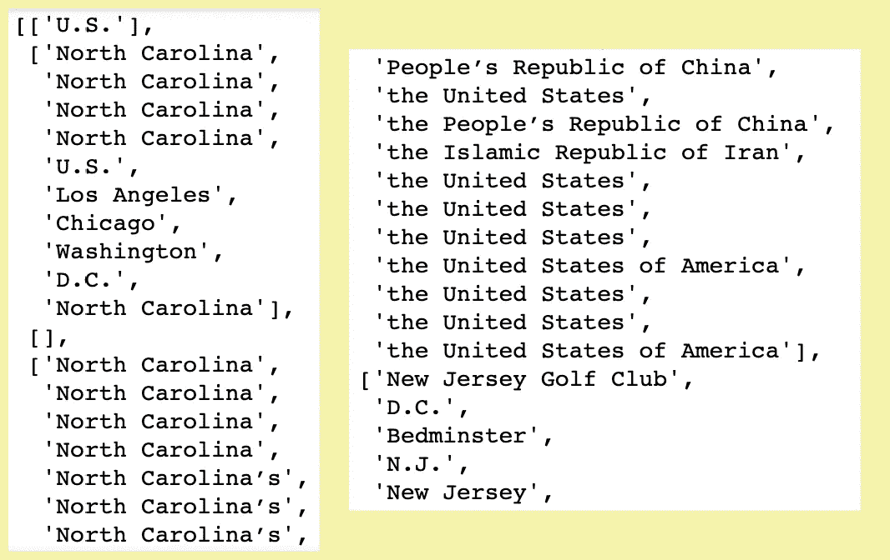

请注意，北卡罗来纳州的名称有几种变体，有些名称中带有“the”前缀。让我们摆脱他们。

```
articles = []for entity_list in entities:
    cleaned_entity_list = []
    for entity in entity_list:
        cleaned_entity_list.append(entity.lstrip('the ').replace("'s", "").replace("’s",""))
    articles.append(cleaned_entity_list)
```

在上面的代码块中，我们简单地遍历列表列表`articles`并逐个清理实体。每次迭代，我们都去掉前缀“the ”,去掉`'s.`

# 可选:FuzzyWuzzy

在查看实体时，我注意到“美国”也有变化。存在着“美利坚合众国”，而有些只是“美国”。我们可以把这些精简成一个更标准的命名约定。

FuzzyWuzzy 可以帮助解决这个问题。

被[pypi.org](https://pypi.org/project/fuzzywuzzy/)描述为“像老板一样的字符串匹配”，FiuzzyWuzzy 使用 Levenshtein 距离来计算单词之间的相似度。关于如何使用 FuzzyWuzzy 的真正好的教程，请查阅 Thanh Huynh 的文章。

[](/fuzzywuzzy-find-similar-strings-within-one-column-in-a-pandas-data-frame-99f6c2a0c212) [## FuzzyWuzzy:用 Python 在一列中查找相似的字符串

### 令牌排序比率与令牌集比率

towardsdatascience.com](/fuzzywuzzy-find-similar-strings-within-one-column-in-a-pandas-data-frame-99f6c2a0c212) 

下面是使用 FuzzyWuzzy 的可选代码:

在创建网络图之前的最后一步，让我们去掉列表中的空列表，这些列表是由没有任何`GPE`实体类型的文章生成的。

```
articles = [article for article in articles if article != []]
```

# 创建网络图

下一步，我们将创建图形存在的世界。

```
G = nx.Graph()
```

然后，我们将手动添加带有`G.add_nodes_from()`的节点。

```
for entities in articles:
    G.add_nodes_from(entities)
```

让我们看看这个图表是什么样子的:

```
figure(figsize=(10, 8))
nx.draw(G, node_size=15)
```

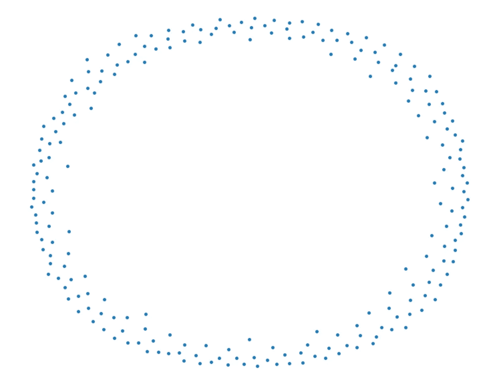

接下来，让我们添加将连接节点的边。

```
for entities in articles:
    if len(entities) > 1:
        for i in range(len(entities)-1):
           G.add_edges_from([(str(entities[i]),str(entities[i+1]))])
```

对于上面代码的每一次迭代，我们都使用了一个条件，该条件将只处理包含两个或更多实体的实体列表。然后，我们用`G.add_edges_from()`手动连接每个实体。

让我们看看现在的图表是什么样的:

```
figure(figsize=(10, 8))
nx.draw(G, node_size=10)
```

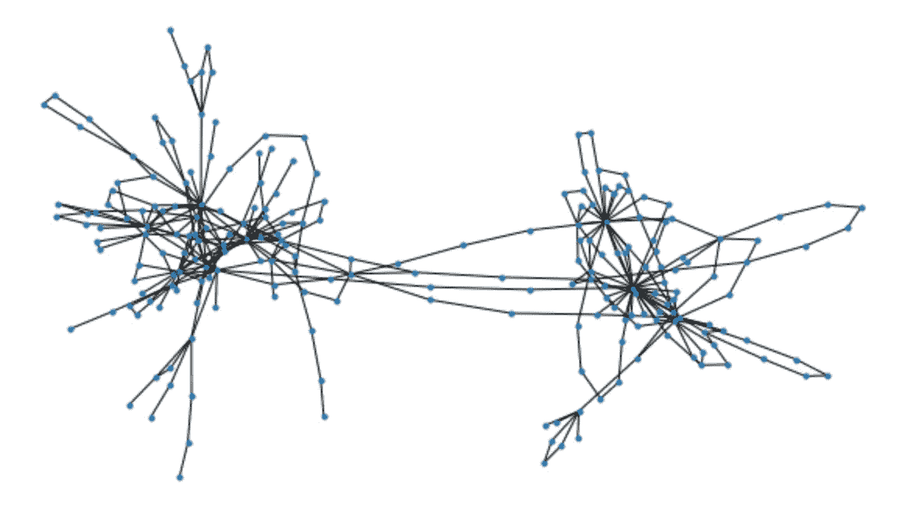

这张图让我想起了蜘蛛！LOL。

为了便于组织，我决定使用 shell 版本的网络图:

```
figure(figsize=(10, 8))
nx.draw_shell(G, node_size=15)
```

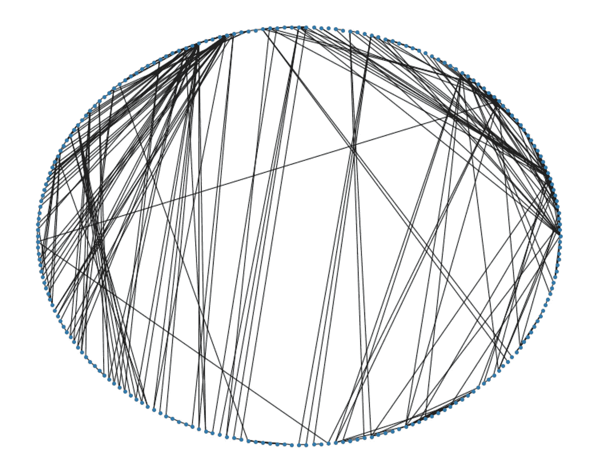

我们可以看出一些节点的连接比其他节点重。要查看哪些节点拥有最多的连接，让我们使用`G.degree()`。

```
G.degree()
```

这给出了以下度数视图:

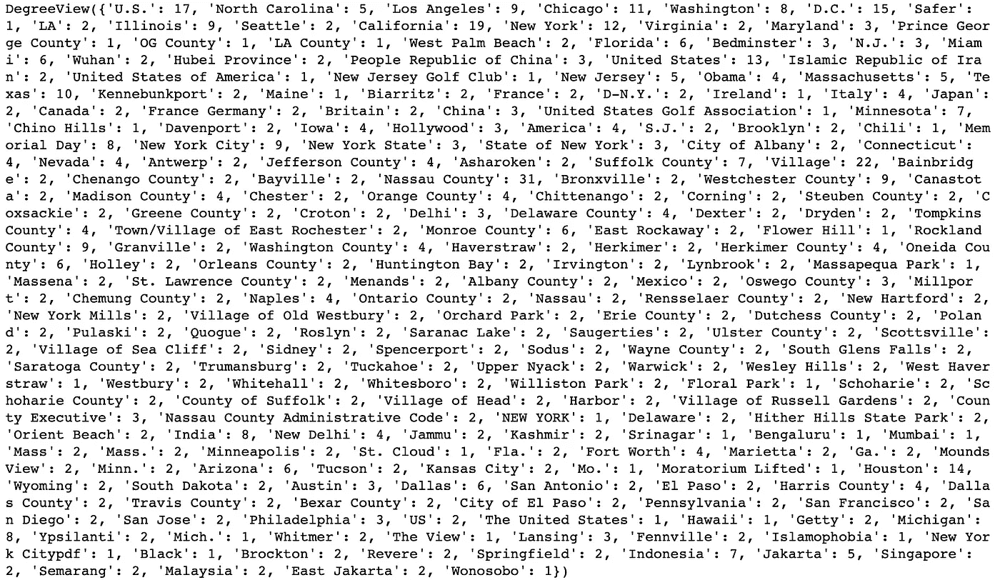

让我们找出哪个节点或实体拥有最多数量的连接。

```
max(dict(G.degree()).items(), key = lambda x : x[1])
```

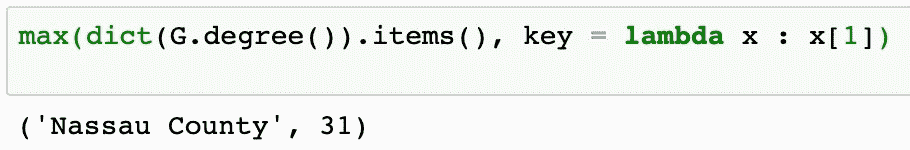

为了找出拥有最多连接数的其他节点，让我们来看看前 5 个:

```
degree_dict = dict(G.degree(G.nodes()))
nx.set_node_attributes(G, degree_dict, 'degree')sorted_degree = sorted(degree_dict.items(), key=itemgetter(1), reverse=True)
```

上面，`sorted_degrees`是一个包含所有节点及其度数值的列表。我们只希望前 5 名是这样的:

```
print("Top 5 nodes by degree:")
for d in sorted_degree[:5]:
    print(d)
```

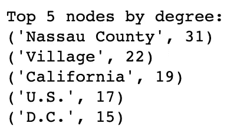

# 奖励回合:Gephi

Gephi 是一个开源的免费桌面应用程序，让我们可以可视化、探索和分析各种图形和网络。

让我们将图形数据导出到一个文件中，这样我们就可以将它导入到 Gephi 中。

```
nx.write_gexf(G, "npr_coronavirus_GPE_50.gexf")
```

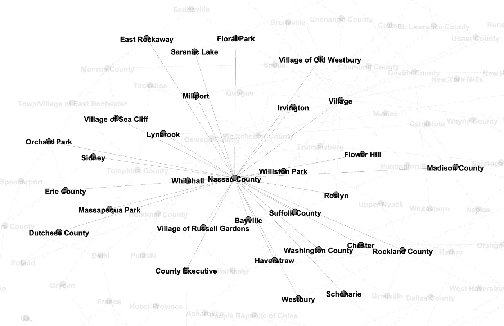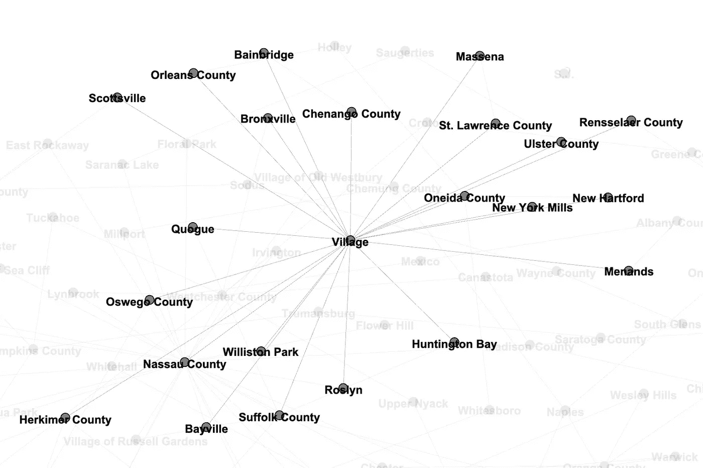

酷豆！

# 后续步骤

这次，我们只处理了来自 npr.org[的 50 篇文章。如果我们处理数据集的所有 300 篇文章，会发生什么？如果我们将实体类型从`GPE`改为`PERSON`，会看到什么？还能怎么用网络图来可视化自然语言处理结果？](https://npr.org)

总是有更多的事情要做。可能性是无限的！

我希望你喜欢今天的帖子。代码并不完美，我们还有很长的路要走，才能从数据中获得洞察力。我鼓励你更深入地了解[空间](https://spacy.io/)、[网络](https://networkx.github.io/)、 [fuzzywuzzy](https://pypi.org/project/fuzzywuzzy/) ，甚至 [Gephi](https://gephi.org/) 。

*敬请期待！*

你可以通过 [Twitter](https://twitter.com/ecdedios) 或 [LinkedIn](https://www.linkedin.com/in/ednalyn-de-dios/) 联系我。

[1]:维基百科。(2020 年 5 月 25 日)。*自然语言处理*https://en.wikipedia.org/wiki/Natural_language_processing

[2]: Gephi。(2020 年 5 月 25 日)。*打开图 Viz 平台*[https://gephi.org/](https://gephi.org/)