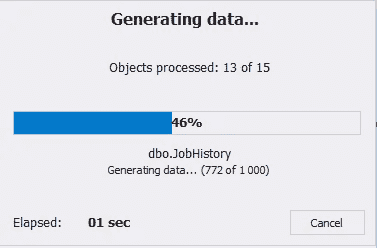

# 用测试数据填充员工数据库

> 原文：<https://towardsdatascience.com/populating-the-employee-database-with-test-data-aa76419eebb6?source=collection_archive---------49----------------------->

## 从雇员数据库的例子开始，这一次我们将弄清楚如何用测试数据填充数据库。

图片来自 [Piqsels](https://www.piqsels.com/en/public-domain-photo-frpof) (CC0)

在本文中，我们将研究用虚拟数据填充雇员数据库的过程，我们在[的上一篇文章](/sql-database-design-basics-with-example-8dcce4b0c687)中设计了虚拟数据的模式。当我们想要运行一些测试时，用虚拟数据填充 SQL 数据库会非常有用。最方便的方法是借助可视化数据生成工具用随机数据填充 SQL 表。

# 借助 SQL Server 数据生成器生成数据

为此，我们将使用 SQL Server 的[数据生成器](https://www.devart.com/dbforge/sql/data-generator/)工具，它被集成到 SSMS 中，也包含在 [dbForge Studio](https://www.devart.com/dbforge/) 中。应该注意，真实的测试数据是基于列名、维度和数据类型生成的。除此之外，还考虑了表之间的关系，因为数据生成过程依赖于它们。

要打开该组件，在 [SSMS](https://docs.microsoft.com/en-us/sql/ssms/download-sql-server-management-studio-ssms?view=sql-server-2017) 中的必要数据库上右击“新数据生成…”:

Img。1.在 SSMS 运行 SQL Server 工具的数据生成器

如果您使用的是 dbForge Studio，请在主菜单中选择工具\新数据生成…:

Img.2 .在 dbForge Studio 中运行 SQL Server 工具的数据生成器

在出现的窗口中，在“Connection”选项卡上，您可以看到当前的 MS SQL Server 实例和为数据生成选择的数据库，可以对其进行编辑(如果需要)。然后单击“下一步”按钮:

Img.3 .设置“连接”选项卡

接下来，在“选项”选项卡上，让我们设置数据库的数据生成选项:

Img.4 .设置数据生成选项

请注意，您可以在不同的模式下生成 SQL 测试数据:

1.  按指定的行数(默认为 1000 行)
2.  按现有数据在总量中所占的百分比(默认为 10 %)
3.  按时间生成数据(默认为 10 秒)

您也可以通过设置“生成前从表中截断数据”参数，在生成前清除数据。

您可以通过以下方式之一设置值分配模式:

1.  按时间戳随机
2.  按种子随机(默认为 1)
3.  连续的

此外，您可以设置列属性:

1.  将值设置为唯一
2.  包括空值(默认为 10%的行)
3.  包括空值(默认为 10%的行)

您可以按下位于数据生成设置窗口左下角的“保存命令行…”按钮，将设置保存到. bat 文件中。

完成设置后，在数据生成设置窗口的右下角，按下“打开”按钮。

然后，您将看到一个进度条，显示表元数据加载。之后，将出现一个窗口，其中包含每个选定表格的详细数据生成设置:

Img.5 .每个选定表格的详细数据生成设置

在左边，您应该选择想要填充的表和列，在右边，您应该为所选的表设置表生成模式。

同时，下面是生成数据的实例(注意代表真实姓名)。

在右上角，有一个上面描述的数据生成设置按钮。

要开始数据生成过程，请单击窗口顶部中间的绿色箭头。然后，您将看到用于选择附加设置的窗口。在这里，在 Output 选项卡上，您需要准确地选择生成数据的位置，以脚本的形式，将其保存到文件或数据库。让我们选择最后一个选项，然后按下一步:

Img。6.设置“输出”选项卡

然后，您可以在“选项”选项卡上设置其他参数。在这种情况下，您需要取消选中数据库备份选项，然后按“下一步”:

Img.7 .设置“选项”选项卡

在“附加脚本”选项卡上，您可以设置附加脚本。在我们的例子中，我们只需按“下一步”:

Img.8 .设置“附加脚本”选项卡

在“Summary”选项卡上，我们可以看到关于设置和警告的信息。在这里，您也可以将所有设置保存为. bat 文件，方法是按下左下角的“保存命令行…”按钮。要运行数据生成流程，您需要按“生成”按钮:

Img.9 .摘要选项卡上的一般信息和警告

出现数据生成过程窗口:

Img.10 .数据生成流程

然后，这些表将被数据填充。例如，Employee 表具有以下生成的数据:

Img.11 .雇员表中生成数据的示例

# 结论

总之，我们用真实的数据填充了数据库，用于测试功能和负载。可以为负载测试生成更多的随机数据。除此之外，测试的过程可以通过 dbForge 单元测试工具来加速。

此外，通过使用 SQL 数据生成，您不仅可以计算数据库增长率，还可以计算数据量增加导致的查询性能差异。

*原载于 2020 年 7 月 22 日 https://blog.devart.com***。**