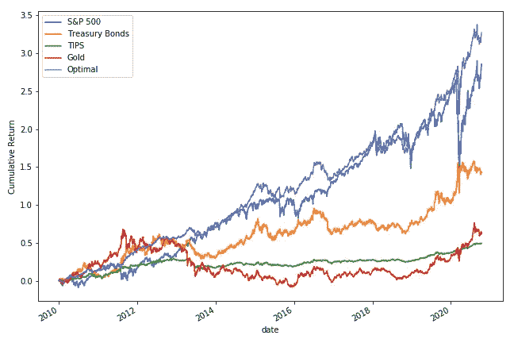

# 基于 NumPy 的投资组合优化

> 原文：<https://towardsdatascience.com/portfolio-optimization-with-numpy-93e1428525a5?source=collection_archive---------15----------------------->


在 [Unsplash](https://unsplash.com?utm_source=medium&utm_medium=referral) 上由 [Austin Distel](https://unsplash.com/@austindistel?utm_source=medium&utm_medium=referral) 拍摄的照片

## 你所需要的只是一些矩阵代数来做出最优投资组合

***来自《走向数据科学》编辑的提示:*** *虽然我们允许独立作者根据我们的* [*规则和指导方针*](/questions-96667b06af5) *发表文章，但我们并不认可每个作者的贡献。你不应该在没有寻求专业建议的情况下依赖一个作者的作品。详见我们的* [*读者术语*](/readers-terms-b5d780a700a4) *。*

*如果你想看我的代码，* [*你可以在我的 GitHub 这里找到*](https://github.com/yiuhyuk/portfolio_optimization) *。*

上次我们讨论了投资组合优化的工作方式和原因:

[](/understanding-portfolio-optimization-795668cef596) [## 了解投资组合优化

### 从概念上理解优化投资组合意味着什么

towardsdatascience.com](/understanding-portfolio-optimization-795668cef596) 

今天，我们将深入实际优化投资组合的技术细节。关于投资组合优化的冷静思考是，它可以完全用矩阵代数来完成，不需要优化软件。

开始之前，让我们重温一下我们的目标。引用我之前的帖子:

> 我们希望(尽可能)确定的是，对于特定的风险水平，我们投资的投资组合能够最大化我们获得正回报的机会。做到这一点的投资组合，也称为最优投资组合，是具有最高预期回报的**(或者用统计学术语来说，是具有最高 Z 值的投资组合)。**

```
For a given level of risk, solve for the weights, W, that:**Maximize W.T @ E****Subject to:
  W.T @ Cov @ W = (target risk)^2 
  and sum(W) = 1**Where **W** is a vector representing the weights of the asset in our portfolio.
**E** is a vector representing the expected returns of the asset.
**Cov** is the covariance matrix of the asset's returns.
**@** denotes matrix multiplication.
**.T** denotes the transpose operation.
```

1.  W @ E 是投资组合的预期收益。
2.  投资组合的方差计算为 W.T @ Cov @ W)。方差是投资组合标准差的平方(也称为风险)。在我们的目标函数中，我们希望投资组合的方差等于目标方差(目标风险水平的平方)。

# 翻转问题

最小化问题通常比最大化问题更容易解决，所以让我们把问题反过来:

```
For a given level of risk, solve for the weights, W, that:**Minimize W.T @ Cov @ W****Subject to:
  W.T @ E = target return = mu
  and sum(W) = 1**Where **W** is a vector representing the weights of the asset in our portfolio.
**E** is a vector representing the expected returns of the asset.
**Cov** is the covariance matrix of the asset's returns.
**@** denotes matrix multiplication.
**.T** denotes the transpose operation.
```

现在，我们不是最大化给定方差水平的收益(也就是风险的平方)，而是最小化给定收益水平的方差。

为了解析地解决这个问题，我们可以利用[拉格朗日乘数](https://en.wikipedia.org/wiki/Lagrange_multiplier)并将我们的问题改写如下:

```
**L(W,h1,h2) 
= W.T@Cov@W + h1*(W.T@E - mu) + h1*(W.T@ones - 1)****ones** denotes a vector of ones with the same length as W
```

请注意，我们现在有一个等式，其中包括我们想要最小化的东西( **W.T@Cov@W** )以及我们的两个约束条件——投资组合的预期回报必须等于目标回报( **W@E — mu** )，投资组合权重总和必须为 1 ( **W@ones — 1** )。

我们可以通过解决以下问题来解决这个问题:

```
**gradient{L(W,h1,h2)} = 0**
```

这基本上是梯度下降，我们想找到关于每个变量的偏导数(也叫斜率)为零的点。当我们到达那一点时，我们知道我们是最小的。

# 一些矩阵代数

我们可以用矩阵代数来解前面的方程。首先让我们写出每个偏导数:

```
gradient L with respect to W  = 2*Cov@W + h1*mu + h2*ones = 0
gradient L with respect to h1 = W.T@E - mu = 0
gradient L with respect to h2 = W.T@ones - 1 = 0
```

我们可以将方程组改写为:

```
2*Cov@W + h1*mu + h2*ones = 0
W.T@E                     = mu
W.T@ones                  = 1
```

矩阵的好处在于，它让我们可以很容易地表示像这样的方程组(并且很容易求解)。在 Python 矩阵表示法中，前面的三个等式是:

```
[[2*Cov  h1 h2],     [[W ],       [[0 ],
 [E.T.   0  0 ],  @   [h1],   =    [mu],
 [ones.T 0\. 0 ]]      [h2]]        [1 ]] **A          @    X      =     b**
```

所以我们可以用三个矩阵 A、X 和 b，用矩阵方程 A@X=b，来解决整个问题。

现在我们需要做的就是解出 X，我们可以很容易地将 b 乘以 A 的倒数:

```
**X = inverse(A)@b**The first **n** elements of X are the optimal weights where **n** is the number of different assets whose weights we are optimizing for.
```

# 用 Python 把它们放在一起

首先我们从一些回报开始。我通过 QUANDL API 从 Shardar 下载了我的。我的返回数据存储在名为 **final** 的数据帧中，如下所示:

```
 S&P 500  Treasury Bonds      TIPS      Gold
date                                                    
2020-10-07  0.017407       -0.007293 -0.000080 -0.000451
2020-10-08  0.008863        0.005400  0.003977  0.003555
2020-10-09  0.008930       -0.000187  0.000317  0.018161
2020-10-12  0.016088        0.003186  0.000634 -0.002872
2020-10-13 -0.006526        0.007161  0.000000 -0.01572
```

有四种资产，我有每种资产几年的日收益。我们可以使用以下代码计算优化所需的输入:

```
# final is a dataframe of daily returns for the assets# I use the historical mean return for my expected return
E = np.array(final.mean(axis=0)).reshape(-1,1)# Calculate the covariance matrix of the asset's returns
cov_matrix = np.array(final.cov())# Ones vector
ones = np.ones((E.shape[0],1))zeros = np.zeros((2,2))
```

接下来，我们根据等式(A@X=b)创建矩阵:

```
# Put together the A matrix
A = 2*cov_matrix
A = np.append(A, E.T, axis=0)
A = np.append(A, ones.T, axis=0)
temp = np.append(E, ones, axis=1)
temp = np.append(temp, zeros, axis=0)
A = np.append(A, temp, axis=1)# Put together the b vector
b = np.array([[0],
              [0],
              [0],
              [0],
              E[0],  # I set the target return to be
              [1]])  # the expected return of stocks# So in essense, I am looking for an optimal portfolio
# that is expected to give the same return as I get from
# investing in stocks (but with lower risk)
```

这是他们每个人的样子:

```
A = 
  0.000237 -0.000096 -0.000015  0.000004  0.000555  1.0
 -0.000096  0.000170  0.000046  0.000038  0.000371  1.0
 -0.000015  0.000046  0.000024  0.000022  0.000154  1.0
  0.000004  0.000038  0.000022  0.000200  0.000228  1.0
  0.000555  0.000371  0.000154  0.000228  0.000000  0.0
  1.000000  1.000000  1.000000  1.000000  0.000000  0.0b = 
  0.000000
  0.000000
  0.000000
  0.000000
  0.000555
  1.000000# The 0.000555 number in b is the historical daily mean return of 
# the S&P 500
```

最后，我们可以通过对矩阵 A 求逆并将其乘以矩阵 b 来计算最佳权重:

```
# Optimize using matrix algebrafrom numpy.linalg import invresults = inv(A)[@b](http://twitter.com/b)# Grab first 4 elements of results because those are the weights
# Recall that we optimize across 4 assets so there are 4 weights
opt_W = results[:final.shape[1]]
```

让我们来看看我们的最佳体重。最佳投资组合主要包括股票和债券，做空 TIPS，少量配置黄金。解析解只能产生无约束权重(意味着允许短重)。如果我们只想要正的权重，我们将不得不使用梯度下降。

***这些权重是使用非常天真的假设和纯粹的历史数据计算出来的。这些绝对不应该作为投资建议！***

```
 Optimal Weights
S&P 500                0.602329
Treasury Bonds         0.726293
TIPS                  -0.357301
Gold                   0.028680
```

最后，让我们看看我们所谓的最优投资组合实际上是否是最优的。我们应该期望我们的最优投资组合的回报与股票(标准普尔 500)相似，但波动性更小。我们可以看到，我们的最优投资组合的回报(紫色线)比股票的回报(蓝色线)更高，波动性更小。

请记住，这个简单的分析是非常偏颇的。目的是向您展示如何用矩阵代数进行投资组合优化。**我优化了投资组合，并在相同的时间框架内对其进行了回溯测试**(没有训练测试分割)，因此投资组合当然会看起来非常好。



最优投资组合与组成资产类别(来源:Sharadar，图形由作者创建)

# 结论

一旦你计算完最佳权重，还有更多工作要做。众所周知，投资组合优化过程对输入(尤其是预期回报)的微小变化非常敏感。

因此，震撼优化输入(通过重采样或甚至添加一些人工噪声)来查看权重如何变化是一个好主意。

最后，思考一下最优投资组合真正代表的是什么是有好处的。这是一个旨在长期持有(几年)的投资组合。这是因为我们用来估计投入的数据(回报的时间序列)需要覆盖尽可能多的时间，最好是多个商业周期。

这不是一个旨在帮助你在短期内把握市场时机的过程。短期内估计的预期收益和协方差矩阵会带来估计错误的巨大风险——记住，垃圾进垃圾出。干杯！