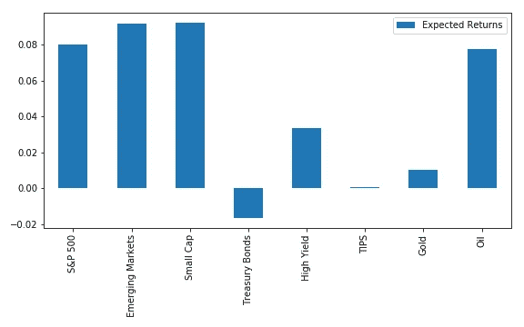
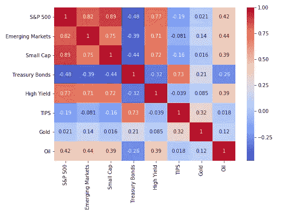
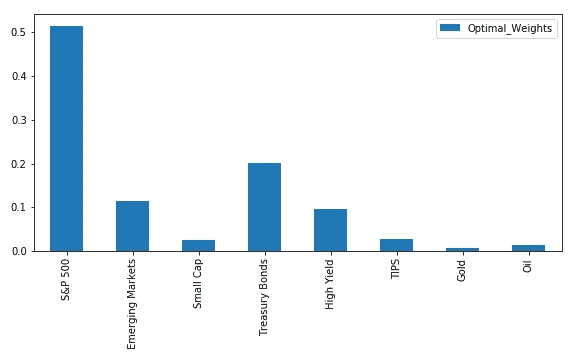
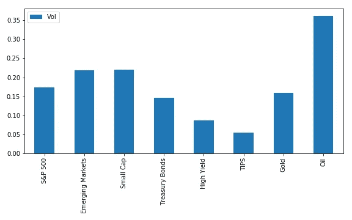

# 使用 SciPy 优化投资组合

> 原文：<https://towardsdatascience.com/portfolio-optimization-with-scipy-aa9c02e6b937?source=collection_archive---------7----------------------->


[活动发起人](https://unsplash.com/@campaign_creators?utm_source=medium&utm_medium=referral)在 [Unsplash](https://unsplash.com?utm_source=medium&utm_medium=referral) 上的照片

## 使用 Python 计算带约束的最优投资组合

***来自《走向数据科学》编辑的提示:*** *虽然我们允许独立作者根据我们的* [*规则和指导方针*](/questions-96667b06af5) *发表文章，但我们并不认可每个作者的贡献。你不应该在没有寻求专业建议的情况下依赖一个作者的作品。详见我们的* [*读者术语*](/readers-terms-b5d780a700a4) *。*

*无意成为投资建议。你可以在我的 GitHub 上找到我的代码。*

是时候写另一篇关于投资组合优化的文章了，因为我最近一直在做这方面的工作。如果你需要复习，这里是我以前写的关于这个话题的文章:

[](/understanding-portfolio-optimization-795668cef596) [## 了解投资组合优化

### 从概念上理解优化投资组合意味着什么

towardsdatascience.com](/understanding-portfolio-optimization-795668cef596) [](/portfolio-optimization-with-numpy-93e1428525a5) [## 基于 NumPy 的投资组合优化

### 你所需要的只是一些矩阵代数来做出最优投资组合

towardsdatascience.com](/portfolio-optimization-with-numpy-93e1428525a5) 

尽管仅仅用矩阵代数和 NumPy 来优化投资组合很有趣，但有时我们需要添加约束。例如，许多投资者不想或不被允许做空投资。我们不能保证使用矩阵代数产生的最优投资组合不包括空头头寸(负权重)。因此，我们转而求助于**优化**。

如果你没有阅读我以前关于优化的文章，**优化是指在给定风险水平下最大化回报(或最小化特定回报水平下的风险)的资产组合的求解过程**。优化的期望输出是一组能够产生最优投资组合的投资组合权重(针对每项资产)。

# 运行投资组合优化

投资组合优化的两个关键输入是:

1.  **被考虑的每项资产的预期收益**。
2.  资产收益的**协方差矩阵**。嵌入其中的是关于 [**交叉资产相关性**](/understanding-correlation-and-diversification-661c19a26555) 和 [**每个资产的波动率**](/understanding-investment-risk-3882c58e00e0) y(对角线)的信息。

预期回报很难估计——有些人喜欢使用历史平均值(因为过去往往不代表未来，这很危险)，其他人有自己的方法来估计回报预测。我计划写一整篇关于这个的文章，所以这次我不会详细讨论。今天我们将关注优化过程本身。因此，我们将假装我们从一个顾问那里得到了预期回报估计。顺便说一句， ***这些都是我非常粗略的估算，绝对不应该作为投资建议*** 。



我们优化的预期回报(图形由作者创建)

正如你从上面的图表中所看到的，我们有一个包含八种投资的投资组合，从股票、债券到大宗商品。对于那些不熟悉这个缩写的人来说，TIPS 是财政部通货膨胀保值证券——换句话说，是没有通货膨胀风险的国债。

以下是用过去 10 年的回报率估算的相关性。越低越好，所以蓝色阴影的单元格代表多样化的潜在机会。从技术上来说，优化需要协方差矩阵，但是相关矩阵提供的信息更多。



相关矩阵(图形由作者创建)

现在我们有了输入，让我们来看看代码。

# 编码投资组合优化

我使用了与我在[之前的优化文章](/portfolio-optimization-with-numpy-93e1428525a5)中相同的数据集，除了现在有八个资产而不是四个。每项资产的标签是:

```
factors = ['S&P 500','Emerging Markets','Small Cap',
           'Treasury Bonds',
           'High Yield','TIPS','Gold','Oil']
```

我将每日收益存储在一个名为 **factor_returns** 的熊猫数据框架中。计算我们资产的协方差矩阵非常简单:

```
cov =  factor_returns.cov()
```

正如我上面提到的，我们将使用我创建的退货预测(退货的指定顺序与它们在因子中列出的顺序相同):

```
expected_returns = np.array([[ 0.080],
                             [ 0.092],
                             [ 0.092],
                             [-0.017],
                             [ 0.034],
                             [ 0.001],
                             [ 0.010],
                             [ 0.079]])
```

现在让我们导入优化所需的 Python 库:

```
from scipy.optimize import minimize, Bounds, LinearConstraint
```

我将稍微不按实际编码的顺序来解释，因为这样更容易理解。下一个代码块显示了一个名为 **optimize** 的函数，它使用 SciPy 的 **minimize** 函数运行优化。

看看调用 minimize 的地方(我加粗了)。第一个参数 **func** 是我们想要最小化的函数。第二个参数 **W** 是允许优化器改变的输入— **W 是我们正在求解的，对应于我们投资组合中资产的权重**。我们需要从猜测开始——没有任何强有力的先验，我只是对每项资产进行同等加权。

**args** 参数中的 **exp_ret** (预期回报)和 **cov** (协方差)变量是提供给优化器的不允许改变的输入。

**因此，优化器所做的是，在给定我们提供的预期回报和协方差矩阵的情况下，搜索使 func 最小化的投资组合权重向量(W)。**

在函数的最后，你会看到我返回了 **optimal_weights['x']** 。这是因为在优化器对象中，我们从 mimimize 返回的‘x’属于优化的权重 w。

```
W = np.ones((factor_moments.shape[0],1))*(1.0/factor_moments.shape[0])# Function that runs optimizer
def optimize(func, W, exp_ret, cov, target_return):
    opt_bounds = Bounds(0, 1)
    opt_constraints = ({'type': 'eq',
                        'fun': lambda W: 1.0 - np.sum(W)},
                       {'type': 'eq',
                        'fun': lambda W: target_return - W.T@exp_ret}) optimal_weights = **minimize(func, W, 
                               args=(exp_ret, cov),
                               method='SLSQP',
                               bounds=opt_bounds,
                               constraints=opt_constraints)**
    return optimal_weights['x']
```

您可能会注意到，minimize 还可以接受两个可选参数— **边界**和**约束**。这些很重要，所以让我们一个一个地看。界限很简单。我们希望 W 中的每个权重介于 0 和 1 之间，换句话说，没有负权重或杠杆:

```
opt_bounds = Bounds(0, 1)
```

对于约束条件，我们有两个——**我们希望我们的权重总和为 1** (为了使它成为一个合适的投资组合)，以及**我们希望实现预先指定的目标回报**(你也可以将其设置为目标风险，或者完全不考虑)。我们设定回报目标的原因是为了避免这样的情况:我们优化并获得了一个甜蜜而多样化的投资组合，但该投资组合的预期回报是 3%或其他一些太低的值。

```
opt_constraints = ({'type': 'eq',
                        'fun': lambda W: 1.0 - np.sum(W)},
                       {'type': 'eq',
                        'fun': lambda W: target_return - W.T@exp_ret})
```

现在让我们来看看我之前跳过的那部分代码。一、什么是 **func** ？当我们求解最优投资组合时，我们试图找到每单位风险回报最高的投资组合(其中风险是投资组合的标准差)。

**所以我们要最大化回报率，我们可以计算为 W.T@exp_ret** (这将每项资产的回报率乘以其权重并求和)**和风险，我们可以计算为 W . T @ cov @ W .**@字符表示矩阵乘法。

由于我们使用了一个优化函数来最小化事物，我们需要在我们的风险回报率上加上一个负号——这样当我们最小化它时，我们实际上是在最大化它。

```
# Function to optimize
def ret_risk(W, exp_ret, cov):
    return -((W.T@exp_ret) / (W.T@cov@W)**0.5)
```

现在剩下要做的就是优化我们的产品组合:

```
x = optimize(ret_risk, W, expected_returns, cov, 
             target_return=0.055)
```

以下是最佳重量的样子:



最佳投资组合权重(作者制作的图表)

重量方面突出的几件事:

*   小型股和新兴市场的预期回报率最高，但权重不高。这是因为它们的波动性(又称风险)明显高于标准普尔 500(见下图)。此外，它们与标准普尔 500 高度相关，因此很少提供多样化。
*   美国国债的预期回报率为负，但却是权重第二高的资产类别。这是因为它也是与股票相关性最小的资产类别(负相关性约为-0.40)。因此，实际上，当股市崩盘时，投资组合的回报依赖于股票和高收益债券，保险依赖于美国国债。
*   尽管石油回报率相对较高，与其他资产的相关性较低，但它的波动性太大，因此权重较低。



每个资产类别的年化标准差(由作者创建的图表)

# 结论

这就是 SciPy 的优化。投资组合策略过程的下一步将是尽最大努力来衡量模型和估计误差的影响。也就是说，我们想知道哪些输入可能是错误指定的(测量误差),以及我们的模型输出对这种误差有多敏感。提示:预期收益是非常嘈杂的，优化的输出对预期收益的微小变化都非常敏感。下一次，我们将看看如何解决这个问题。干杯！

[***如果你总体上喜欢这篇文章和我的写作，请考虑通过我在这里的推荐链接注册 Medium 来支持我的写作。谢谢！***](https://tonester524.medium.com/membership)