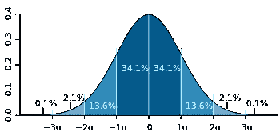
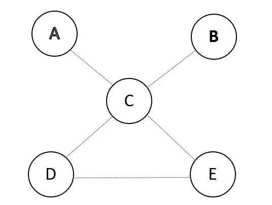
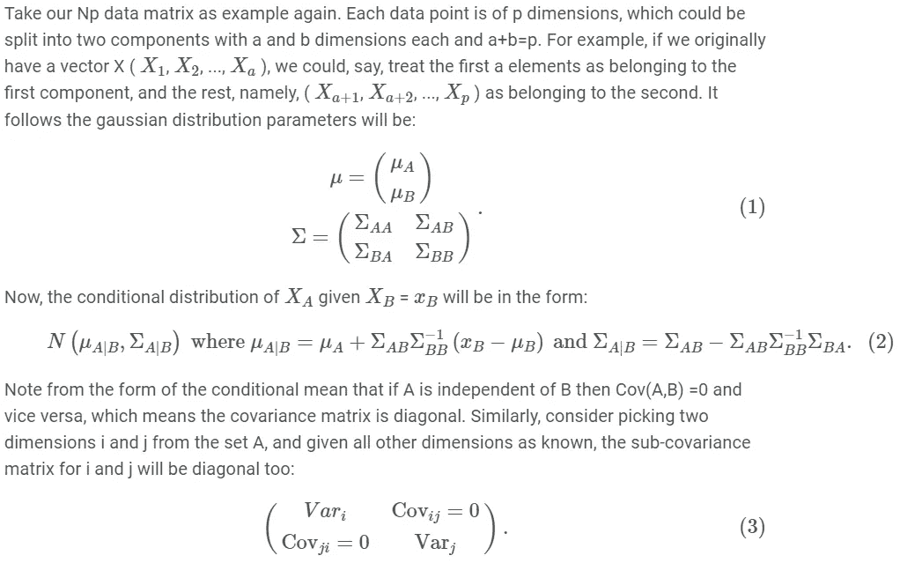
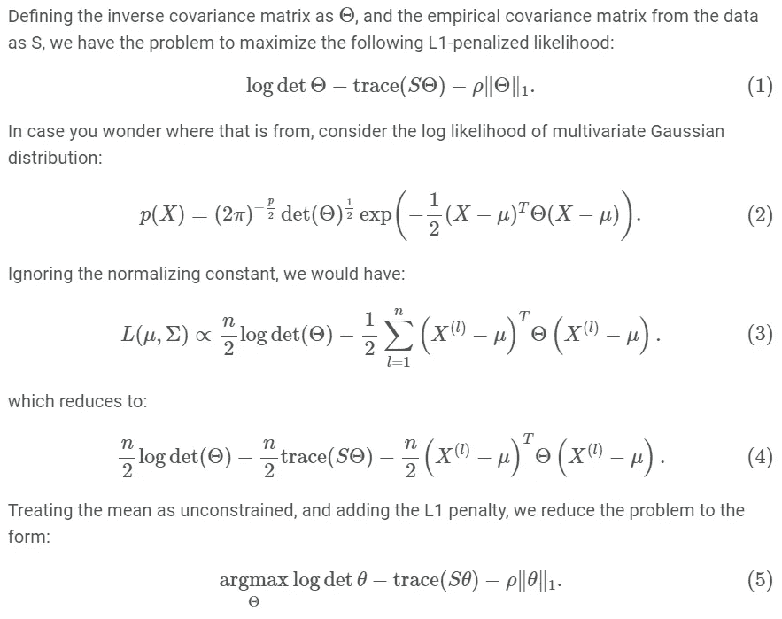
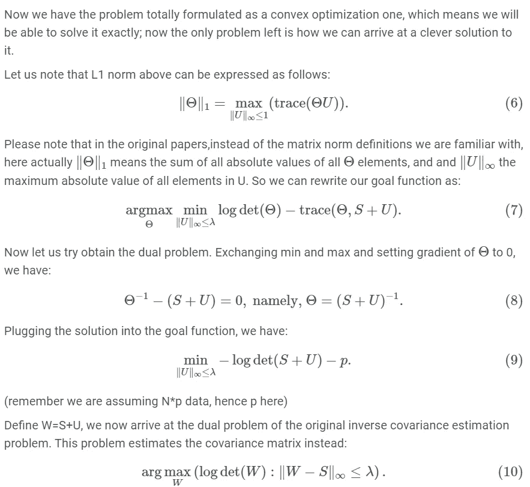
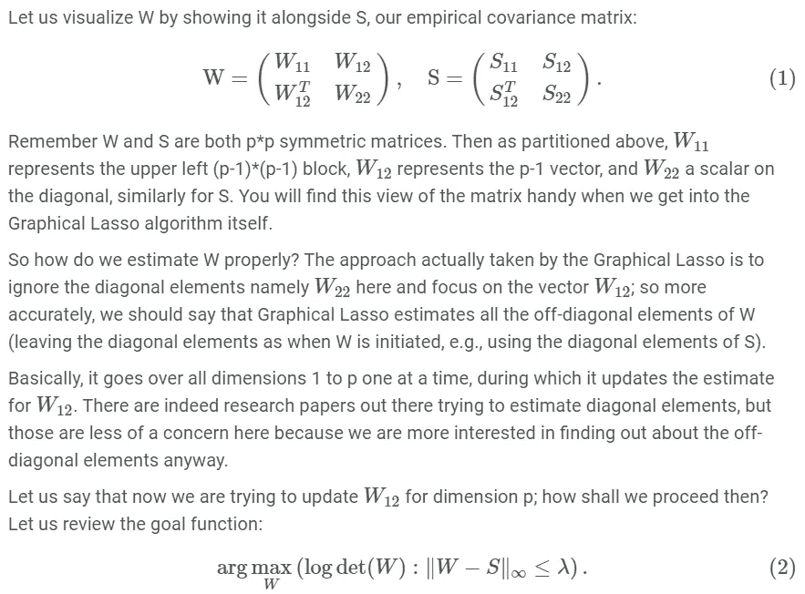
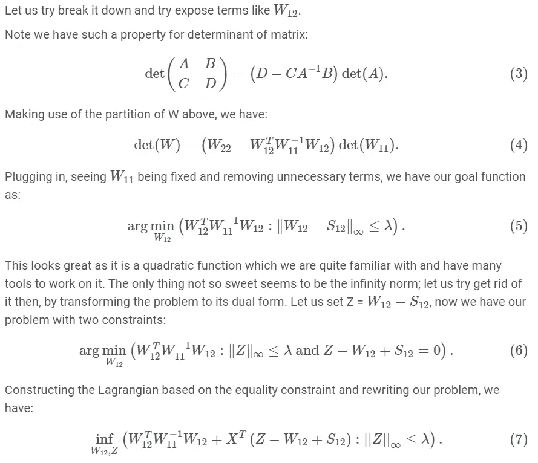
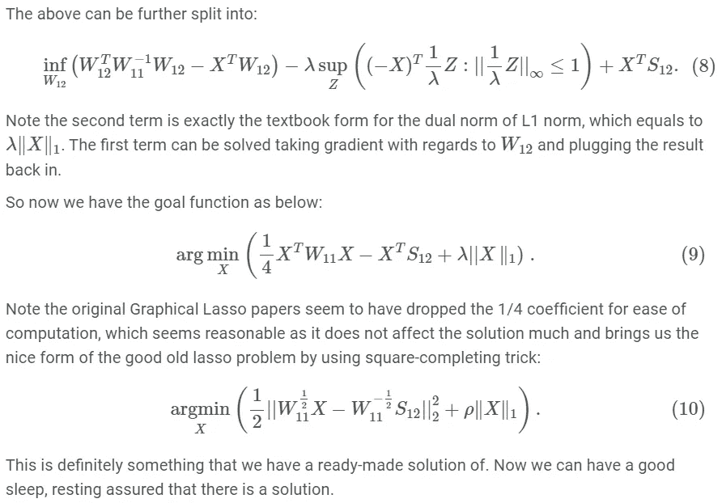
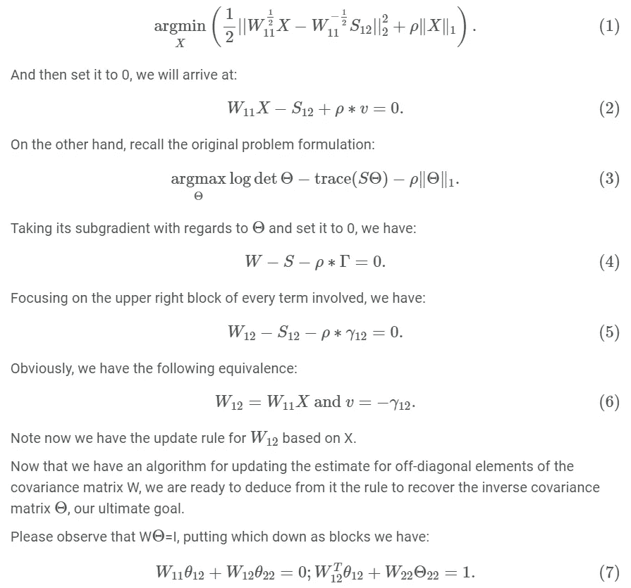
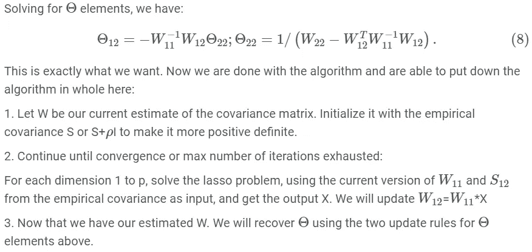

# 将想法移植到数学:图形套索的逐步推导

> 原文：<https://towardsdatascience.com/porting-ideas-to-math-a-step-by-step-derivation-of-graphical-lasso-2e01f7165d95?source=collection_archive---------31----------------------->

TLDR:如果你像我一样对数学一无所知，你可能会发现大多数关于图形套索的教程文章第一眼看上去很难理解，而且推导步骤通常是不存在的。为了使它更容易理解，这篇文章将分解这个算法，带领读者通过可口的片段，并帮助发展对算法理论基础的直观理解。

JESHOOTS.COM 在 [Unsplash](https://unsplash.com?utm_source=medium&utm_medium=referral) 上[的照片](https://unsplash.com/@jeshoots?utm_source=medium&utm_medium=referral)

正如诺姆·乔姆斯基所说，我解释说:人类的认知过程实际上是符号操作，以不同的方式发泄出来(想想语法)会产生不同的语言。数学只是另一种让我们简洁描述事物的语言。

以下部分将使用图形套索来说明如何直观地将您的想法转换为数学语言，作为我上一篇关于图形套索的文章的续篇([https://towardsdatascience . com/machine-learning-in-action-in-finance-using-graphical-lasso-to-identify-trading-pairs-in-fa 00d 29 c 71 a 7](/machine-learning-in-action-in-finance-using-graphical-lasso-to-identify-trading-pairs-in-fa00d29c71a7?source=your_stories_page---------------------------))。

# 问题是

假设我们有 p 个股票代号，每个代号都记录了 N 天的收盘价，我们希望计算出股票代号之间的部分相关性，用精度矩阵表示，并从中绘制出一个无向图。这是我们要解决的问题。

# 假设

所有的模型或算法都基于一组假设，这些假设往往会简化问题，使问题与我们已经有解决方案的问题相似。因此，几乎没有模型以像素完美的方式反映现实，但请记住这句老话:“所有的模型都是错的，但有些是有用的”。

因此，为了重新表述我们的问题，我们说有 N 个观测值，每个都是 p 维正态分布的；换句话说，现在我们有了一个 N*p 矩阵。

显然，我们这里的大假设是多维常态。对于那些好奇的人来说，这里有一些对常态普遍偏爱的理由/论据:

1.  它使数学变得简单——用你我这样的平民的话说，这意味着试图避开复杂/混乱的数学。是的，它导致更容易的几何解释和更容易的参数估计。
2.  *还记得中心极限定理吗？许多独立统计分布的和最终收敛于正态分布。如今单子很难找到，我们所使用的功能(价格等)对 CLT 也不例外。*
3.  *还记得热力学第二定律吗？孤立系统的总熵从来不会减少，在非理想条件下总是增加(读，在几乎所有现实世界的条件下)。正态分布是所有具有特定均值和协方差的实值分布中熵最大的一种分布。*

注意上面的 2 和 3 之间似乎有一些有趣的联系。一定要深入挖掘。

一条钟形曲线(来源:[https://en . Wikipedia . org/wiki/File:Standard _ deviation _ diagram . SVG](https://en.wikipedia.org/wiki/File:Standard_deviation_diagram.svg))

现在，我们已经制定了数据矩阵和数据的分布，我们如何从这里开始解决我们的问题？关键是从我们数据的精度(逆协方差)矩阵到我们想要的无向图有一个映射。

# 用精确矩阵连接无向图

让我们看一个假设的无向图:

重点放在顶点 A、B 和 c 上，通过无向图或马尔可夫场更正式的性质，它们的联合分布可以分解为:

*P(A，B，C) = P(A，B|C)P(C) = P(A|C)P(B|C)P(C)*

即给定 c，A 和 B 是条件独立的。

在无向图中，如果 C 阻塞 A 和 B，那么给定 C，A 和 B 是条件独立的。

注意，我们也有 P(A，B，C，D，E) = P(A|C，D，E)P(B|C，D，E)P(C，D，E)，因为 C，D，E 可以看成是把 A 和 B 堵在一起。

关于精度矩阵，条件独立变量告诉我们什么？

结论首先:**我们可以说明，给定图中所有其他变量，两个变量条件独立对应精度矩阵中对应单元格的值 0。**

为了说明这一点，让我们首先回顾一下关于条件高斯分布的一些事实:

对角矩阵的逆也是对角的。现在我们已经表明，如果两个维度 I 和 j 是条件独立的，它们在精度矩阵中的对应项将是 0。

有了所有这些假设和事实，我们现在准备处理估计精度矩阵的问题。

# 数学公式

现在我们能够对这个问题进行数学表述了:

我们走了很长一段路才找到这种形式，它更容易使用，也更清晰。**现在让我们不要忘记我们最初的目标:估计精度矩阵**。为此，我们将首先尝试估计协方差矩阵，从中我们将最终得到精度矩阵。

# 更深入

# 解决方案

我们快到了。在制定算法之前，让我们再看一些东西。首先，请注意，如果我们在目标函数中对 X 取次梯度:

# 结束了

这就是我如何冗长地推导图形套索算法，我希望血淋淋的细节不会让我的读者感到厌烦，并实际上有助于消除一些疑虑，填补一些空白，而不是涵盖在这个主题的其他地方。如果你发现一些错误或对此有任何疑问，请务必告诉我。

最后，我为不得不从我自己的笔记中复制粘贴而道歉，因为 Medium 似乎不太支持数学方程。