# 使用 RNN 的词性标注

> 原文：<https://towardsdatascience.com/pos-tagging-using-rnn-7f08a522f849?source=collection_archive---------1----------------------->

## 了解如何使用 rnn 在英语语料库中使用词性(POS)标签来标记单词


安格尔·坎普在 [Unsplash](https://unsplash.com?utm_source=medium&utm_medium=referral) 上的照片

做**词性标注**的经典方式是使用**隐马尔可夫模型的某种变体。**在这里，我们将看到如何使用递归神经网络来实现这一点。最初的 RNN 建筑也有一些变化。它有一个新颖的 RNN 架构——**双向 RNN** ,能够以“逆序”读取序列，并已被证明可以显著提高性能。

然后是 RNN 的两个重要的前沿变体，它们使得在真实数据集上训练大型网络成为可能。尽管 rnn 能够解决各种序列问题，但是由于在 rnn 的训练期间出现的爆炸和消失梯度的问题，它们的架构本身是它们最大的敌人。这个问题由两个流行的**门控 RNN 架构**—**长、短时记忆(LSTM)** 和**门控递归单元(GRU)解决。**我们将在这里研究所有这些与词性标注相关的模型。

# 词性标注—概述

将单词分类到它们的**词性**并相应地标注它们的过程被称为**词性标注**，或者简称为**词性标注**。NLTK 库有许多包含单词及其词性标签的语料库。我将使用来自 NLTK 的带词性标记的语料库，即 **treebank** 、 **conll2000、**和 **brown** 来演示关键概念。为了直接进入代码，Kaggle 上发布了一个附带的[笔记本](https://www.kaggle.com/tanyadayanand/pos-tagging-using-rnn)。

[](https://www.kaggle.com/tanyadayanand/pos-tagging-using-rnn) [## 使用 RNN 的词性标注

### 使用 Kaggle 笔记本探索和运行机器学习代码|使用来自单词嵌入的数据

www.kaggle.com](https://www.kaggle.com/tanyadayanand/pos-tagging-using-rnn) 

下表提供了一些主要标签的信息:

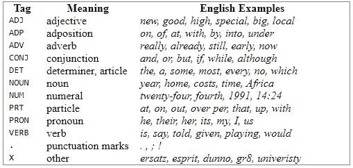

**位置标记**

# 文章布局

1.  预处理数据
2.  单词嵌入
3.  香草 RNN
4.  LSTM
5.  苏军总参谋部情报总局
6.  双向 LSTM
7.  模型评估

# 导入数据集

让我们从导入必要的库和加载数据集开始。这是每一个数据分析过程中必不可少的一步(完整的代码可以在[这里](https://www.kaggle.com/tanyadayanand/pos-tagging-using-rnn)查看)。我们将首先使用三个著名的文本语料库加载数据，并对它们进行合并。

```
***# Importing and Loading the data into data frame
# load POS tagged corpora from NLTK***
treebank_corpus = treebank.tagged_sents(tagset='universal')
brown_corpus = brown.tagged_sents(tagset='universal')
conll_corpus = conll2000.tagged_sents(tagset='universal')

***# Merging the dataframes to create a master df*** tagged_sentences = treebank_corpus + brown_corpus + conll_corpus
```

# **1。预处理数据**

作为预处理的一部分，我们将执行各种步骤，例如将数据分成单词和标签，对 X 和 Y 进行矢量化，以及填充序列。

我们先来看数据。对于下面的每个单词，都有一个与之相关的标签。

```
***# let's look at the data***
tagged_sentences[7]
```

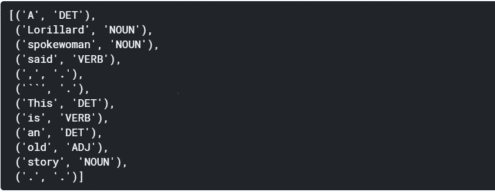

## 将数据分为单词(X)和标签(Y)

由于这是一个**多对多**问题，每个数据点将是语料库的不同句子。每个数据点在**输入序列**中都有多个字。这就是我们所说的 **X** 。每个单词在**输出序列**中都有相应的标签。这就是我们所说的 **Y** 。样本数据集:

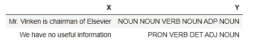

```
X = [] ***# store input sequence***
Y = [] ***# store output sequence***for sentence in tagged_sentences:
 X_sentence = []
 Y_sentence = []
 for entity in sentence: 
 X_sentence.append(entity[0]) ***# entity[0] contains the word***
 Y_sentence.append(entity[1]) ***# entity[1] contains corresponding tag***

 X.append(X_sentence)
 Y.append(Y_sentence)num_words = len(set([word.lower() for sentence in X for word in sentence]))
num_tags   = len(set([word.lower() for sentence in Y for word in sentence]))print("Total number of tagged sentences: {}".format(len(X)))
print("Vocabulary size: {}".format(num_words))
print("Total number of tags: {}".format(num_tags))
```

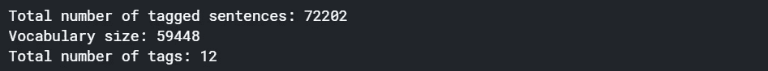

```
***# let’s look at first data point
# this is one data point that will be fed to the RNN***
print(‘sample X: ‘, X[0], ‘\n’)
print(‘sample Y: ‘, Y[0], ‘\n’)
```

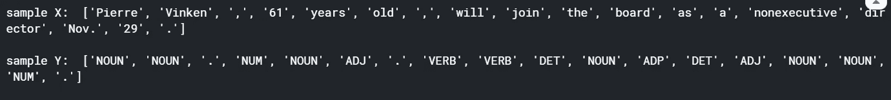

```
***# In this many-to-many problem, the length of each input and output sequence must be the same.
# Since each word is tagged, it’s important to make sure that the length of input sequence equals the output sequence***print(“Length of first input sequence : {}”.format(len(X[0])))
print(“Length of first output sequence : {}”.format(len(Y[0])))
```

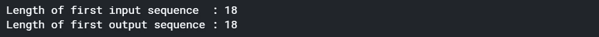

我们需要解决的下一件事是，我们如何将这些输入提供给 RNN。如果我们必须把单词作为神经网络的输入，那么我们必须把它们转换成数字。我们需要创建一个单词嵌入或一个热点矢量，即每个单词的数字形式的矢量。首先，我们将首先对输入和输出进行编码，这将为输入数据的整个语料库中的每个单词提供一个盲唯一 id。另一方面，我们有 Y 矩阵(标签/输出数据)。我们这里有 12 个 pos 标签，将它们中的每一个视为一个类，每个 POS 标签都被转换为长度为 12 的独热编码。我们将使用 Keras 库中的 Tokenizer()函数将文本序列编码为整数序列。

## 向量化 X 和 Y

```
***# encode X*** word_tokenizer = Tokenizer()              ***# instantiate tokeniser***
word_tokenizer.fit_on_texts(X)            ***# fit tokeniser on data******# use the tokeniser to encode input sequence***
X_encoded = word_tokenizer.texts_to_sequences(X) ***# encode Y*** tag_tokenizer = Tokenizer()
tag_tokenizer.fit_on_texts(Y)
Y_encoded = tag_tokenizer.texts_to_sequences(Y)***# look at first encoded data point*** print("** Raw data point **", "\n", "-"*100, "\n")
print('X: ', X[0], '\n')
print('Y: ', Y[0], '\n')
print()
print("** Encoded data point **", "\n", "-"*100, "\n")
print('X: ', X_encoded[0], '\n')
print('Y: ', Y_encoded[0], '\n')
```

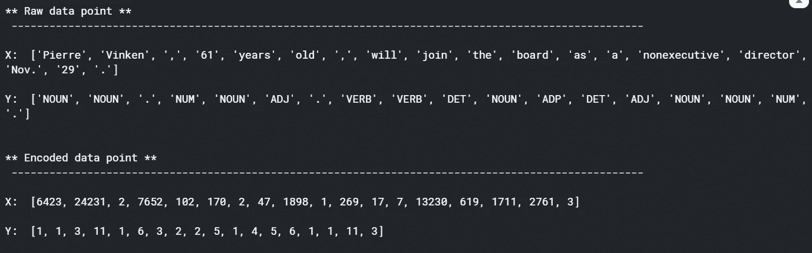

确保每个输入和输出序列的长度相同。

## 填充序列

语料库中的句子长度不同。在我们输入 RNN 模型之前，我们需要确定句子的长度。我们不能动态分配处理语料库中每个句子所需的内存，因为它们的长度不同。因此，数据编码后的下一步是**定义序列长度**。我们需要要么填充短句，要么把长句截成固定长度。然而，这个固定长度是一个**超参数**。

```
***# Pad each sequence to MAX_SEQ_LENGTH using KERAS’ pad_sequences() function. 
# Sentences longer than MAX_SEQ_LENGTH are truncated.
# Sentences shorter than MAX_SEQ_LENGTH are padded with zeroes.******# Truncation and padding can either be ‘pre’ or ‘post’. 
# For padding we are using ‘pre’ padding type, that is, add zeroes on the left side.
# For truncation, we are using ‘post’, that is, truncate a sentence from right side.******# sequences greater than 100 in length will be truncated*** MAX_SEQ_LENGTH = 100X_padded = pad_sequences(X_encoded, maxlen=MAX_SEQ_LENGTH, padding=”pre”, truncating=”post”)
Y_padded = pad_sequences(Y_encoded, maxlen=MAX_SEQ_LENGTH, padding=”pre”, truncating=”post”)***# print the first sequence***
print(X_padded[0], "\n"*3)
print(Y_padded[0])
```

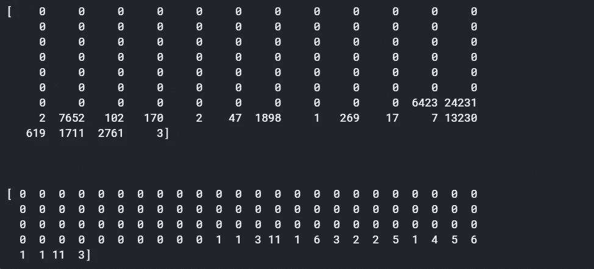

# 2.单词嵌入

你知道一种更好的表示文本的方式是**单词嵌入**。目前，每个单词和每个标签都被编码为一个整数。我们将使用一种更复杂的技术来表示输入单词(X ),这就是所谓的单词嵌入。

然而，为了表示 Y 中的每个标签，我们将简单地使用独热编码方案，因为数据集中只有 12 个标签，并且 LSTM 在学习这些标签的自己的表示时没有问题。

要使用单词嵌入，您可以使用以下任一模型:

1.  [**word2vec 型号**](https://code.google.com/archive/p/word2vec/)
2.  [**手套型号**](https://nlp.stanford.edu/projects/glove/)

我们使用 word2vec 模型没有特别的原因。这两者在表示单词方面都非常高效。你可以两个都试试，看看哪个效果更好。

**一个单词嵌入的维数是:(词汇 _ 大小，嵌入 _ 维数)**

## 对输入序列使用单词嵌入(X)

```
***# word2vec*** path = ‘../input/wordembeddings/GoogleNews-vectors-negative300.bin’***# load word2vec using the following function present in the gensim library***
word2vec = KeyedVectors.load_word2vec_format(path, binary=True)***# assign word vectors from word2vec model
# each word in word2vec model is represented using a 300 dimensional vector***EMBEDDING_SIZE  = 300  
VOCABULARY_SIZE = len(word_tokenizer.word_index) + 1**# create an empty embedding matix**
embedding_weights = np.zeros((VOCABULARY_SIZE, EMBEDDING_SIZE))**# create a word to index dictionary mapping**
word2id = word_tokenizer.word_index**# copy vectors from word2vec model to the words present in corpus**
for word, index in word2id.items():
    try:
        embedding_weights[index, :] = word2vec[word]
    except KeyError:
        pass
```

## 对输出序列使用一键编码(Y)

```
# use Keras’ to_categorical function to one-hot encode Y
Y = to_categorical(Y)
```

所有的数据预处理现在都完成了。现在让我们通过**将数据分割为训练、验证和测试集**来跳转到建模部分。

在使用 RNN 之前，我们必须确保数据的维度是 RNN 所期望的。一般来说，RNN 人期望以下形状

**X 的形状:(#样本，#时间步长，#特征)**

**Y 的形状:(#样本，#时间步长，#特征)**

现在，根据建筑的类型，你可以用不同的形状来制作 RNN。由于我们正在研究的问题具有多对多的架构，输入和输出都包括时间步长的数量，而时间步长就是序列长度。但是注意张量 X 没有第三维度，也就是特征数。这是因为在将数据输入 RNN 之前，我们将使用单词嵌入，因此没有必要明确提到第三个维度。这是因为当您在 Keras 中使用 Embedding()图层时，训练数据将自动转换为( **#samples、#timesteps、#features** )，其中 **#features** 将是嵌入维度(请注意，嵌入图层始终是 RNN 的第一个图层)。使用嵌入层时，我们只需要将数据整形为我们已经完成的(#samples，#timesteps)。但是，请注意，如果不使用 Keras 中的 Embedding()层，您需要将其调整为(#samples、#timesteps、#features)。

# 3.香草 RNN

接下来，让我们建立 RNN 模型。我们将使用单词嵌入来表示单词。现在，在训练模型的同时，你也可以**训练单词嵌入**和网络权重。这些通常被称为**嵌入权重**。训练时，嵌入权重将被视为网络的正常权重，在每次迭代中更新。

在接下来的几节中，我们将尝试以下三种 RNN 模型:

*   具有任意初始化的**的 RNN，不可训练的嵌入**:在这个模型中，我们将任意初始化嵌入权重。此外，我们将**冻结嵌入**，也就是说，我们将不允许网络训练它们。
*   RNN 与**任意初始化，可训练的嵌入**:在这个模型中，我们将允许网络训练嵌入。
*   具有**可训练 word2vec 嵌入的 RNN:**在这个实验中，我们将使用 word2vec 单词嵌入*和*也允许网络进一步训练它们。

## 未初始化的固定嵌入

让我们从第一个实验开始:一个普通的 RNN，带有任意初始化的、不可训练的嵌入。对于这个 RNN，我们不会使用预先训练的单词嵌入。我们将使用随机初始化的嵌入。此外，我们不会更新嵌入权重。

```
***# create architecture*** rnn_model = Sequential()***# create embedding layer — usually the first layer in text problems
# vocabulary size — number of unique words in data*** rnn_model.add(Embedding(input_dim = VOCABULARY_SIZE, 
***# length of vector with which each word is represented***
 output_dim = EMBEDDING_SIZE, 
***# length of input sequence***
 input_length = MAX_SEQ_LENGTH, 
***# False — don’t update the embeddings***
 trainable = False 
))***# add an RNN layer which contains 64 RNN cells
# True — return whole sequence; False — return single output of the end of the sequence*** rnn_model.add(SimpleRNN(64, 
 return_sequences=True
))***# add time distributed (output at each sequence) layer***
rnn_model.add(TimeDistributed(Dense(NUM_CLASSES, activation=’softmax’)))***#compile model***
rnn_model.compile(loss      =  'categorical_crossentropy',
                  optimizer =  'adam',
                  metrics   =  ['acc'])***# check summary of the model***
rnn_model.summary()
```

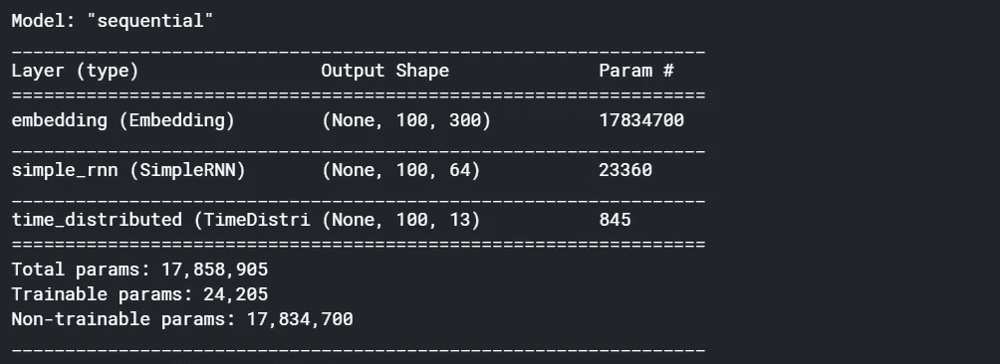

```
***#fit model***
rnn_training = rnn_model.fit(X_train, Y_train, batch_size=128, epochs=10, validation_data=(X_validation, Y_validation))
```

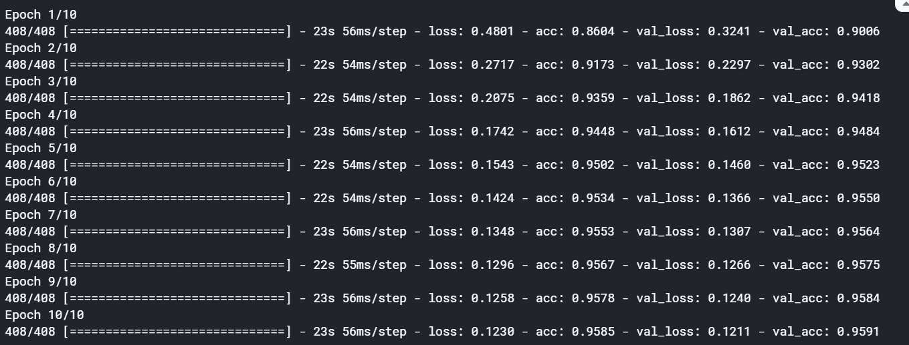

我们可以在这里看到，在十个纪元之后，它给出了大约 95%的相当不错的**准确度。**此外，我们在下图中看到了一条健康的增长曲线。

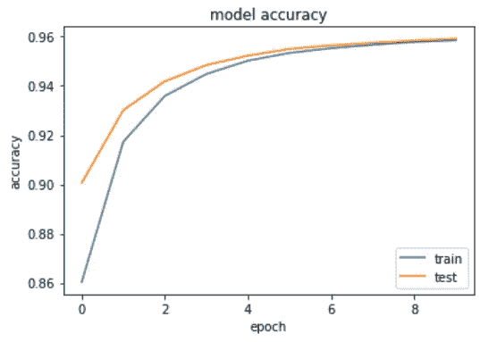

## 未初始化的可训练嵌入

接下来，尝试第二种模型——带有任意初始化的**的 RNN，可训练的嵌入**。这里，我们将允许嵌入与网络一起训练。我所做的只是将参数**trainiable 改为 true，即 trainable = True。**其余一切同上。在检查模型摘要时，我们可以看到所有的参数都是可训练的。即可训练参数等于总参数。

```
***# check summary of the model***
rnn_model.summary()
```

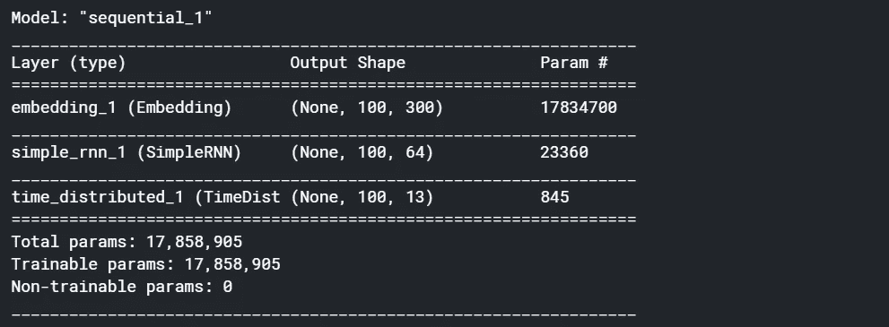

在拟合模型时，精确度显著提高。通过允许嵌入权重训练，它已经上升到大约 98.95%。因此，嵌入对网络的性能有着重要的影响。

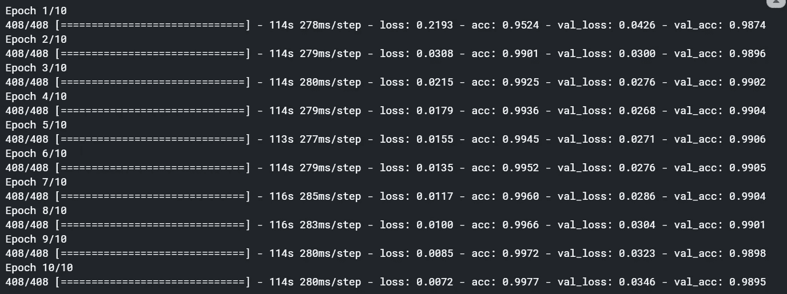

我们现在将尝试 word2vec 嵌入，看看它是否能改进我们的模型。

## 使用预先训练的嵌入权重

现在让我们尝试第三个实验——使用**可训练 word2vec 嵌入的 RNN。**回想一下，我们已经在一个名为‘embedding _ weights’的矩阵中加载了 word2vec 嵌入。使用 word2vec 嵌入就像在模型架构中包含这个矩阵一样简单。

网络架构与上面相同，但是我们将使用来自 word2vec 的预训练嵌入权重(**weights =【embedding _ weights】**)，而不是从任意嵌入矩阵开始。在这种情况下，精确度进一步提高到了**大约 99.04%。**

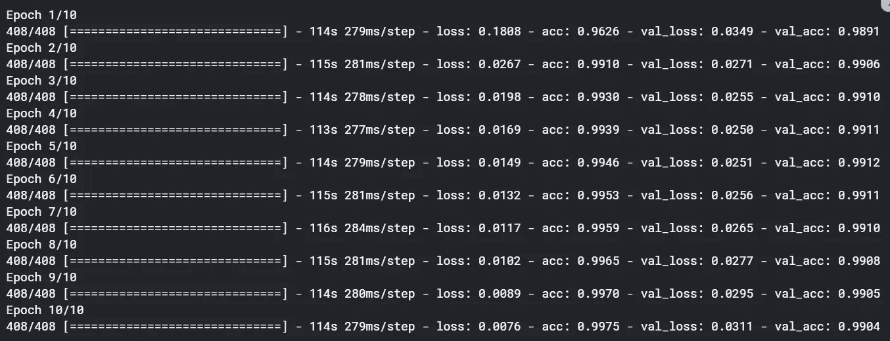

在这种情况下，结果略有改善。那是因为这个模型已经表现得很好了。在没有如此好的模型性能的情况下，通过使用预先训练的嵌入，您将看到更多的改进。预训练的嵌入在许多应用中提供了真正的提升。

# 4.LSTM

为了解决渐变消失的问题，人们已经做了很多尝试来调整传统的 RNNs，使得当序列变长时，渐变不会消失。这些尝试中最受欢迎和最成功的是**长短期记忆网络**，或 **LSTM** 。LSTMs 被证明是如此有效，以至于它们几乎取代了普通的 rnn。

因此，RNN 和 LSTM 之间的一个根本区别是，LSTM 有一个**外显记忆** **单元**，它存储与学习某些任务相关的信息。在标准 RNN 中，网络记忆过去信息的唯一方式是随着时间的推移更新隐藏状态，但它没有显式的内存来存储信息。

另一方面，在 LSTMs 中，即使序列变得很长，存储单元也能保留信息片段。

接下来，我们将建立一个 LSTM 模型，而不是 RNN。我们只需要用 LSTM 层替换 RNN 层。

```
***# create architecture*** lstm_model = Sequential()
***# vocabulary size — number of unique words in data
# length of vector with which each word is represented*** lstm_model.add(Embedding(input_dim = VOCABULARY_SIZE, 
 output_dim = EMBEDDING_SIZE, 
***# length of input sequence*** input_length = MAX_SEQ_LENGTH, 
***# word embedding matrix*** weights = [embedding_weights],
***# True — update embeddings_weight matrix*** trainable = True 
))***# add an LSTM layer which contains 64 LSTM cells
# True — return whole sequence; False — return single output of the end of the sequence***
lstm_model.add(**LSTM**(64, return_sequences=True))
lstm_model.add(TimeDistributed(Dense(NUM_CLASSES, activation=’softmax’)))***#compile model***
rnn_model.compile(loss      =  'categorical_crossentropy',
                  optimizer =  'adam',
                  metrics   =  ['acc'])***# check summary of the model***
rnn_model.summary()
```

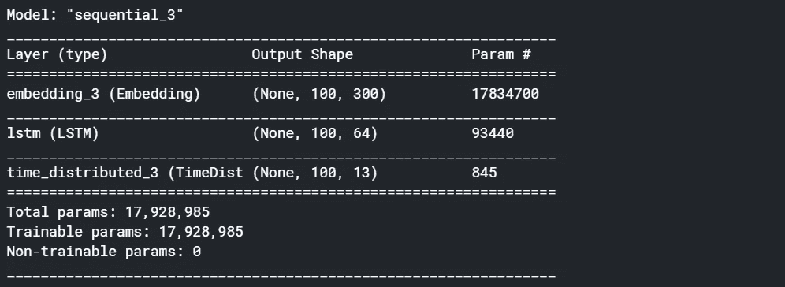

```
lstm_training = lstm_model.fit(X_train, Y_train, batch_size=128, epochs=10, validation_data=(X_validation, Y_validation))
```

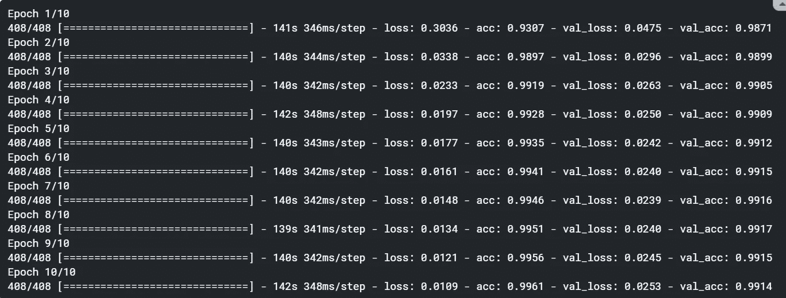

LSTM 模式也提供了一些边际改进。然而，如果我们在其他任务中使用 LSTM 模型，如语言翻译、图像字幕、时间序列预测等。那么您可能会看到性能的显著提升。

# 5.苏军总参谋部情报总局

考虑到计算开销和过度拟合的问题，研究人员试图提出 LSTM 单元的替代结构。这些替代方案中最受欢迎的是**门控循环单元(GRU)。作为一个比 LSTM 更简单的车型，GRU 总是更容易训练。LSTMs 和 GRUs 在实践中几乎完全取代了标准的 RNNs，因为它们比普通的 RNNs 更有效，训练速度更快(尽管参数数量更多)。**

现在让我们建立一个 GRU 模型。然后，我们还将比较 RNN、LSTM 和 GRU 模型的性能。

```
***# create architecture*** lstm_model = Sequential()
***# vocabulary size — number of unique words in data
# length of vector with which each word is represented*** lstm_model.add(Embedding(input_dim = VOCABULARY_SIZE, 
 output_dim = EMBEDDING_SIZE, 
***# length of input sequence*** input_length = MAX_SEQ_LENGTH, 
***# word embedding matrix*** weights = [embedding_weights],
***# True — update embeddings_weight matrix*** trainable = True 
))***# add an LSTM layer which contains 64 LSTM cells
# True — return whole sequence; False — return single output of the end of the sequence***
lstm_model.add(**GRU**(64, return_sequences=True))
lstm_model.add(TimeDistributed(Dense(NUM_CLASSES, activation=’softmax’)))***#compile model***
rnn_model.compile(loss      =  'categorical_crossentropy',
                  optimizer =  'adam',
                  metrics   =  ['acc'])***# check summary of the model***
rnn_model.summary()
```

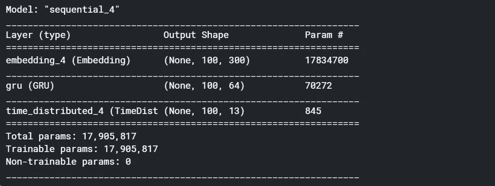

与 LSTM 相比，GRU 的参数有所减少。因此，我们在计算效率方面得到了显著的提高，而模型的性能几乎没有任何下降。

```
gru_training = gru_model.fit(X_train, Y_train, batch_size=128, epochs=10, validation_data=(X_validation, Y_validation))
```

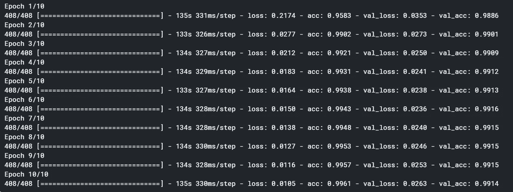

该模型的精度与 LSTM 相同。但是我们看到 LSTM 花费的时间比 GRU 和 RNN 要长。这是意料之中的，因为 LSTM 和 GRU 的参数分别是正常 RNN 的 4 倍和 3 倍。

# 6.双向 LSTM

例如，当你想**给一段文字(比如一篇客户评论)分配一个情感分数**时，网络可以在给它们分配分数之前看到整个评论文字。另一方面，在给定先前几个键入的单词的情况下，在诸如**预测下一个单词**的任务中，在预测下一个单词时，网络不能访问未来时间步中的单词。

这**两类任务**分别称为离线**和在线**序列处理。

现在，你可以用一个巧妙的技巧来处理**离线任务**——既然网络在做出预测之前可以访问整个序列，为什么不使用这个任务来让网络在训练时“查看序列中的未来元素”，希望这将使网络学习得更好？

这就是所谓的**双向 RNNs** 所利用的想法。

通过使用双向 RNNs，几乎可以肯定你会得到更好的结果。然而，由于网络参数的数量增加，双向 rnn 花费几乎两倍的时间来训练。因此，您需要在训练时间和性能之间进行权衡。使用双向 RNN 的决定取决于您拥有的计算资源和您想要的性能。

最后，让我们再构建一个模型——一个**双向 LSTM** ,并与之前的模型在准确性和训练时间方面进行比较。

```
***# create architecture***bidirect_model = Sequential()
bidirect_model.add(Embedding(input_dim = VOCABULARY_SIZE,
 output_dim = EMBEDDING_SIZE,
 input_length = MAX_SEQ_LENGTH,
 weights = [embedding_weights],
 trainable = True
))
bidirect_model.add(**Bidirectional**(**LSTM**(64, return_sequences=True)))
bidirect_model.add(TimeDistributed(Dense(NUM_CLASSES, activation=’softmax’)))***#compile model*** bidirect_model.compile(loss='categorical_crossentropy',
              optimizer='adam',
              metrics=['acc'])***# check summary of model***
bidirect_model.summary()
```

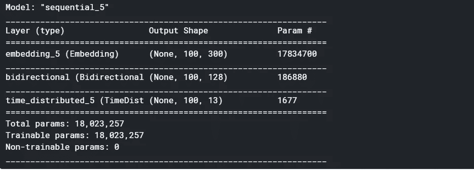

您可以看到参数的数量增加了。它确实大大提高了参数的数量。

```
bidirect_training = bidirect_model.fit(X_train, Y_train, batch_size=128, epochs=10, validation_data=(X_validation, Y_validation))
```

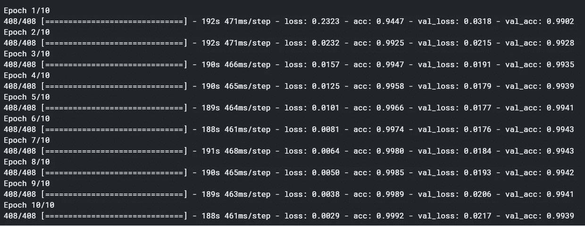

双向 LSTM 确实大大提高了精确度(考虑到精确度已经达到顶点)。这显示了双向 LSTMs 的威力。然而，这种精度的提高是有代价的。所花的时间几乎是普通 LSTM 网络的两倍。

# 7.模型评估

下面是我们尝试的四种模式的快速总结。当我们从一种模式转向另一种模式时，我们可以看到一种趋势。

```
loss, accuracy = rnn_model.evaluate(X_test, Y_test, verbose = 1)
print(“Loss: {0},\nAccuracy: {1}”.format(loss, accuracy))
```

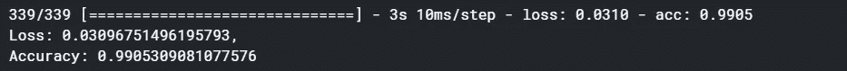

```
loss, accuracy = lstm_model.evaluate(X_test, Y_test, verbose = 1)
print(“Loss: {0},\nAccuracy: {1}”.format(loss, accuracy))
```

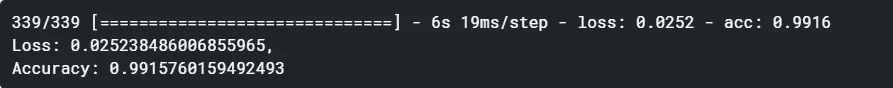

```
loss, accuracy = gru_model.evaluate(X_test, Y_test, verbose = 1)
print(“Loss: {0},\nAccuracy: {1}”.format(loss, accuracy))
```


```
loss, accuracy = bidirect_model.evaluate(X_test, Y_test, verbose = 1)
print("Loss: {0},\nAccuracy: {1}".format(loss, accuracy))
```

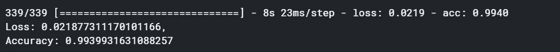

如果你有任何问题、建议或批评，可以通过 LinkedIn 或评论区联系我。