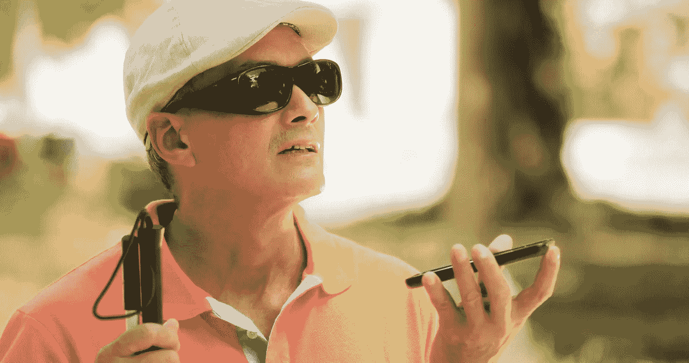

# 合成媒体的正面使用案例(又名 Deepfakes)

> 原文：<https://towardsdatascience.com/positive-use-cases-of-deepfakes-49f510056387?source=collection_archive---------5----------------------->

从 [diego cervo](https://stock.adobe.com/contributor/38908/diego-cervo?load_type=author&prev_url=detail) 处获得许可——Adobe Stock

## Deepfakes 可以为所有人创造无数的可能性和机会，无论他们是谁，如何与周围的世界互动。

技术是一个很好的使能因素，可以赋予人很大的力量。由于数据科学和人工智能的进步，赋权的新想法和能力已经出现。人工智能可以为所有人创造可能性和机会，无论他们是谁，如何听、说或交流。

> [这本书现已在亚马逊上架——https://www . Amazon . com/deep fakes-aka-Synthetic-Media-Humanity-ebook/DP/b0b 846 ycnj/](https://www.amazon.com/Deepfakes-aka-Synthetic-Media-Humanity-ebook/dp/B0B846YCNJ/)

人工智能生成的合成媒体，也称为 deepfakes，有许多积极的用例。[人工智能生成的合成媒体，又名 Deepfakes](/ai-generated-synthetic-media-aka-deepfakes-7c021dea40e1) ，在某些领域取得了明显的进步，如可访问性、教育、电影制作、刑事取证和艺术表达。

在本文中，我将探索 deepfakes 的一些积极用例。我坚信，随着技术的发展和社会对 deepfake 现象的裁决，deepfakes 的大多数用例将会改善人们的生活，并赋予社区和机构权力。

> 科技可以给人们声音、目标和快速产生大规模影响的能力。

## 易接近

人工智能可以建立工具来听、看，并且很快用人工一般智能(AGI)，推理越来越准确。人工智能生成的合成媒体可以帮助使辅助工具更加智能，在某些情况下，甚至可以负担得起和个性化，这可以帮助人们扩大他们的代理并获得独立性。技术，特别是基于人工智能的工具，可以为所有人带来无障碍的解决方案。

> **Deepfake 可以加速可访问性探索，从而提高公平性。**

微软的[seening . AI](https://www.microsoft.com/en-us/ai/seeing-ai)和谷歌的 [Lookout](https://www.blog.google/topics/accessibility/lookout-app-help-blind-and-visually-impaired-people-learn-about-their-surroundings/) 利用人工智能进行识别和合成语音来讲述物体、人和世界。人工智能生成的合成媒体可以为步行旅行的个性化辅助导航应用提供动力。

触觉手杖控制器 cane controller 可以通过模拟和手杖互动帮助视力障碍者在虚拟现实世界中导航。它可以使有视觉障碍的人通过将他们的手杖技能转移到虚拟世界中来导航虚拟环境。这项技术有助于实现平等和赋权。

对于[肌萎缩侧索硬化症](https://medlineplus.gov/amyotrophiclateralsclerosis.html) (ALS)患者来说，合成声音非常有力量，因为这种可怕的疾病影响了说话、交流和运动技能的能力。想象一下，即使失去了说话的能力，也能和你爱的人用自己的声音说话。[为 ALS 患者提供技术、设备和服务的 Gleason 团队](http://www.teamgleason.org/)，正在与科技公司合作，为 ALS(卢·格里克病)患者实现和开发人工智能生成的合成媒体场景。

还有其他合成语音的使用案例。 [VOCALiD](https://vocalid.ai/) 利用 voicebank 和专有的语音混合技术为任何设备创建独特的人声角色，为有语言和听力障碍的人将文本转换为语音。合成声音也是使这些病人能够独立的必要条件。低沉的假声音也有助于天生的语言障碍。

## 教育

Deepfake 技术促进了教育领域的许多可能性。学校和老师在课堂上使用媒体、音频、视频已经有一段时间了。Deepfakes 可以帮助教育工作者提供比传统视觉和媒体形式更具吸引力的创新课程。

人工智能生成的合成媒体可以将历史人物带回生活，以实现更具吸引力和互动性的课堂。一个合成的重演视频或历史人物的声音和视频可能会更有影响力，更有吸引力，并且会是一个更好的学习工具。例如，JFK 结束冷战的决议是演讲，但从未发表过，是[重新创作的](https://www.cereproc.com/en/jfkunsilenced)使用合成声音，他的声音和演讲风格显然会让学生以一种创造性的方式学习这个问题。

合成人体解剖学、复杂的工业机械和复杂的工业项目可以在混合现实世界中建模和模拟，以便使用微软 [Hololens](https://www.microsoft.com/en-us/education/mixed-reality) 教授学生并进行合作。

> **创造性地使用合成语音和视频可以在规模和有限成本的情况下提高整体成功和学习成果。**

## 艺术

几十年来，好莱坞一直使用高端 CGI、VFX 和 SFX 技术来创造人工但可信的世界，以引人入胜地讲述故事。在 1994 年的电影《阿甘正传》中，主角遇到了 JFK 和其他历史人物。场景和效果的[创作](https://snippetofhistory.wordpress.com/portfolio/forrest-gump-with-president-john-f-kennedy-1994-movie/)是使用 CGI 和不同的技术完成的，耗资数百万美元。如今，复杂的 CGI 和 VFX 技术在电影中被用来生成合成媒体，以讲述一个迷人的故事。

> **Deepfakes 可以将昂贵的 VFX 技术大众化，成为独立故事讲述者的强大工具，而成本只是其一小部分。**

Deepfakes 是一个很好的工具，可以真实地实现喜剧或戏仿中真实事件的反映、延伸、扭曲和挪用。人工智能生成的合成媒体可以在娱乐业务中带来前所未有的机会，我们看到独立创作者或 YouTube 实现了很多机会。使用 GANS 的电影 deepfake 的一些很好的例子是 YouTube 的创作者，如 [ctrl shift face](https://www.youtube.com/channel/UCKpH0CKltc73e4wh0_pgL3g/videos) 和 [shamook](https://www.youtube.com/channel/UCZXbWcv7fSZFTAZV4beckyw/videos) 。

文化和娱乐企业可以出于艺术目的使用 deepfakes。佛罗里达州圣彼得堡的达利博物馆举办了一场名为[达利生活](https://www.theverge.com/2019/5/10/18540953/salvador-dali-lives-deepfake-museum)的展览，利用 deepfakes 让参观者与超现实主义画家萨瓦尔多·达利互动并自拍，让他重获新生。同样，三星在莫斯科的人工智能实验室通过使用 Deepfake 技术使[蒙娜丽莎](https://www.bbc.com/news/technology-48395521)栩栩如生。

在视频游戏行业，人工智能生成的图形和图像可以加快游戏创作的速度。Nvidia 演示了由 deepfakes 创建的混合游戏环境，并正在努力将其推向市场。

音频讲故事和书籍旁白是合成语音的另一个很好的用例。作者的合成声音字体可用于创建作者的书的音频格式。企业可以使用不同语言的同一演员的合成画外音来扩大其内容的覆盖范围。实现上述场景的创造性语音技术必须以道德和负责任的方式使用[ [1](https://medium.com/microsoft-design/responsible-innovation-the-next-wave-of-design-thinking-86bc9e9a8ae8) ]，并有一个健全的同意框架，因为它对语音艺术家的生计和代理有直接影响。

## 自主与表达

合成媒体可以帮助人权活动家和记者在独裁和压迫政权中保持匿名。对于公民记者和活动人士来说，利用技术在传统或社交媒体上报道暴行是非常有力量的。Deepfake 可以用来匿名语音和面部，以保护他们的隐私。

Deepfakes 可用于为在线个人创建化身体验以进行自我表达。个人数字化身给予了自主权，可以帮助个人扩展他们的目的、想法和信念，并使自我表达成为可能，否则这对于一些人来说可能是困难的。患有某些身体或精神残疾的个人可以使用自己的合成化身进行在线自我表达。

> **Deepfakes 可以给个人在网络世界中自我表达和融入的新工具。**

联合国儿童基金会和麻省理工学院的项目“深度同理心”利用深度学习来了解受冲突影响的叙利亚社区的特征。然后，它模拟了世界各地的城市在类似的冲突中会是什么样子。该项目创建了波士顿、伦敦和世界其他主要城市的合成战争图像，以帮助增加对灾区受害者的同情。

有一些语音技术初创公司将创造合成语音作为一种新的丧亲疗法，或帮助人们记住死者并与他们联系。

## 延伸和信息放大

去年 4 月，一家健康慈善机构与大卫·贝克汉姆合作，制作了一个视频和语音宣传活动，以帮助终结疟疾。在“消灭疟疾”活动中，贝克汉姆无缝地讲了九种语言，以响应公众的呼吁。这场社会运动是一个很好的例子，它利用 deepfakes 来扩大公共信息的范围。[小贝视频背后的公司 Synthesia](https://www.synthesia.io/) 和语音初创公司 [VOCALiD](https://vocalid.ai/) 开发工具，将视频和音频内容本地化，用于学习工具、品牌营销、观众参与、客户服务和公共信息，以扩大信息的覆盖范围和传播范围。

文本到语音模型可以通过 podcaster 的声音字体帮助创建播客，以更少的错误和更快的速度从文本创建合成音频。

影响者可以利用 Deepfakes 来扩大他们的影响范围，增加他们的受众。使用 deepfakes，一个品牌可以通过高度针对性和个性化的信息接触到许多客户。Zalando 与 Cara Delevigne 一起执行了一项活动，该活动可以通过有影响力的视频镜头和声音字体变得更加个性化。19 岁的 CG“玉米卷卡车专家”和社交媒体名人 Lil Miquela 拥有 240 万粉丝。数字模型、人工智能生成的深度假货正在成为时尚和品牌营销的新趋势。

[人工智能基金会](https://aifoundation.com/)正在为有影响力的人和名人创建个人人工智能，征得他们的同意，以吸引和扩大他们与观众的接触，与粉丝建立更深层次的互动，并大规模提供个人体验。艾基金会最近推出了狄巴克·乔布拉的个人数字头像。

> **Deepfakes 将影响者营销带到了另一个高度。**

在德里选举的前几天，印度的一名政客创造了一个深度骗局来吸引不同语言的选民。这是第一次有记载的政党出于竞选目的使用深度造假。

## 公共安全与数字重建

重建犯罪现场是一门法庭科学和艺术，使用归纳和演绎推理和证据。人工智能生成的合成媒体可以帮助重建具有空间和时间人工制品相互关系的场景。2018 年，一组民事调查人员使用手机视频、尸检报告和监控录像重建了虚拟犯罪现场。

## 创新ˌ革新

数据和人工智能正在帮助许多行业的数字化转型和自动化。Deepfake 或人工智能生成的合成媒体正在成为吸引客户和提供个性化价值的基础。路透社展示了一个完全由人工智能生成的 deepfake [主持人领导的](https://www.synthesia.io/post/reuters)体育新闻摘要系统，以帮助大规模个性化新闻。在时尚零售行业，deepfakes 可以通过虚拟试用最新的服装和配饰来帮助客户成为模特。

一个令人兴奋的应用程序将捕捉顾客的面部、身体，甚至微小的习惯，以生成一个深度假货，并尝试最新的时尚趋势。[日本人工智能公司 Data Grid](https://datagrid.co.jp/) 创造了一个人工智能引擎，可以自动生成广告和时尚的虚拟模型。deepfake 的方法使品牌能够拥有一个虚拟的试衣间，让用户在购买之前体验产品。零售品牌也可以通过创建一个人工智能生成的混合现实世界来让顾客在家里尝试、布置和装饰他们的空间。

[微软 Hololens](https://dynamics.microsoft.com/en-us/mixed-reality/overview/) 开启企业和工业混合现实创新场景，提供价值。[产品可视化](https://dynamics.microsoft.com/en-us/mixed-reality/product-visualize/)让客户直观地探索工业产品。团队和技术人员可以通过混合现实协作工具[远程协助](https://dynamics.microsoft.com/en-us/mixed-reality/remote-assist/)在工业产品中一起工作。

人工智能技术也可以用来增强和提高低分辨率图像的分辨率。这些增强技术对于旧媒体或由低分辨率镜头创建的媒体非常有用。谷歌发表了一篇论文，利用潜在的对抗性生成器[创建](https://arxiv.org/pdf/2003.02365v1.pdf)高分辨率图像。微软研究院发表了一篇文章，使用三重域翻译网络来增强和[修复退化照片的缺陷](https://www.microsoft.com/en-us/research/publication/bringing-old-photos-back-to-life/)。

合成数据可以让医学研究人员在没有实际患者数据的情况下开发治疗疾病的新方法。他们可以将人工智能生成的合成数据用于训练模型，以产生类似的结果。英伟达、MGH & BWH 临床数据科学中心和梅奥诊所展示了他们如何使用 GANs——通过相互竞争来迭代和改进的算法——来创建带有肿瘤的合成大脑 MRI 图像。通过在合成医学图像上训练算法，并将它们与 10%的真实图像相结合，他们变得与只在真实图像上训练的算法一样擅长识别肿瘤。

> Deepfakes 还可以减轻一些患者的隐私担忧。

深度学习算法需要大量的训练数据来创建有效的模型，甚至开发 deepfake 检测模型。由于现实生活中的 deepfakes 不多，像脸书这样的公司不得不为脸书 Deepfake 检测挑战赛创造合成媒体和 deepfakes

## 结论

Deepfakes 提供了一个对我们的生活产生积极影响的绝佳机会。人工智能生成的合成媒体可以非常强大，是一个伟大的推动者。Deepfakes 可以给人们一个声音、目的和影响规模和速度的能力。从艺术、表达、公共安全到无障碍和商业，各行各业都出现了新的赋权理念和能力。Deepfakes 可以通过扩大他们的影响力为所有人创造可能性，而不管他们的局限性

然而，随着合成媒体技术的普及，被利用的风险也在增加。Deepfakes 可以用来损害名誉、伪造证据、欺骗公众和破坏对民主制度的信任。

[在下一篇帖子中，我将讨论 deepfakes 的一些恶意用例]。

*喜欢？* [*随便给我买本书*](https://www.buymeacoffee.com/ashishjaiman)

## 参考

[【1】](#_ftnref1)[https://medium . com/Microsoft-design/responsible-innovation-the-next-wave-of-design-thinking-86 BC 9e 9 A8 AE 8](https://medium.com/microsoft-design/responsible-innovation-the-next-wave-of-design-thinking-86bc9e9a8ae8)

【https://scholarship.law.bu.edu/cgi/viewcontent.cgi?】[context =教员 _ 奖学金](#_ftnref2)

[【3】](#_ftnref3)[https://www . Forbes . com/sites/Katie baron/2019/07/29/digital-doubles-the-deep fake-tech-nutrition-new-wave-retail/](https://www.forbes.com/sites/katiebaron/2019/07/29/digital-doubles-the-deepfake-tech-nourishing-new-wave-retail/)

[【4】](#_ftnref4)[https://arxiv.org/abs/1807.10225](https://arxiv.org/abs/1807.10225)

[【5】](#_ftnref5)[https://arxiv.org/pdf/2006.07397.pdf](https://arxiv.org/pdf/2006.07397.pdf)