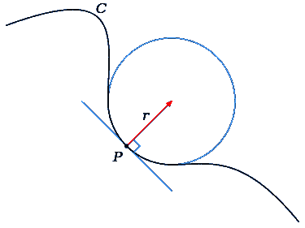

# 后负油:1 年曲率作为远期曲线演变的度量

> 原文：<https://towardsdatascience.com/post-negative-oil-the-1-year-curvature-as-a-measure-of-forward-curve-evolution-a1013dcd6b2b?source=collection_archive---------50----------------------->

## 用单一指标量化前向曲线动态

WTI 期货市场历史上首次跌破 0 美元，5 月合约(CLK20)下跌 306%，4 月 20 日周一收于-37.63 美元/桶。交易量和持仓量一直在向 6 月合约(CLM20)转移，随着 5 月合约在 4 月 21 日(周二)到期，6 月合约成为了近月合约。6 月合约也下跌，因为它成为短期市场的代表，导致升水更大。

我很好奇期货溢价通常是如何计算的，因为我意识到有几篇文章使用了不同月份合约(9 月 20 日、12 月 20 日等)的价差。)来量化短期和长期市场动态之间的差异。我知道期货溢价通常是指远期曲线的向上形状，但我想找到一个单一的指标来代表曲率。我还想探索远期曲线如何随时间演变，而不必盯着[日期 x 合约]矩阵来寻找模式。

# 前向曲线的演变

现有的可视化要么只显示当前的实时前向曲线，要么在相同的轴上叠加大量不同日期的杂乱前向曲线。我知道每个人都讨厌 3D 绘图，除了艺术家自己，但我相信这个绘图实际上可以减轻对曲线形状演变的解释。

x 轴(CLM20。NYM 到 CLK21。NYM)代表从 2020 年 6 月到 2021 年 5 月的合约。y 轴(04–23 到 03–31)表示从 2020 年 4 月开始的最新日期。z 轴代表每份合约每天的收盘价。底部的等高线图表示顶部曲面图的展平表示。

从图中可以清楚地看出，月初的升水“变软”，然后在接近展期时明显变陡。

# 1 年曲率作为远期曲线演变的衡量标准

我想到了几种计算曲率的方法:

1.  由于 x 轴(周期)是统一的，因为每一步代表一个合约，如果每个合约之间的不同收盘价代表梯度，我们可以将这些差异相加得到总曲率。这显然是错误的，因为它只是从第一个合同到最后一个合同的梯度
2.  利用我在多变量微积分课上学到的知识，我想找到密切圆，这是逼近曲线某一点的“最佳拟合圆”。然而，很难找到这样一个点，如果曲线上有几个拐点，这可能是危险的。另一种方法是将曲线参数化，并考虑沿曲线运动的质点的加速度大小。

3.一种更简单的方法是计算并求和每条曲线的有限差分，因为 x 轴已经是离散的。这个想法是在每个点上累积“近似梯度”。使用内部点中的二阶精确中心差和边界处的一阶或二阶精确单侧(向前或向后)差来计算梯度。

如果这些值是等间距的，则中心差是向前和向后差的平均值。通过使用过去和未来的值进行比较，中心差给出了导数的更精确的近似值。然后，二阶中心差表示点与点之间梯度变化的程度。

# 结果

结果指标是 1 年曲率，它考虑了曲线上的波动，而不是简单的点对点测量。这个单一值能够捕捉到月初的期货溢价、“软化”阶段以及月末的最终陡峭化。这有望提供一个可以使用的更加一致和可量化的度量。

## 如果您想与 3D 绘图互动，并访问一个简短的 Jupyter 笔记本，其中包含供您自己使用的代码，请留下注释。