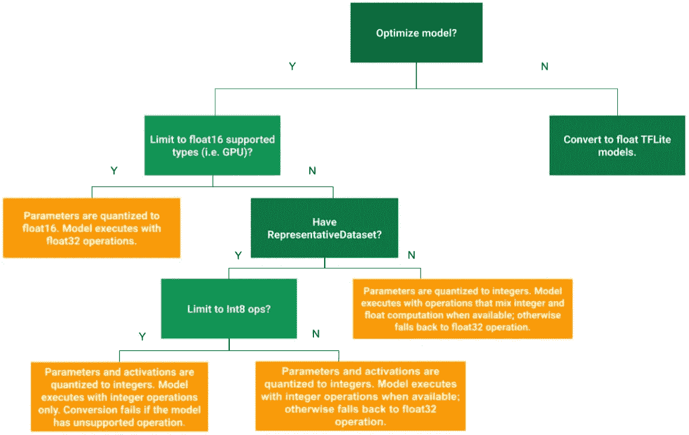

# 机器学习和深度学习模型的训练后分析和量化

> 原文：<https://towardsdatascience.com/post-training-analysis-and-quantization-of-machine-learning-and-deep-learning-models-a133231f6100?source=collection_archive---------24----------------------->

## [虚拟助理项目](https://towardsdatascience.com/tagged/virtual-assistant-project)

## 一个极其重要但有时被忽视的概念

[斯科特·格雷厄姆](https://unsplash.com/@sctgrhm?utm_source=medium&utm_medium=referral)在 [Unsplash](https://unsplash.com?utm_source=medium&utm_medium=referral) 上拍照

建立和探索机器学习以及深度学习模型是我喜欢做的事情。我选择一个项目并开始着手做。有些只是业余爱好者级别的项目，有些是具有真实用例和优势的项目。我有一个中等的 GPU 和一个中等的处理能力的系统。所以我所关注的只是训练和确保模型在我的电脑上工作和运行。然而，这并不是故事的结尾，有时我最终会错过一个极其重要的概念——模型的**训练后分析**。

这种培训后分析是什么，为什么如此重要？

训练后分析有时也称为事后分析，在模型优化中起着重要作用。构建和训练的业务模型需要优化，以便在低端设备和嵌入式系统(如 raspberry pi)上有效工作。构建和评估模型的主要组件之一是检查模型的预测能力和性能质量。一个更重要的概念是理解你的机器学习或深度学习模型的局限性。克服这些限制是成功模式的关键。

在本文中，我们将讨论如何针对特定用例有效地量化我们的模型。我们将主要关注深度学习模型的局限性、改进和量化的讨论。首先，我们将讨论使用 TensorFlow 的模型的训练后量化到底是什么。我们将学习如何在各种优化技术的帮助下，使我们的模型在所有平台上更加动态和有效，以达到更广泛的目标受众。然后，我们将了解可用于改进各种模型的限制和技术。我们对这个项目的主要参考将是 TensorFlow 博客的训练后量化和虚拟助理项目系列，这是我做的。你可以在下面提供的链接中查看这两个，尽管不是强制性的。

 [## 训练后量化| TensorFlow Lite

### 训练后量化是一种转换技术，可以减少模型大小，同时还可以改善 CPU 和硬件…

www.tensorflow.org](https://www.tensorflow.org/lite/performance/post_training_quantization)  [## 虚拟助手项目——走向数据科学

### 阅读《走向数据科学》中关于虚拟助手项目的文章。分享概念、想法和…

towardsdatascience.com](https://towardsdatascience.com/tagged/virtual-assistant-project) 

> **注意:**虽然不是必要条件，但我强烈建议观众查看我以前在智能面部锁定系统、下一个单词预测和虚拟助手系列中创新的使用一维卷积层的聊天机器人项目上的项目，因为这将有助于以更直观的方式掌握一些概念。

由[迈克尔·泽兹奇](https://unsplash.com/@lazycreekimages?utm_source=medium&utm_medium=referral)在 [Unsplash](https://unsplash.com?utm_source=medium&utm_medium=referral) 上拍摄的照片

## 训练后量化:

在您的系统上有效运行的模型可能无法在低端设备上有效运行相同的程序/模型。这可能是由于目标设备的硬件限制。在这里，训练后量化可以帮助改进目标设备的算法和模型的优化。训练后量化是一种转换技术，可以减少模型大小，同时还可以改善 CPU 和硬件加速器的延迟，而模型精度几乎不会下降。当您使用 [TensorFlow Lite 转换器](https://www.tensorflow.org/lite/convert/)将其转换为 TensorFlow Lite 格式时，您可以量化已训练的浮点 TensorFlow 模型。TensorFlow Lite 转换器在 Raspberry Pi 等设备上非常有用，可用于优化对象检测模型、人脸识别模型等。对象检测项目可以使用 TensorFlow Lite 进行优化，对 android 或 ios 设备也有很大的影响。你可以在这里查看这个很酷的项目。

下面是帮助您为模型选择最佳训练后量化和优化方法的框图:

[来源:](https://www.tensorflow.org/lite/performance/post_training_quantization)图片来自 tensorflow

简而言之，各种训练后量化方法如下:

## 动态范围量化

这种最简单的训练后量化形式。它只将权重从浮点静态量化为整数，精度为 8 位。

## 全整数量化

通过确保所有模型数学都是整数量化的，您可以进一步改善延迟，减少峰值内存使用，并与纯整数硬件设备或加速器兼容。

## 浮点量化

您可以通过将权重量化为 float 16(16 位浮点数的 IEEE 标准)来减小浮点模型的大小。

基本上，在这 3 种训练后优化方法中，我们确保我们的模型设计尽可能高效和优化。我们必须确保，一旦完成了必要的优化更改，该模型将保持高效的性能，同时在精度和损失等参数方面保持或多或少相同的有效性。

照片由 [Unsplash](https://unsplash.com?utm_source=medium&utm_medium=referral) 上的 [Dhru J](https://unsplash.com/@dhruj?utm_source=medium&utm_medium=referral) 拍摄

# 其他直观的例子来理解模型的局限性以及可以做出的重大改变和改进—

# **1。人脸识别模型:**

所以，你成功地建立了一个面部识别模型，使用了像迁移学习这样的深度学习技术，类似于这里的。整个模型在训练数据上表现得非常好。在对训练和验证数据进行测试时，产生的结果仍然非常好。该模型在大多数情况下都能按预期运行。然而，该模型存在一些局限性。让我们来理解和看待人脸识别模型的这些局限性。让我们也看看在以下方面可以作出的改进。

## 局限性:

1.  人脸识别模型不能在低质量的相机上表现得很好。摄像机质量必须至少一般，才能正确捕捉实时人脸并授予访问权限。
2.  周围的照明不能太暗。它至少需要适度的亮度。否则，该模型将在实时分析过程中出现检测和识别人脸的问题。
3.  我们使用 Haar cascode _ frontal face _ default . XML 来检测人脸。这对于在某些角度识别面部可能是有问题的，并且面部的检测可能不能如期望的那样工作。

## 改进:

1.  可以使用一次性学习和训练方法来减少每个面部的训练时间。由于当前模型只识别一张脸，如果我们想添加更多的脸，我们需要重新训练整个模型。因此，需要考虑一次性学习等方法来提高模型的质量和性能。
2.  可以找到 haarcascade _ frontal face _ default . XML 的替代方案来提高在任何特定角度检测面部的准确性。另一种方法是为正面和侧面创建一个定制的 XML 文件。
3.  为了使其在嵌入式设备上运行，可以对内存约束进行更改，如转换为 tf.float(32 ),也可以通过考虑使用 tflite 对模型进行更改。

# 2.下一个单词预测:

[下一个字预测](/next-word-prediction-with-nlp-and-deep-learning-48b9fe0a17bf)模型能够在模型上实现体面的损失。下一个单词模型是一种预测搜索类型的方法，可用于 google 搜索。这些也可以用来检测用户的某些模式，并可以用于电子邮件和短信的下一个单词预测任务。该模型尽管还不错，但仍有缺陷，并且存在改进下一个单词预测模型中存在的缺陷的方法。让我们看看所有的限制和可以改进整个模型的变化。

## 局限性:

1.  下一个单词预测仅限于几个单词，并且不能非常准确地对较长的句子进行预测。在这个行业工作时，这不是最好的情况，因为可能会有更长的刑期。
2.  由于使用了 LSTM 层，与其他模型相比，该模型需要更长的时间来训练和执行。在 ram 和 GPU 能力较低的小型嵌入式系统中，这种较长的训练可能是一种限制。然而，一旦在更好的系统上训练，部署就不是一个大问题了。

## 改进:

1.  对于自然语言处理，甚至存在零拍和一拍的学习方法。可以使用相同的方法来更好地训练模型，以提高整体性能，并避免重复的训练过程，这在一些现实生活的应用程序和场景中可能是一个真正的大障碍。因此，一次性学习是在其他培训能力较低的嵌入式系统中部署和工作的一个很好的选择。
2.  像 GPT-3 模型这样的高级训练算法对这些预测任务非常有效。
3.  可以使用更多预处理方法，也可以测试更多替代方法，以获得更好的精度、更低的损耗，并实现整体高性能。

# 3.聊天机器人模型:

[聊天机器人](/innovative-chatbot-using-1-dimensional-convolutional-layers-2cab4090b0fc)模型是一个基于文本分类的创新聊天机器人，可以实现整体良好的准确性和减少损失。聊天机器人模型能够在我们使用的整个数据集上表现得非常好。然而，即使是我们的聊天机器人也有一定的局限性和问题。我们将在下一节中介绍它们。但是基于 conv-1D 架构的整体预测系统和聊天机器人在 witty.txt 数据集上表现良好，可以用于类似的数据集。该模型对最常重复的问题的唯一值进行分类。

## 局限性:

1.  conv-1D 聊天机器人模型的主要限制之一是，它是一种基于分类的聊天机器人，而不是一种生成式建模方法。这种分类方法可能会导致重大挫折，因为在某些语言中可能会有问题，比如当用户不太精通英语时的语义问题。这可能会产生误导，聊天机器人可能不会产生预期的结果。
2.  由于它不是一个完全完美的模型，所以有时会容易出错。它可以预测用户不满意的结果，这可能是工业应用的一个问题。

## 改进:

1.  可以使用更多的预处理和自然语言处理的方法来达到更高的精度和减少模型训练的损失。这也可以改善模型的整体预测。
2.  像 GPT-3 模型这样的高级训练算法甚至对对话型聊天机器人也非常有效，这是训练高质量聊天机器人的一个很好的替代方法。
3.  可以使用其他方法，如基于分类的迁移学习、注意的序列到序列模型，或者甚至用于训练的某些一次性学习方法。

威廉·艾文在 [Unsplash](https://unsplash.com?utm_source=medium&utm_medium=referral) 上的照片

## 结论:

体验机器学习和深度学习模型的乐趣总是很酷，也是它们最棒的部分。在探索这些模型时，如果您确实希望将它们转换成现实生活中的用例，使其能够惠及大量的人，那么模型的训练后分析和训练后量化对于提高效率、质量和紧凑性以将项目部署到更广泛的受众变得极其重要。训练后量化还使我们能够在量化模型上获得几乎相同的精度，类似于在原始模型中获得的精度。这简化并使我们的生活变得容易多了！

谢谢大家坚持到最后。祝你在机器学习和深度学习模型的探索和量化过程中度过愉快的时光。请随意查看我之前提到的所有项目，我希望你们都喜欢这篇文章，并祝你们有美好的一天！