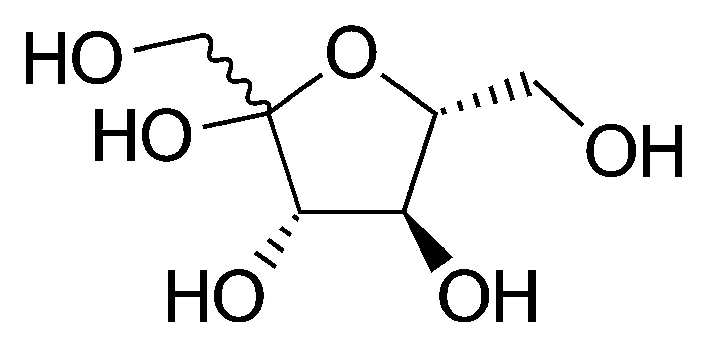
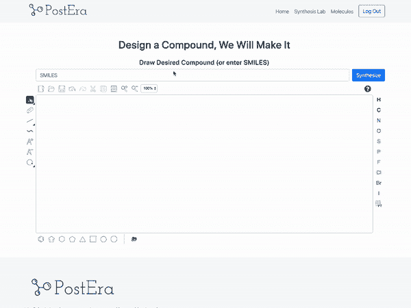

# 今年，PostEra 正在使用机器学习制造一种新冠肺炎药物

> 原文：<https://towardsdatascience.com/postera-is-using-machine-learning-to-make-a-covid-19-drug-this-year-c7d70245bcd9?source=collection_archive---------41----------------------->

## 将谷歌翻译启发的机器学习应用于化学

*声明:我是* [*Cortex*](https://github.com/cortexlabs/cortex) *的维护者，这是一个开源的机器学习工程平台，用在下面提到的一些项目中。*

最近，一家名为 [PostEra](https://postera.ai/) 的初创公司宣布，他们打算“在年内”开发一种新冠肺炎疗法，作为开源 moonshot 的一部分。

自然，这一宣布引起了一些兴奋。虽然 PostEra 肯定不是第一家做出雄心勃勃声明的生物技术/机器学习初创公司，但这次有一些特别令人兴奋的事情。

虽然我们可能已经习惯于宣布公司 *X* 将做不可能的事 *Y* 因为“机器学习”——其细节从未得到解释——PostEra 的宣布是不同的，因为它:

*   分离出药物开发中的一个特殊瓶颈。
*   把阻断器设计成一个工程挑战。
*   提出了一种新颖的机器学习解决方案来应对这一挑战。

看他们的发布公告，感觉不像是 AI 福音或者炒作。感觉就像*工程，*机器学习只是堆栈的另一部分。

因此，PostEra 在一年内制造新冠肺炎治疗的目标，虽然可能是雄心勃勃的，但在某种程度上感觉是严肃的，这是许多登月者所没有的。PostEra 没有等待机器学习的突破，他们没有押注于投机性技术。他们正在推广一个流行产品——Google Translate——所使用的成熟方法，以解决一个新领域的类似问题。

为了更好地解释我的意思，让我们深入了解一下 PostEra 是如何工作的。

# 将化学合成理解为翻译

PostEra 在药物开发中解决的问题是分散的:

对于任何给定的化合物，都有许多不同的制造方法，并且没有严格的、确定性的模型来确定哪种方法是最好的。

为了给出更多的上下文，你可以简单地在白板上画出一个分子:

氧原子到这里，在那里插入几个键，瞧——分子。然而，在现实生活中，我们不能如此精确地剪切和粘贴原子。

为了创造一种新的分子，化学家采用更简单的分子，通过化学反应转化它们，这被称为“移动”然后，新分子通过额外的移动进行转化，直到最终产生目标分子。形成一个分子的一系列运动被称为“路线”

化学家主要通过有知识的试错法来预测移动的结果和路线的可行性。这很贵，因为化学。

PostEra 所做的是建立一个平台，使用机器学习来即时预测，给定一个拟议的分子，最可行的合成路线:

来源: [PostEra](https://postera.ai/demo)

为了理解该平台如何工作，将化学合成问题分解成更抽象的术语是有帮助的:

*   你需要将一组对象 A 转换成一个单独的对象 b。
*   您可以通过一组预定义的功能(化学/物理反应)组合对象来转换它们。
*   你需要创建一个模型来对许多理论上似乎合理的函数链的可行性进行评分。

如果你把这个问题的化学背景去掉，它就变成了工程师们熟悉的东西——一个翻译问题。

假设你的任务是设计谷歌翻译。您可以像这样确定问题的范围:

*   您需要将一组对象 A 转换成一个单独的对象 B，即一个等价的英语短语，在本例中，这个对象是法语单词“*乐惠·德·诺克斯·德·可可，*”。
*   您可以通过以多种不同方式应用翻译功能来转换对象。*乐惠·德·诺伊克斯·德·可可*可能是“椰子油”或“可可坚果油”
*   你必须给各种翻译打分，没有明显的基于规则的系统。“椰子油”是对的，但“椰子的坚果油”不是*不对*。

来源:[谷歌翻译](https://translate.google.com/)

从根本上说，这是同样的问题，Google Translate 中使用的相同的序列到序列方法应该适用于 PostEra。

经过适当的训练，PostEra 的模型应该能够生成分子之间可能的“翻译”树，为树中的每条路线分配可行性分数，然后在树中搜索最可行的翻译——这正是所发生的事情。

然后，可以将这一系列模型部署为单个 API，可从 PostEra 前端查询，以创建药物化学即服务平台。

# 波斯特拉正在努力实现登月，而不是创造奇迹

需要强调的是，PostEra 的 moonshot 唯一雄心勃勃的是它的时间线。

基本技术已经被证实。机器翻译作为一个领域已经建立了很长时间，PostEra 的创始团队甚至在公司成立之前就发布了第一个在预测化学反应结果方面胜过人类化学家的模型。

这也是为什么 ML 月球探测器如此令人兴奋的部分原因。底层产品不是推测性的——它是功能性软件，它是机器学习工程如何以真实、有形的方式改变技术的又一个例子。

***注来自《走向数据科学》的编辑:*** *虽然我们允许独立作者根据我们的* [*规则和指导方针*](/questions-96667b06af5) *发表文章，但我们不认可每个作者的贡献。你不应该在没有寻求专业建议的情况下依赖一个作者的作品。详见我们的* [*读者术语*](/readers-terms-b5d780a700a4) *。*