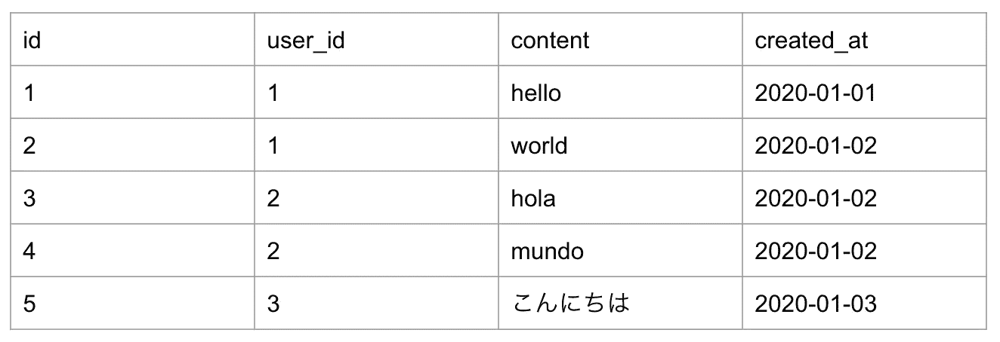
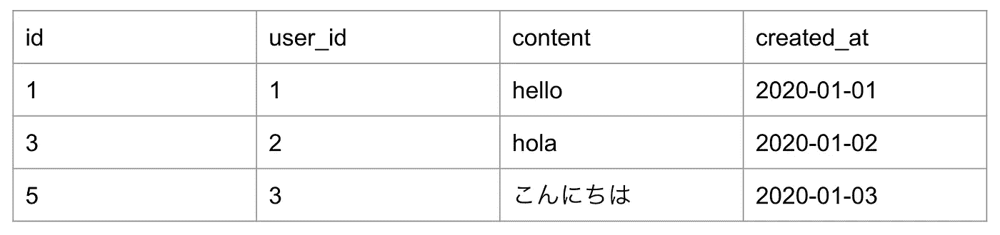
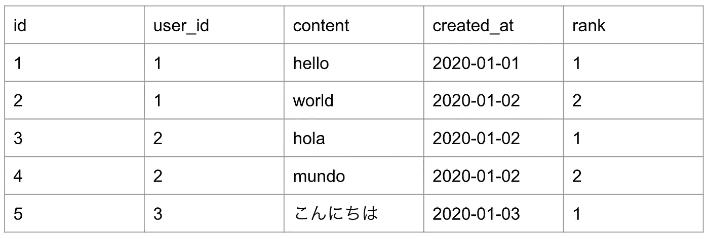
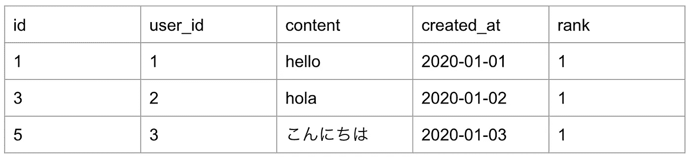

# PostgreSQL:秩函数介绍。

> 原文：<https://towardsdatascience.com/postgresql-rank-function-introduction-c8ac008506dd?source=collection_archive---------50----------------------->

## 如果您尝试过分析一些应用程序数据库，您可能会看到如下内容。


卢克·切瑟在 [Unsplash](https://unsplash.com?utm_source=medium&utm_medium=referral) 上拍摄的照片



每个用户都可以在应用程序中发布多个帖子，我想一个超级简化版的 twitter 数据库应该是这样的。

数据分析的问题来了。

我们如何才能发现每个用户第一次发帖的时间和内容？这种问题很常见，当你分析应用程序数据时，你想知道每个用户的第一个活动。通过实现这一点，我们应该得到如下表格。



您可以看到，现在我们提取了三个帖子，它们是用户从上一个表中首先创建的第一个帖子。该提取可以作为获得如下服务洞察的基础

1.  用户创建第一个帖子需要多长时间？
2.  用户倾向于在第一篇帖子中使用什么样的词？

增强用户采取主动是激活服务的关键，所以你应该知道如何做到这一点。

# 编写 SQL

我们可以将所需的程序总结如下。

1.  按`user_id`分组数据样本。
2.  按每组中的`id`降序排序。
3.  从每组中提取 id 最小的样本。

要仅使用 PostgreSQL 实现这一点，有一些可能的方法，但今天我们将使用其中实现的一个窗口函数， [RANK 函数](https://www.postgresqltutorial.com/postgresql-rank-function/)。使用这个，我们可以简单容易地完成这个分析。该函数将用于分组和排序方法的列作为参数，并给出每个组的排名。它的语法是这样的。

```
RANK() OVER (
    [PARTITION BY partition_expression, ... ]
    ORDER BY sort_expression [ASC | DESC], ...
)
```

如你所见，我们将“如何分组”交给`PARTITION BY`，将“如何排序”交给`ORDER BY`。似乎很简单，对吗？让我们把这个排序函数应用到我们的问题中。

```
select
  *,
  rank() over (partition by user_id order by id)
from
  posts
```

`PARTITION BY`使用`user_id`将数据分组到每个用户中，`ORDER BY` `id`对每个用户组中的帖子进行排序。通过执行这个 SQL，我们可以获得下表。



您可以看到每个用户组的排名数字，为了从转换后的表格中只提取第一篇文章，我们可以利用`where`来约束`rank = 1`。

```
select
  *
from
(
  select
    *,
    rank() over (partition by user_id order by id)
  from
    posts
 ) as tmp
 where
   rank = 1
```

这个 SQL 最终给出了我们想要的东西。



我希望您现在可以看到，使用 PostgreSQL 的 RANK 函数提取数据库中每个用户的第一篇文章是多么容易。基于这些提取的信息，你可以运行大量的分析来更好地理解你的用户。