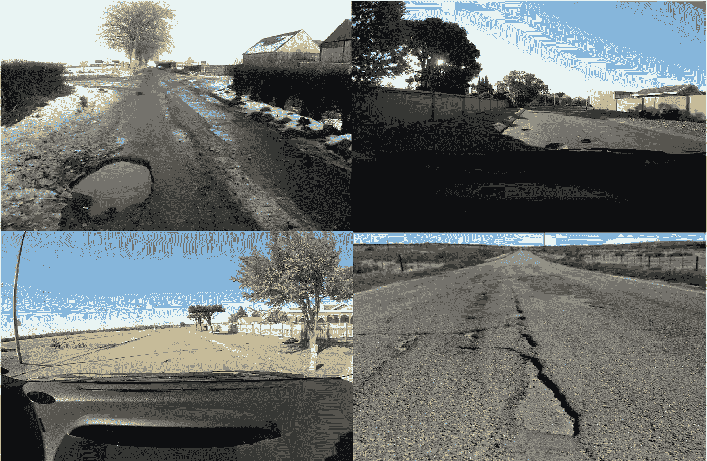
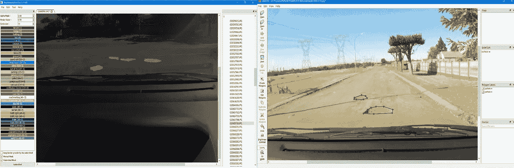
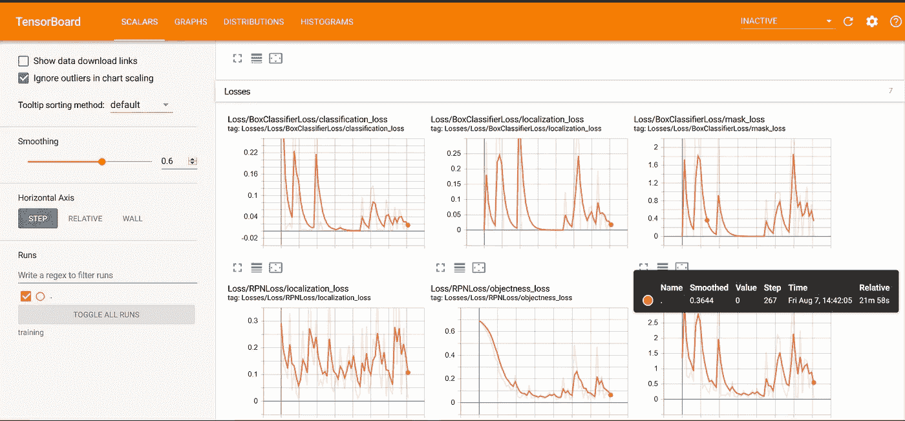
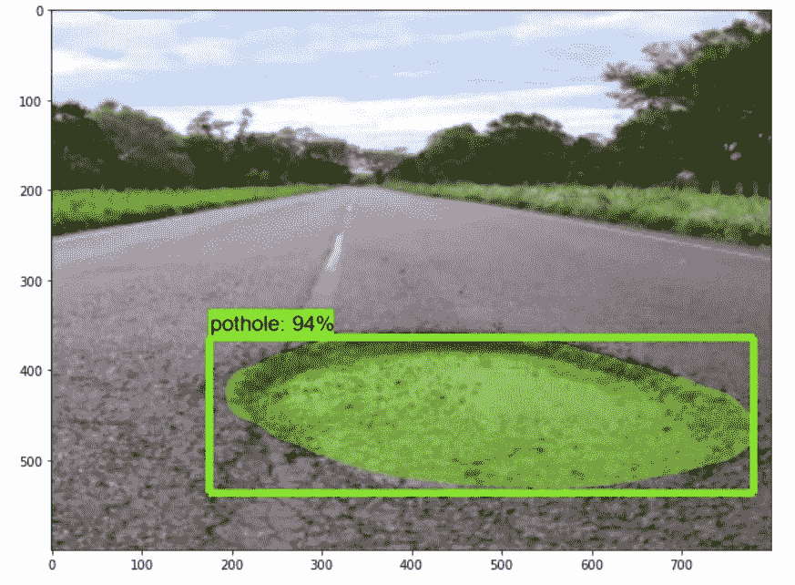
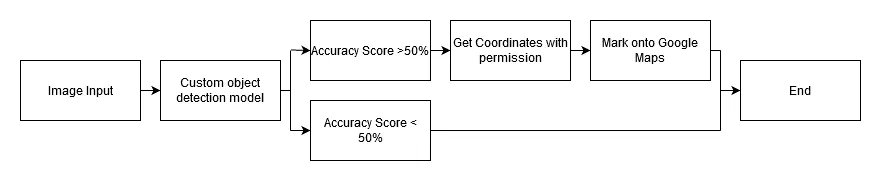
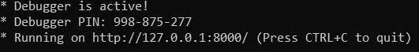
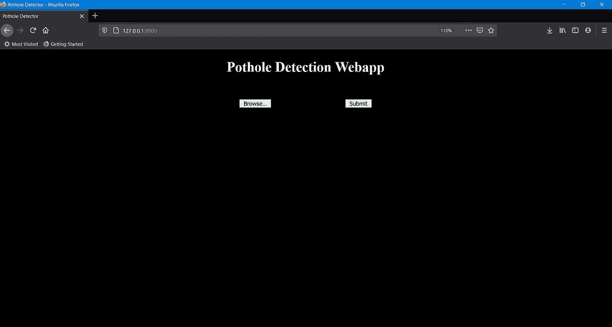
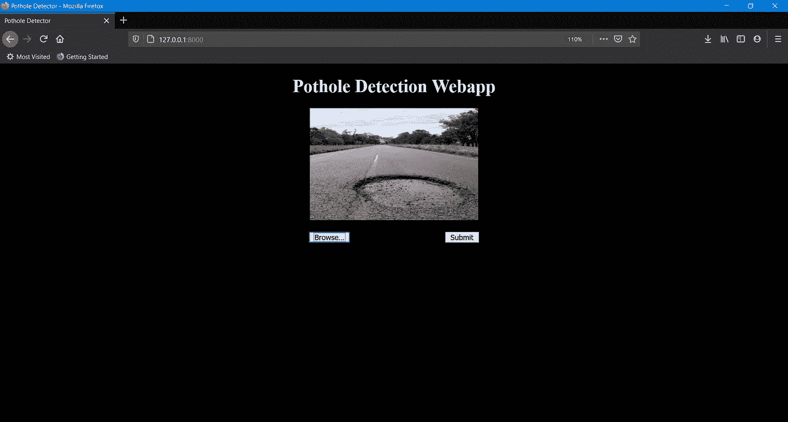
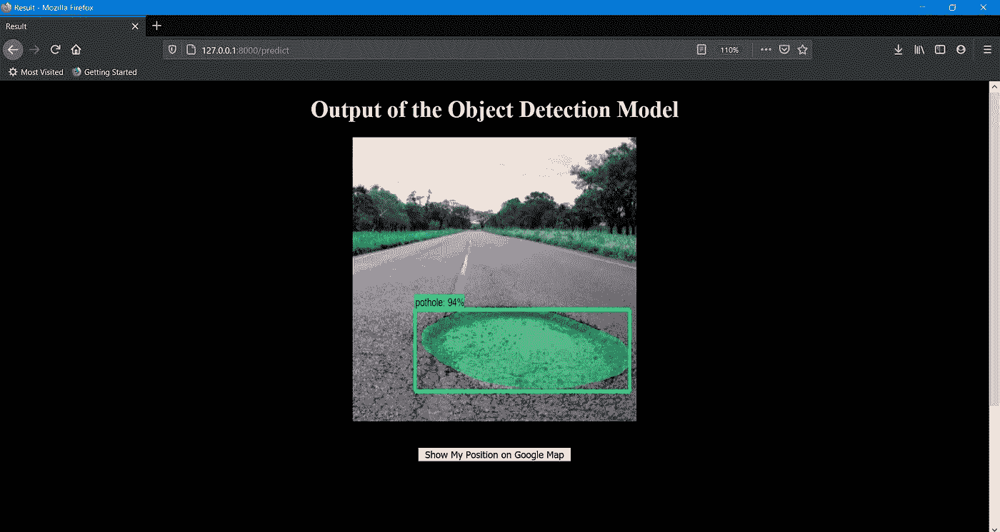
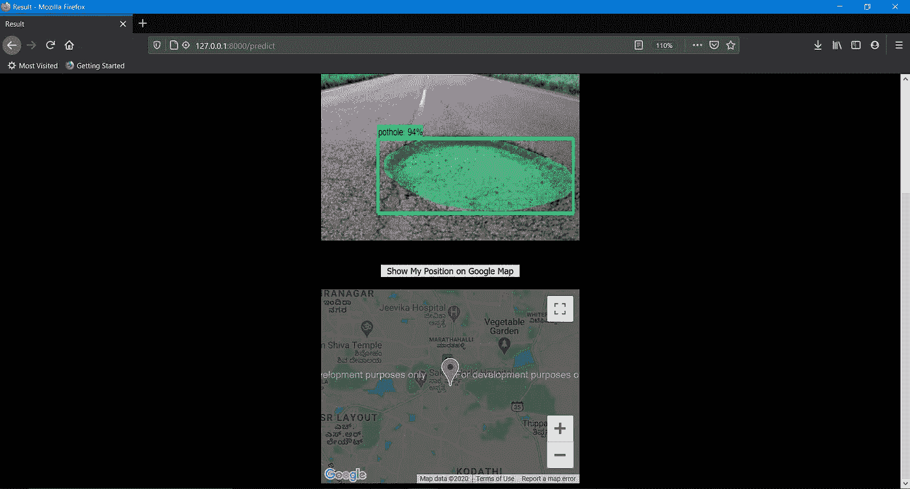

# 使用掩模 RCNN 训练定制对象检测模型

> 原文：<https://towardsdatascience.com/pothole-detection-with-mask-rcnn-b78d18a89915?source=collection_archive---------10----------------------->


照片由 Marc-Olivier Jodoin 在 Unsplash 上拍摄

> 从安装和培训到在 webapp 中部署定制的经过培训的对象检测模型的完整指南。

# 背景

根据维基百科，“坑洞是路面上的凹陷，通常是沥青路面，交通已经清除了路面的碎片”。据报道，截至 2015 年，加拿大阿尔伯塔省的埃德蒙顿“自称为坑洞之都”，每年花费 480 万美元用于 45 万个坑洞。在印度，每年大约有 1100 人死于由坑洞引起的事故。当当局不了解情况时，普通公民没有办法向有关当局传达或报告糟糕的道路。

因此，几个组织一直在尝试开发工具(如 web 应用程序)，市民可以向有关当局报告坑洼。已经举办了几次黑客马拉松，把这个项目作为目标之一。鉴于这一问题日益受到关注，在这个项目中，解决这一问题的目标是**开发一个简单的界面，使用最先进的物体检测技术来实时检测坑洞，并使用谷歌地图报告它们**。这篇文章将带你完成建立你自己的坑洞探测系统的步骤。根据 Newzoo 的 2019 年全球移动市场报告，该项目的部署介质将是印度 5 亿多人使用的智能手机。

使用的工具:

*   Python 3.6 以上版本
*   Tensorflow 对象检测 API
*   像素注释工具
*   Anaconda 包管理器
*   瓶

该项目的工作流程如下:

*   环境设置
*   数据集收集
*   模特培训
*   用烧瓶展开
*   结果

# Anaconda 环境设置

开始时，我们将建立一个新的 Anaconda 环境，并安装这个项目所需的所有必要的包。Anaconda 是和“pip”一起流行的 python 包管理器。如果您在此项目之前没有安装，请使用下面的链接进行安装。

这是一个相当简单的安装过程，应该不会花很长时间。如果你有使用命令行的经验，你可以安装 [Miniconda](https://docs.conda.io/en/latest/miniconda.html) ，但是如果你愿意，贵由可以安装带有所有附加软件包的 [Anaconda Navigator](https://www.anaconda.com/products/individual) (这将需要更长的安装时间)。

之后，从开始菜单中打开“Anaconda Prompt ”,并按照安装说明的其余部分进行操作:

1.  创造康达环境。

```
(base) C:\Users>conda create --name pothole python=3.6
```

2.激活环境并升级 pip。

```
(base) C:\Users>activate pothole
(pothole) C:\Users>python -m pip install --upgrade pip
```

3.通过发出以下命令安装其他必需的软件包:

```
(pothole) C:\Users>conda install -c anaconda protobuf
(pothole) C:\Users>pip install pillow
(pothole) C:\Users>pip install lxml
(pothole) C:\Users>pip install Cython
(pothole) C:\Users>pip install contextlib2
(pothole) C:\Users>pip install jupyter
(pothole) C:\Users>pip install matplotlib
(pothole) C:\Users>pip install opencv-python
(pothole) C:\Users>pip install labelme
(pothole) C:\Users>pip install tensorflow-gpu==1.15.2
```

4.从 Github 克隆或下载 tensorflow 对象检测 api 存储库。出于这个项目的目的，我们使用 tensorflow 版本 1.15.2。**注意始终确保安装的 tensorflow 版本和 tensorflow 对象检测 api 存储库版本相同**。运行下面的命令或者手动下载这个[库](https://github.com/tensorflow/models/tree/r1.13.0)。

```
(pothole) C:\Users>git clone https://github.com/tensorflow/models.git
```

将这些文件夹放在名为“模型”的文件夹中。您可以将这个“模型”文件夹放在您选择的目录中。

5.配置 PYTHONPATH 环境变量并安装 COCO api:

```
(pothole) C:\Users>set PYTHONPATH=C:\models;C:\models\research;C:\models\research\slim
(pothole) C:\Users>pip install git+https://github.com/philferriere/cocoapi.git#subdirectory=PythonAPI
```

6.编译 Protobufs 并运行 setup.py

在 Anaconda 提示符下，将目录更改为\models\research 目录

```
(pothole) C:\Users>cd C:\models\research
```

运行以下代码行:

```
protoc --python_out=. .\object_detection\protos\anchor_generator.proto .\object_detection\protos\argmax_matcher.proto .\object_detection\protos\bipartite_matcher.proto .\object_detection\protos\box_coder.proto .\object_detection\protos\box_predictor.proto .\object_detection\protos\eval.proto .\object_detection\protos\faster_rcnn.proto .\object_detection\protos\faster_rcnn_box_coder.proto .\object_detection\protos\grid_anchor_generator.proto .\object_detection\protos\hyperparams.proto .\object_detection\protos\image_resizer.proto .\object_detection\protos\input_reader.proto .\object_detection\protos\losses.proto .\object_detection\protos\matcher.proto .\object_detection\protos\mean_stddev_box_coder.proto .\object_detection\protos\model.proto .\object_detection\protos\optimizer.proto .\object_detection\protos\pipeline.proto .\object_detection\protos\post_processing.proto .\object_detection\protos\preprocessor.proto .\object_detection\protos\region_similarity_calculator.proto .\object_detection\protos\square_box_coder.proto .\object_detection\protos\ssd.proto .\object_detection\protos\ssd_anchor_generator.proto .\object_detection\protos\string_int_label_map.proto .\object_detection\protos\train.proto .\object_detection\protos\keypoint_box_coder.proto .\object_detection\protos\multiscale_anchor_generator.proto .\object_detection\protos\graph_rewriter.proto .\object_detection\protos\calibration.proto .\object_detection\protos\flexible_grid_anchor_generator.proto
```

如果出现找不到 protobuf 文件的错误，请在以下时间后运行:

```
protoc object_detection/protos/*.proto --python_out=.
```

最后，我们需要运行以下命令:

```
(pothole) C:\models\research> python setup.py build
(pothole) C:\models\research> python setup.py install
```

8.您可以通过运行名为“object_detection _ tutorial . ipynb”的 object _ detection 文件夹中的 IPython 笔记本来测试一切是否正常。

```
(pothole) C:\models\research>cd object_detection
(pothole) C:\models\research\object_detection>jupyter notebook object_detection_tutorial.ipynb
```

您可以使用我的存储库来获得本文的支持材料。

[](https://github.com/SamdenLepcha/Pothole-Detection-With-Mask-R-CNN) [## SamdenLepcha/带面罩的坑洞探测-R-CNN

### 这个存储库包含来自文章“用掩模 RCNN 检测坑洞”的项目。你可以找到关于…的文章

github.com](https://github.com/SamdenLepcha/Pothole-Detection-With-Mask-R-CNN) 

# 数据集收集

与往常一样，在任何数据科学或人工智能项目的开始，在问题陈述被确定之后，我们继续收集数据，或者在这种情况下，收集用于训练的图像。

为了训练一个健壮的模型，我们需要使用大量的图片，但是也要有变化。这意味着坑洞必须以不同的角度或形状出现，这样我们的模型就不会倾向于一种变化，或者说过度拟合，也不会推广到其他图像。

你可以使用你自己拍摄的图片，或者像我一样从网上下载。对于这个项目，我们的想法是检测坑洼，这样我们就不会根据严重程度将它们分割出来，但这也为未来的范围留下了一些东西。以下数据源用于构建此项目:

*   [卡格尔](https://www.kaggle.com/atulyakumar98/pothole-detection-dataset?select=potholes)
*   [研究门](https://www.researchgate.net/publication/282807920_Dataset_of_images_used_for_pothole_detection)



按作者分类的数据集中的图像

我们需要调整图像的大小，以便可以使用这些调整后的图像(如本项目中的 800 x 600)来训练模型(除非你有无限的 GPU 计算能力)。使用命令提示符或 anaconda 提示符或任何其他 IDE 来运行这个脚本。例如，在 Anaconda 提示符下:

```
(pothole) C:\Users> python DatasetCreation.py
```

# 数据标记

现在我们已经收集了数据集，我们需要标记图像，以便模型了解什么是坑洞。为了给图像贴标签，我们需要一个贴标签软件。

为了这个项目的目的，我使用了 labelme，因为它使用起来相当简单。在您的 anaconda 环境中输入“labelme ”,软件应该会像下面这样打开。

```
(pothole) C:\Users>labelme
```

从你的目录中打开你的图像，点击创建多边形，开始给你的图像加标签。Labelme 将您的标签保存为与图像名称同名的 json 文件。将 json 放在与图像相同的目录中。Labelme(右)和像素注释工具(左)的示例如下所示。对于这个项目，我已经标记了 400 张图片。



像素注释工具(左)和 Labelme(右)的图像(作者提供的图像)

# 模特培训

1.  创建 TFRecords:

在标记了我们的整个数据集之后，我们现在必须生成 TFRecords，作为我们的模型训练的输入。但在此之前，我们需要将 json labelme 标签转换成 COCO 格式。我采用了 Gilber Tanner 在他的教程中提供的脚本来执行此操作。你也可以在我的标有“ [labelme2coco.py](https://github.com/SamdenLepcha/Pothole-Detection-With-Mask-R-CNN/blob/master/place_in_object_detection/images/labelme2coco.py) ”的 Github 存储库中找到它。下载并把它放到你的训练/测试图像所在的目录中。现在运行以下命令:

```
(pothole) C:\Users\models\research\object_detection\images>python labelme2coco.py train --output train.json
(pothole) C:\Users\models\research\object_detection\images>python labelme2coco.py test --output test.json
```

既然训练/测试数据是 COCO 格式的，我们现在可以使用同样由 Gilber Tanner 创建的 create_coco_tf_record.py 来创建 TFRecords。[这个脚本](https://github.com/SamdenLepcha/Pothole-Detection-With-Mask-R-CNN/blob/master/place_in_object_detection/create_coco_tf_record.py)也需要从 object_detection 文件夹中放置并运行。

```
python create_coco_tf_record.py --logtostderr --train_image_dir=images/train --test_image_dir=images/test --train_annotations_file=images/train.json --test_annotations_file=images/test.json --include_masks=True --output_dir=./
```

您应该在 object_detection 文件夹中找到 train.record 和 test.record。

2.正在创建标签映射

标签映射将类名链接到 ID 号。使用类似 Sublime Text 的文本编辑器创建一个“labelmap.pbtxt”并将其存储在 object_detection/training 文件夹中。在文件夹内写下以下内容:

```
item {
  id: 1
  name: 'Pothole'
}
```

您可以根据您想要检测的类别来定义您想要的数量，但对于这个项目的目的，我们只对检测坑洞感兴趣。

这个 id 应该与您的 train.json 和 test.json 文件中提到的 id 相匹配。请注意它是如何大了一个数字的，即这里是 id: 0，但我们在 labelmap 文件中提到了 id:1。

```
"categories": [
    {
        "supercategory": "Pothole",
        "id": 0,
        "name": "Pothole"
    },
],
```

3.正在创建培训配置文件:

现在我们需要创建一个培训配置文件。从[张量流模型动物园](https://github.com/tensorflow/models/blob/master/research/object_detection/g3doc/detection_model_zoo.md)有各种各样的张量流模型可用于 Mask RCNN，但为了这个项目的目的，我们将使用[Mask _ RCNN _ inception _ v2 _ coco](http://download.tensorflow.org/models/object_detection/mask_rcnn_inception_v2_coco_2018_01_28.tar.gz)，因为它的速度。下载该文件并将其放在 object_detection 文件夹中。您可以在 samples/config 文件夹中找到 mask _ rcnn _ inception _ v2 _ coco . config 文件。复制此文件夹并将其放入 object_detection/training 文件夹。现在，我们必须对这个配置文件进行以下更改:

*   第 10 行:将 num_classes 更改为您希望分类器检测的不同对象的数量。(在本项目中为 1)
*   第 126 行:将微调检查点更改为:

```
fine_tune_checkpoint: "<path>/models/research/object_detection/mask_rcnn_inception_v2_coco_2018_01_28/model.ckpt"
```

*   第 142 行:将 input_path 改为 train.records 文件的路径:

```
input_path: "<path>/models/research/object_detection/train.record"
```

*   第 158 行:将 input_path 改为 test.records 文件的路径:

```
input_path: "<path>/models/research/object_detection/test.record"
```

*   第 144 行和第 160 行:将 label_map_path 更改为标签映射的路径:

```
label_map_path: "<path>/models/research/object_detection/training/labelmap.pbtxt"
```

*   第 150 行:将 num_example 更改为测试文件夹中图像的数量。

4.训练模型:

运行以下命令，从 object_detection 文件夹开始模型的定型:

```
python legacy/train.py --train_dir=training --pipeline_config_path=training/mask_rcnn_inception_v2_coco.config
```

在每个间隔之后，模型将检查点保存在 training 文件夹中。让它训练到损失低于 0.05 是个好主意。花费的时间将取决于你的 GPU 有多强大。

您可以通过打开另一个 Anaconda 提示符窗口，将目录更改为 object_detection 文件夹，并键入以下命令来查看模型的进度:

```
(pothole) C:\models\research\object_detection>tensorboard --logdir=training
```

这将在您的本地计算机上创建一个网页，您可以通过 web 浏览器查看该网页。TensorBoard 页面提供了显示训练进度的信息和图表。



Tensorboard 示例(图片由作者提供)

在命令提示窗口中，可以通过按 Ctrl+C 来停止训练。我建议在它在你的文件夹中创建检查点后停止，这通常是每 5-10 分钟做一次，取决于你的计算能力。步骤数最高的检查点将用于生成冻结推理图。

5.导出推理图

在 object_detection 文件夹中创建一个名为“inference_graph”的文件夹。现在我们可以创建冻结的推理图(。pb 文件)放在这个文件夹中。要解决这个问题，请发出以下命令:

```
python export_inference_graph.py --input_type=image_tensor --pipeline_config_path=training/mask_rcnn_inception_v2_coco.config --trained_checkpoint_prefix=training/model.ckpt-2194 --output_directory=inference_graph
```

这个冻结的推理图是对象检测分类器。

6.测试新训练的分类器

为了测试新训练的分类器，您可以对我的 Github Repo 中已经存在的 [object_detection.ipynb](https://github.com/SamdenLepcha/Pothole-Detection-With-Mask-R-CNN/blob/master/place_in_object_detection/object_detection_tutorial.ipynb) 文件进行修改。

更改 labelmap，inference_graph，.配置文件和 test_images 目录。您应该得到以下输出:



测试图像的输出(作者提供的图像)

# 使用烧瓶展开

Flask 是一个用 Python 编写的微型 web 框架，由阿明·罗纳彻开发。我们将使用 Flask 来部署我们定制的经过训练的对象检测模型。你可以在他们的[官方文档](https://flask.palletsprojects.com/en/1.1.x/quickstart/#a-minimal-application)上找到初学者教程。

我们将在 Flask 应用程序中使用 object_detection.ipynb 文件中的代码。代码名为“ [app.py](https://github.com/SamdenLepcha/Pothole-Detection-With-Mask-R-CNN/blob/master/app.py) ”，也在我的 Github 库中。在我们的 app.py 文件的开始，我们导入我们的库，并在对象检测 api 所在的位置附加我们的 Python 路径。根据您放置该文件的位置进行更改。

Flask 应用程序的简单架构可以用下图来描述。



Flask Webapp 架构(图片由作者提供)

我们将图像作为定制训练的掩模 RCNN 模型的输入，该模型基于准确度分数来决定是否给出坐标。您可以通过运行以下命令来运行“app.py”。

```
python app.py
```



flask 应用程序在命令提示符下的输出(图片由作者提供)

运行上面的命令后，我们应该得到下面的输出。将它复制到您的浏览器中，以便 web 应用程序呈现 HTML 页面。这件事我做得很糟糕。你们可以通过修改 HTML 和 CSS 文件来为这个项目创建更好的界面或 UI。您可以在下面的结果部分找到所有的输出图像。

# 结果

这个部分只包含项目的各种输出图像。

*   这是将来自 Anaconda 提示符的 URL 复制到您选择的浏览器后的第一页。



Webapp 主页(图片由作者提供)

*   )这是选择并上传您选择的图片后的页面。



加载后的 Webapp(图片由作者提供)

*   这是点击提交按钮后的页面。请注意，只有当分数高于 50%时，下方的按钮才会出现。



模型预测后的输出(图片由作者提供)

点击下方的按钮后，输出结果状态，得到当前位置。为了不暴露我的位置，我已经把地图缩小了不少，但是你可以非常精确地放大坐标。您可以尝试建立一个架构，其中您在线维护一个位置数据库，以便页面可以显示这些坐标，但对于这个项目的目的，我们只是显示图像上传的当前位置。所以图像必须在同一个地方拍摄和上传。



最终谷歌地图功能的输出(图片由作者提供)

感谢您阅读到本文结尾。这就是本教程的内容。我希望您喜欢这篇文章，并希望它对您的数据科学之旅有所帮助。你可以在我网站的博客部分找到更多这样的文章。

[](https://www.samdenlepcha.com/#blogs) [## 萨姆登·莱普查

### 在这次以“人工智能/机器学习”为主题的黑客马拉松中，我们为他们的……

www.samdenlepcha.com](https://www.samdenlepcha.com/#blogs) 

# 参考

1.  3 年内超过 9300 人死亡，25000 人因路面坑洼受伤— [今日印度](https://www.indiatoday.in/india/story/over-9300-deaths-25000-injured-in-3-years-due-to-potholes-1294147-2018-07-24)
2.  S & Booysen，M.J. (Thinus) & Kroon，RS(2015).[用于坑洞检测的图像数据集。10.13140/RG.2.1.3646.1520](https://www.researchgate.net/publication/282807920_Dataset_of_images_used_for_pothole_detection?channel=doi&linkId=561ccc7b08ae78721fa2b350&showFulltext=true)
3.  如何在 Windows 10 上使用 TensorFlow (GPU)训练一个针对多个物体的物体检测分类器— [Github](https://github.com/EdjeElectronics/TensorFlow-Object-Detection-API-Tutorial-Train-Multiple-Objects-Windows-10)
4.  使用 Tensorflow 对象检测 API 的自定义遮罩 RCNN—[介质](https://medium.com/@vijendra1125/custom-mask-rcnn-using-tensorflow-object-detection-api-101149ce0765)
5.  使用 Tensorflow 对象检测 API 训练 Mask R-CNN 模型— [Gilbert Tanner](https://gilberttanner.com/blog/train-a-mask-r-cnn-model-with-the-tensorflow-object-detection-api)
6.  HTML 地理定位 API — [w3schools](https://www.w3schools.com/html/html5_geolocation.asp)