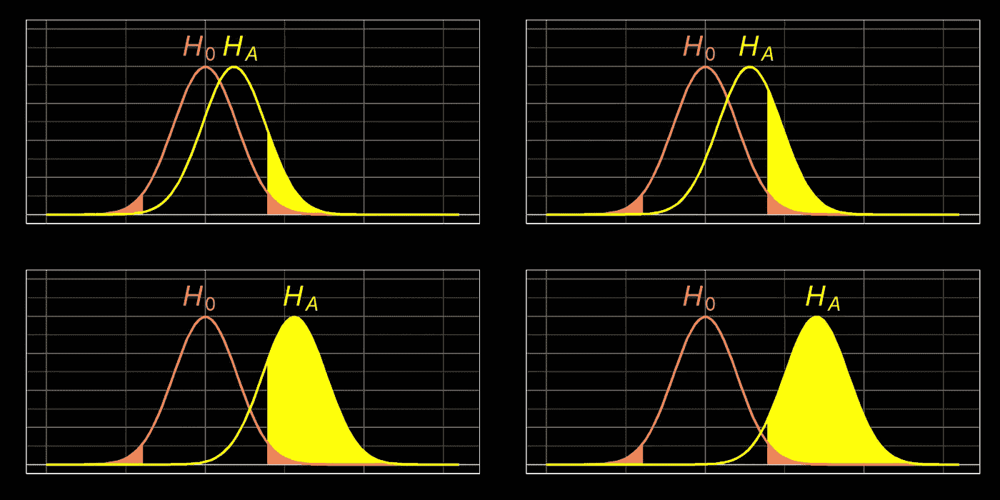
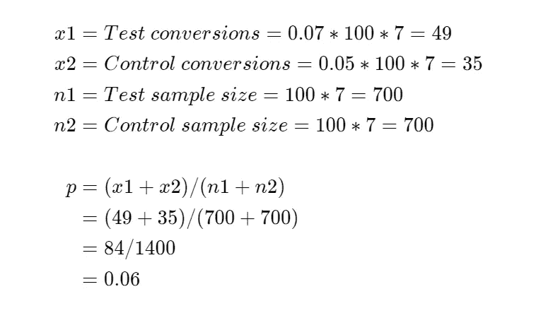
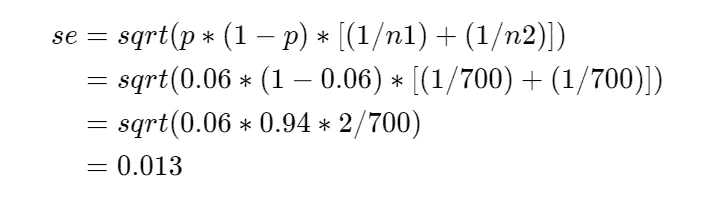
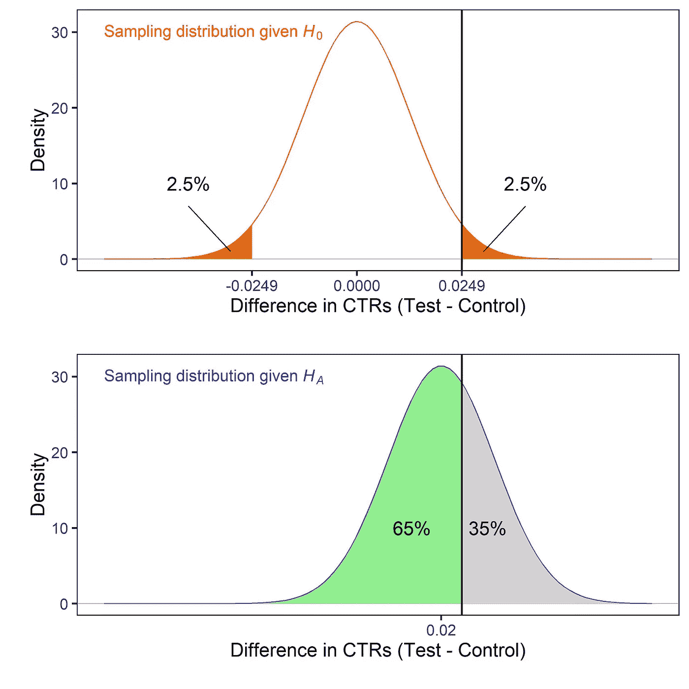
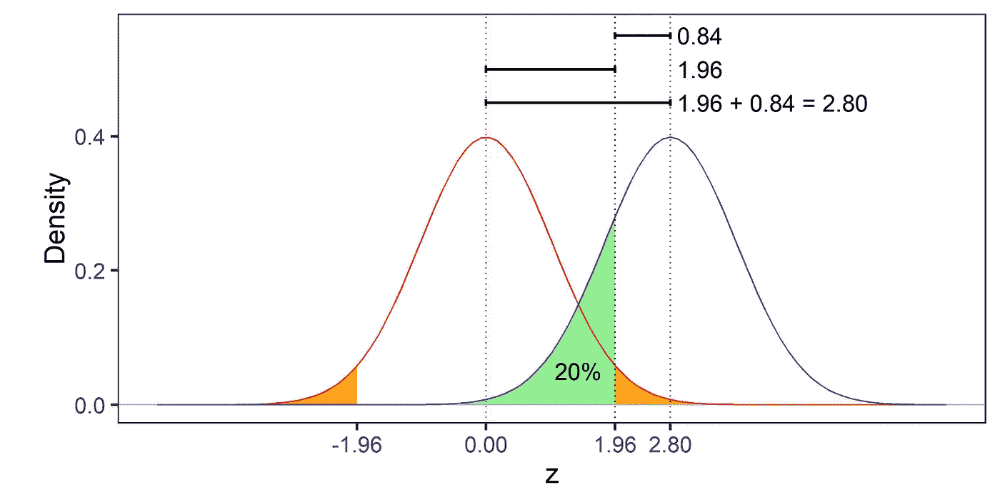
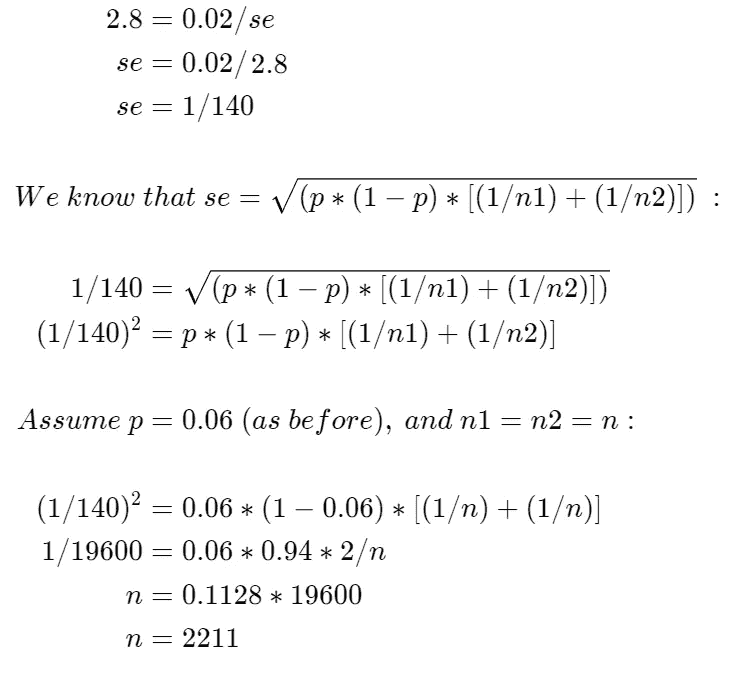

# 功耗分析变得简单

> 原文：<https://towardsdatascience.com/power-analysis-made-easy-dfee1eb813a?source=collection_archive---------20----------------------->

## 如此简单，你可以用手来做。



你已经重新设计了你网站的登陆页面，现在你需要对它进行 A/B 测试。您应该运行测试多长时间？本文将演示如何使用样本大小计算(“功效分析”)来回答这个问题。

统计学可能是一门令人望而生畏的学科，但也不尽然。这些指南的目的是让人们更容易使用统计工具。确保您熟悉抽样分布的概念(如果您需要复习，请参见此处的)和比例度量标准误差的计算(请参见此处的)。尽情享受吧！

# 1.计划 A/B 测试

您想要 A/B 测试您的登录页面的重新设计。目前的登录页面平均每天有 200 名访客，点击率为 5%。您认为重新设计将带来至少 7%的点击率。一旦我们平均分配流量，当前的登录页面(控制)每天应该看到 100 个访问者，重新设计(测试)每天也应该看到 100 个访问者:

测试和控制的预计流量和性能

为了验证测试确实优于控制，您应该运行测试多少天？

# 2.如果我们运行测试，比如说，7 天呢？

假设我们计划只运行我们的 A/B 测试 7 天，此时我们每组将收集 700 个访问者。让我们计算零假设(总体 CTR 无差异)和替代假设(总体 CTR 有真实差异)的抽样分布。

**第一步:计算汇集样本比例(p)。**



**第二步:用 *p* 计算标准误差( *se* )。**



**第三步:计算抽样分布。**

*   ***H0(零假设)*** : 均值= 0，标准差= 0.013 的正态分布。
*   ***HA(替代假设)*** : 一个均值= 0.02，标准差= 0.013 的正态分布。

让我们绘制这些分布图:



H0 和 HA 在 7 天数据收集后的抽样分布

在显著性水平(𝛂)为 0.05 时，临界值为 0.0249。这意味着:

## 1.如果样本 CTRs 的绝对差值>为 0.0249，我们将总是**拒绝**零假设(H0)。

*   如果 H0 是真的，那么拒绝它的决定将是不正确的(类型 1 错误)。这种情况的发生率为 100 次实验中有 5 次(𝛂).
*   如果哈确实是真的，那么拒绝 H0 的决定将是正确的。这将发生在 35/100 的实验中(1-𝛃).这种速率也被称为 ***功率*** 的一种测试。

## 2.如果样本 CTRs 的绝对差≤ 0.0249，我们总是 ***无法拒绝*** 零假设(H0)。

*   如果 H0 确实是真的，那么不拒绝它的决定将是正确的。这种情况的发生率为 95/100(1-𝛂).
*   如果 HA 为真，那么不拒绝 H0 的决定将是不正确的(类型 2 错误)。这种情况的发生率为 100 次实验中有 65 次(𝛃).

总结一下:

A/B 测试所有潜在结果的描述

我们决定仅运行 7 天的 A/B 测试，这将导致我们在 100 个实验中的 65 个实验中无法检测到测试组的升高。这个错误率太高了！通常，我们希望将该值降至 20%，相当于 80%的幂。我们可以通过增加样本量来实现这一点。

**重述:通过运行 7 天的 A/B 测试，因此，每组收集 700 个访问者的样本量，我们实验的功效只有 35%。为了达到 80%的功效，我们需要增加样本量，这意味着让 A/B 测试运行更长时间。**

# 3.手动计算 80%功率所需的样本大小

要获得 80%功率的测试，我们需要多大的样本量？

让我们将零假设下的采样分布转换为一个 ***标准正态分布*** 以使计算更简单:

*   显著性为 0.05 的临界值约为 1.96，可从[查找表](https://en.wikipedia.org/wiki/Standard_normal_table#Table_examples)中获得。
*   如果我们现在考虑给定替代假设的采样分布，那么我们希望-1.96 和 1.96 之间的曲线下面积等于 20%(对于 80%的功率)。因此，临界值必须距离平均值约 0.84(也可从查找表中获得)。
*   所以总的*标准化的*均值之间的差值一定是 1.96 + 0.84 = 2.8。

这可能更容易用图形来理解:



我们还知道，*真实的*均值之间的差值为 0.02，因此，*标准化的*差值等于 0.02 / se。所以我们可以构造一个等式并求解 n:



所以我们需要收集每组 2211 个观察值。按照每组每天 100 名访问者的速度，我们需要运行测试至少 23 天，以获得 80%功率的实验。在这种样本规模下，如果重新设计的页面确实提供了至少 7%的点击率，那么我们在 100 次实验中有 80 次可以检测到这种提升。

**概述:参考标准正态分布，我们能够确定平均值之间的标准化差值在 80%功率下应为 2.8 左右。然后，我们可以用标准误差来表示，然后求出 n。我们计算出 n = 2，211 次观察。**

# 4.R 中的统计分析

至此，您应该对样本大小计算(功效分析)的总体框架感到相当满意了。现在，让我们看看如何将上述所有步骤简化为几行代码。在 *R* 我们会写:

它产生:

```
[1] "absolute difference (Test — Control)"
0.02[1] "pooled sample proportion"
0.06[1] "standardized distance for requested power"
2.80158521811297[1] "solve for n"
2213.38408508644
```