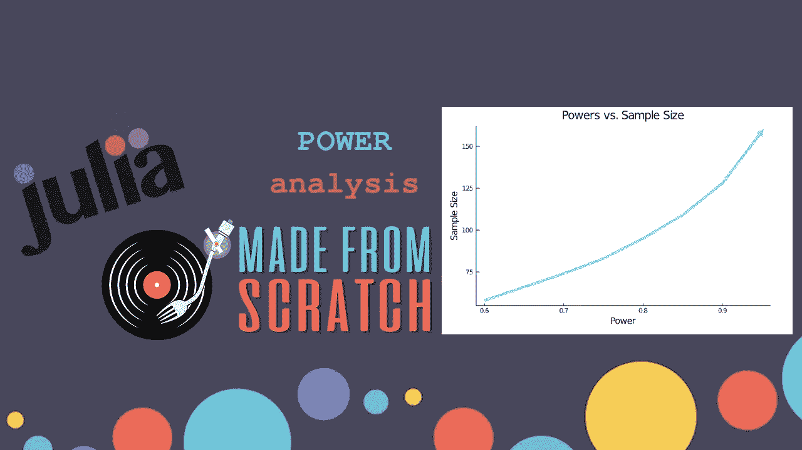
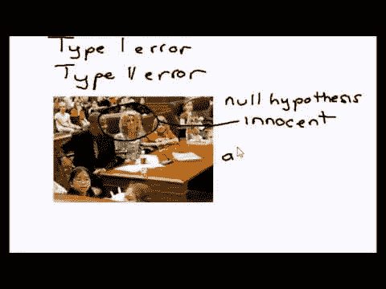
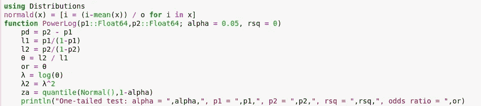
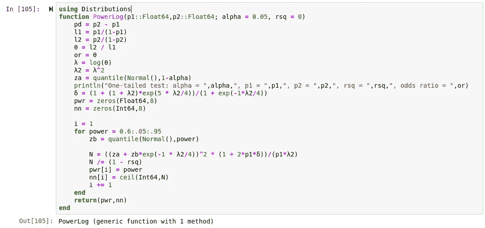
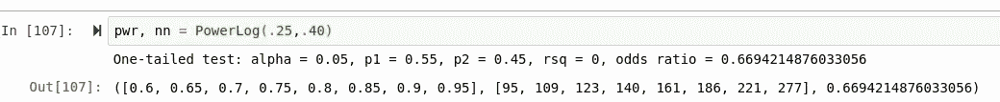
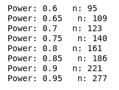
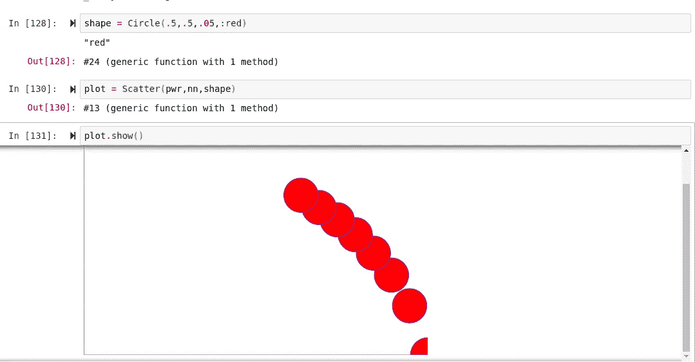

# 电源分析——你从未听说过的最酷的东西。

> 原文：<https://towardsdatascience.com/power-analysis-the-coolest-thing-that-youve-never-heard-of-476d35c18161?source=collection_archive---------45----------------------->

## 从头做起

## 将权力投入到您的物流决策中。



> [笔记本](https://github.com/emmettgb/Emmetts-DS-NoteBooks/blob/master/Julia/using%20powerlog%20to%20our%20advantage.ipynb)

无论我说什么，T2

> “基本概率”

可能立即跳入你脑海的是统计学中的贝叶斯数学(可能是宗教的)。贝叶斯定理或条件概率定理都是很好的例子，说明为什么这是一个很好的假设。尽管条件概率与贝叶斯统计有很强的关系，但是，有很多独特而有趣的方法来进行推理。当你在一台计算机和程序机器学习算法(数据科学超级力量)后面时，尤其如此。)我主观地认为，统计学和统计学家这两个派别(很可能是宗教派别)实际上合作得非常好，或者可以互换。今天我将向你展示如何在 Julia 中使用简单的数学来操作逻辑概率。

逻辑回归功效分析的迷人之处在于，执行它的数学是相对基础的，不需要任何递归成本训练或任何类似的东西(甚至不需要 sigmoid 或 relu。)这不仅方便，而且性能很好，易于编程和操作。此外，您可以将这种分析重新应用到机器学习算法中，并将其用于您的优势。

# 说明

逻辑回归功效分析通常用于确定样本量。统计学家中一个常见的误解是，你的样本量是静态的；也就是说，对于每一种情况，没有一个特定的样本量。幸运的是，使用一个逻辑的决策模型将允许你为几乎任何场合计算一个精确的样本大小。作为一个额外的好处，功耗分析还可以做很多其他的事情。

# 该功能

为了执行功耗分析，我们需要一些输入变量。不要太担心这些简短的解释，因为如果您处于未知领域，它可能在函数的示例使用中更有意义。


首先，我们需要 p1 和 p2。这两个值中的 p 是一个概率，所以本质上，我们有

> 概率 1 和概率 2。

> 记住:这些不是 P 值，而是百分比。

我们还需要阿尔法。一个**阿尔法水平**是一个类型 I 错误的概率，所以当它为真时，你拒绝零假设。这是在 ***对比*** 到**贝塔水平**中，正好相反，会让你接受你的零假设。确保不要在这个问题上选边站，**你不能选择是接受还是拒绝你的空值**。有时候我喜欢用迷因来阐述观点，不久前我发现了这个:



(不是质量最好的)

我们的最后一个值是 rsq，rsq 是预测变量(y)和模型中所有其他变量(X('s))之间的多重相关的平方。我们需要在这个函数中获取的第一个值是 l1 和 l2:

```
pd = p2 - p1
    l1 = p1/(1-p1)
    l2 = p2/(1-p2)
```

如果 X 是一个未知变量，其概率分布为 f(x ),其特征为未知参数θ，随机样本 X1 的大小为 n，X2……..X2 XnX1……..Xn 然后统计ϕ=h(X1,X2，)是θ\左(\θ\右)的点估计量。我们也可以说ϕϕ是θ的参数空间。所以本质上，当我们声明 l1 和 l2 时，我们所做的是，用我们的两个概率来设置θ的参数空间。现在我们计算θ，就像用较高概率(p2)的参数(l2)除以较低概率(p1)的参数(l1)一样简单。

```
θ = l2 / l1
```

现在我们需要λ，我们可以通过简单地记录θ来得到。这可以在 julia 中用 log()方法完成(正如您可能已经想到的。)我们也可以继续做λ。

```
λ = log(θ)
λ2 = λ^2
```

接下来，我们需要一个正态分布，我们还想获得正态分布的分位数，在 Julia 中，我们将使用 Julia 基本统计库中的分位数函数:

```
za = quantile(Normal(),1-alpha)
```

这里我使用的是软件包“Distributions.jl”，这当然是一个很棒的软件包，可以在 Julia Pkg 注册表中找到，但是计算您自己的正态分布是相对简单的。如果你熟悉标准定标器，它就是**一样的东西。**您只需从 X 的迭代中减去样本均值，然后除以标准偏差。

f(x)=[I =(I-μ)/σfor I in x**)**

您可能已经注意到我使用了一个语法循环，这是有意为之的，因为 quantile()方法的语法不会采用单个规范化值，因为它依赖于分布和 1-alpha 来计算 za。

```
using Lathe.stats: mean, std
# Function
function normald(array)
    **σ** = std(array)
    μ = mean(array)
    v = [i = (i-μ) / **σ** for i in array]
    return(v)
end# Syntactual expression
normald(x) = [i = (i-mean(x)) / o for i in x]
```

现在我不确定 Julia 是否真的使用了 syntactual 表达式，但是发行版中的 Normalize()方法很有可能也适用于这个特定的实例。

> 朱利安提示:分位数是通过点`((k-1)/(n-1), v[k])`之间的线性插值计算出来的，对于`k = 1:n`其中`n = length(v)`。

接下来，我们将打印出双尾检验的值。这一步当然是可选的，但对于这一特殊功能来说，这无疑是一个很有价值的步骤:

```
println("One-tailed test: alpha = ",alpha,", p1 = ",p1,", p2 = ",p2,", rsq = ",rsq,", odds ratio = ",or)
```

> 如果你还在继续，这就是我们现在的情况:



接下来，我们需要计算小写 delta。幸运的是，对于这个特定的操作，我们已经有了可用的值。它看起来是这样的:

```
δ = (1 + (1 + λ2)*exp(5 * λ2/4))/(1 + exp(-1*λ2/4))
```

我们将为样本大小和功效值创建两个空数组。

```
pwr = zeros(Float64,8)
nn = zeros(Int64,8)
```

然后，最重要的是，我们添加一个循环来迭代我们的幂和样本大小，并给出一个返回:

```
i = 1
    for power = 0.6:.05:.95
        zb = quantile(Normal(),power)N = ((za + zb*exp(-1 * λ2/4))^2 * (1 + 2*p1*δ))/(p1*λ2)
        N /= (1 - rsq)
        pwr[i] = power
        nn[i] = ceil(Int64,N)
        i += 1
    end
    return(pwr,nn)
```

最终结果看起来有点像这样:



# 例子

假设，让我们说我们正计划为我们的一个空缺职位招聘人员。在我们的带回家的面试中，我们给每个人都做了一个测试，他们必须通过这个测试才能被录用——但是那些分数较高的人更有可能被考虑。我们预计，只有大约 25%的人会在测试中取得高于样本平均值的分数。然后我们还会考虑多 15%的分数会比平均值高出一个标准差，或者

```
μ < p1 = .25 + .15 = p2 < **σ**
```

有了这个表达式，我们可以假设值 p2 将是那些测试的 15%+= P1，所以在我们的例子中，我们得到 0.40。现在如果我们把它代入公式:



现在我们可以用 zip 函数并行打印我们的幂和样本大小(或者成对连接它们，由您决定。)

```
for (i,w) in zip(pwr,nn)
    println("Power: ", i, "   n: ", w)
end
```



功率的技术定义是，它是检测到一个“真实”效应存在时的概率。在大多数情况下，功耗分析涉及许多简化假设，以使问题易于处理，并使用不同的变量多次运行功耗分析，以涵盖所有的意外情况。

# 描绘我们的力量

当然，为了完成这一切，我们必须将这些数据可视化。为此，我将使用我的包 Hone.jl。

```
using Hone
```



看起来我的系统上有 0.0.1 版本的 Hone.jl，但没关系，我可以忍受它…我们在这里可以观察到的是，随着功率的增加，nn 也会增加。我们可以利用这些数据做的另一件有趣的事情是回到那个迭代循环，记录更多的功率。

# 结论

坦白地说，我认为很多读者知道这种方法是可能的。话虽如此，我希望能从这篇文章中吸取一些东西。我在制作它的过程中获得了很多乐趣，我肯定会在 Julia、R 和——你猜对了，Python 中添加更多“从头开始”的机器学习模型(也许我会变得疯狂，做一些 Scala 或 C，谁知道呢。)